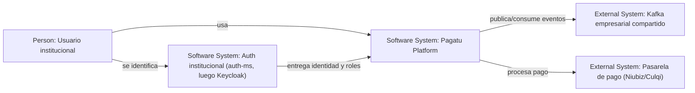
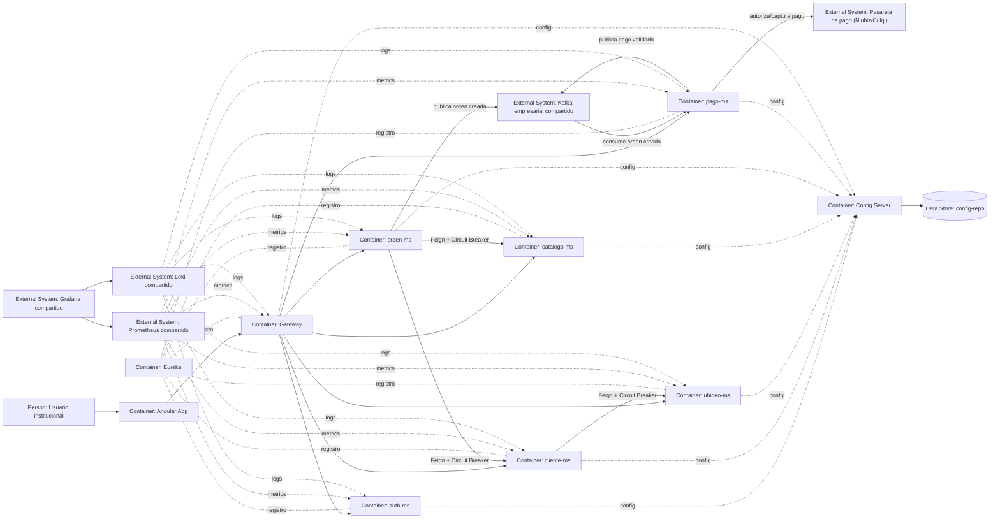
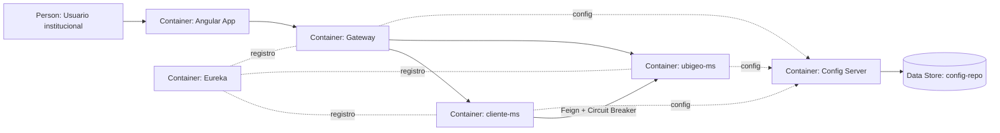
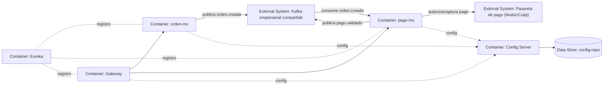
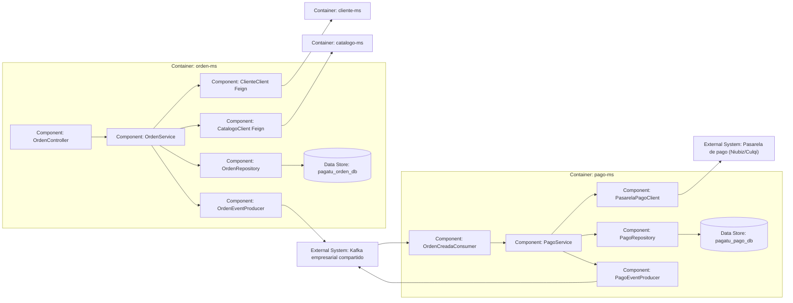
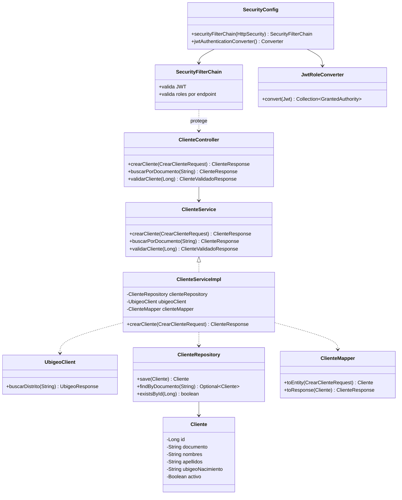
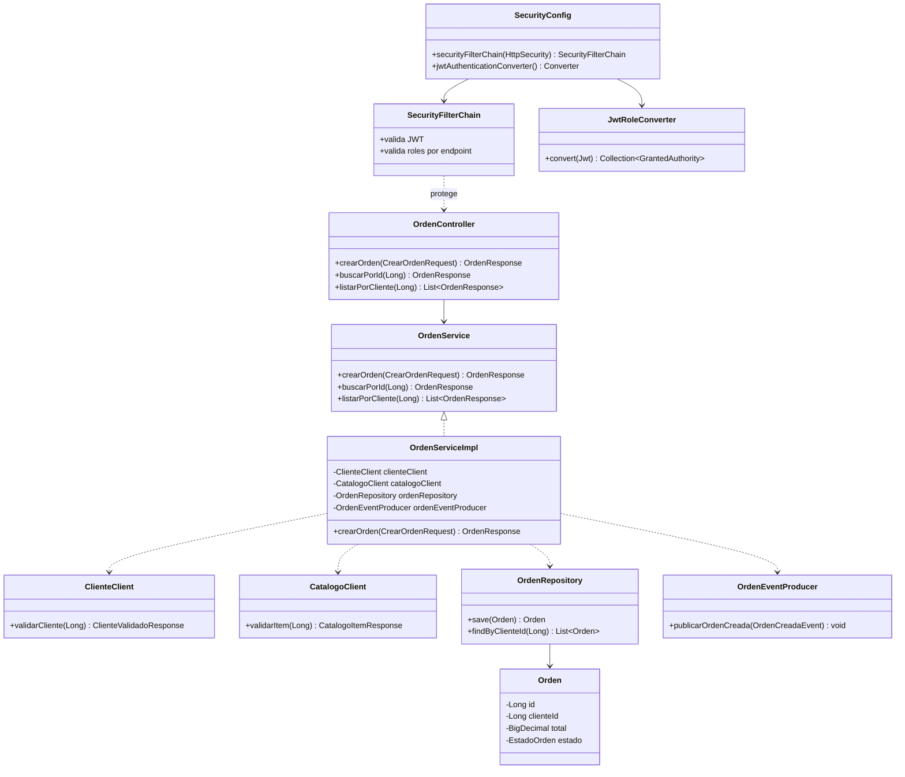
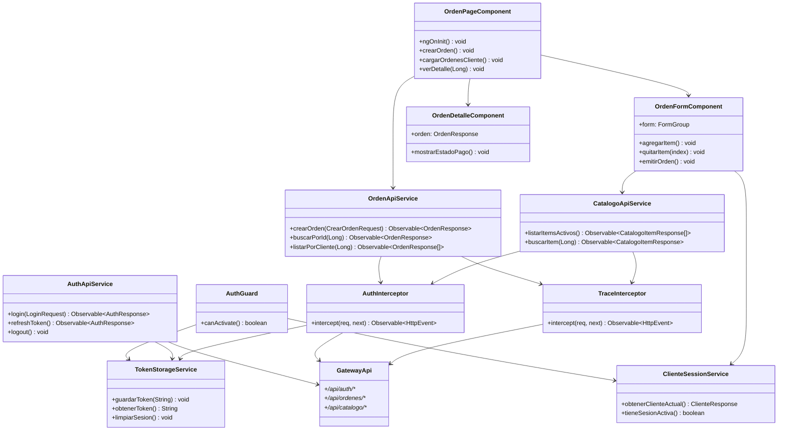
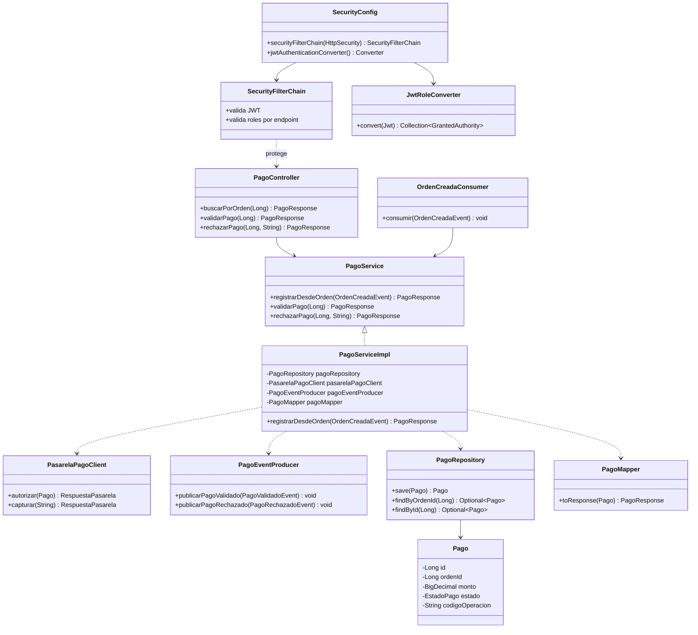
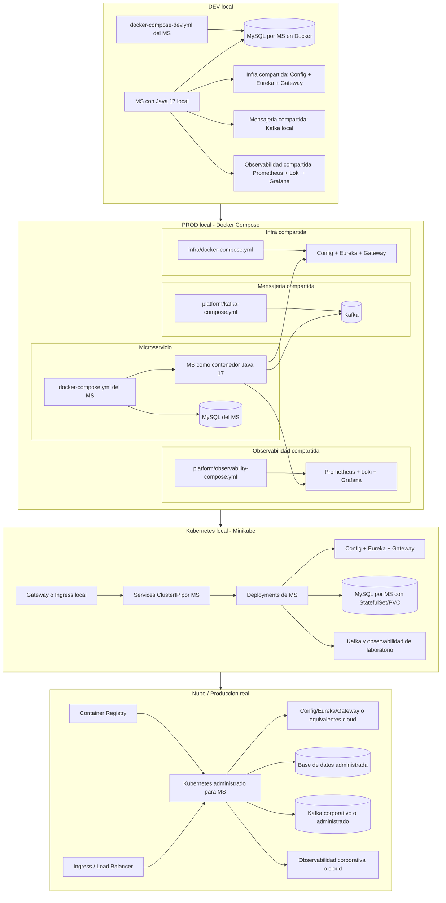

# pagatu

`pagatu` es un proyecto de microservicios para pagos y comercio institucional. La arquitectura se construye por sesiones, empezando con un microservicio base independiente y evolucionando hacia configuracion centralizada, descubrimiento, gateway, Feign, resiliencia, Kafka, seguridad, Docker, Kubernetes y una aplicacion Angular.

## Documentos del Proyecto

| Documento | Rol |
|---|---|
| `README.md` | Entrada principal del repositorio. Resume el proposito del proyecto, el orden de trabajo por sesiones y donde leer cada tema. |
| `ACERCA_DEL_PROYECTO.md` | Describe la vision concreta de Pagatu: microservicios, releases, flujo principal, infraestructura, stack tecnico y estructura real del repositorio. |
| `README_ESTRUCTURA_ESTANDAR.md` | Define el patron generico de estructura para proyectos de microservicios, sin depender de nombres especificos de Pagatu. |

## Arquitectura

Pagatu se organiza como una arquitectura de microservicios con entrada unica por Gateway, configuracion centralizada, descubrimiento de servicios, comunicacion sincrona con Feign, comunicacion asincrona con Kafka y observabilidad con Prometheus, Loki y Grafana.

En Release 1, el flujo principal se apoya en estos servicios:

- `cliente-ms`: gestiona clientes, documentos, contacto y datos de nacimiento.
- `ubigeo-ms`: provee datos geograficos por pais para completar informacion del cliente.
- `catalogo-ms`: gestiona productos, conceptos de pago, familias, categorias, tipos y precios.
- `orden-ms`: orquesta la creacion de ordenes; valida cliente y catalogo por Feign.
- `pago-ms`: procesa eventos de orden creada, integra una pasarela externa como Niubiz o Culqi y publica resultados de pago.
- `auth-ms`: gestiona autenticacion y control de acceso inicial sin depender aun de Keycloak.

La comunicacion queda dividida por responsabilidad:

- Gateway enruta las llamadas externas hacia los MS.
- Config Server entrega configuracion centralizada desde `config-repo`.
- Eureka permite descubrimiento de servicios.
- Feign se usa cuando un MS necesita respuesta inmediata.
- Circuit Breaker protege llamadas Feign ante fallos o latencia.
- Kafka se usa cuando algo ya ocurrio y otros servicios deben reaccionar.
- `pago-ms` encapsula la integracion con proveedores externos de pago para no acoplar el resto del sistema a Niubiz, Culqi u otro proveedor.
- Prometheus recolecta metricas, Loki centraliza logs y Grafana visualiza ambos.
- Angular consume el sistema siempre por Gateway.

### C4 Nivel 1: Contexto del Sistema

Este nivel muestra Pagatu como una caja principal frente a su actor institucional y sistemas compartidos. `auth-ms` aparece aqui porque representa la identidad institucional transversal: el mismo punto de autenticacion puede servir a Pagatu y tambien a otros modulos de la empresa, como planes de estudios, carga academica, matricula, contabilidad o LMS. En Release 1 se implementa como `auth-ms`; luego puede evolucionar a Keycloak sin cambiar la idea arquitectonica. Los detalles internos de Pagatu, como Angular, Gateway, microservicios, Config Server y Eureka, aparecen recien en el nivel de contenedores. Kafka se trata como plataforma empresarial compartida, no como componente exclusivo del proyecto.

### C4 Nivel 2: Software System - Pagatu Platform

Contenedores de Release 1.

Este nivel ya puede mostrar tecnologia y responsabilidades internas: Angular, Gateway, microservicios, bases de configuracion, servicios de soporte y sistemas externos consumidos por los contenedores.

### Vista Dinamica: Cliente y Ubigeo

### Vista Dinamica: Orden y Pago

### C4 Nivel 3: Container - orden-ms y pago-ms

Componentes principales del flujo de orden y pago.

Este nivel baja el zoom dentro de dos contenedores concretos del Release 1. `orden-ms` conserva la decision sincrona por Feign para validar cliente y catalogo antes de crear la orden. `pago-ms` reacciona por Kafka a `orden.creada`, encapsula la pasarela externa y publica el resultado `pago.validado`.

### C4 Nivel 4: Component - ClienteService

Codigo de ejemplo en `cliente-ms`.

### C4 Nivel 4: Component - OrdenService

Codigo de ejemplo en `orden-ms`.

Este nivel se usa solo como ejemplo didactico. En C4, el nivel de codigo no deberia convertirse en un diagrama de todas las clases del proyecto; sirve para explicar una parte puntual cuando aporta claridad.

### C4 Nivel 4: Component - Angular Ordenes

Codigo de ejemplo del frontend para el flujo de ordenes.

Angular se muestra aparte porque vive en otro proyecto/contenedor. Este diagrama explica la pantalla de ordenes, sus componentes, servicios HTTP e interceptores, mientras el diagrama de `orden-ms` queda enfocado en el backend.

### C4 Nivel 4: Component - PagoService

Codigo de ejemplo en `pago-ms`.

Estos ejemplos de codigo muestran el estilo esperado dentro de cada microservicio: el acceso HTTP se valida antes del controller con `SecurityConfig`, `SecurityFilterChain` y conversion de roles JWT; el controller depende del contrato `Service`; la clase `Impl` encapsula la orquestacion interna y desde alli se usan repositories, mappers, clients Feign y producers/consumers Kafka cuando correspondan. En consumidores Kafka, la autorizacion no entra por endpoint HTTP, pero el servicio igual conserva trazabilidad y validaciones de negocio.

### C4: Despliegue por Ambientes

DEV local y PROD local representan el mismo sistema corriendo en paralelo, pero con distinto modo de ejecucion. En DEV local, los microservicios y la infraestructura (`config`, `eureka`, `gateway`) corren con Java 17 en la maquina del desarrollador para facilitar cambios rapidos; Docker se usa para dependencias como MySQL por MS, Kafka y observabilidad compartida. En PROD local, los mismos componentes se validan como imagenes y contenedores: la infraestructura propia se levanta con `infra/docker-compose.yml`, Kafka y observabilidad con `platform/`, y cada microservicio con su propio `<ms>/docker-compose.yml`. En Kubernetes local se usan manifiestos `k8s-local/`: los MS van como `Deployment`, los servicios internos como `ClusterIP`, MySQL puede ir como `StatefulSet` con PVC y el acceso externo pasa por Gateway o Ingress. En nube se usan imagenes desde registry, manifiestos `k8s/` para los MS, bases de datos administradas, Kafka corporativo/administrado y observabilidad de plataforma.

## Ruta de Trabajo por Sesiones

| Sesion | Trabajo principal | Tarea para avanzar |
|---:|---|---|
| 1 | Crear `cliente-ms` como microservicio base independiente: capas simples, CRUD, MySQL, Flyway, validaciones, DTOs, MapStruct, logs, OpenAPI, `CorrelationIdFilter`, `Dockerfile`, `docker-compose-dev.yml` y `docker-compose.yml`. Se registra y despliega como `pagatu-cliente-ms`. | Crear `ubigeo-ms` con pais, departamento/region, provincia y distrito. Validar su MySQL con `docker-compose-dev.yml` y preparar su `Dockerfile`. |
| 2 | Crear `config` y `config-repo`. Mover configuracion de `cliente-ms` al Config Server y preparar archivos por servicio. Validar imagen Docker de `config`. | Configurar `ubigeo-ms` para leer desde Config Server y validar su imagen Docker. |
| 3 | Crear `eureka` y `gateway`. Registrar `cliente-ms` en Eureka y exponer `/api/clientes/**` por Gateway. Validar imagenes Docker de `eureka` y `gateway`. | Integrar `ubigeo-ms` con Config Server, Eureka y Gateway. Exponer `/api/ubigeo/**`. |
| 4 | Implementar Feign + Circuit Breaker: `cliente-ms` consulta `ubigeo-ms`. Agregar timeouts, fallback, manejo de errores y propagacion de `X-Trace-ID`. | Crear `catalogo-ms` como servicio REST estable de productos, conceptos, familias, categorias, tipos y precios, con `docker-compose-dev.yml`, `Dockerfile`, Feign + Circuit Breaker listo para `orden-ms`. |
| 5 | Incorporar observabilidad con Actuator, Prometheus, Loki y Grafana. Exponer health, metrics, logs y dashboards basicos para `gateway`, `cliente-ms`, `ubigeo-ms` y `catalogo-ms`. | Preparar contratos de orden, evento `orden.creada` y archivos Docker iniciales para `orden-ms` y `pago-ms`. |
| 6 | Crear `orden-ms` y `pago-ms`. Implementar Event-Driven con Kafka: `orden-ms` valida cliente y catalogo por Feign, crea la orden, publica `orden.creada`; `pago-ms` consume `orden.creada` y publica `pago.validado`. Validar Kafka en Docker local. | Revisar idempotencia basica, manejo de eventos duplicados, trazabilidad en consumidores e imagenes Docker de ambos MS. |
| 7 | Crear `auth-ms` e implementar control de acceso inicial sin Keycloak obligatorio: autenticacion basica/JWT propio, roles logicos, permisos por endpoint y reglas de autorizacion en Gateway y MS. Preparar `SecurityConfig` para evolucionar a Keycloak. | Dejar Keycloak como modulo opcional y documentar roles/claims esperados. |
| 8 | Preparar `k8s-local/` y `k8s/` para infraestructura y microservicios, diferenciando Minikube de nube/produccion real. | Verificar nombres operativos `pagatu-*`, perfiles, variables, secrets/configmaps y tags de GitHub por sesion/release. |
| 9 | Crear aplicacion Angular base para consumir Gateway: layout, rutas, servicios HTTP, interceptores, pantallas de clientes, catalogo y consulta de ordenes. | Preparar formularios para crear orden y visualizar estado de pago. |
| 10 | Completar Angular: flujo de creacion de orden, visualizacion de pago, manejo de errores, trazabilidad con `X-Trace-ID` y build Docker del frontend. | Dejar preparado un modulo opcional de login con Keycloak. |

## Temas Transversales Pendientes

Ademas de las sesiones principales, el proyecto debe considerar:

- Resiliencia: Resilience4j, timeouts, circuit breakers, retries limitados y fallbacks.
- Observabilidad: logs con `X-Trace-ID`, Actuator, health checks, Prometheus, Loki y Grafana.
- Documentacion API: OpenAPI/Swagger por MS, consumido preferentemente por Gateway.
- Manejo de errores: excepciones controladas, codigos HTTP consistentes y respuestas estandar.
- Testing: unit tests, integration tests y pruebas de contrato para Feign/eventos cuando el flujo madure.
- Versionado de eventos: nombres de topicos, esquema de payloads y compatibilidad de eventos Kafka.
- Perfiles: `dev`, `prod`, Docker local, Kubernetes local y nube.
- Frontend: Angular, consumo por Gateway, manejo de errores, trazabilidad y build Docker.
- Seguridad opcional: Keycloak, JWT Resource Server, roles, claims y vinculacion con `keycloakUserId`.

## Modulo Opcional: Keycloak

Si el curso necesita una ampliacion de seguridad, Keycloak puede trabajarse como modulo opcional despues de Release 1:

- Crear realm, clients, roles y usuarios.
- Configurar Gateway y MS como Resource Server.
- Validar JWT y roles por endpoint.
- Vincular `cliente-ms` con `keycloakUserId` usando el claim `sub`.
- Ajustar Angular para login, refresh de token e interceptor `Authorization`.

## Release 1

Release 1 construye el core inicial:

Carpetas del repositorio:

- `cliente-ms`
- `auth-ms`
- `catalogo-ms`
- `ubigeo-ms`
- `orden-ms`
- `pago-ms`
- `infra/config`
- `infra/eureka`
- `infra/gateway`

Artefactos operativos:

- `pagatu-cliente-ms`
- `pagatu-auth-ms`
- `pagatu-catalogo-ms`
- `pagatu-ubigeo-ms`
- `pagatu-orden-ms`
- `pagatu-pago-ms`
- `pagatu-config`
- `pagatu-eureka`
- `pagatu-gateway`

## Lectura Recomendada

1. Leer `ACERCA_DEL_PROYECTO.md` para entender que se va a construir.
2. Leer `README_ESTRUCTURA_ESTANDAR.md` para entender el patron de carpetas.
3. Trabajar las sesiones en orden, empezando por un microservicio independiente antes de agregar infraestructura.
