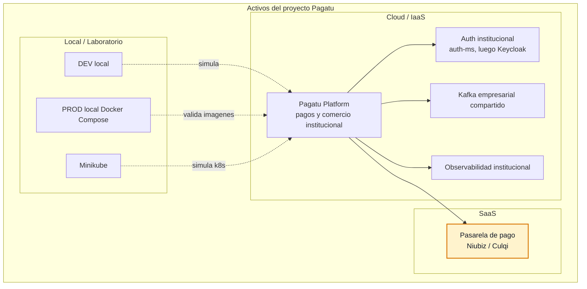
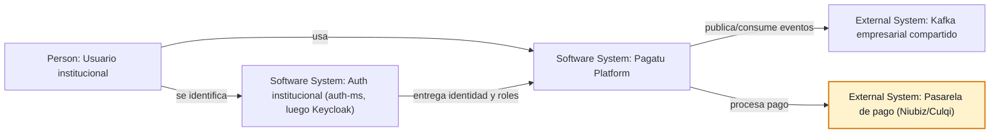
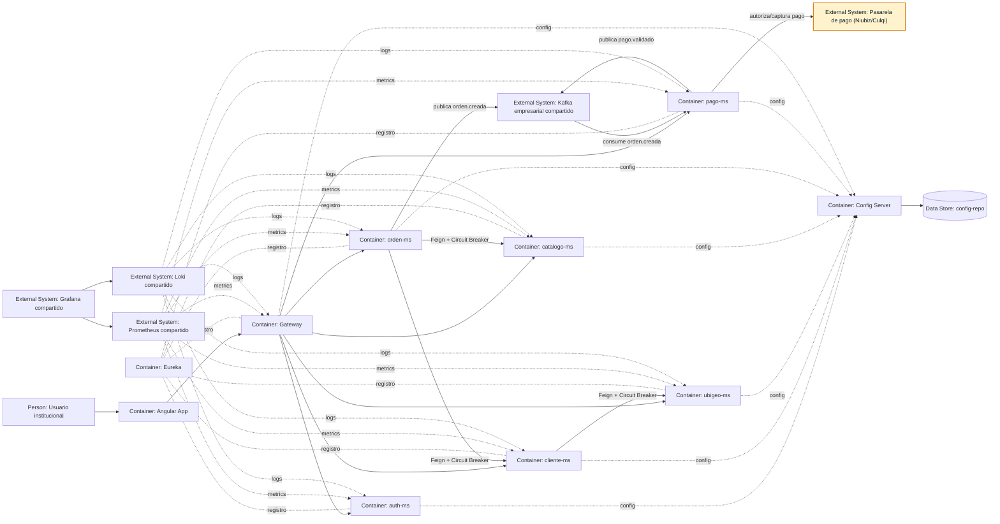
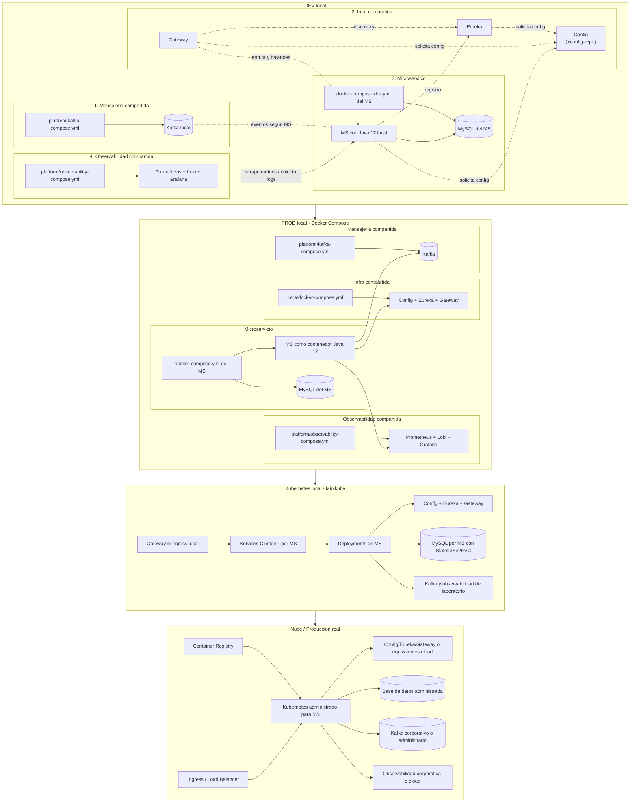

# Acerca del Proyecto: pagatu

## Objetivo

`pagatu` es una arquitectura base de microservicios para un sistema de pagos y comercio institucional. El proyecto busca ser profesional, didactico y evolutivo: incluye CRUD, comunicacion sincrona con Feign, mensajeria asincrona con Kafka, configuracion centralizada, descubrimiento de servicios, gateway, seguridad JWT, Docker y Kubernetes, sin caer en una arquitectura innecesariamente compleja.

La propuesta usa una arquitectura por capas simple, no hexagonal, pensada para mantener el codigo claro y facil de explicar.

## Stack Tecnico

- Java 17
- Spring Boot 3.5.x
- Maven
- Spring Web
- Spring Data JPA
- Spring Validation
- OpenFeign
- Eureka Client
- Config Client
- Spring Kafka
- MySQL 8
- Flyway
- Lombok
- MapStruct
- Seguridad JWT inicial con `auth-ms`
- Keycloak como modulo opcional futuro
- Docker y Docker Compose
- Kubernetes con manifiestos YAML

## Microservicios del Proyecto

El proyecto se plantea en releases para mantener una evolucion ordenada. No todos los microservicios se implementan desde el inicio: primero se construye el flujo principal y luego se agregan capacidades complementarias.

| Microservicio | Release | Responsabilidad |
|---|---:|---|
| `pagatu-auth-ms` | 1 | Gestiona autenticacion y control de acceso inicial: usuarios, credenciales, roles logicos y emision/validacion de tokens propios. |
| `pagatu-ubigeo-ms` | 1 | Gestiona ubicaciones geograficas por pais: pais, departamento/region, provincia, distrito y codigos territoriales. |
| `pagatu-cliente-ms` | 1 | Gestiona clientes: alumno universitario, alumno colegio, apoderado y cliente externo. Permite CRUD, busqueda por documento y validacion de cliente. |
| `pagatu-catalogo-ms` | 1 | Gestiona lo que se puede comprar o pagar: productos, conceptos de pago, familias, categorias, tipos, precios y activacion. |
| `pagatu-orden-ms` | 1 | Es el nucleo del negocio. Crea ordenes, agrega items, calcula totales, consulta estados y lista ordenes por cliente. |
| `pagatu-pago-ms` | 1 | Gestiona el proceso financiero: registra, valida o rechaza pagos e integra una pasarela externa como Niubiz o Culqi. |
| `pagatu-notificacion-ms` | 2 | Envia notificaciones por eventos relevantes, como orden creada, pago validado o pago rechazado. |
| `pagatu-contabilidad-ms` | 2 | Integra pagos validados con procesos contables, conciliacion y registros financieros internos. |
| `pagatu-reportes-ms` | 2 | Expone reportes operativos, financieros y analiticos sobre clientes, ordenes, pagos y catalogo. |

## Release 1: Core Inicial

| Microservicio | Responsabilidad | Comunicacion |
|---|---|---|
| `pagatu-auth-ms` | Gestiona autenticacion inicial, roles y tokens propios sin depender aun de Keycloak. | REST |
| `pagatu-ubigeo-ms` | Gestiona datos geograficos por pais para completar nacimiento, direccion o residencia del cliente. | REST |
| `pagatu-cliente-ms` | Gestiona clientes: alumno universitario, alumno colegio, apoderado y cliente externo. Permite CRUD, busqueda por documento y validacion de cliente. | REST y Feign |
| `pagatu-catalogo-ms` | Gestiona productos, conceptos de pago, familias, categorias, tipos, precios y activacion. | REST |
| `pagatu-orden-ms` | Es el nucleo del negocio. Crea ordenes, agrega items, calcula totales, consulta estados y lista ordenes por cliente. | REST, Feign y Kafka |
| `pagatu-pago-ms` | Gestiona el proceso financiero, consume eventos de orden, integra una pasarela externa como Niubiz o Culqi y publica resultados de pago. | Kafka, REST externo |

## Infraestructura

| Componente | Funcion |
|---|---|
| `pagatu-config` | Centraliza la configuracion de los microservicios. |
| `pagatu-eureka` | Provee descubrimiento de servicios con Eureka. |
| `pagatu-gateway` | Es la entrada unica al sistema y enruta las peticiones a los microservicios. |

Rutas principales del Gateway:

```text
/api/auth/**
/api/clientes/**
/api/catalogo/**
/api/ubigeo/**
/api/ordenes/**
/api/pagos/**
```

## Flujo Principal

```text
Usuario
  -> Gateway
  -> pagatu-auth-ms
  -> pagatu-orden-ms
  -> Feign: pagatu-cliente-ms
  -> Feign interno: pagatu-cliente-ms -> pagatu-ubigeo-ms
  -> Feign: pagatu-catalogo-ms
  -> Kafka: orden.creada
  -> pagatu-pago-ms
  -> Pasarela externa: Niubiz / Culqi
  -> Kafka: pago.validado
```

`pagatu-orden-ms` consulta de forma sincrona a cliente y catalogo porque necesita respuestas inmediatas antes de crear una orden. `pagatu-cliente-ms` puede consultar a `pagatu-ubigeo-ms` para completar detalles de nacimiento, residencia o direccion. Si el cliente no es valido o el producto/concepto no existe, esta inactivo o no tiene precio valido, la orden no se crea. Una vez creada, publica el evento `orden.creada` para que `pagatu-pago-ms` continue el proceso de pago de forma asincrona e integre una pasarela externa como Niubiz, Culqi u otro proveedor.

## Regla de Comunicacion

Feign y Kafka se usan para problemas distintos:

- Feign se usa cuando el servicio necesita una respuesta inmediata para tomar una decision.
- Kafka se usa cuando algo ya ocurrio y otros servicios deben reaccionar.

En Release 1, Feign se usa para decisiones inmediatas: `pagatu-cliente-ms` consulta `pagatu-ubigeo-ms`, y `pagatu-orden-ms` consulta `pagatu-cliente-ms` y `pagatu-catalogo-ms`. `pagatu-ubigeo-ms` queda como servicio sincrono estable; no necesita evolucionar a Kafka. Kafka se usa entre `pagatu-orden-ms` y `pagatu-pago-ms`.

## Estructura General

```text
pagatu/
|-- infra/
|   |-- config/
|   |   |-- config-repo/
|   |   |-- src/
|   |   |-- pom.xml
|   |   `-- Dockerfile
|   |-- eureka/
|   |-- gateway/
|   |-- docker-compose.yml
|   |-- k8s-local/
|   `-- k8s/
|-- platform/
|   |-- kafka-compose.yml
|   |-- observability-compose.yml
|   `-- k8s-local/
|-- auth-ms/
|   |-- src/
|   |-- pom.xml
|   |-- Dockerfile
|   |-- docker-compose-dev.yml
|   |-- docker-compose.yml
|   |-- k8s-local/
|   `-- k8s/
|-- ubigeo-ms/
|   |-- src/
|   |-- pom.xml
|   |-- Dockerfile
|   |-- docker-compose-dev.yml
|   |-- docker-compose.yml
|   |-- k8s-local/
|   `-- k8s/
|-- cliente-ms/
|   |-- src/
|   |-- pom.xml
|   |-- Dockerfile
|   |-- docker-compose-dev.yml
|   |-- docker-compose.yml
|   |-- k8s-local/
|   `-- k8s/
|-- catalogo-ms/
|   |-- src/
|   |-- pom.xml
|   |-- Dockerfile
|   |-- docker-compose-dev.yml
|   |-- docker-compose.yml
|   |-- k8s-local/
|   `-- k8s/
|-- orden-ms/
|   |-- src/
|   |-- pom.xml
|   |-- Dockerfile
|   |-- docker-compose-dev.yml
|   |-- docker-compose.yml
|   |-- k8s-local/
|   `-- k8s/
`-- pago-ms/
    |-- src/
    |-- pom.xml
    |-- Dockerfile
    |-- docker-compose-dev.yml
    |-- docker-compose.yml
    |-- k8s-local/
    `-- k8s/
```

## Convencion de Nombres

Las carpetas del repositorio usan nombres cortos para facilitar el trabajo diario. Los artefactos operativos usan el prefijo `pagatu-` para evitar colisiones en Docker, Eureka, Config Server y Kubernetes.

| Elemento | Ejemplo |
|---|---|
| Carpeta del proyecto | `cliente-ms` |
| Maven `artifactId` | `pagatu-cliente-ms` |
| `spring.application.name` | `pagatu-cliente-ms` |
| Imagen Docker | `pagatu-cliente-ms:latest` |
| Servicio Docker Compose | `pagatu-cliente-ms` |
| Deployment Kubernetes | `pagatu-cliente-ms` |
| Service Kubernetes | `pagatu-cliente-ms` |
| Config Server file | `pagatu-cliente-ms.yml` |
| Base de datos | `pagatu_cliente_db` |
| Paquete Java | `com.pagatu.cliente` |
| Ruta Gateway | `/api/clientes/**` |

## Estructura Interna por Microservicio

Cada microservicio core debe seguir una estructura por capas simple:

```text
com.pagatu.<contexto>
|-- config
|-- controller
|-- dto
|   |-- request
|   `-- response
|-- entity
|-- exception
|-- filter
|-- mapper
|-- repository
|-- service
|   `-- impl
|-- client
|-- event
`-- <Contexto>Application.java
```

Las carpetas `client` y `event` solo se crean cuando el microservicio las necesita:

| Microservicio | `client` | `event` |
|---|---:|---:|
| `pagatu-auth-ms` | No | No |
| `pagatu-ubigeo-ms` | No | No |
| `pagatu-cliente-ms` | Si | No |
| `pagatu-catalogo-ms` | No | No |
| `pagatu-orden-ms` | Si | Si |
| `pagatu-pago-ms` | No | Si |

## Configuracion Comun

En los microservicios se considera la siguiente configuracion base:

- `SecurityConfig.java` para proteger endpoints con JWT.
- `JwtProperties.java` para centralizar propiedades de seguridad.
- `FeignTraceConfig.java` para propagar trazabilidad en llamadas Feign.
- `OpenApiConfig.java` para documentacion de API.
- `KafkaConfig.java` solo cuando el servicio use Kafka.
- `CorrelationIdFilter.java` para leer o generar `X-Trace-ID`, guardarlo en MDC y retornarlo en la respuesta.
- `logback-spring.xml` con `traceId=%X{X-Trace-ID}` para trazabilidad en logs.

No se crea carpeta `security`; la configuracion de seguridad vive dentro de `config`.

## Bases de Datos

Cada microservicio core tiene su propia base de datos:

| Microservicio | Base de datos |
|---|---|
| `pagatu-auth-ms` | `pagatu_auth_db` |
| `pagatu-ubigeo-ms` | `pagatu_ubigeo_db` |
| `pagatu-cliente-ms` | `pagatu_cliente_db` |
| `pagatu-catalogo-ms` | `pagatu_catalogo_db` |
| `pagatu-orden-ms` | `pagatu_orden_db` |
| `pagatu-pago-ms` | `pagatu_pago_db` |

Las migraciones se gestionan con Flyway mediante `V1__init.sql`.

## Seguridad

Release 1 usa `auth-ms` para autenticacion y control de acceso inicial. Los endpoints deben validar autenticacion y roles segun la responsabilidad de cada microservicio. Keycloak queda como modulo opcional futuro para reemplazar o complementar la emision de tokens.

## Docker y Kubernetes

El proyecto contempla:

- `Dockerfile` por microservicio y componente de infraestructura.
- `docker-compose.yml` en `infra/` para Config Server, Eureka y Gateway.
- `platform/kafka-compose.yml` y `platform/observability-compose.yml` para dependencias compartidas de laboratorio.
- `docker-compose-dev.yml` por microservicio para levantar dependencias locales del MS, por ejemplo MySQL, mientras la aplicacion corre con Java local.
- `docker-compose.yml` por microservicio para validar su imagen Docker de forma aislada con dependencias minimas.
- `k8s-local/` para Minikube o Kubernetes local.
- `k8s/` para nube o produccion real.

El Gateway es la entrada externa; los microservicios no deben consumirse directamente por puertos publicos.

En Minikube se permite levantar MySQL por microservicio y plataformas compartidas de laboratorio, como Kafka u observabilidad, para practicar despliegue completo. En nube real, MySQL debe ser una base administrada o externa, Kafka debe ser corporativo/administrado y observabilidad debe venir de una plataforma compartida o proveedor cloud.

## Alcance de Release 1

Release 1 incluye los 6 microservicios core necesarios para explicar y validar el flujo principal:

- Autenticacion inicial, usuarios, roles y tokens con `auth-ms`.
- CRUD de clientes.
- CRUD/consulta de ubigeo por pais para completar nacimiento, residencia o direccion del cliente.
- CRUD de catalogo: productos, conceptos, familias, categorias, tipos y precios.
- Creacion y consulta de ordenes.
- Validacion sincrona con Feign desde cliente hacia ubigeo, y desde orden hacia cliente y catalogo.
- Publicacion de `orden.creada`.
- Consumo de `orden.creada` desde pago.
- Integracion de `pago-ms` con una pasarela externa de pagos como Niubiz o Culqi.
- Publicacion de `pago.validado`.
- Configuracion centralizada, Eureka, Gateway, seguridad con `auth-ms`, trazabilidad, Docker y Kubernetes.

## Aspectos Transversales Pendientes

Estos puntos no pertenecen a un solo microservicio. Deben mantenerse visibles durante el curso para que la arquitectura avance de forma consistente.

| Aspecto | Que debe definirse |
|---|---|
| Contratos REST | Endpoints, DTO request/response, codigos de error y headers obligatorios como `X-Trace-ID`. |
| Contratos Kafka | Topicos, eventos, payloads, versionado y comportamiento ante mensajes no procesables. |
| Errores comunes | Formato estandar para validacion, recurso no encontrado, error de negocio, timeout, fallback y error de integracion. |
| Versionado | Uso de rutas como `/api/v1/...` y compatibilidad de DTOs y eventos. |
| Seguridad | Validacion en Gateway, validacion en cada MS, roles base, endpoints publicos/protegidos y propagacion del JWT. |
| Observabilidad | Health checks, metricas HTTP, logs con `X-Trace-ID`, errores Feign, eventos Kafka y latencia por MS. |
| Persistencia | Una base de datos por MS, migraciones Flyway, datos iniciales y prohibicion de compartir tablas entre MS. |
| Ejecucion | Diferenciar DEV local, PROD local con Docker Compose, Kubernetes local y nube. |
| Alcance Release 1 | Mantener fuera inventario, notificaciones, contabilidad, reportes y sagas complejas. |


## Arquitectura

Pagatu se organiza como una arquitectura de microservicios con entrada unica por Gateway, configuracion centralizada, descubrimiento de servicios, comunicacion sincrona con Feign, comunicacion asincrona con Kafka y observabilidad con Prometheus, Loki y Grafana.

En Release 1, el flujo principal se apoya en estos servicios:

- `cliente-ms`: gestiona clientes, documentos, contacto y datos de nacimiento.
- `ubigeo-ms`: provee datos geograficos por pais para completar informacion del cliente.
- `catalogo-ms`: gestiona productos, conceptos de pago, familias, categorias, tipos y precios.
- `orden-ms`: orquesta la creacion de ordenes; valida cliente y catalogo por Feign.
- `pago-ms`: procesa eventos de orden creada, integra una pasarela externa como Niubiz o Culqi y publica resultados de pago.
- `auth-ms`: gestiona autenticacion y control de acceso inicial sin depender aun de Keycloak.

La comunicacion queda dividida por responsabilidad:

- Gateway enruta las llamadas externas hacia los MS.
- Config Server entrega configuracion centralizada desde `config-repo`.
- Eureka permite descubrimiento de servicios.
- Feign se usa cuando un MS necesita respuesta inmediata.
- Circuit Breaker protege llamadas Feign ante fallos o latencia.
- Kafka se usa cuando algo ya ocurrio y otros servicios deben reaccionar.
- `pago-ms` encapsula la integracion con proveedores externos de pago para no acoplar el resto del sistema a Niubiz, Culqi u otro proveedor.
- Prometheus recolecta metricas, Loki centraliza logs y Grafana visualiza ambos.
- Angular consume el sistema siempre por Gateway.

## Activos de Software de Pagatu

Este mapa no es un nivel C4. Representa solo las aplicaciones y activos de alto nivel relacionados con Pagatu, agrupados por capa de alojamiento o servicio: SaaS, Cloud/IaaS y Local/Laboratorio.



Este mapa ayuda a explicar donde vive cada activo. Pagatu se presenta como una sola aplicacion del portafolio institucional y su destino natural es Cloud/IaaS; los entornos locales sirven para desarrollo, validacion y simulacion. Los detalles como Angular, Gateway, Config Server, Eureka y microservicios aparecen despues en los diagramas C4.

## Arquitectura C4 de Pagatu

### C4 Nivel 1: Contexto del Sistema



Este nivel muestra Pagatu como una caja principal frente a su actor institucional y sistemas compartidos. `auth-ms` aparece aqui porque representa la identidad institucional transversal: el mismo punto de autenticacion puede servir a Pagatu y tambien a otros modulos de la empresa, como planes de estudios, carga academica, matricula, contabilidad o LMS. En Release 1 se implementa como `auth-ms`; luego puede evolucionar a Keycloak sin cambiar la idea arquitectonica. Los detalles internos de Pagatu, como Angular, Gateway, microservicios, Config Server y Eureka, aparecen recien en el nivel de contenedores. Kafka se trata como plataforma empresarial compartida, no como componente exclusivo del proyecto.

### C4 Nivel 2: Software System - Pagatu Platform

Contenedores de Release 1.



Este nivel ya puede mostrar tecnologia y responsabilidades internas: Angular, Gateway, microservicios, bases de configuracion, servicios de soporte y sistemas externos consumidos por los contenedores.

Las vistas dinamicas, C4 nivel 3 y C4 nivel 4 viven en [README_02_ARQUITECTURA_DETALLADA.md](README_02_ARQUITECTURA_DETALLADA.md) para mantener este documento enfocado en la vision general.

### C4: Despliegue por Ambientes



DEV local y PROD local representan el mismo sistema corriendo en paralelo, pero con distinto modo de ejecucion. En DEV local, los microservicios y la infraestructura (`config`, `eureka`, `gateway`) corren con Java 17 en la maquina del desarrollador para facilitar cambios rapidos; Docker se usa para dependencias como MySQL por MS, Kafka y observabilidad compartida. En PROD local, los mismos componentes se validan como imagenes y contenedores: la infraestructura propia se levanta con `infra/docker-compose.yml`, Kafka y observabilidad con `platform/`, y cada microservicio con su propio `<ms>/docker-compose.yml`. En Kubernetes local se usan manifiestos `k8s-local/`: los MS van como `Deployment`, los servicios internos como `ClusterIP`, MySQL puede ir como `StatefulSet` con PVC y el acceso externo pasa por Gateway o Ingress. En nube se usan imagenes desde registry, manifiestos `k8s/` para los MS, bases de datos administradas, Kafka corporativo/administrado y observabilidad de plataforma.


## Pendiente para Release 2

No se incluyen por ahora:

- `pagatu-notificacion-ms`
- `pagatu-contabilidad-ms`
- `pagatu-inventario-ms`
- `pagatu-reportes-ms`

Estos servicios pueden agregarse cuando el flujo principal este estable y sea necesario cubrir mensajes, integracion contable, inventario, reservas reales de stock o analitica.
