# Arquitectura Detallada de Pagatu

Este documento contiene las vistas tecnicas de mayor detalle de Pagatu. Complementa a [README_01_ACERCA_DEL_PROYECTO.md](README_01_ACERCA_DEL_PROYECTO.md), que conserva la vision general, C4 nivel 1, C4 nivel 2, despliegue por ambientes y aspectos transversales del proyecto.

## Vistas Dinamicas

### Autenticacion y Acceso

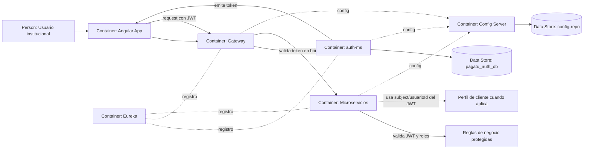

Este flujo muestra la separacion de responsabilidades: `auth-ms` emite el token inicial con identificador de usuario y roles; Gateway valida en borde; cada microservicio vuelve a validar JWT y roles antes de ejecutar reglas de negocio. Cuando el flujo requiere datos de cliente, `cliente-ms` usa el `subject` o `usuarioId` del JWT como referencia, sin consultar directamente a `auth-ms`.

### Cliente y Ubigeo

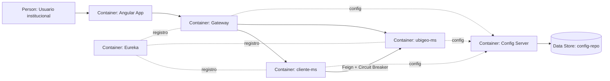

### Pago y Orden

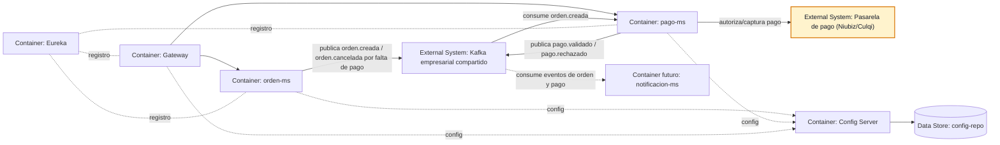

### Estados de Orden

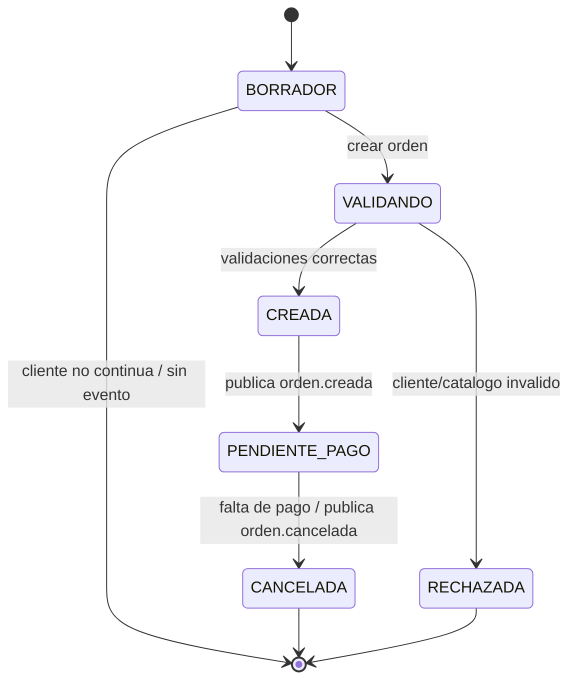

`orden-ms` cambia de estado por decisiones propias del flujo de orden. Si el cliente no continua antes de confirmar, el flujo termina sin publicar eventos. Las validaciones con `cliente-ms` y `catalogo-ms` ocurren antes de crear la orden. Luego publica `orden.creada`. Si una orden ya creada queda sin pago hasta su vencimiento, `orden-ms` la marca como cancelada por falta de pago y publica `orden.cancelada`. No consume `pago.validado` ni `pago.rechazado` en Release 1. El resultado del pago vive en `pago-ms`; otros servicios como notificaciones pueden reaccionar a los eventos de orden y pago.

### Estados de Pago

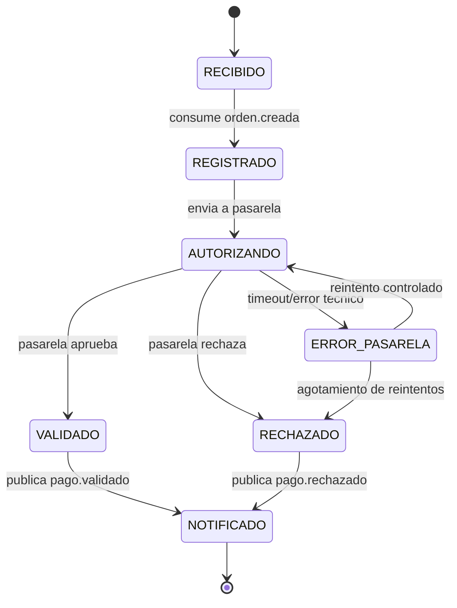

`pago-ms` nace a partir del evento `orden.creada`. Registra el intento de pago, llama a la pasarela externa y publica el resultado. El estado `ERROR_PASARELA` permite diferenciar un rechazo de negocio de un problema tecnico o de comunicacion.

En Release 1, `pago-ms` consume `orden.creada` y publica eventos de pago. `orden-ms` publica eventos de orden y no consume eventos de pago. En Release 2, `notificacion-ms` podra consumir `orden.cancelada`, `pago.validado` y `pago.rechazado` para avisar al usuario.

## C4 Nivel 3

### Container - gateway, eureka y config

Componentes principales de la infraestructura propia de Pagatu.

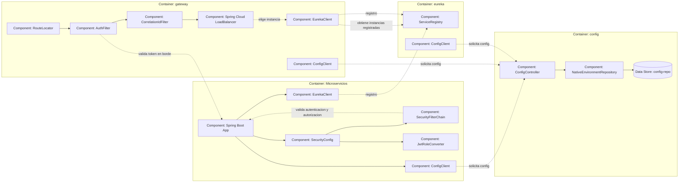

Este nivel muestra la infraestructura propia del proyecto. `config` publica configuracion desde `config-repo`; `gateway`, `eureka` y los microservicios leen su configuracion como Config Client. `eureka` mantiene el registro de servicios; los microservicios y el Gateway se registran con `EurekaClient`. Gateway usa `EurekaClient` para obtener instancias registradas y usa Spring Cloud LoadBalancer para elegir una instancia. La seguridad se valida en dos capas: Gateway aplica una primera validacion de borde y cada microservicio conserva su propia validacion de autenticacion, autorizacion y roles.

Resumen de seguridad:

```text
Gateway:
- Valida token en borde.
- Enruta y balancea.

Microservicios:
- Validan JWT y roles otra vez.
- Protegen reglas de negocio.

Config Server:
- Seguridad interna/operativa.
- Protege configuracion.

Eureka:
- Seguridad interna/operativa.
- Protege registro y discovery.
```

### Container - auth-ms

Componentes principales del servicio de autenticacion inicial.

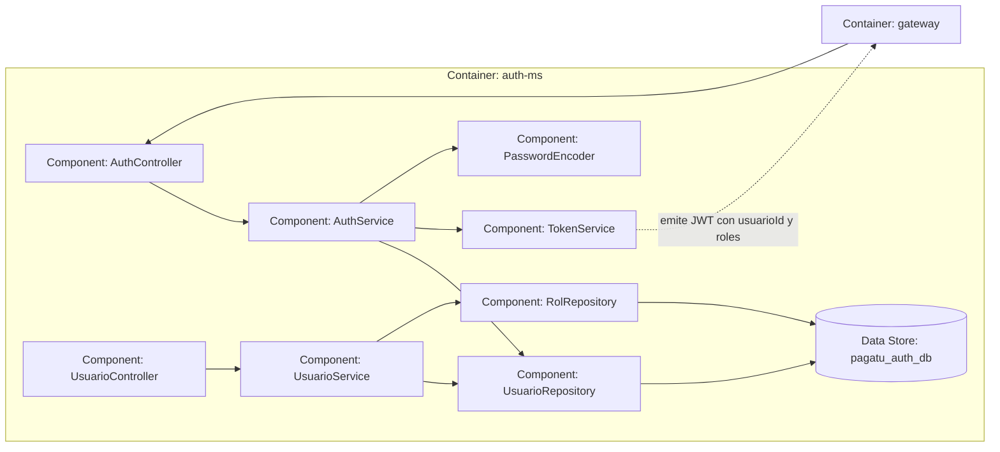

`auth-ms` se mantiene como autenticacion inicial de Release 1. Es duenio de usuarios, credenciales y roles. Mas adelante puede reemplazarse o integrarse con Keycloak, pero los demas servicios seguiran consumiendo tokens y roles bajo la misma idea arquitectonica.

### Container - cliente-ms y ubigeo-ms

Componentes principales del flujo de cliente y ubigeo.

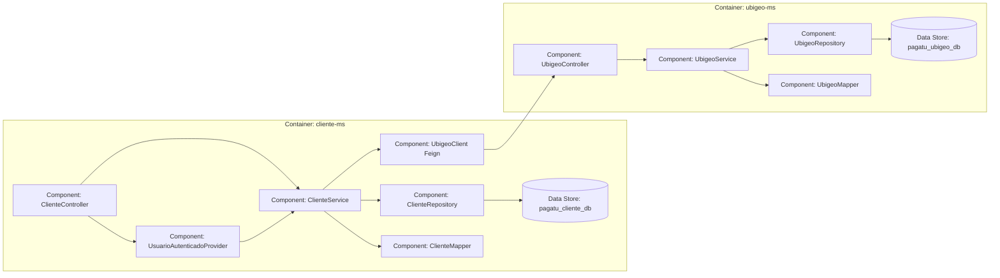

Este nivel baja el zoom dentro de dos contenedores concretos del Release 1. `cliente-ms` gestiona los datos del cliente y consulta a `ubigeo-ms` por Feign cuando necesita completar o validar datos geograficos como nacimiento, residencia o direccion. La relacion con el usuario autenticado se toma desde el JWT mediante `UsuarioAutenticadoProvider`; no se consulta a `auth-ms` por Feign.

### Container - orden-ms y catalogo-ms

Componentes principales del flujo de orden y catalogo.

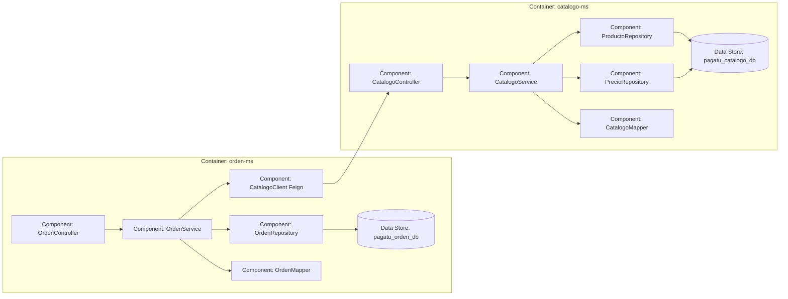

Este nivel muestra la validacion sincrona de items antes de crear una orden. `orden-ms` consulta a `catalogo-ms` por Feign para validar productos, conceptos, familias, categorias, tipos, precios y estado activo.

### Container - pago-ms y orden-ms

Componentes principales del flujo de orden y pago.

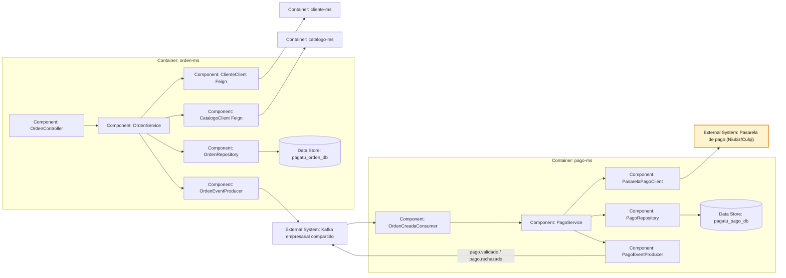

Este nivel baja el zoom dentro de dos contenedores concretos del Release 1. `orden-ms` conserva la decision sincrona por Feign para validar cliente y catalogo antes de crear la orden, y publica eventos propios de orden como `orden.creada` y `orden.cancelada` cuando corresponde por falta de pago. `pago-ms` consume `orden.creada`, encapsula la pasarela externa y publica `pago.validado` o `pago.rechazado` para consumidores posteriores, como `notificacion-ms` en Release 2.

## C4 Nivel 4

### Component - AuthService

Codigo de ejemplo en `auth-ms`.

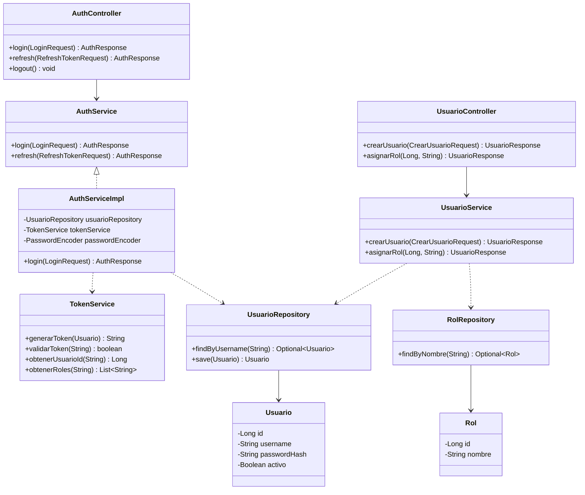

Este ejemplo representa la autenticacion inicial del curso. No busca reemplazar a Keycloak en escenarios empresariales completos; sirve para entender tokens, roles y control de acceso antes de integrar un proveedor de identidad.

### Component - ClienteService

Codigo de ejemplo en `cliente-ms`.

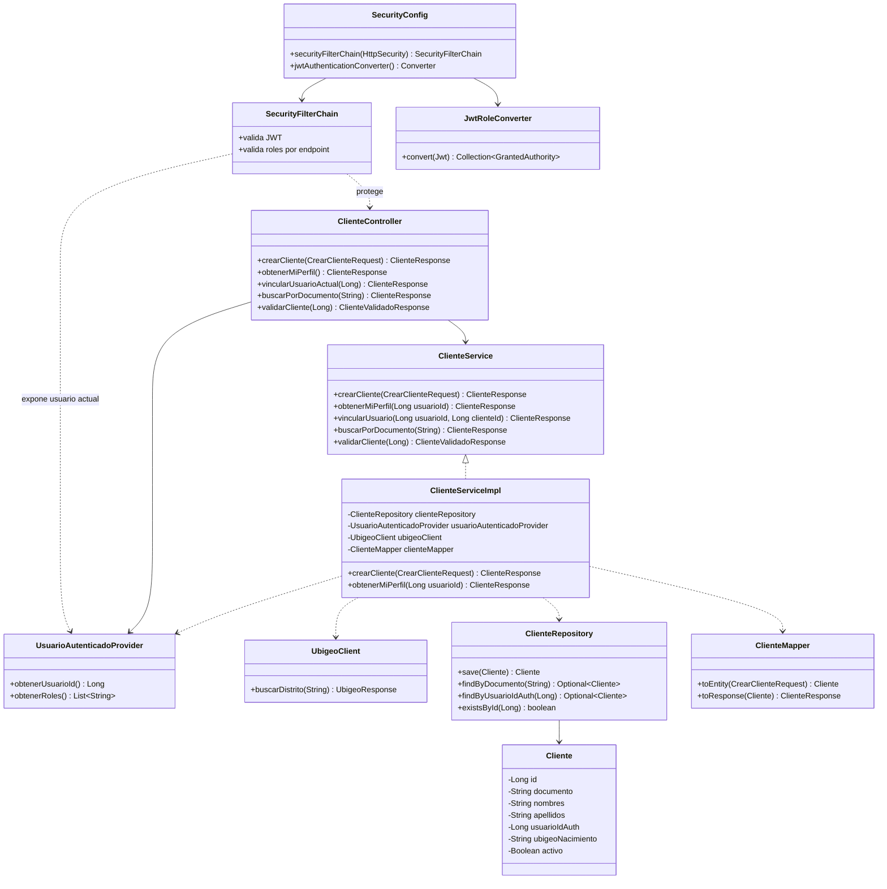

La relacion entre usuario y cliente se muestra en `cliente-ms`, no como llamada directa a `auth-ms`. `auth-ms` es duenio de la identidad; `cliente-ms` solo guarda `usuarioIdAuth` como referencia al usuario autenticado y lo obtiene desde el JWT mediante `UsuarioAutenticadoProvider`. Asi se puede resolver el perfil del cliente actual sin acoplar ambos microservicios.

### Component - UbigeoService

Codigo de ejemplo en `ubigeo-ms`.

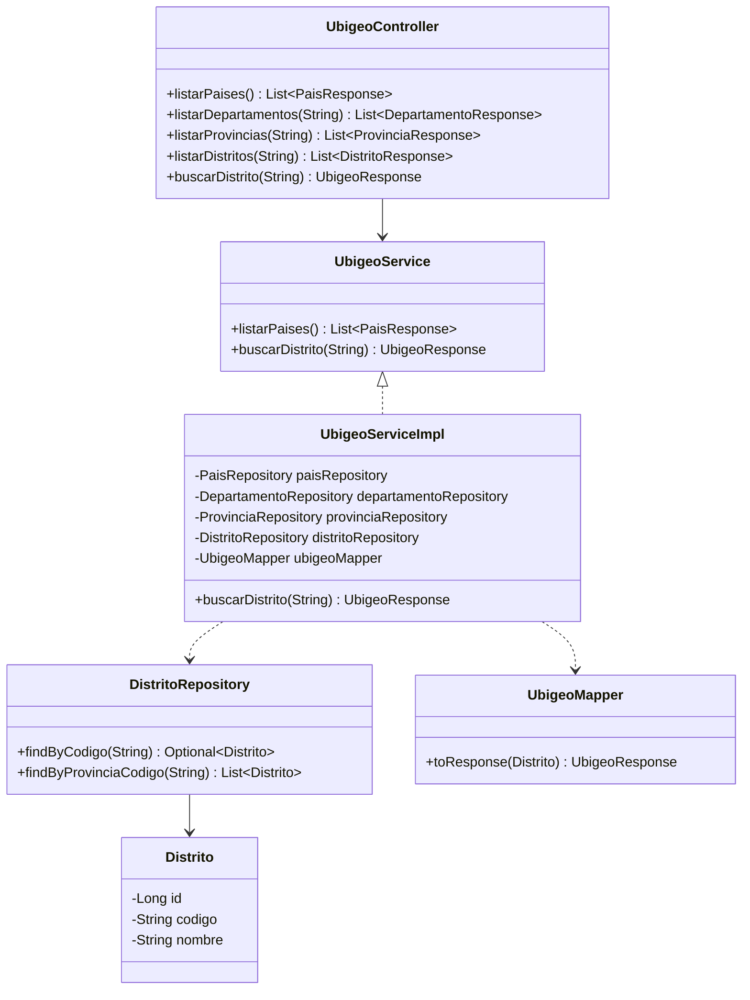

`ubigeo-ms` queda como servicio sincrono estable y de consulta publica. Su responsabilidad es exponer datos territoriales conocidos, no proteger reglas de negocio ni evolucionar a mensajeria de eventos.

### Component - CatalogoService

Codigo de ejemplo en `catalogo-ms`.

```mermaid
classDiagram
    class SecurityConfig {
        +securityFilterChain(HttpSecurity) SecurityFilterChain
        +jwtAuthenticationConverter() Converter
    }

    class SecurityFilterChain {
        +valida JWT
        +valida roles por endpoint
    }

    class ProductoController {
        +listarActivos() List~ProductoResponse~
        +buscarProducto(Long) ProductoResponse
        +crearProducto(CrearProductoRequest) CatalogoItemResponse
        +actualizarProducto(Long, ActualizarProductoRequest) CatalogoItemResponse
        +desactivar(Long) void
    }

    class CategoriaController {
        +listarCategorias() List~CategoriaResponse~
        +crearCategoria(CrearCategoriaRequest) CategoriaResponse
        +actualizarCategoria(Long, ActualizarCategoriaRequest) CategoriaResponse
    }

    class FamiliaController {
        +listarFamilias() List~FamiliaResponse~
        +crearFamilia(CrearFamiliaRequest) FamiliaResponse
    }

    class ConceptoController {
        +listarConceptos() List~ConceptoResponse~
        +buscarConcepto(Long) ConceptoResponse
    }

    class PrecioController {
        +buscarPrecioVigente(Long) PrecioResponse
        +registrarPrecio(CrearPrecioRequest) PrecioResponse
    }

    class CatalogoConsultaController {
        +validarItem(Long) CatalogoItemResponse
        +listarItemsActivos() List~CatalogoItemResponse~
    }

    class ProductoService {
        +crearProducto(CrearProductoRequest) CatalogoItemResponse
        +listarActivos() List~ProductoResponse~
        +desactivar(Long) void
    }

    class CategoriaService {
        +listarCategorias() List~CategoriaResponse~
        +crearCategoria(CrearCategoriaRequest) CategoriaResponse
    }

    class FamiliaService {
        +listarFamilias() List~FamiliaResponse~
        +crearFamilia(CrearFamiliaRequest) FamiliaResponse
    }

    class ConceptoService {
        +buscarConcepto(Long) ConceptoResponse
    }

    class PrecioService {
        +buscarPrecioVigente(Long) PrecioResponse
        +registrarPrecio(CrearPrecioRequest) PrecioResponse
    }

    class CatalogoConsultaService {
        +validarItem(Long) CatalogoItemResponse
    }

    class CatalogoConsultaServiceImpl {
        -ProductoRepository productoRepository
        -ConceptoRepository conceptoRepository
        -PrecioRepository precioRepository
        -CatalogoMapper catalogoMapper
        +validarItem(Long) CatalogoItemResponse
    }

    class ProductoRepository {
        +findById(Long) Optional~Producto~
        +findByActivoTrue() List~Producto~
        +save(Producto) Producto
    }

    class ConceptoRepository {
        +findById(Long) Optional~Concepto~
    }

    class CategoriaRepository {
        +findById(Long) Optional~Categoria~
        +findByActivoTrue() List~Categoria~
    }

    class FamiliaRepository {
        +findById(Long) Optional~Familia~
        +findByActivoTrue() List~Familia~
    }

    class PrecioRepository {
        +findVigenteByItemId(Long) Optional~Precio~
    }

    class CatalogoMapper {
        +toResponse(Producto, Precio) CatalogoItemResponse
    }

    class Producto {
        -Long id
        -String nombre
        -String tipo
        -Boolean activo
    }

    class Categoria {
        -Long id
        -String nombre
        -Boolean activo
    }

    class Familia {
        -Long id
        -String nombre
        -Boolean activo
    }

    class Concepto {
        -Long id
        -String nombre
        -String tipo
        -Boolean activo
    }

    class Precio {
        -Long id
        -BigDecimal monto
        -LocalDate fechaInicio
        -LocalDate fechaFin
    }

    SecurityConfig --> SecurityFilterChain
    SecurityFilterChain ..> ProductoController : protege escritura
    SecurityFilterChain ..> CategoriaController : protege escritura
    SecurityFilterChain ..> FamiliaController : protege escritura
    SecurityFilterChain ..> PrecioController : protege escritura
    ProductoController --> ProductoService
    CategoriaController --> CategoriaService
    FamiliaController --> FamiliaService
    ConceptoController --> ConceptoService
    PrecioController --> PrecioService
    CatalogoConsultaController --> CatalogoConsultaService
    ProductoService ..> ProductoRepository
    CategoriaService ..> CategoriaRepository
    FamiliaService ..> FamiliaRepository
    ConceptoService ..> ConceptoRepository
    PrecioService ..> PrecioRepository
    CatalogoConsultaService <|.. CatalogoConsultaServiceImpl
    CatalogoConsultaServiceImpl ..> ProductoRepository
    CatalogoConsultaServiceImpl ..> ConceptoRepository
    CatalogoConsultaServiceImpl ..> PrecioRepository
    CatalogoConsultaServiceImpl ..> CatalogoMapper
    ProductoRepository --> Producto
    ConceptoRepository --> Concepto
    CategoriaRepository --> Categoria
    FamiliaRepository --> Familia
    PrecioRepository --> Precio
```

`catalogo-ms` es un solo microservicio, pero no significa un solo controller. Puede exponer controladores por recurso: productos, categorias, familias, conceptos y precios. Las consultas de catalogo pueden ser publicas porque muestran informacion comercial disponible para el usuario. La edicion del catalogo si queda protegida por JWT y roles. Cuando se crea una orden, la autenticacion ocurre en `orden-ms`; luego `orden-ms` consulta `catalogo-ms` por Feign para decidir si un item puede entrar en la orden.

### Component - OrdenService

Codigo de ejemplo en `orden-ms`.

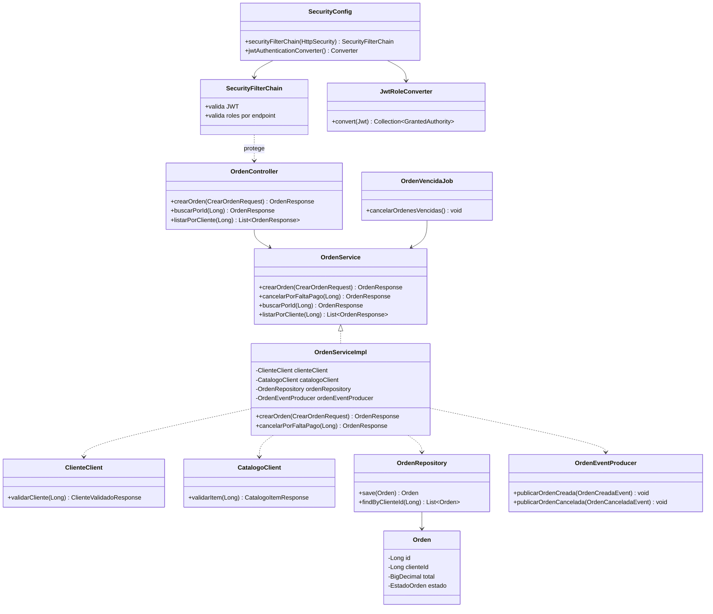

Este nivel se usa solo como ejemplo didactico. En C4, el nivel de codigo no deberia convertirse en un diagrama de todas las clases del proyecto; sirve para explicar una parte puntual cuando aporta claridad.

### Component - Angular Ordenes

Codigo de ejemplo del frontend para el flujo de ordenes.


Angular se muestra aparte porque vive en otro proyecto/contenedor. Este diagrama explica la pantalla de ordenes, sus componentes, servicios HTTP e interceptores, mientras el diagrama de `orden-ms` queda enfocado en el backend.

### Component - PagoService

Codigo de ejemplo en `pago-ms`.


Estos ejemplos de codigo muestran el estilo esperado dentro de cada microservicio: el acceso HTTP se valida antes del controller con `SecurityConfig`, `SecurityFilterChain` y conversion de roles JWT; el controller depende del contrato `Service`; la clase `Impl` encapsula la orquestacion interna y desde alli se usan repositories, mappers, clients Feign y producers/consumers Kafka cuando correspondan. En consumidores Kafka, la autorizacion no entra por endpoint HTTP, pero el servicio igual conserva trazabilidad y validaciones de negocio.
