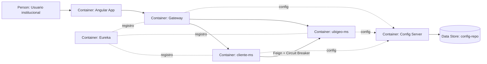
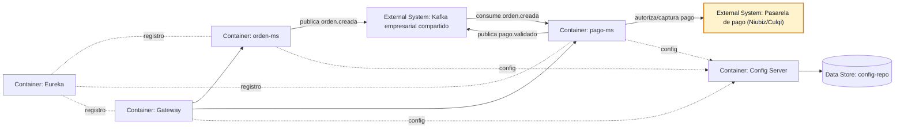
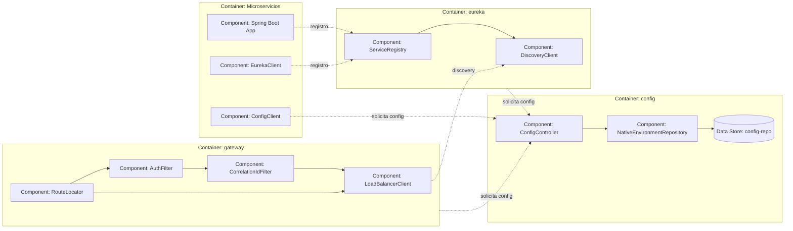
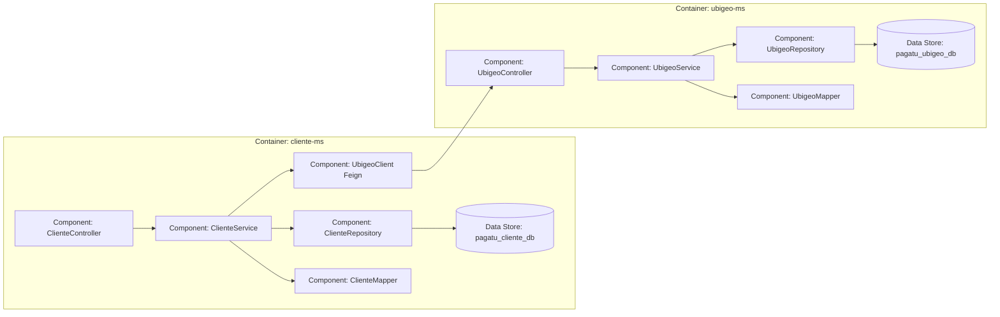
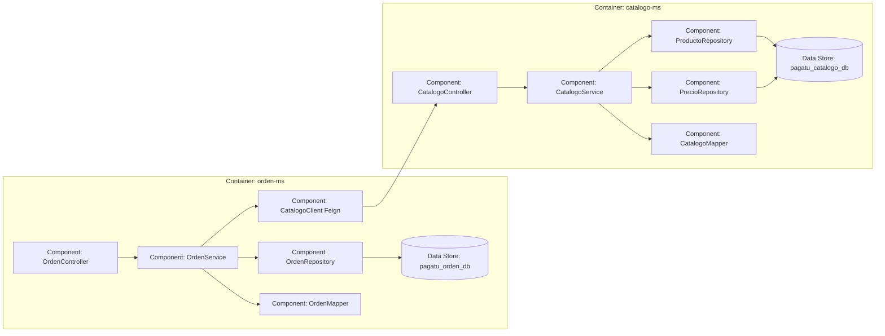
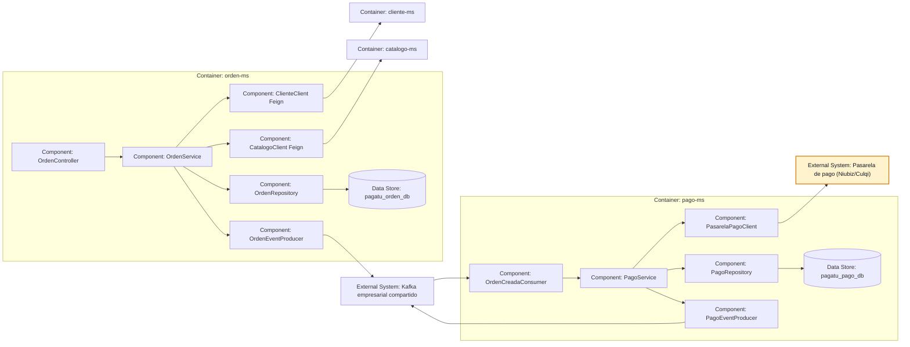
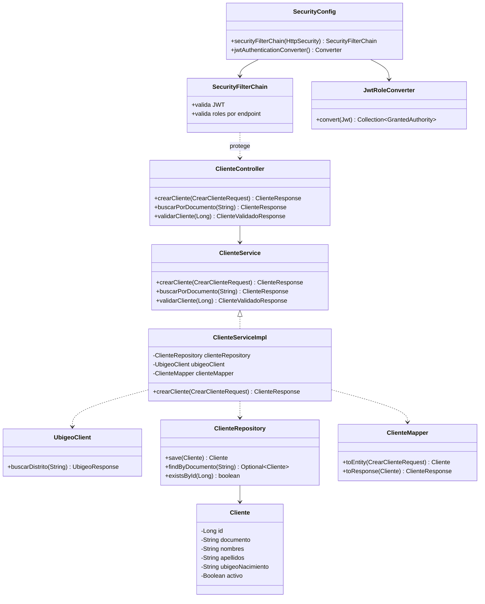
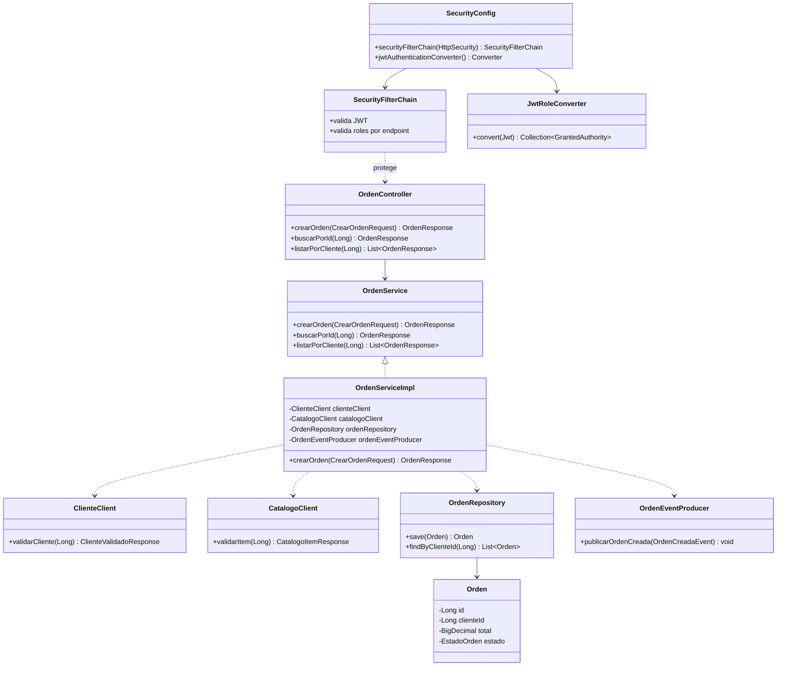
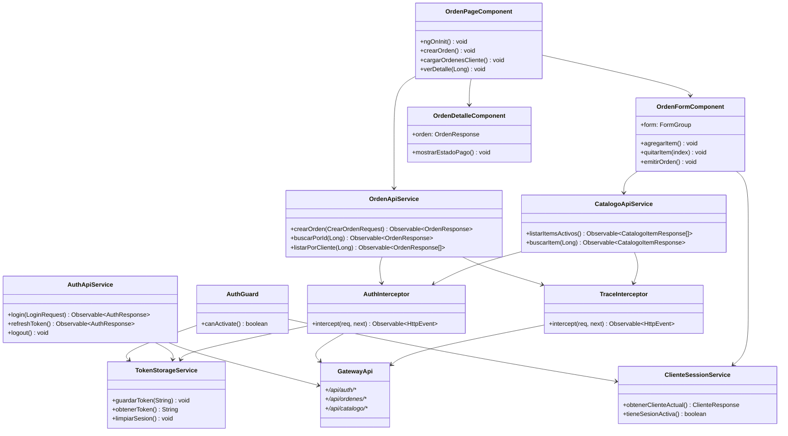
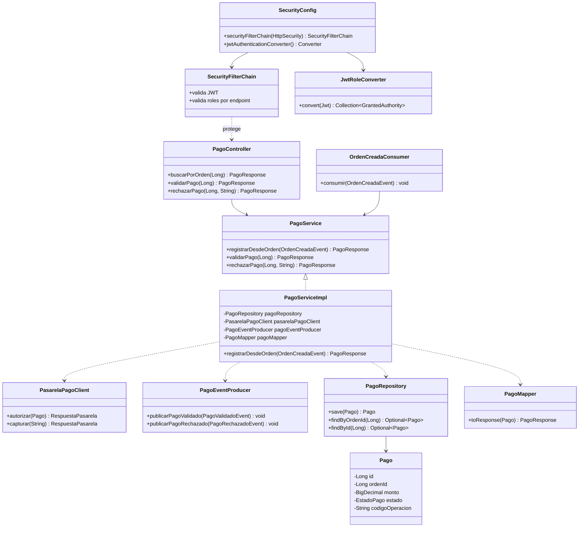

# Arquitectura Detallada de Pagatu

Este documento contiene las vistas tecnicas de mayor detalle de Pagatu. Complementa a [README_01_ACERCA_DEL_PROYECTO.md](README_01_ACERCA_DEL_PROYECTO.md), que conserva la vision general, C4 nivel 1, C4 nivel 2 y despliegue por ambientes.

## Vistas Dinamicas

### Cliente y Ubigeo

### Orden y Pago

## C4 Nivel 3

### Container - gateway, eureka y config

Componentes principales de la infraestructura propia de Pagatu.

Este nivel muestra la infraestructura propia del proyecto. `config` publica configuracion desde `config-repo`, `eureka` mantiene el registro de servicios y `gateway` enruta y balancea hacia los microservicios usando discovery.

### Container - cliente-ms y ubigeo-ms

Componentes principales del flujo de cliente y ubigeo.

Este nivel baja el zoom dentro de dos contenedores concretos del Release 1. `cliente-ms` gestiona los datos del cliente y consulta a `ubigeo-ms` por Feign cuando necesita completar o validar datos geograficos como nacimiento, residencia o direccion.

### Container - orden-ms y catalogo-ms

Componentes principales del flujo de orden y catalogo.

Este nivel muestra la validacion sincrona de items antes de crear una orden. `orden-ms` consulta a `catalogo-ms` por Feign para validar productos, conceptos, familias, categorias, tipos, precios y estado activo.

### Container - pago-ms y orden-ms

Componentes principales del flujo de orden y pago.

Este nivel baja el zoom dentro de dos contenedores concretos del Release 1. `orden-ms` conserva la decision sincrona por Feign para validar cliente y catalogo antes de crear la orden. `pago-ms` reacciona por Kafka a `orden.creada`, encapsula la pasarela externa y publica el resultado `pago.validado`.

## C4 Nivel 4

### Component - ClienteService

Codigo de ejemplo en `cliente-ms`.

### Component - OrdenService

Codigo de ejemplo en `orden-ms`.

Este nivel se usa solo como ejemplo didactico. En C4, el nivel de codigo no deberia convertirse en un diagrama de todas las clases del proyecto; sirve para explicar una parte puntual cuando aporta claridad.

### Component - Angular Ordenes

Codigo de ejemplo del frontend para el flujo de ordenes.

Angular se muestra aparte porque vive en otro proyecto/contenedor. Este diagrama explica la pantalla de ordenes, sus componentes, servicios HTTP e interceptores, mientras el diagrama de `orden-ms` queda enfocado en el backend.

### Component - PagoService

Codigo de ejemplo en `pago-ms`.

Estos ejemplos de codigo muestran el estilo esperado dentro de cada microservicio: el acceso HTTP se valida antes del controller con `SecurityConfig`, `SecurityFilterChain` y conversion de roles JWT; el controller depende del contrato `Service`; la clase `Impl` encapsula la orquestacion interna y desde alli se usan repositories, mappers, clients Feign y producers/consumers Kafka cuando correspondan. En consumidores Kafka, la autorizacion no entra por endpoint HTTP, pero el servicio igual conserva trazabilidad y validaciones de negocio.
