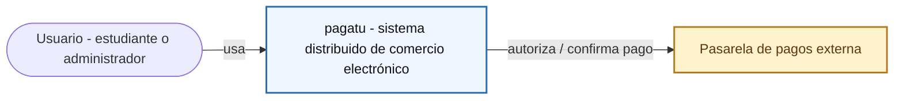
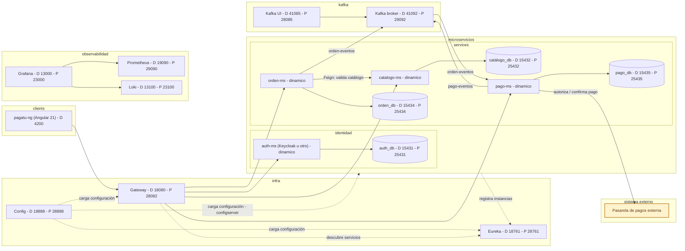

# DISTribuidas 2026-2

Curso práctico de sistemas distribuidos con microservicios, configuración centralizada, descubrimiento de servicios, Gateway, seguridad, resiliencia, mensajería asíncrona, consistencia distribuida, observabilidad e integración frontend.

[`pagatu`](https://github.com/262dist/pagatu) es un entorno integrado para construir un sistema distribuido de comercio electrónico mediante laboratorios reproducibles basados en Docker y Spring Cloud. El proyecto unifica infraestructura, microservicios, cliente frontend, mensajería, observabilidad y documentación para que cada equipo pueda adaptar el sistema a su proyecto final.

## Producto del curso

Producto del curso = Producto U3:

```text
Sistema distribuido de microservicios end-to-end, configurable, escalable,
seguro, resiliente, consistente, observable, integrado con frontend y defendido
técnicamente.
```

Resultado esperado del curso:

Al finalizar el curso, el estudiante implementa, integra y sustenta un sistema distribuido basado en microservicios. La solución debe ejecutarse de forma reproducible en desarrollo y producción local, exponer evidencias de configuración, registro, enrutamiento, escalado, seguridad, comunicación entre servicios, mensajería asíncrona, consistencia distribuida, observabilidad, persistencia e integración frontend. El producto se presenta en equipo, pero cada estudiante evidencia y defiende su aporte individual.

## Contenido

### U1: Sistema distribuido base orientado a producción

Producto U1: sistema distribuido base funcional, configurable y preparado para múltiples instancias.

Resultado esperado U1: el estudiante construye un primer servicio REST funcional, externaliza configuración por ambientes, registra servicios dinámicamente, accede al sistema mediante un punto único de entrada y demuestra distribución de tráfico entre instancias.

| Sesión | Tema (sílabo) | MS que se toca | Trabajo principal |
|---|---|---|---|
| S1 | Construcción de un servicio base para un sistema distribuido. | `catalogo-ms` | Servicio REST base, PostgreSQL, Swagger, Actuator. |
| [S2](sesiones/S02_Configuracion_Centralizada_Ambientes.md) | Gestión centralizada de configuración y ambientes. | `catalogo-ms` + `orden-ms` (nuevo, esqueleto) | Config Server + config-repo; se crea `orden-ms` mínimo (CRUD simple) para tener un segundo servicio que también lea del Config Server. |
| S3 | Registro, descubrimiento y ejecución concurrente de servicios. | `catalogo-ms`, `orden-ms` | Eureka; ambos servicios se registran; múltiples instancias de `catalogo-ms` visibles en el dashboard de Eureka. Se levantan Prometheus y Loki para empezar a recolectar métricas y logs de esas instancias. |
| S4 | Punto único de acceso y distribución de tráfico. | `catalogo-ms`, `orden-ms` | Gateway enruta a ambos; balanceo de carga entre instancias. Se agrega Grafana con paneles básicos sobre las métricas y logs que ya recolectan Prometheus y Loki desde S3. |
| S5 | Integración del sistema distribuido base: servicios, configuración centralizada, descubrimiento, ejecución concurrente, Gateway y balanceo de carga. | — | Sustentación del sistema base, con evidencia de operación de los MS en los paneles de Grafana: instancias registradas en Eureka, balanceo de carga entre ellas y métricas/logs en vivo. |

### U2: Sistema distribuido robusto

Producto U2: sistema distribuido seguro, resiliente, consistente, observable e integrado con cliente frontend.

Resultado esperado U2: el estudiante implementa comunicación síncrona resiliente, seguridad distribuida, mensajería asíncrona, consistencia eventual en procesos de negocio, observabilidad operacional e integración frontend mediante el punto único de acceso.

| Sesión | Tema (sílabo) | MS que se toca | Trabajo principal |
|---|---|---|---|
| S6 | Comunicación síncrona resiliente entre servicios. | `orden-ms` → `catalogo-ms` | Feign + Circuit Breaker: `orden-ms` valida catálogo antes de crear la orden. |
| S7 | Seguridad distribuida y control de acceso. | `auth-ms` (nuevo) | JWT propio, roles, Gateway como Resource Server. |
| S8 | Mensajería asíncrona entre servicios. | `orden-ms` → `pago-ms` (nuevo) | `orden-ms` publica `orden.creada`; `pago-ms` consume y publica `pago.validado`. |
| S9 | Consistencia distribuida en procesos de negocio. | `orden-ms`, `pago-ms` | Idempotencia, compensación, manejo de eventos duplicados. |
| S10 | Observabilidad y diagnóstico de sistemas distribuidos. | todos | Extiende Prometheus/Loki/Grafana (ya en pie desde S3-S4) a `auth-ms`, `orden-ms` y `pago-ms`; agrega paneles de diagnóstico y alertas sobre todo el sistema, no solo `catalogo-ms`. |
| S11 | Integración con cliente frontend. | Angular 21 | Cliente consumiendo por Gateway: catálogo, crear orden, ver pago. |
| S12 | Integración del sistema distribuido robusto: comunicación resiliente, seguridad, mensajería, consistencia eventual, observabilidad e integración frontend. | — | Sustentación del sistema robusto. |

### U3: Validación y consolidación del producto del curso

Producto U3 / producto del curso: sistema distribuido de microservicios end-to-end, validado, documentado, estabilizado y defendido técnicamente.

Resultado esperado U3: el estudiante integra los componentes desarrollados en las unidades anteriores, valida flujos completos, estabiliza documentación y despliegue local, prepara evidencias técnicas y sustenta el producto final. La defensa es grupal, pero la nota es individual.

| Sesión | Tema (sílabo) | MS que se toca | Trabajo principal |
|---|---|---|---|
| S13 | Validación end-to-end del producto del curso. | todos | Pruebas end-to-end del flujo completo: catálogo, orden, pago, seguridad, mensajería. |
| S14 | Revisión técnica y estabilización del producto. | todos | Documentación, evidencias, configuración y despliegue local estabilizados. |
| S15 | Integración y validación del sistema distribuido: arquitectura, seguridad, mensajería, consistencia, observabilidad, frontend y despliegue reproducible. | todos | Sustentación grupal del sistema completo. |
| S16 | Integración de sistemas distribuidos: servicios, configuración, comunicación, resiliencia, seguridad, consistencia, observabilidad, pruebas y despliegue. | todos | Evaluación individual final: demostración y preguntas técnicas pendientes. |

## Arquitectura pagatu v2026

### Nivel 1: Contexto del sistema (System Context - C4 nivel 1)



`pagatu` se ve como una sola caja negra: sin microservicios, sin Gateway, sin Kafka por dentro. Solo importa quién lo usa (el usuario) y con qué sistema externo conversa (la pasarela de pagos). El detalle interno aparece recién en el nivel 2.

### Nivel 2: Contenedores (Container diagram - C4 nivel 2)



Convención del diagrama: las flechas continuas representan interacciones de negocio o consultas directas; las flechas punteadas representan dependencias de infraestructura, configuración o descubrimiento.

## Flujo de trabajo

1. El alumno construye primero un microservicio base en `services/catalogo-ms` y replica el patrón en otros servicios.
2. La infraestructura en `infra/` centraliza configuración, descubrimiento y acceso por Gateway; los microservicios importan configuración con `optional:configserver:${CONFIG_SERVER_URL:http://localhost:18888}`.
3. Los microservicios se ejecutan en DEV con Maven y bases de datos en Docker; al cierre de cada sesión se valida producción local con Docker.
4. Las pruebas de API se realizan con PowerShell o bash/curl, sin depender de Postman.
5. Los flujos asincronos usan mensajería para coordinar ordenes y pagos.
6. `/actuator/health` existe desde S1. El stack de observabilidad (Prometheus, Loki, Grafana) se levanta ya en S3-S4 sobre `catalogo-ms`/`orden-ms`, para tener evidencia visual de operación desde la sustentación de S5; en S10 se extiende a `auth-ms`, `orden-ms` y `pago-ms` con paneles de diagnóstico y alertas sobre todo el sistema.
7. El frontend `clients/pagatu-ng` (Angular 21) consume el sistema mediante Gateway.
8. El producto final se valida end-to-end, se estabiliza y se defiende técnicamente.

## Enlaces

- [Sílabo 2026-2](silabo_dist_2026_2.md)
- [S1 - Construcción de un servicio base](sesiones/S01_Construccion_Servicio_Base.md)
- [S2 - Gestión centralizada de configuración y ambientes](sesiones/S02_Configuracion_Centralizada_Ambientes.md)
- [Guía de Proyecto Sello](proyecto-sello/index.md)
