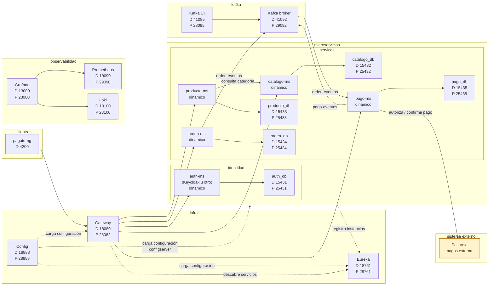

# DISTribuidas 2026-2

Curso práctico de sistemas distribuidos con microservicios, configuración centralizada, descubrimiento de servicios, Gateway, seguridad, resiliencia, mensajería asíncrona, consistencia distribuida, observabilidad e integración frontend.

[`pagatu`](https://github.com/262dist/pagatu) es un entorno integrado para construir un sistema distribuido de comercio electrónico mediante laboratorios reproducibles basados en Docker y Spring Cloud. El proyecto unifica infraestructura, microservicios, cliente frontend, mensajería, observabilidad y documentación para que cada equipo pueda adaptar el sistema a su proyecto final.

## Producto del curso

Producto del curso = Producto U3:

```text
Sistema distribuido de microservicios end-to-end, configurable, escalable,
seguro, resiliente, consistente, observable, integrado con frontend y defendido
técnicamente.
```

Resultado esperado del curso:

Al finalizar el curso, el estudiante implementa, integra y sustenta un sistema distribuido basado en microservicios. La solución debe ejecutarse de forma reproducible en desarrollo y producción local, exponer evidencias de configuración, registro, enrutamiento, escalado, seguridad, comunicación entre servicios, mensajería asíncrona, consistencia distribuida, observabilidad, persistencia e integración frontend. El producto se presenta en equipo, pero cada estudiante evidencia y defiende su aporte individual.

## Contenido

### U1: Sistema distribuido base orientado a producción

Producto U1: sistema distribuido base funcional, configurable y preparado para múltiples instancias.

Resultado esperado U1: el estudiante construye un primer servicio REST funcional, externaliza configuración por ambientes, registra servicios dinámicamente, accede al sistema mediante un punto único de entrada y demuestra distribución de tráfico entre instancias.

| Sesión | Tema | Producto de sesión |
|---|---|---|
| S1 | Construcción de un servicio base para un sistema distribuido | Servicio REST funcional, persistente, observable y preparado para ejecución reproducible |
| S2 | Gestión centralizada de configuración y ambientes | Configuración externa por ambiente y evidencia inicial de observabilidad |
| S3 | Registro, descubrimiento y ejecución concurrente de servicios | Servicios descubiertos dinámicamente y múltiples instancias operativas |
| S4 | Punto único de acceso y distribución de tráfico | Acceso centralizado con rutas y balanceo de carga |
| S5 | Evaluación U1 | Sistema base integrado funcionando como un todo |

### U2: Sistema distribuido robusto

Producto U2: sistema distribuido seguro, resiliente, consistente, observable e integrado con cliente frontend.

Resultado esperado U2: el estudiante implementa comunicación síncrona resiliente, seguridad distribuida, mensajería asíncrona, consistencia eventual en procesos de negocio, observabilidad operacional e integración frontend mediante el punto único de acceso.

| Sesión | Tema | Producto de sesión |
|---|---|---|
| S6 | Comunicación síncrona resiliente entre servicios | Operación distribuida con respuesta controlada ante fallos |
| S7 | Seguridad distribuida y control de acceso | Autenticación, autorización y protección de rutas del sistema |
| S8 | Mensajería asíncrona entre servicios | Comunicación por eventos entre servicios desacoplados |
| S9 | Consistencia distribuida en procesos de negocio | Proceso distribuido con consistencia eventual, compensacion e idempotencia |
| S10 | Observabilidad y diagnóstico de sistemas distribuidos | Logs, health, métricas y paneles de diagnóstico |
| S11 | Integración con cliente frontend | Cliente integrado al sistema distribuido mediante Gateway |
| S12 | Evaluación U2 | Sistema robusto validado en condiciones reales |

### U3: Validación y consolidación del producto del curso

Producto U3 / producto del curso: sistema distribuido de microservicios end-to-end, validado, documentado, estabilizado y defendido técnicamente.

Resultado esperado U3: el estudiante integra los componentes desarrollados en las unidades anteriores, valida flujos completos, estabiliza documentación y despliegue local, prepara evidencias técnicas y sustenta el producto final. La defensa es grupal, pero la nota es individual.

| Sesión | Tema | Producto de sesión |
|---|---|---|
| S13 | Validación end-to-end del producto del curso | Producto del curso probado integralmente |
| S14 | Revisión técnica y estabilización del producto | Documentación, evidencias y estabilización |
| S15 | Defensa técnica | Sustentación grupal del producto |
| S16 | Evaluación final | Demostración individual de competencias pendientes |

## Arquitectura pagatu v2026



Convención del diagrama: las flechas continuas representan interacciones de negocio o consultas directas; las flechas punteadas representan dependencias de infraestructura, configuración o descubrimiento.

## Flujo de trabajo

1. El alumno construye primero un microservicio base en `services/catalogo-ms` y replica el patrón en otros servicios.
2. La infraestructura en `infra/` centraliza configuración, descubrimiento y acceso por Gateway; los microservicios importan configuración con `optional:configserver:${CONFIG_SERVER_URL:http://localhost:18888}`.
3. Los microservicios se ejecutan en DEV con Maven y bases de datos en Docker; al cierre de cada sesión se valida producción local con Docker.
4. Las pruebas de API se realizan con PowerShell o bash/curl, sin depender de Postman.
5. Los flujos asincronos usan mensajería para coordinar ordenes y pagos.
6. La observabilidad acompaña el curso desde S2 y se consolida en S10.
7. El frontend `clients/pagatu-ng` consume el sistema mediante Gateway.
8. El producto final se valida end-to-end, se estabiliza y se defiende técnicamente.

## Enlaces

- [Sílabo detallado](silabo.md)
- [Guía del curso](guia-curso.md)
- [Puertos y accesos](referencias/puertos.md)
- [Comandos PowerShell](referencias/comandos-powershell.md)
- [Comandos bash macOS/Linux](referencias/comandos-bash.md)
- [Troubleshooting](referencias/troubleshooting.md)
- [Rúbrica](referencias/rubrica.md)
