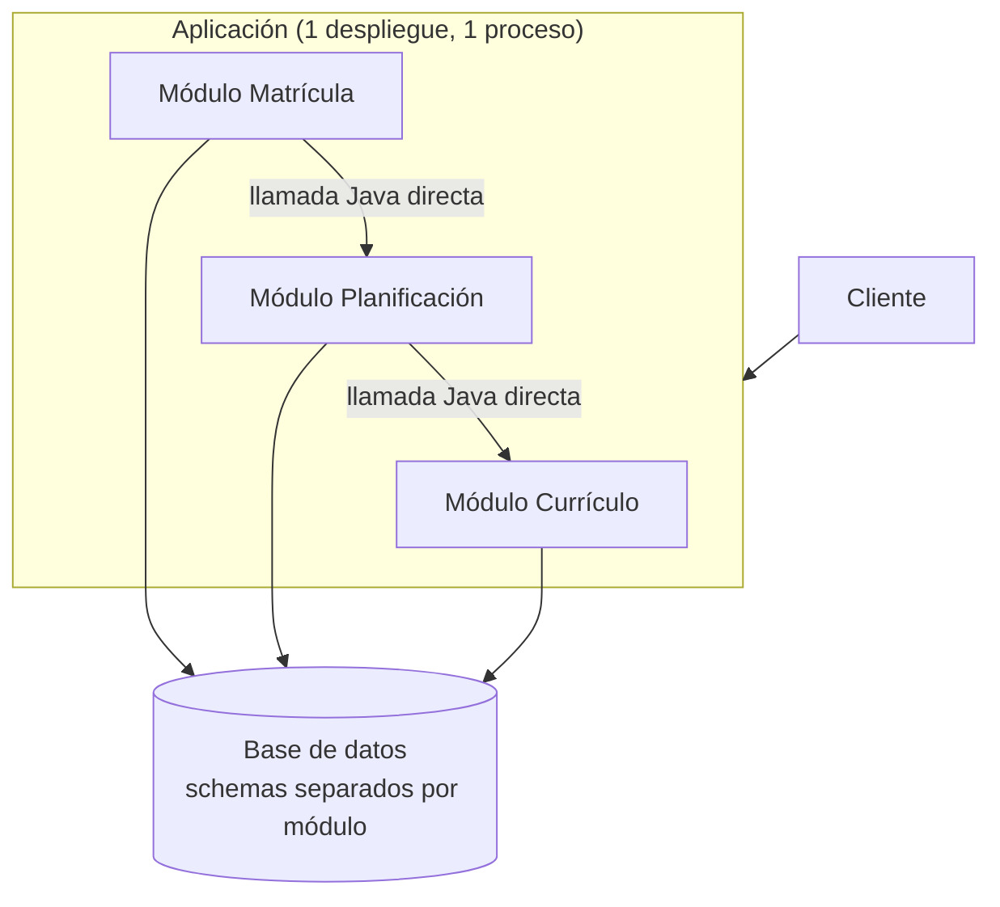
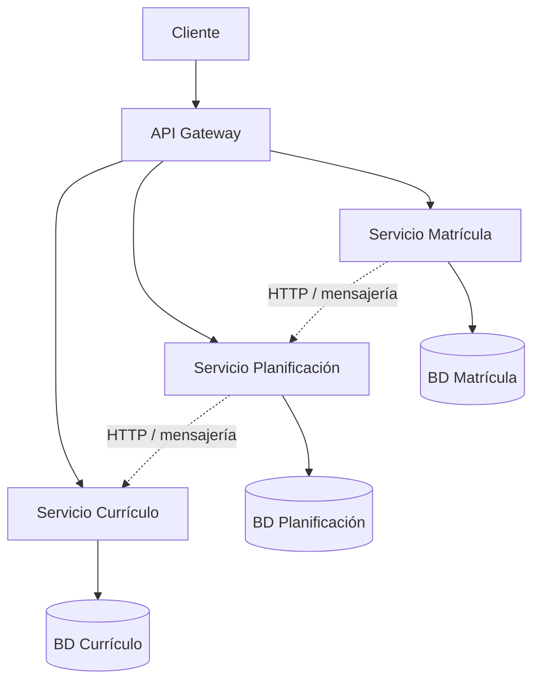
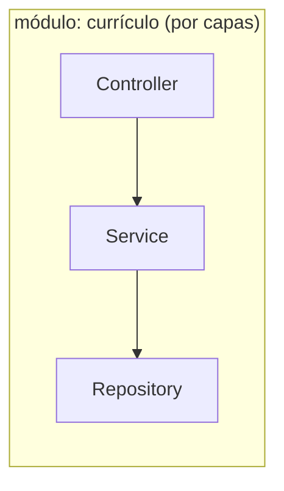
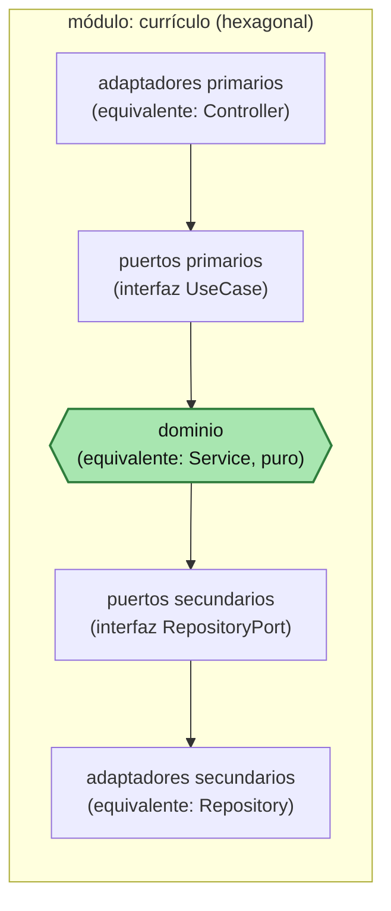
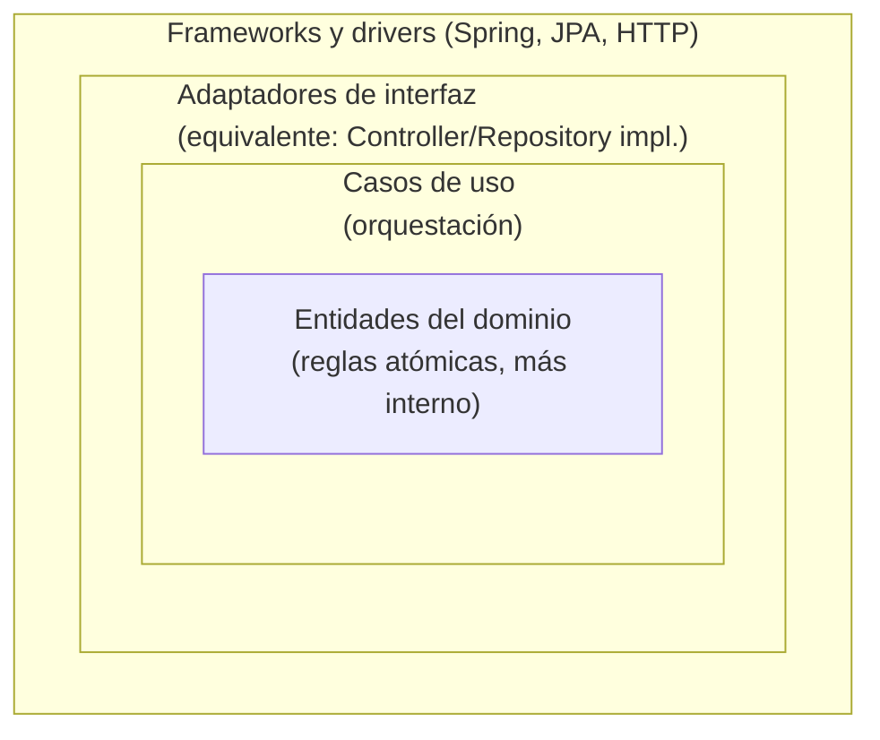

# Sistema Universitario Integrado

**Figura 1. Los 22 dominios del Sistema Universitario Integrado**

```text
 ┌───────────────────────────┐                   ┌───────────────────────────┐
 │ 1. INSTITUCIONAL          │                   │ 2. PERSONAS               │
 │ Y ORGANIZACIÓN            │                   │                           │
 │ institución, campus,      │                   │ persona, identificación,  │
 │ sedes, facultades,        │                   │ datos personales          │
 │ escuelas, programas,      │                   │ contactos                 │
 │ periodos, calendarios     │                   │ documentos                │
 └─────────────┬─────────────┘                   └─────────────┬─────────────┘
               │                                               │
               └──────────────────────┬────────────────────────┘
                                      │
                       ┌──────────────┴──────────────┐
                       │                             │
                       ▼                             ▼
            ┌─────────────────────┐      ┌────────────────────────┐
            │ 3. ADMISIÓN         │      │ 4. CURRÍCULO           │
            │ E INGRESO           │      │                        │
            │ prospectos,         │      │ programas, planes,     │
            │ postulantes,        │      │ versiones, asignaturas,│
            │ evaluaciones,       │      │ créditos, requisitos,  │
            │ resultados, ingreso │      │ equivalencias          │
            └──────────┬──────────┘      └───────────┬────────────┘
                       │                             │
                       └──────────────┬──────────────┘
                                      ▼
                  ┌──────────────────────────────────┐
                  │ 5. PLANIFICACIÓN Y OFERTA        │
                  │ ACADÉMICA                        │
                  │ cursos, secciones, docentes,     │
                  │ horarios, aulas, cupos,          │
                  │ modalidad, carga docente         │
                  └────────────────┬─────────────────┘
                                   │
                                   ▼
                         ┌─────────────────────┐
                         │ 6. MATRÍCULA        │
                         │ inscripción,        │
                         │ retiros, cambios,   │
                         │ reservas, reglas,   │
                         │ bloqueos            │
                         └──────────┬──────────┘
                                    │
              ┌─────────────────────┼─────────────────────┐
              │                     │                     │
              ▼                     ▼                     ▼
 ┌────────────────────────┐ ┌──────────────────────┐ ┌──────────────────────┐
 │ 7. EVALUACIÓN Y        │ │ 9. FINANZAS DEL      │ │ 13. LMS /            │
 │ CIERRE ACADÉMICO       │ │ ESTUDIANTE           │ │ APRENDIZAJE          │
 │                        │ │                      │ │                      │
 │ evaluaciones, notas,   │ │ matrícula, enseñanza │ │ contenidos, tareas,  │
 │ actas, rectificaciones,│ │ derechos académicos, │ │ foros, evaluaciones, │
 │ cierre                 │ │ becas, descuentos    │ │ recursos, seguimiento│
 └────────────┬───────────┘ └──────────┬───────────┘ └──────────────────────┘
              │                        │
              ▼                        ▼
 ┌────────────────────────┐ ┌────────────────────────────┐
 │ 8. TRAYECTORIA         │ │ 11. INGRESOS, COBRANZA     │
 │ ACADÉMICA              │ │ Y PAGOS                    │
 │                        │ │                            │
 │ historial*, promedio,  │ │ cargos, cuentas por        │
 │ créditos, avance,      │ │ cobrar, caja, pagos,       │
 │ convalidaciones,       │ │ pasarelas, bancos,         │
 │ reconocimientos        │ │ devoluciones, comprobantes │
 └────────────┬───────────┘ └────────────┬───────────────┘
              │                          │
              ▼                          ▼
 ┌────────────────────────┐       ┌─────────────────────┐
 │ 10. EGRESO, GRADOS,    │       │ ERP FINANCIERO      │
 │ TÍTULOS Y              │       │ contabilidad,       │
 │ CERTIFICACIÓN          │       │ tesorería, bancos,  │
 │                        │       │ presupuesto, etc.   │
 └────────────────────────┘       └─────────────────────┘


        ═════════════ DOMINIOS INSTITUCIONALES PARALELOS ═════════════


 ┌──────────────────────────────────────────────────────────────────────┐
 │ 12. EXTENSIÓN, EDUCACIÓN CONTINUA Y EVENTOS                          │
 │ talleres, cursos libres, seminarios, congresos, jornadas,            │
 │ diplomados, inscripciones, participantes y certificación             │
 └───────────────────────────────┬──────────────────────────────────────┘
                                 │
                    ┌────────────┴────────────┐
                    ▼                         ▼
            13. LMS / APRENDIZAJE     11. INGRESOS,
                                      COBRANZA Y PAGOS


 ┌──────────────────────────────────────────────────────────────────────┐
 │ 14. SERVICIOS AL ESTUDIANTE                                          │
 │ tutoría, asesoría académica, bienestar, trámites, solicitudes,       │
 │ reclamos, acompañamiento y servicios universitarios                  │
 └──────────────────────────────────────────────────────────────────────┘


 ┌──────────────────────────────────────────────────────────────────────┐
 │ 15. INVESTIGACIÓN                                                    │
 │ proyectos, grupos, investigadores, semilleros, producción            │
 │ científica, jornadas de investigación y repositorio                  │
 └──────────────────────────────────────────────────────────────────────┘


 ┌──────────────────────────────────────────────────────────────────────┐
 │ 16. PRÁCTICAS, INTERNADO Y VINCULACIÓN                               │
 │ prácticas preprofesionales, internado, centros de práctica,          │
 │ supervisión, evaluación, evidencias y convenios                      │
 └──────────────────────────────────────────────────────────────────────┘


 ┌──────────────────────────────────────────────────────────────────────┐
 │ 17. MOVILIDAD E INTERNACIONALIZACIÓN                                 │
 │ intercambio, movilidad entrante/saliente, estancias,                 │
 │ convenios y reconocimiento académico                                 │
 └──────────────────────────────────────────────────────────────────────┘


 ┌──────────────────────────────────────────────────────────────────────┐
 │ 18. EGRESADOS Y SEGUIMIENTO                                          │
 │ egresados, empleabilidad, bolsa de trabajo, seguimiento laboral,     │
 │ alumni y relación con educación continua                             │
 └──────────────────────────────────────────────────────────────────────┘


 ┌──────────────────────────────────────────────────────────────────────┐
 │ 19. CONVENIOS Y RELACIONES INSTITUCIONALES                           │
 │ instituciones asociadas, convenios marco/específicos, vigencia,      │
 │ responsables, compromisos y beneficios                               │
 └──────────────────────────────────────────────────────────────────────┘


 ┌──────────────────────────────────────────────────────────────────────┐
 │ 20. BIBLIOTECA Y RECURSOS ACADÉMICOS                                 │
 │ sistema bibliotecario, préstamos, recursos digitales,                │
 │ bases de datos, repositorios e integración                           │
 └──────────────────────────────────────────────────────────────────────┘


        ═════════════════ CAPAS TRANSVERSALES ═════════════════


 ┌──────────────────────────────────────────────────────────────────────┐
 │ 21. ANALÍTICA, INDICADORES Y BI                                      │
 │ dashboards, rendimiento, retención, deserción, avance curricular,    │
 │ demanda, carga docente, ingresos e indicadores institucionales       │
 └──────────────────────────────────────────────────────────────────────┘


 ┌──────────────────────────────────────────────────────────────────────┐
 │ 22. PLATAFORMA TRANSVERSAL                                           │
 │ seguridad, roles, permisos, SSO, workflow, gestión documental,       │
 │ firma, notificaciones, auditoría, parametrización, APIs,             │
 │ integración e interoperabilidad                                      │
 └──────────────────────────────────────────────────────────────────────┘


 * El historial académico NO constituye una segunda fuente de verdad.
   Se deriva de matrícula + evaluación + actas/cierre +
   convalidaciones/reconocimientos y demás movimientos académicos.
```

## Cómo implementarlo: monolito modular vs. microservicios

Cualquiera de los 22 dominios de arriba puede construirse dentro de **un solo desplegable** (monolito modular) o como **servicios independientes** (microservicios) — la elección no cambia el modelo de dominio, cambia solo dónde termina un proceso y empieza otro. Los dos diagramas de abajo se quedan a nivel **contenedor** (C2 del C4 model): módulos/servicios y sus bases de datos, y cómo se llaman entre sí — sin bajar al detalle interno de cada uno (eso ya se ve en ADS S04, 2.4).

### A. Monolito modular — un solo despliegue

**Figura 2. Monolito modular (C2 — contenedores)**



Los tres módulos corren en el mismo proceso — `Matrícula` llama a `Planificación` y esta a `Currículo` con una llamada directa en Java (verificada en tiempo de compilación, p. ej. `ApplicationModules.verify()` de Spring Modulith), sin red de por medio.

### B. Microservicios — un despliegue por servicio

**Figura 3. Microservicios (C2 — contenedores)**



Cada servicio es su propio proceso, con su propia base de datos — la comunicación ya no es una llamada Java, es red (HTTP/mensajería) a través del *API Gateway* o directo entre servicios, con todo lo que eso trae: *service discovery*, tolerancia a fallos, observabilidad distribuida.

### Lo que no cambia entre A y B

Un nivel más abajo (C3, no dibujado aquí — ver ADS S04, 2.4), cada módulo/servicio sigue siendo el mismo hexágono: dominio en el centro, puertos primarios/secundarios alrededor, adaptadores primarios/secundarios hacia el exterior. Lo único que cambia entre A y B es el borde exterior: si ese límite es una llamada de método dentro del mismo proceso, o una llamada de red entre dos procesos distintos. Por eso un módulo bien delimitado en A se puede extraer a microservicio en B sin rediseñar su interior: el puerto que ya tenía se convierte en el contrato de red.

### C3: dentro de un módulo/servicio — dos formas de organizarlo (zoom a `currículo`)

Dentro de cada caja "Módulo Currículo"/"Servicio Currículo" de A y B hay todavía una decisión más: cómo se organiza el código *adentro*. Dos opciones, no una — la misma comparación que hace ADS S04 (2.3-2.4), aplicada aquí al dominio académico.

**Figura 4. Por capas (organización tradicional)**



**Figura 5. Hexagonal (dominio aislado)**



Esto es lo que A y B esconden detrás de cada caja "Módulo Currículo"/"Servicio Currículo" — el mismo detalle que ADS S04 (2.4, Figura 6) muestra con adaptadores concretos (REST, CLI, eventos por el lado primario; PostgreSQL, API externa, correo por el secundario) en vez de las etiquetas genéricas de aquí.

**Figura 6. Clean Architecture (si algún módulo llega a necesitarlo)**



Hexagonal es, en la práctica, un caso concreto de aplicación de Clean Architecture (SACAViX Tech, ver ADS S04 2.5) — no un tercer patrón aparte. La diferencia real de Clean sobre Hexagonal es separar formalmente **Entidades** (reglas atómicas) de **Casos de uso** (orquestación entre varias entidades), algo que el "dominio" de la Figura 5 todavía trata como una sola pieza. Esa separación solo aporta claridad cuando un módulo acumula muchos casos de uso complejos — ningún dominio de los 22 la necesita hoy.

**Tabla 1. Capas vs. Hexagonal vs. Clean, dentro de un módulo**

| | Por capas | Hexagonal | Clean Architecture |
|---|---|---|---|
| **Ventaja** | Simple y rápido de construir — sin interfaces ni indirección extra, natural para CRUD. | Dominio aislado de la tecnología: se prueba sin base de datos ni servidor HTTP, y se cambia de proveedor (BD, API externa) escribiendo solo un adaptador nuevo. | Mismo aislamiento que Hexagonal, más una separación explícita entre reglas atómicas (Entidades) y orquestación (Casos de uso) — útil si un módulo tiene muchos casos de uso complejos que comparten las mismas entidades. |
| **Desventaja** | El dominio queda acoplado directo a Spring/JPA — cambiar de framework o de motor de base de datos obliga a tocar la lógica de negocio. | Más clases e interfaces que mantener; *over-engineering* si el módulo es CRUD simple sin reglas de negocio reales que proteger. | Todo el costo de Hexagonal, más una capa adicional (Casos de uso separados de Entidades) que la mayoría de los módulos no necesita — el *over-engineering* de Hexagonal, pero un escalón más arriba. |
| **Cuándo usarla aquí** | La mayoría de los 22 dominios, al menos al inicio — CRUD con validaciones simples (ej. Personas, Currículo, Matrícula en su versión básica). | Un dominio que acumule reglas de negocio genuinamente complejas — candidatos reales: cálculo de créditos/convalidaciones (Trayectoria Académica), o reglas de cobranza con múltiples medios de pago (Ingresos y Pagos). | Ninguno de los 22 dominios lo justifica hoy — quedaría reservado para un módulo que, además de complejo, acumule tantos casos de uso que separarlos de las entidades aporte claridad real. |

No es una decisión de una sola vez para todo el sistema: cada módulo se evalúa por separado, con el mismo criterio de ADS S04 (2.11) — capas por defecto, hexagonal cuando el dominio ya lo justifica, Clean solo si además el volumen de casos de uso lo pide.

## Decisión aplicada: académico, financiero y el resto

**Tabla 2. Decisión de arquitectura por grupo de dominios**

| Grupo | Dominios (del mapa de 22) | Organización interna | Por qué |
|---|---|---|---|
| **Académico** | 1-8: Institucional, Personas, Admisión, Currículo, Planificación, Matrícula, Evaluación, Trayectoria | **Capas** por defecto | CRUD con validaciones — sin regla de negocio que hoy justifique aislar el dominio (Tabla 1). |
| **Académico — excepción** | 8. Trayectoria Académica | **Hexagonal**, si el cálculo de convalidaciones/reconocimientos crece | Único candidato real dentro de académico a agregado DDD (mismo criterio que `ventas` en LP2 S4, ver ADS S04 2.11) — se evalúa cuando el código exista, no antes. |
| **Financiero** | 9. Finanzas del Estudiante, 11. Ingresos, Cobranza y Pagos | **Hexagonal desde el inicio** | Caso de uso de manual (SACAViX, ver ADS S04 2.4): pasarelas de pago y bancos distintos, necesidad real de cambiar de proveedor sin tocar el cálculo de cargos/conciliación — no hay que esperar a que la complejidad "aparezca", ya está garantizada por el dominio. |
| **Financiero — externo** | ERP Financiero (contabilidad, tesorería) | **No se construye — se integra** | Mismo criterio que Keycloak para seguridad: sistema de terceros, el trabajo del equipo es el adaptador de integración, no el motor contable. |
| **Resto** | 12, 14-20: Extensión, LMS, Servicios al Estudiante, Investigación, Prácticas, Movilidad, Egresados, Convenios, Biblioteca | **Capas** | Mismo perfil que académico: gestión de contenido/registros, sin regla de negocio que aislar todavía. |
| **Transversal** | 21. Analítica/BI, 22. Plataforma Transversal | **No aplica el eje hexagonal** | Son capas transversales de infraestructura (seguridad vía Keycloak, observabilidad, BI), no módulos de dominio — se consumen desde los demás, no se construyen con el mismo criterio. |

**Topología de despliegue:** monolito modular (A) para todo el sistema al inicio — ningún grupo justifica todavía el costo operacional de microservicios (Trade-offs, más arriba). **Financiero/Pagos** es el candidato más real a extraerse primero si el volumen de transacciones o un requisito de aislamiento (auditoría, PCI) lo justifica más adelante — no antes, y no como decisión de diseño inicial.
