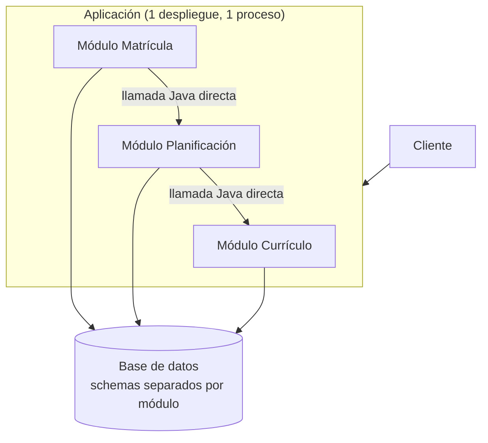
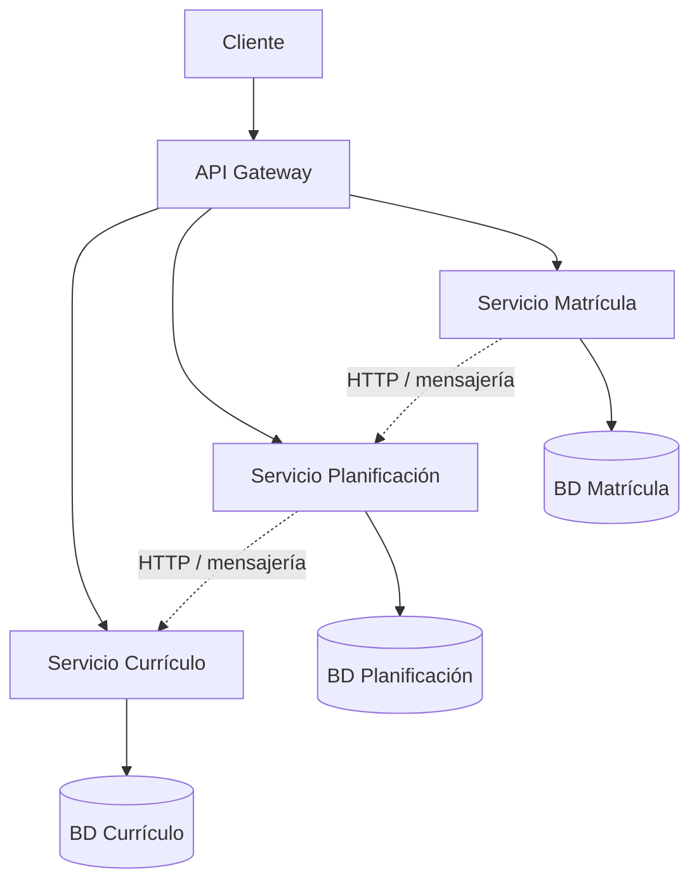
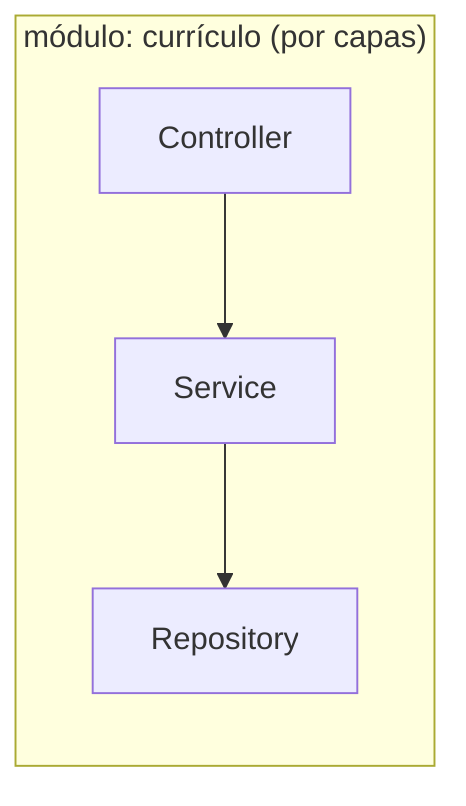
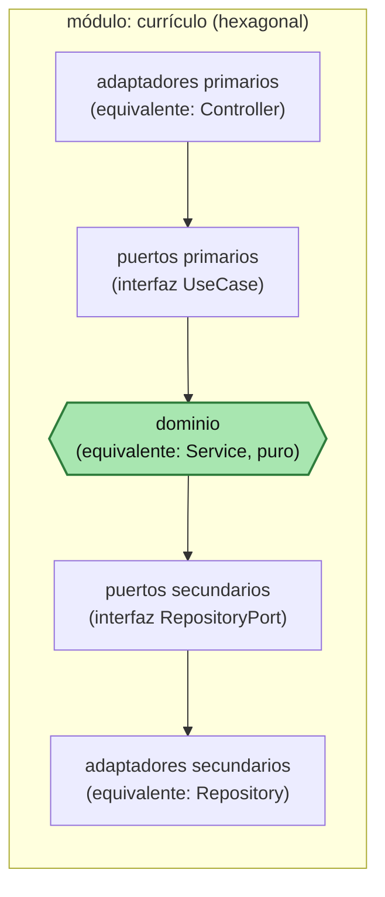
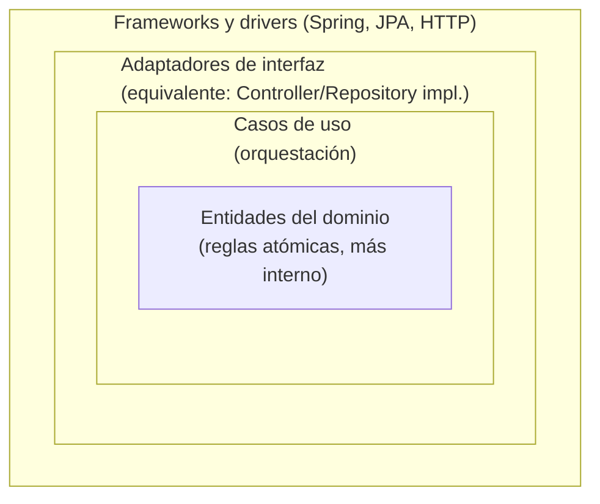
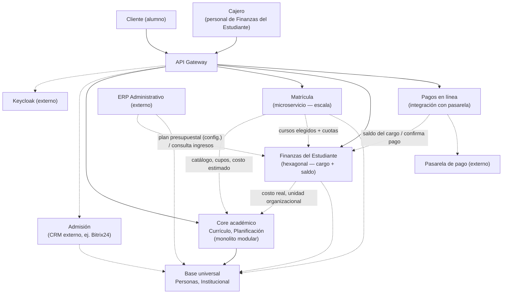

# Sistema Universitario Integrado

**Figura 1. Los 22 dominios del Sistema Universitario Integrado**

```text
 ┌───────────────────────────┐                   ┌───────────────────────────┐
 │ 1. INSTITUCIONAL          │                   │ 2. PERSONAS               │
 │ Y ORGANIZACIÓN            │                   │                           │
 │ institución, campus,      │                   │ persona, identificación,  │
 │ sedes, facultades,        │                   │ datos personales          │
 │ escuelas, programas,      │                   │ contactos                 │
 │ periodos, calendarios     │                   │ documentos                │
 └─────────────┬─────────────┘                   └─────────────┬─────────────┘
               │                                               │
               └──────────────────────┬────────────────────────┘
                                      │
                       ┌──────────────┴──────────────┐
                       │                             │
                       ▼                             ▼
            ┌─────────────────────┐      ┌────────────────────────┐
            │ 3. ADMISIÓN         │      │ 4. CURRÍCULO           │
            │ E INGRESO           │      │                        │
            │ prospectos,         │      │ programas, planes,     │
            │ postulantes,        │      │ versiones, asignaturas,│
            │ evaluaciones,       │      │ créditos, requisitos,  │
            │ resultados, ingreso │      │ equivalencias          │
            └──────────┬──────────┘      └───────────┬────────────┘
                       │                             │
                       └──────────────┬──────────────┘
                                      ▼
                  ┌──────────────────────────────────┐
                  │ 5. PLANIFICACIÓN Y OFERTA        │
                  │ ACADÉMICA                        │
                  │ cursos, secciones, docentes,     │
                  │ horarios, aulas, cupos,          │
                  │ modalidad, carga docente         │
                  └────────────────┬─────────────────┘
                                   │
                                   ▼
                         ┌─────────────────────┐
                         │ 6. MATRÍCULA        │
                         │ inscripción,        │
                         │ retiros, cambios,   │
                         │ reservas, reglas,   │
                         │ bloqueos            │
                         └──────────┬──────────┘
                                    │
              ┌─────────────────────┼─────────────────────┐
              │                     │                     │
              ▼                     ▼                     ▼
 ┌────────────────────────┐ ┌──────────────────────┐ ┌──────────────────────┐
 │ 7. EVALUACIÓN Y        │ │ 9. FINANZAS DEL      │ │ 13. LMS /            │
 │ CIERRE ACADÉMICO       │ │ ESTUDIANTE           │ │ APRENDIZAJE          │
 │                        │ │                      │ │                      │
 │ evaluaciones, notas,   │ │ matrícula, enseñanza │ │ contenidos, tareas,  │
 │ actas, rectificaciones,│ │ derechos académicos, │ │ foros, evaluaciones, │
 │ cierre                 │ │ becas, descuentos    │ │ recursos, seguimiento│
 └────────────┬───────────┘ └──────────┬───────────┘ └──────────────────────┘
              │                        │
              ▼                        ▼
 ┌────────────────────────┐ ┌────────────────────────────┐
 │ 8. TRAYECTORIA         │ │ 11. INGRESOS, COBRANZA     │
 │ ACADÉMICA              │ │ Y PAGOS                    │
 │                        │ │                            │
 │ historial*, promedio,  │ │ cargos, cuentas por        │
 │ créditos, avance,      │ │ cobrar, caja, pagos,       │
 │ convalidaciones,       │ │ pasarelas, bancos,         │
 │ reconocimientos        │ │ devoluciones, comprobantes │
 └────────────┬───────────┘ └────────────┬───────────────┘
              │                          │
              ▼                          ▼
 ┌────────────────────────┐       ┌─────────────────────┐
 │ 10. EGRESO, GRADOS,    │       │ ERP FINANCIERO      │
 │ TÍTULOS Y              │       │ contabilidad,       │
 │ CERTIFICACIÓN          │       │ tesorería, bancos,  │
 │                        │       │ presupuesto, etc.   │
 └────────────────────────┘       └─────────────────────┘


        ═════════════ DOMINIOS INSTITUCIONALES PARALELOS ═════════════


 ┌──────────────────────────────────────────────────────────────────────┐
 │ 12. EXTENSIÓN, EDUCACIÓN CONTINUA Y EVENTOS                          │
 │ talleres, cursos libres, seminarios, congresos, jornadas,            │
 │ diplomados, inscripciones, participantes y certificación             │
 └───────────────────────────────┬──────────────────────────────────────┘
                                 │
                    ┌────────────┴────────────┐
                    ▼                         ▼
            13. LMS / APRENDIZAJE     11. INGRESOS,
                                      COBRANZA Y PAGOS


 ┌──────────────────────────────────────────────────────────────────────┐
 │ 14. SERVICIOS AL ESTUDIANTE                                          │
 │ tutoría, asesoría académica, bienestar, trámites, solicitudes,       │
 │ reclamos, acompañamiento y servicios universitarios                  │
 └──────────────────────────────────────────────────────────────────────┘


 ┌──────────────────────────────────────────────────────────────────────┐
 │ 15. INVESTIGACIÓN                                                    │
 │ proyectos, grupos, investigadores, semilleros, producción            │
 │ científica, jornadas de investigación y repositorio                  │
 └──────────────────────────────────────────────────────────────────────┘


 ┌──────────────────────────────────────────────────────────────────────┐
 │ 16. PRÁCTICAS, INTERNADO Y VINCULACIÓN                               │
 │ prácticas preprofesionales, internado, centros de práctica,          │
 │ supervisión, evaluación, evidencias y convenios                      │
 └──────────────────────────────────────────────────────────────────────┘


 ┌──────────────────────────────────────────────────────────────────────┐
 │ 17. MOVILIDAD E INTERNACIONALIZACIÓN                                 │
 │ intercambio, movilidad entrante/saliente, estancias,                 │
 │ convenios y reconocimiento académico                                 │
 └──────────────────────────────────────────────────────────────────────┘


 ┌──────────────────────────────────────────────────────────────────────┐
 │ 18. EGRESADOS Y SEGUIMIENTO                                          │
 │ egresados, empleabilidad, bolsa de trabajo, seguimiento laboral,     │
 │ alumni y relación con educación continua                             │
 └──────────────────────────────────────────────────────────────────────┘


 ┌──────────────────────────────────────────────────────────────────────┐
 │ 19. CONVENIOS Y RELACIONES INSTITUCIONALES                           │
 │ instituciones asociadas, convenios marco/específicos, vigencia,      │
 │ responsables, compromisos y beneficios                               │
 └──────────────────────────────────────────────────────────────────────┘


 ┌──────────────────────────────────────────────────────────────────────┐
 │ 20. BIBLIOTECA Y RECURSOS ACADÉMICOS                                 │
 │ sistema bibliotecario, préstamos, recursos digitales,                │
 │ bases de datos, repositorios e integración                           │
 └──────────────────────────────────────────────────────────────────────┘


        ═════════════════ CAPAS TRANSVERSALES ═════════════════


 ┌──────────────────────────────────────────────────────────────────────┐
 │ 21. ANALÍTICA, INDICADORES Y BI                                      │
 │ dashboards, rendimiento, retención, deserción, avance curricular,    │
 │ demanda, carga docente, ingresos e indicadores institucionales       │
 └──────────────────────────────────────────────────────────────────────┘


 ┌──────────────────────────────────────────────────────────────────────┐
 │ 22. PLATAFORMA TRANSVERSAL                                           │
 │ seguridad, roles, permisos, SSO, workflow, gestión documental,       │
 │ firma, notificaciones, auditoría, parametrización, APIs,             │
 │ integración e interoperabilidad                                      │
 └──────────────────────────────────────────────────────────────────────┘


 * El historial académico NO constituye una segunda fuente de verdad.
   Se deriva de matrícula + evaluación + actas/cierre +
   convalidaciones/reconocimientos y demás movimientos académicos.
```

## Cómo implementarlo: monolito modular vs. microservicios

Cualquiera de los 22 dominios de arriba puede construirse dentro de **un solo desplegable** (monolito modular) o como **servicios independientes** (microservicios) — la elección no cambia el modelo de dominio, cambia solo dónde termina un proceso y empieza otro. Los dos diagramas de abajo se quedan a nivel **contenedor** (C2 del C4 model): módulos/servicios y sus bases de datos, y cómo se llaman entre sí — sin bajar al detalle interno de cada uno (eso ya se ve en ADS S04, 2.4).

### A. Monolito modular — un solo despliegue

**Figura 2. Monolito modular (C2 — contenedores)**



Los tres módulos corren en el mismo proceso — `Matrícula` llama a `Planificación` y esta a `Currículo` con una llamada directa en Java (verificada en tiempo de compilación, p. ej. `ApplicationModules.verify()` de Spring Modulith), sin red de por medio.

### B. Microservicios — un despliegue por servicio

**Figura 3. Microservicios (C2 — contenedores)**



Cada servicio es su propio proceso, con su propia base de datos — la comunicación ya no es una llamada Java, es red (HTTP/mensajería) a través del *API Gateway* o directo entre servicios, con todo lo que eso trae: *service discovery*, tolerancia a fallos, observabilidad distribuida.

### Lo que no cambia entre A y B

Un nivel más abajo (C3, no dibujado aquí — ver ADS S04, 2.4), cada módulo/servicio sigue siendo el mismo hexágono: dominio en el centro, puertos primarios/secundarios alrededor, adaptadores primarios/secundarios hacia el exterior. Lo único que cambia entre A y B es el borde exterior: si ese límite es una llamada de método dentro del mismo proceso, o una llamada de red entre dos procesos distintos. Por eso un módulo bien delimitado en A se puede extraer a microservicio en B sin rediseñar su interior: el puerto que ya tenía se convierte en el contrato de red.

### C3: dentro de un módulo/servicio — dos formas de organizarlo (zoom a `currículo`)

Dentro de cada caja "Módulo Currículo"/"Servicio Currículo" de A y B hay todavía una decisión más: cómo se organiza el código *adentro*. Dos opciones, no una — la misma comparación que hace ADS S04 (2.3-2.4), aplicada aquí al dominio académico.

**Figura 4. Por capas (organización tradicional)**



**Figura 5. Hexagonal (dominio aislado)**



Esto es lo que A y B esconden detrás de cada caja "Módulo Currículo"/"Servicio Currículo" — el mismo detalle que ADS S04 (2.4, Figura 6) muestra con adaptadores concretos (REST, CLI, eventos por el lado primario; PostgreSQL, API externa, correo por el secundario) en vez de las etiquetas genéricas de aquí.

**Figura 6. Clean Architecture (si algún módulo llega a necesitarlo)**



Hexagonal es, en la práctica, un caso concreto de aplicación de Clean Architecture (SACAViX Tech, ver ADS S04 2.5) — no un tercer patrón aparte. La diferencia real de Clean sobre Hexagonal es separar formalmente **Entidades** (reglas atómicas) de **Casos de uso** (orquestación entre varias entidades), algo que el "dominio" de la Figura 5 todavía trata como una sola pieza. Esa separación solo aporta claridad cuando un módulo acumula muchos casos de uso complejos — ningún dominio de los 22 la necesita hoy.

**Tabla 1. Capas vs. Hexagonal vs. Clean, dentro de un módulo**

| | Por capas | Hexagonal | Clean Architecture |
|---|---|---|---|
| **Ventaja** | Simple y rápido de construir — sin interfaces ni indirección extra, natural para CRUD. | Dominio aislado de la tecnología: se prueba sin base de datos ni servidor HTTP, y se cambia de proveedor (BD, API externa) escribiendo solo un adaptador nuevo. | Mismo aislamiento que Hexagonal, más una separación explícita entre reglas atómicas (Entidades) y orquestación (Casos de uso) — útil si un módulo tiene muchos casos de uso complejos que comparten las mismas entidades. |
| **Desventaja** | El dominio queda acoplado directo a Spring/JPA — cambiar de framework o de motor de base de datos obliga a tocar la lógica de negocio. | Más clases e interfaces que mantener; *over-engineering* si el módulo es CRUD simple sin reglas de negocio reales que proteger. | Todo el costo de Hexagonal, más una capa adicional (Casos de uso separados de Entidades) que la mayoría de los módulos no necesita — el *over-engineering* de Hexagonal, pero un escalón más arriba. |
| **Cuándo usarla aquí** | La mayoría de los 22 dominios, al menos al inicio — CRUD con validaciones simples (ej. Personas, Currículo, Matrícula en su versión básica). | Un dominio que acumule reglas de negocio genuinamente complejas — candidatos reales: cálculo de créditos/convalidaciones (Trayectoria Académica), o reglas de cobranza con múltiples medios de pago (Ingresos y Pagos). | Ninguno de los 22 dominios lo justifica hoy — quedaría reservado para un módulo que, además de complejo, acumule tantos casos de uso que separarlos de las entidades aporte claridad real. |

No es una decisión de una sola vez para todo el sistema: cada módulo se evalúa por separado, con el mismo criterio de ADS S04 (2.11) — capas por defecto, hexagonal cuando el dominio ya lo justifica, Clean solo si además el volumen de casos de uso lo pide.

## Decisión aplicada: académico, financiero y el resto

**Tabla 2. Decisión de arquitectura por grupo de dominios**

| Grupo | Dominios (del mapa de 22) | Organización interna | Topología de despliegue | Por qué |
|---|---|---|---|---|
| **Base (universal)** | 1-2: Institucional, Personas | **Capas** | **Monolito modular** (A) | La consulta literalmente todo lo demás — académico, administrativo, y hasta sistemas externos (Admisión, ERP). Extraerlo multiplicaría por 20 las llamadas de red del sistema (ver más arriba, "por qué no es microservicio"). |
| **Core académico** | 4-5, 7-8: Currículo, Planificación, Evaluación, Trayectoria | **Capas** por defecto | **Monolito modular** (A) | CRUD con validaciones — sin regla de negocio que hoy justifique aislar el dominio (Tabla 1), ni volumen que justifique un despliegue aparte. |
| **Core académico — excepción DDD** | 8. Trayectoria Académica | **Hexagonal**, si el cálculo de convalidaciones/reconocimientos crece | **Monolito modular** (A) | Único candidato real dentro de académico a agregado DDD (mismo criterio que `ventas` en LP2 S4, ver ADS S04 2.11) — se evalúa cuando el código exista, no antes. Organización interna distinta no implica proceso aparte. |
| **Académico — externo, por escala** | 3. Admisión | No aplica — no se construye | **Sistema externo** (CRM, ej. Bitrix24) | Examen de admisión y publicación de resultados concentran un pico de tráfico igual o mayor al de matrícula. En vez de construir y operar un microservicio propio solo para absorber ese pico, se contrata un CRM ya hecho para gestión de prospectos/postulantes — el equipo construye el adaptador de integración (registrar persona admitida en el núcleo), no el motor. |
| **Académico — excepción de escala** | 6. Matrícula | **Capas** (sin cambio) | **Candidato real a microservicio** (B) desde el diseño, no solo "más adelante" | Carga muy distinta al resto: en periodo de matrícula, miles de estudiantes inscriben al mismo tiempo, mientras el resto del sistema (Currículo, Personas) tiene tráfico normal — el caso de uso de manual de microservicios (SACAViX/ADS S04 2.7): "servicios con necesidades de escala muy distintas entre sí". No es complejidad de dominio (por eso sigue en Capas), es volumen de tráfico concentrado en el tiempo. A diferencia de Admisión, sí se construye propio — es el flujo central del negocio, no algo que un CRM genérico resuelva. |
| **Core administrativo** | 9. Finanzas del Estudiante | **Hexagonal desde el inicio** | **Monolito modular al inicio** — candidato a extraerse a microservicio (B) si el volumen de transacciones o un requisito de aislamiento (auditoría, PCI) lo justifica | Dueño real del cargo y el saldo del estudiante (agregado DDD, ver más abajo) — crea el cargo, aplica descuentos, y su propio personal (`Cajero`) cobra presencial. Es el primer módulo del core administrativo — otros módulos administrativos propios, si el sistema los necesita, se agregarían a este mismo grupo. |
| **Administrativo — canal** | 11. Ingresos, Cobranza y Pagos (acotado a `Pagos en línea`) | **Hexagonal** (servicio delgado) | **Servicio propio, opcional aparte del monolito** | Solo intermedia con la pasarela cuando el alumno paga online y confirma a `Finanzas del Estudiante` — no crea cargos ni decide descuentos. Caso de uso de manual (SACAViX, ver ADS S04 2.4): necesidad real de cambiar de pasarela sin tocar el cálculo de cargos, que vive en otro módulo. |
| **Administrativo — externo** | ERP Administrativo (contabilidad, RRHH, tesorería) | **No se construye — se integra** | **Sistema externo** (fuera de los despliegues propios) | Mismo criterio que Keycloak para seguridad y Admisión/Bitrix24: sistema de terceros, el trabajo del equipo es el adaptador de integración, no el motor contable/RRHH. Se nombra "Administrativo" (no "Financiero") justamente para no confundirlo con `Finanzas del Estudiante` — cubre además RRHH, que no es parte de ese módulo. |
| **Resto** | 12, 14-20: Extensión, LMS, Servicios al Estudiante, Investigación, Prácticas, Movilidad, Egresados, Convenios, Biblioteca | **Capas** | **Monolito modular** (A) | Mismo perfil que académico: gestión de contenido/registros, sin regla de negocio ni volumen que aislar todavía. |
| **Transversal** | 21. Analítica/BI, 22. Plataforma Transversal | **No aplica el eje hexagonal** | Seguridad: **servicio externo** (Keycloak); Analítica/BI: consume datos de los demás, no es un despliegue propio | Son capas transversales de infraestructura, no módulos de dominio — se consumen desde los demás, no se construyen con el mismo criterio. |

**Decisión de topología, en una frase:** el sistema arranca como **monolito modular** (Figura 2) para el core académico y `Finanzas del Estudiante` (core administrativo), con `Matrícula` y `Pagos en línea` como microservicios propios desde el diseño (escala el primero, canal de pago aislado el segundo) — `Admisión` no llega ni a construirse: se resuelve con un CRM externo por la misma razón de escala, sin pagar el costo de operar un servicio propio. `Institucional`/`Personas` no se mueve de la base bajo ninguna circunstancia: es lo único que absolutamente todo (interno y externo) necesita consultar.

## C2 real: base + cores + excepciones

**Figura 7. C2 (contenedores) con la decisión completa**



**Cómo leer el diagrama:** flecha sólida = llamada Java directa, mismo proceso (`Cliente`/`Cajero → Gateway`, `Gateway → *` por ser enrutamiento, y `Core académico → Base` porque ambos viven en el mismo monolito modular). Flecha punteada = HTTP, procesos distintos — todo lo demás, incluidos los tres microservicios propios (`Matrícula`, `Finanzas del Estudiante`, `Pagos en línea`) y los cuatro sistemas externos (`Keycloak`, `Admisión`, `ERP Administrativo`, `Pasarela`). Cada flecha muestra una dependencia, no una secuencia de pasos — el orden real de la conversación está en la lista de abajo.

**Quién es quién:**

- **Base universal** (`Personas`, `Institucional`): la consulta literalmente todo el sistema, interno y externo. Vive en el monolito modular.
- **Core académico** (`Currículo`, `Planificación`): también en el monolito modular, un escalón más específico que la base.
- **`Matrícula`**: microservicio propio por **escala** (picos en periodo de matrícula), no por complejidad de dominio — sigue organizada por capas por dentro.
- **`Admisión`**: incluso con el mismo problema de escala (examen/resultados), **no se construye** — se resuelve con un CRM externo (ej. Bitrix24), igual que Keycloak resuelve seguridad.
- **`Finanzas del Estudiante`** (dominio 9): el core administrativo real — dueño del cargo y el saldo del estudiante, hexagonal desde el inicio. `Cajero` es su propio personal, no un servicio aparte.
- **`Pagos en línea`** (parte del dominio 11): un servicio delgado y separado de `Finanzas del Estudiante` — solo intermedia con la `Pasarela`, no crea cargos ni decide descuentos.
- **`ERP Administrativo`**: sistema externo (contabilidad, RRHH, tesorería) — nunca se construye, solo se integra.

**El flujo, de punta a punta:**

0. La gerencia aprueba el plan presupuestal en `ERP Administrativo` (tarifa por crédito, política de becas). De ahí baja, en una sola dirección y por adelantado (no por transacción), el tarifario y las reglas de descuento que `Finanzas del Estudiante` deja configurados para todo el periodo.
1. El alumno elige cursos y número de **cuotas** en `Matrícula`, consultando a `Core académico` el catálogo, los cupos y un costo estimado (para mostrar en pantalla).
2. `Matrícula` le pasa a `Finanzas del Estudiante` los cursos elegidos (los IDs, no un monto) más el número de cuotas.
3. `Finanzas del Estudiante` **no confía en el estimado de `Matrícula`** — vuelve a consultar `Core académico` el costo real de cada curso, y de paso obtiene el programa y la facultad/escuela a la que pertenece (dato que guarda como **unidad organizacional**, junto al **tipo de concepto**: matrícula o enseñanza).
4. Con el costo real y sus descuentos aplicados, `Finanzas del Estudiante` genera el **cargo de matrícula** (a pagar ahora) y programa los **cargos de enseñanza** de los meses siguientes, uno por cuota elegida — estos últimos existen ya, pero no se cobran todavía.
5. El alumno cubre el cargo de matrícula con uno o ambos canales: `Pagos en línea` (que antes de cobrar verifica el saldo con `Finanzas` y después le confirma el pago) o directo en ventanilla (`Cajero`). Se puede combinar — por ejemplo, 60% online y 40% en caja.
6. Cuando el saldo del cargo de matrícula llega a cero, `Finanzas del Estudiante` lo hace saber y `Matrícula` queda confirmada. Los cargos de enseñanza de los meses siguientes se cobran igual, por los mismos canales, sin volver a pasar por `Matrícula`.

**Tres aclaraciones que ya se corrigieron una vez y vale la pena dejar explícitas:**

- **`Finanzas del Estudiante` no conoce ninguna cuenta contable.** Cada cargo lleva concepto y unidad organizacional — lenguaje del negocio académico. Traducir eso a cuenta contable y centro de costo es trabajo del `ERP Administrativo`, con su propio plan de cuentas, cuando consulta ingresos — nunca antes.
- **`Matrícula` y `Pagos en línea` no se llaman entre sí.** Cada uno depende de `Finanzas del Estudiante` por separado — `Matrícula` para crear el cargo, `Pagos en línea` para cobrarlo. Meterlos en contacto directo (como el patrón clásico Orden→Pago) obligaría a `Matrícula` a cargar con lógica de cobranza que dura meses, no solo el pico de matrícula que la justifica.
- **El agregado real de `Finanzas del Estudiante`** es "un cargo de matrícula + N cargos de enseñanza programados", cada uno con su propio saldo (2.11, más arriba) — con dos invariantes: la suma de pagos de un cargo nunca supera su monto, y la matrícula se confirma solo con el cargo de matrícula en cero (no los de enseñanza).

La Figura 7 dibuja 8 de los 22 dominios como muestra — el patrón (todo consulta la base, HTTP solo cuando hay una razón real de extraerse o reemplazarse por un externo) se repite igual para el resto.
