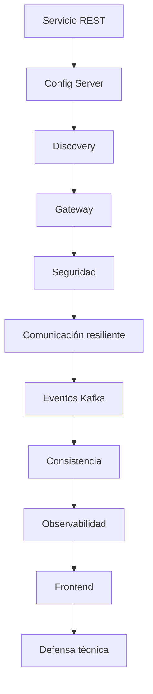

# Guía del Proyecto Sello de Desarrollo de Aplicaciones Distribuidas

## 1. Propósito

El Proyecto Sello integra las sesiones de **Desarrollo de Aplicaciones Distribuidas** alrededor de un sistema de microservicios construido de manera progresiva. Cada sesión agrega una capacidad real de arquitectura distribuida hasta llegar a un producto end-to-end configurable, seguro, resiliente, observable y defendible técnicamente.

### Competencia o capacidad del proyecto

Al finalizar el Proyecto Sello, el estudiante demuestra que puede diseñar, implementar y defender un sistema distribuido end-to-end, aplicando microservicios, configuración centralizada, descubrimiento, Gateway, seguridad, resiliencia, mensajería, observabilidad, integración frontend, reproducibilidad y sustentación integral del producto.

### Competencias relacionadas

| Código | Competencia | Relación con el proyecto |
|---|---|---|
| CE023 | Programación | Evidencia construcción de un sistema distribuido escalable basado en servicios interoperables. |
| CE022 | Ingeniería de la Información | Evidencia persistencia, mensajería, consistencia y procesamiento de datos entre servicios. |
| CE024 | Calidad de Software | Evidencia seguridad, resiliencia, observabilidad, reproducibilidad, documentación y sustentación integral. |

Fuente oficial de los códigos: [Transcripción de evidencias por competencia — Ingeniería de Software](https://upeuoficial.github.io/planb/transcripcion/#c-area-de-ingenieria-de-software).

```text
Servicio -> Configuración -> Descubrimiento -> Gateway -> Seguridad -> Eventos -> Observabilidad -> Frontend -> Defensa
```

## 2. El Proyecto

Durante el semestre desarrollarás un **sistema distribuido de microservicios end-to-end** aplicado a un flujo de negocio.

El proyecto debe integrar microservicios, infraestructura, Gateway, seguridad, comunicación síncrona y asíncrona, consistencia distribuida, observabilidad, persistencia, frontend y evidencias de operación reproducible.

No se busca solo ejecutar contenedores. Se espera una arquitectura distribuida que pueda explicar por qué cada servicio existe, cómo se comunica, cómo falla, cómo se observa y cómo se recupera.

No se considera Proyecto Sello:

- Microservicios aislados sin flujo de negocio.
- APIs sin configuración, descubrimiento o Gateway.
- Contenedores levantados sin evidencias de integración.
- Eventos sin relación con un proceso distribuido.
- Frontend desconectado del sistema.
- Un producto que el estudiante no pueda defender técnicamente.

## 3. Evolución del Proyecto

| Unidad | Temas principales | Evolución del proyecto |
|---|---|---|
| Unidad 1: Sistema distribuido base orientado a producción | Servicio base, configuración centralizada, descubrimiento, Gateway y múltiples instancias. | Sistema distribuido base funcional, configurable y preparado para escalar. |
| Unidad 2: Sistema distribuido robusto | Comunicación resiliente, seguridad, mensajería, consistencia, observabilidad e integración frontend. | Sistema distribuido robusto, seguro, observable e integrado. |
| Unidad 3: Validación y consolidación del producto del curso | Validación end-to-end, estabilización, documentación y defensa técnica. | Sistema distribuido final validado, documentado y defendido. |



### Alineamiento por sesiones

Este alineamiento muestra cómo cada bloque de sesiones agrega una capacidad distribuida verificable al mismo sistema de microservicios.

| Sesiones | Contenido central | Avance del proyecto |
|---|---|---|
| S1-S2 | Servicio base, persistencia, configuración centralizada y ambientes. | Brief técnico, primer microservicio y configuración externalizada. |
| S3-S4 | Registro, descubrimiento, Gateway y balanceo de carga. | Infraestructura distribuida base con acceso centralizado y múltiples instancias. |
| S5 | Evaluación U1. | Sistema distribuido base integrado y reproducible. |
| S6-S7 | Comunicación resiliente, seguridad distribuida y control de acceso. | Servicios protegidos y comunicación controlada ante fallos. |
| S8-S9 | Mensajería asíncrona y consistencia distribuida. | Flujo de negocio por eventos, compensación o idempotencia. |
| S10-S11 | Observabilidad e integración frontend. | Logs, métricas, health, paneles y cliente integrado por Gateway. |
| S12 | Evaluación U2. | Sistema robusto validado en condiciones reales. |
| S13-S14 | Validación end-to-end, estabilización y documentación. | Producto final probado, documentado y listo para defensa. |
| S15-S16 | Defensa técnica y evaluación final. | Sustentación grupal con aporte individual verificable. |

## 4. Cronograma

| Hito | Momento | Producto esperado |
|---|---|---|
| S2 | Brief técnico | Flujo de negocio, servicios previstos, datos, endpoints iniciales y alcance. |
| S5 | Producto U1 | Sistema base con servicio REST, configuración, descubrimiento, Gateway y balanceo. |
| S12 | Producto U2 | Sistema robusto con resiliencia, seguridad, eventos, consistencia, observabilidad y frontend. |
| S15 | Producto final | Sistema end-to-end validado, documentado y defendido técnicamente. |
| S16 | Cierre individual | Evaluación final y demostración de competencias pendientes. |

## 5. Repositorio académico y topics

Desde la primera presentación del proyecto, el repositorio debe estar creado y configurado con los topics académicos mínimos. Esta configuración es obligatoria porque permite identificar campus, semestre, línea, tipo de proyecto, curso, sección y grupo.

El detalle oficial del estándar se encuentra en [Estándar transversal de topics para repositorios académicos](https://upeuoficial.github.io/planb/anexos/estandar-topics-repositorios/).

Ejemplo base para Distribuidas:

```text
campus-juliaca
semestre-2026-2
linea-software
tipo-ps
dist
seccion-g1
grupo-<numero>-<nombre-proyecto>
```

## 6. Producto y evaluación por unidad

Cada unidad tiene su propio producto (plantilla-ejemplo con el contenido de `pagatu`) y su propia sesión de evaluación, con rúbrica citada literalmente del sílabo. El "Producto Final" del curso no es una cuarta entrega aparte: **es el producto de Unidad 3**, según el propio sílabo ("Validación y consolidación del producto **del curso**").

**Tabla 1. Producto y evaluación por unidad**

| Unidad | Producto (plantilla-ejemplo) | Evaluación |
|---|---|---|
| Unidad 1: Sistema distribuido base | [`u1-producto.md`](u1-producto.md) | [S5 - Evaluación de la Unidad I](../sesiones/S05_Evaluacion_Unidad_1.md) |
| Unidad 2: Sistema distribuido robusto | [`u2-producto.md`](u2-producto.md) | [S12 - Evaluación de la Unidad II](../sesiones/S12_Evaluacion_Unidad_2.md) |
| Unidad 3: Validación y consolidación (Producto Final) | [`u3-producto.md`](u3-producto.md) | [S15 - Evaluación de la Unidad III](../sesiones/S15_Evaluacion_Unidad_3.md) (continúa en S16 para pendientes) |

Cada `uN-producto.md` incluye su propia rúbrica, la trazabilidad con la malla curricular, y — en Unidad 3 — la secuencia de sustentación completa y las plantillas de documentación e informe que antes vivían sueltas en esta guía.

## 7. Resultado Esperado

Al finalizar el curso, el estudiante debe demostrar que puede construir y defender un sistema distribuido realista, reproducible y observable.

```text
Flujo de negocio -> Microservicios -> Infraestructura -> Seguridad -> Eventos -> Observabilidad -> Frontend -> Defensa
```
