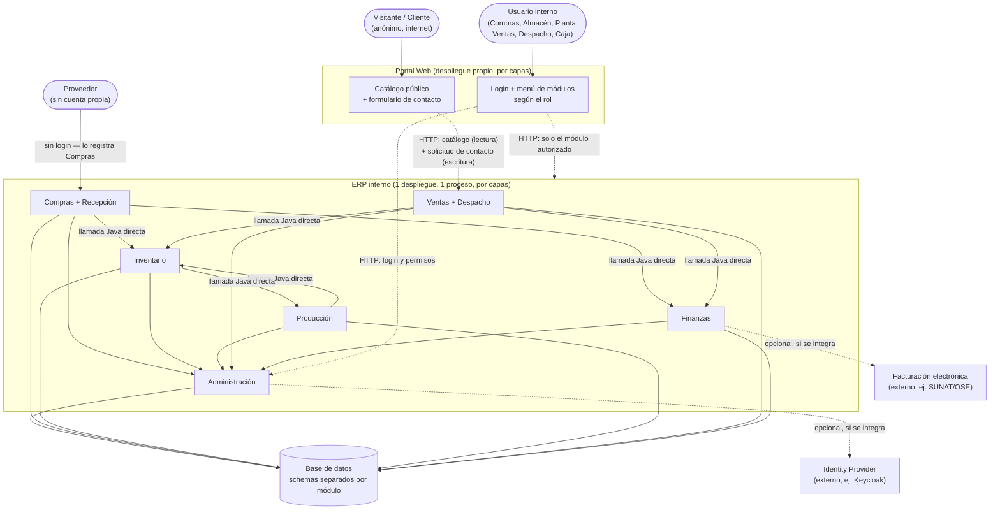
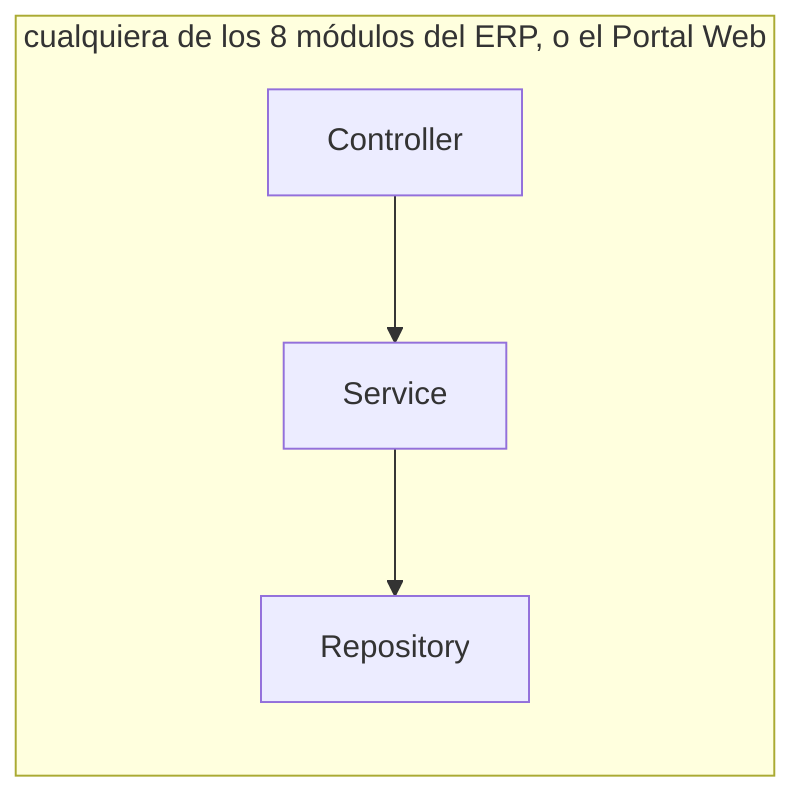

# Sistema Integral de Gestión de Producción y Comercialización

**Figura 1. Los 8 módulos del ERP interno, con el Portal Web como entrada única**

```text
 ┌───────────────────────┐
 │ 1. COMPRAS             │
 │ proveedores, cotiza-   │
 │ ciones, órdenes de     │
 │ compra                 │
 └───────────┬─────────────┘
             ▼
 ┌───────────────────────┐
 │ 2. RECEPCIÓN           │
 │ pesaje (bruto/tara/    │
 │ neto), humedad,        │
 │ impurezas, lotes       │
 └───────────┬─────────────┘
             ▼
 ┌───────────────────────┐
 │ 3. INVENTARIO          │◄────────────────────┐
 │ almacenes, ubicaciones,│                      │
 │ lotes, entradas/salidas│                      │
 └───────────┬─────────────┘                      │
             ▼                                    │
 ┌───────────────────────┐    productos terminados,
 │ 4. PRODUCCIÓN          │    subproductos, mermas
 │ fórmulas, órdenes,     │────────────────────────┘
 │ consumo, rendimiento   │
 └───────────┬─────────────┘
             │ (el flujo de venta sale del mismo
             │  Inventario de arriba, no de un
             │  segundo módulo)
             ▼
 ┌───────────────────────┐   solicitud de   ┌────────────────────────┐
 │ 5. VENTAS              │◄──contacto/──────│ 9. PORTAL WEB           │
 │ clientes, cotizaciones,│    pedido        │ · anónimo: catálogo +   │
 │ pedidos, precios       │                  │   formulario de contacto│
 └───────────┬─────────────┘                  │ · con sesión: login +   │
             ▼                                │   menú de módulos según │
                                              │   el rol del usuario    │
 ┌───────────────────────┐                    └────────────────────────┘
 │ 6. DESPACHO            │
 │ picking, transportista,│
 │ entrega, devoluciones  │
 └───────────┬─────────────┘
             ▼
          CLIENTE


        ═══════════ MÓDULOS DE SOPORTE ═══════════


 ┌────────────────────────────────────────────────┐
 │ 7. FINANZAS                                     │
 │ cuentas por pagar (de Compras), cuentas por     │
 │ cobrar (de Ventas), caja, cobranzas             │
 └────────────────────────────────────────────────┘

 ┌────────────────────────────────────────────────┐
 │ 8. ADMINISTRACIÓN                               │
 │ usuarios, roles, permisos, catálogos            │
 │ compartidos, parametrización, auditoría         │
 └────────────────────────────────────────────────┘

```

Trazabilidad, Costos, Calidad y Reportes no son módulos ni despliegues — son capacidades que se apoyan en los datos de los ocho módulos de arriba, por eso no tienen caja propia en el diagrama (se describen en "Calidad, costos, trazabilidad y reportes", más abajo).

El `Portal Web` tampoco es un módulo del ERP: vive fuera de la red interna, en su propio despliegue (ver "Arquitectura", más abajo). Se incluye en el diagrama porque es la puerta de entrada de todo lo demás. **Ningún usuario entra directo al ERP**: todos —visitante anónimo, comprador, almacenista, operario de planta, vendedor, despachador, cajero— pasan primero por el Portal. Lo que cambia es qué ve cada uno adentro: el visitante anónimo, catálogo y contacto; el usuario con sesión iniciada, el menú de los módulos que su rol le permite (definidos en `Administración`).

## Qué hace cada módulo

El sistema se organiza en ocho módulos internos, cada uno con responsabilidades y límites explícitos — ningún módulo asume una función que le corresponde a otro, aunque el flujo de negocio los recorra en secuencia (Figura 1) —, más un componente adicional que mira hacia afuera: el `Portal Web`.

**1. Compras.** Gestiona proveedores, solicitudes de cotización, cotizaciones, órdenes de compra, precios, cantidades y condiciones de compra de materias primas, insumos de producción, materiales de empaque y demás artículos que la empresa necesita. Su alcance termina en la emisión y el seguimiento de la orden de compra — la recepción física es responsabilidad de `Recepción`, nunca de este módulo: `Compras` decide qué y cuánto comprar, no si lo que llegó cumple.

**2. Recepción.** Registra la llegada física de lo que `Compras` ordenó: relación con la orden de compra, proveedor, procedencia, fecha y condiciones de llegada. Para materias primas como el maíz, además del pesaje (bruto, tara, neto) aplica los controles de calidad que la empresa defina (humedad, impurezas, entre otros). De ese control depende una decisión con consecuencia real — aceptar, observar, rechazar o devolver al proveedor —: solo lo aceptado genera lote y entra a `Inventario`.

**3. Inventario.** Es el registro único de existencias físicas — materias primas, insumos, materiales de empaque, productos en proceso, productos terminados, subproductos y materiales auxiliares — con sus almacenes, ubicaciones, lotes y estado. No decide nada por sí mismo (ver aclaraciones, más abajo): solo refleja los movimientos que le informan `Recepción`, `Producción` y `Despacho`, y responde con exactitud cuánto hay disponible cuando se le pregunta.

**4. Producción.** Transforma lo que `Inventario` tiene disponible en purina y otros derivados, siguiendo fórmulas o recetas. Administra órdenes de producción, cantidades planificadas frente a reales, el lote de materia prima consumido, y lo que resulta de ejecutar la orden: productos terminados, subproductos, mermas, desperdicios y reprocesos. Es también la fuente de la información necesaria para calcular el costo de producción — sin `Producción`, `Costos` no tiene de dónde partir.

**5. Ventas.** Gestiona clientes, cotizaciones, pedidos, listas de precios, descuentos y condiciones comerciales, tanto mayoristas como minoristas. Antes de comprometer un pedido, consulta a `Inventario` la disponibilidad real — nunca vende sobre una cifra que no verificó — y entrega el pedido aprobado a `Despacho` para su atención.

**6. Despacho.** Convierte el pedido aprobado en una entrega física: picking, selección de lotes, carga, transportista, vehículo, ruta y confirmación de entrega. Genera la salida correspondiente en `Inventario` y es también el punto de entrada de las devoluciones del cliente — decide si el producto devuelto reingresa, queda observado, se reprocesa o se da de baja.

**7. Finanzas.** Traduce a términos económicos lo que `Compras` y `Ventas` generan: cuentas por pagar (de las compras), cuentas por cobrar (de las ventas), facturación, pagos, anticipos, cobranzas y caja. Es, junto a `Producción`, el módulo con un agregado real que proteger (ver más abajo): el saldo de cada cuenta, con la garantía de que nunca se le aplica más pago o cobranza del que le corresponde.

**8. Administración.** No participa en el flujo de negocio (Figura 1) — lo sostiene desde abajo: usuarios, roles, permisos, seguridad de acceso, parámetros generales y los catálogos compartidos que los demás módulos necesitan (unidades de medida, categorías, almacenes, ubicaciones, presentaciones, motivos de devolución o de merma). También concentra el registro de auditoría de lo que los usuarios hacen en el resto de módulos. Es, además, la fuente de la verdad de **qué módulo ve cada usuario** dentro del `Portal Web`: el rol vive aquí, el menú solo lo refleja.

**9. Portal Web.** Es la única puerta de entrada — nadie accede a los otros ocho módulos por otra vía. Para un visitante anónimo, es un sitio de promoción: catálogo de productos (ficha, descripción, imágenes) y un formulario de contacto para pedir información o un pedido. Cada envío llega a `Ventas` como una **solicitud de contacto**, que un vendedor revisa y decide si convierte en cotización o pedido real — no vende en línea, no hay carrito, checkout ni pago todavía. Para un usuario con sesión iniciada (comprador, almacenista, operario de planta, vendedor, despachador, cajero), el Portal muestra un **menú con los módulos a los que su rol le da acceso** — el mismo rol que administra `Administración` — y ahí adentro navega el módulo correspondiente (Compras, Inventario, Producción, etc.). La empresa ya anticipó una v2 con **ventas en línea** (carrito, pago); esta v1 se construye de manera que esa evolución no obligue a rehacerlo (ver "Arquitectura", más abajo).

### Tipos de artículos

El sistema distingue explícitamente entre lo que fluye por cada etapa, porque el mismo artículo cambia de naturaleza según en qué módulo está:

**Tabla 1. Tipos de artículo gestionados por el sistema**

| Tipo | Ejemplos | Dónde nace / dónde se consume |
|---|---|---|
| Materia prima | Maíz y otras materias primas de producción | Nace en `Recepción`, se consume en `Producción` |
| Insumo de producción | Vitaminas, minerales, aditivos y otros componentes | Nace en `Recepción`/`Compras`, se consume en `Producción` |
| Material de empaque | Sacos, bolsas, envases, etiquetas | Nace en `Recepción`/`Compras`, se consume en `Producción` |
| Producto en proceso | Intermedio de una orden de producción todavía no cerrada | Nace y se consume dentro de `Producción` |
| Producto terminado | Purina y otros derivados | Nace en `Producción`, se consume en `Ventas`/`Despacho` |
| Subproducto | Resultado secundario de la transformación | Nace en `Producción` |
| Material auxiliar o consumible | Insumo de soporte que no forma parte del producto final | Se consume donde la operación lo requiera |

### Calidad, costos, trazabilidad y reportes: capacidades, no módulos aparte

Cuatro capacidades atraviesan los ocho módulos sin ser un despliegue propio (ya adelantado en la Figura 1):

- **Calidad** vive donde ocurre el control real: en `Recepción` (parámetros, resultados y aceptación/rechazo de lo que llega) y en `Producción` (parámetros y resultados del proceso y del producto obtenido). No hay un módulo de "Calidad" separado porque el control siempre pertenece a quien genera el dato, no a un tercero que lo audita después.
- **Costos** se arma con lo que `Compras`, `Inventario`, `Producción` y `Finanzas` ya registran — materia prima, insumos, empaque, mermas y demás costos atribuibles — para llegar a costo de producción, costo unitario, márgenes y rentabilidad. No es una fuente de datos propia, es un cálculo sobre las demás.
- **Trazabilidad** es la capacidad de recorrer la cadena completa — proveedor, compra, recepción, lote de materia prima, movimiento de inventario, orden de producción, insumos usados, lote de producto terminado, venta y cliente — en ambos sentidos: hacia adelante (de un lote de materia prima a los clientes que recibieron algo hecho con él) y hacia atrás (de un producto terminado a los proveedores y lotes que lo originaron).
- **Reportes** los entrega cada módulo sobre su propio ámbito — adquisiciones y proveedores (`Compras`), ingresos y controles (`Recepción`), existencias y movimientos (`Inventario`), consumo y rendimiento (`Producción`), operaciones comerciales (`Ventas`), salidas y entregas (`Despacho`), operaciones económicas (`Finanzas`), usuarios y auditoría (`Administración`) — sin un módulo de reportería centralizado que dependa de todos los demás.

## Arquitectura: monolito modular, organizado por capas — y el Portal Web aparte

El **ERP interno** tiene usuarios acotados (compradores, almacenistas, operarios de planta, vendedores, despachadores, cajeros) y un cuello de botella real en la planta física — la báscula, el laboratorio de calidad, la línea de producción —, no en el tráfico digital. Sin un argumento de escala o de sistema externo que lo justifique, sus ocho módulos se construyen como **un solo desplegable**: corren en el mismo proceso, se llaman entre sí con una llamada Java directa (verificada en tiempo de compilación, p. ej. `ApplicationModules.verify()` de Spring Modulith) y comparten una única base de datos con schemas separados por módulo.

Por dentro, los ocho módulos se organizan **por capas** (`Controller` → `Service` → `Repository`): es la opción más simple y rápida de construir, y ninguno acumula hoy un caso de uso lo bastante complejo — ni siquiera `Producción` o `Finanzas` — como para pagar el costo extra de aislar el dominio (hexagonal/Clean, ADS S04 2.4-2.5). Si eso cambia más adelante, se evalúa entonces, con el código real delante, no antes.

**El `Portal Web` es la única excepción real del sistema.** A diferencia de los ocho módulos anteriores, aquí sí hay un argumento concreto de separación — el mismo criterio de ADS S04 (2.7, "servicios con necesidades de escala muy distintas entre sí") que ya usa el ejemplo académico para `Matrícula` y `Pagos en línea`:

- **Perímetro de seguridad distinto.** El Portal es lo único expuesto a internet — el ERP interno nunca debe quedar accesible directamente ni de casualidad. Para el visitante anónimo, el Portal solo conoce una vista de catálogo curada (nombre, descripción, imagen — no costos, no stock exacto, no datos de proveedor) y un único endpoint de escritura pública: recibir la solicitud de contacto. Para el usuario con sesión iniciada, el Portal valida sus credenciales y su rol contra `Administración` antes de dejarlo entrar a cualquier módulo — nunca asume el rol por su cuenta.
- **Tráfico con un patrón distinto.** Una campaña de marketing puede disparar visitas al catálogo sin ninguna relación con la carga del ERP interno (que depende de cuántos empleados están trabajando, no de cuánta gente ve un anuncio) — aunque ambos flujos (público y con sesión) entren por el mismo Portal.
- **Ya se sabe que va a crecer.** La empresa anticipó una v2 con ventas en línea (carrito, checkout, pasarela de pago) — ese es justo el tipo de crecimiento que conviene no tener acoplado al ERP interno desde el principio, para no separarlo después bajo presión.

Por eso el `Portal Web` se construye **desde el día uno como su propio desplegable** — la única capa de presentación de todo el sistema, tanto para el público como para el personal interno —, no como un noveno módulo del monolito. Se organiza también **por capas** (mostrar catálogo, guardar un formulario, o pedirle a `Administración` el menú del usuario y redirigir al módulo autorizado — nada de eso exige aislar un dominio), pero como proceso aparte que le habla al ERP interno solo por su API, nunca a su base de datos directamente.

**Figura 2. C2 (contenedores): el Portal Web como entrada única de todo el sistema**



**Figura 3. Por capas: la misma organización interna, en los dos despliegues**



**Cómo leer el diagrama:** flecha sólida = llamada Java directa, mismo proceso — dentro del ERP interno, porque sus ocho módulos viven en el mismo monolito modular; también `Proveedor → Compras + Recepción`, porque el proveedor no tiene cuenta propia, quien registra el dato es el personal de `Compras`. Flecha punteada = HTTP, proceso distinto — el `Portal Web` hablándole al ERP por su API (tanto la pública de catálogo/contacto como la protegida de cada módulo), y las dos integraciones externas opcionales (`Facturación electrónica`, `Identity Provider`), que hoy no están construidas: se agregan el día que el negocio realmente las necesite.

**Tabla 2. Por qué cada componente va donde va**

| Componente(s) | Despliegue | Por qué |
|---|---|---|
| `Administración` | ERP interno, por capas | Base universal — usuarios, roles, catálogos compartidos. Es también quien decide qué módulos ve cada usuario en el menú del Portal. |
| `Compras` + `Recepción` | ERP interno, por capas | CRUD con validaciones — cotizar/ordenar y registrar pesaje/calidad no tienen hoy un caso más complejo que "la orden existe" o "el lote quedó aceptado/rechazado". |
| `Inventario` | ERP interno, por capas | Es la base operativa que los demás módulos leen y escriben constantemente — mientras el modelo siga siendo entradas/salidas/transferencias por lote, capas alcanza. |
| `Producción` | ERP interno, por capas | El módulo con más reglas de negocio del sistema (fórmulas, consumo real vs. planificado, mermas) — pero todavía CRUD con validaciones sobre esas reglas, no un caso que hoy exija aislarse del framework. |
| `Ventas` + `Despacho` | ERP interno, por capas | Cotizar, tomar pedidos, hacer picking y despachar es gestión de registros con reglas simples de disponibilidad y condiciones comerciales. |
| `Finanzas` | ERP interno, por capas | Cuentas por cobrar/pagar con un saldo que cuidar — que la suma de pagos no supere el monto se resuelve con una validación de servicio simple, sin necesitar aislar el dominio todavía. |
| `Portal Web` | **Despliegue propio, por capas** | Es la única presentación de todo el sistema (público y con sesión) — tráfico público/anónimo que no debe tocar el ERP interno directamente; escala distinta (campañas de marketing); va a crecer a ventas en línea en v2. Separarlo ahora evita rehacerlo bajo presión después. |
| Trazabilidad, Costos, Calidad, Reportes | No son despliegues | Se apoyan en los datos que ya generan los 8 módulos del ERP. |

**Decisión, en una frase:** el **ERP interno** es un **monolito modular** organizado **por capas**, sin excepciones entre sus ocho módulos; el **`Portal Web`** es la única excepción del sistema completo — su propio despliegue, también por capas, porque a diferencia de los ocho módulos internos sí tiene un argumento real de perímetro público y de escala distinta.

**Quién es quién:**

- **`Administración`**: la base universal — usuarios, roles, permisos, catálogos compartidos. La consulta todo lo demás, incluido el `Portal Web` para saber qué módulos le muestra a cada usuario. Puede delegar la autenticación a un Identity Provider externo (Keycloak) el día que el negocio lo pida, sin dejar de ser dueña de los catálogos, los roles y la parametrización propios.
- **`Compras + Recepción`**: la cadena de abastecimiento — desde la orden de compra hasta el lote aceptado en planta.
- **`Inventario`**: el núcleo de existencias — todo lo demás lee y escribe aquí, nunca al revés.
- **`Producción`**: el módulo con más reglas de negocio del sistema — orden de producción, fórmula, consumo, rendimiento, mermas.
- **`Ventas + Despacho`**: el lado comercial — desde la cotización hasta la entrega confirmada al cliente.
- **`Finanzas`**: cuentas por cobrar (de Ventas) y por pagar (de Compras), con su propio saldo.
- **`Portal Web`**: la entrada única del sistema, en su propio despliegue. Al visitante anónimo le muestra catálogo y contacto, y le entrega las solicitudes a `Ventas` sin convertirlas en pedido por sí mismo; al usuario con sesión le muestra el menú de módulos que su rol autoriza y lo deja operar ahí — nunca decide permisos por su cuenta, siempre se los pregunta a `Administración`.
- **`Facturación electrónica`/`Identity Provider`**: sistemas externos opcionales — se integran, no se construyen, el día que aparezcan (cumplimiento tributario, SSO corporativo).

**El flujo, de punta a punta:**

0. Un visitante anónimo entra al `Portal Web`, revisa el catálogo de productos y llena el formulario de contacto. El Portal envía esa solicitud al ERP interno; un vendedor la recibe en `Ventas`, se comunica con el interesado y, si prospera, la convierte manualmente en una cotización o un pedido — el Portal nunca genera un pedido por sí mismo (todavía no hay carrito ni pago; eso es v2). Ese mismo vendedor, para hacer esto, primero inició sesión en el `Portal Web` con su usuario: el Portal le pidió el rol a `Administración`, confirmó que tiene acceso a `Ventas`, y recién ahí le mostró la pantalla — el mismo camino que sigue cualquier otro empleado (comprador, almacenista, operario de planta, despachador, cajero) para entrar a su propio módulo.
1. `Compras` genera una orden de compra a un `Proveedor` (maíz u otro insumo/material de empaque), y de paso informa a `Finanzas` el compromiso de pago (cuenta por pagar programada, aún no exigible).
2. El proveedor entrega físicamente la mercadería y `Recepción` la registra: pesaje (bruto, tara, neto para el maíz), controles de calidad (humedad, impurezas) y la decisión de aceptar, observar o rechazar. Lo aceptado genera lotes y su correspondiente entrada en `Inventario`.
3. Cuando `Recepción` confirma la entrega, la cuenta por pagar de `Finanzas` pasa de "programada" a "exigible" según los términos pactados con el proveedor.
4. `Producción` toma una fórmula/receta, planifica una orden de producción y consulta a `Inventario` la disponibilidad real de materias primas, insumos y materiales de empaque antes de iniciar — no reserva de forma optimista.
5. Al ejecutar la orden, `Producción` registra el consumo real (que puede diferir del planificado), el rendimiento, las mermas y los subproductos, y entrega a `Inventario` los lotes de producto terminado resultantes (purina u otros derivados).
6. `Ventas` cotiza y toma pedidos contra la disponibilidad que le reporta `Inventario` (el mismo módulo del paso 2, con productos terminados en vez de materia prima), y al confirmar un pedido informa a `Finanzas` la cuenta por cobrar correspondiente al `Cliente`.
7. `Despacho` prepara el pedido aprobado (picking, selección de lotes, transporte) y confirma la entrega, generando la salida correspondiente en `Inventario`. Una devolución del cliente reingresa a `Inventario` (o queda observada/dada de baja) y ajusta la cuenta por cobrar en `Finanzas` si corresponde.
8. `Administración` no genera ningún documento del flujo de negocio — pero sí aparece en cada paso, de forma implícita: es a quien el `Portal Web` le pregunta el rol antes de dejar entrar a `Compras`, `Recepción`, `Producción`, `Ventas`, `Despacho` o `Finanzas` en los pasos 1-7. Sostiene a los siete módulos operativos desde el inicio (usuarios, roles, catálogos, auditoría), igual que `Personas`/`Institucional` en el ejemplo académico.

**Cinco aclaraciones que vale la pena dejar explícitas:**

- **`Inventario` no decide nada, solo refleja.** No decide cuánto comprar ni cuánto producir — esas decisiones son de `Compras` y `Producción`. `Inventario` únicamente registra el movimiento que cada módulo le informa y responde "cuánto hay disponible" cuando se le pregunta.
- **`Producción` no reserva stock de forma optimista.** Antes de iniciar una orden, confirma con `Inventario` la disponibilidad real de insumos — si no alcanza, la orden queda en espera o se ejecuta parcial, nunca se descuenta un consumo que la planta no puede cubrir.
- **`Finanzas` no conoce plan de cuentas contable ni centro de costo.** Cada cuenta por pagar o por cobrar lleva proveedor/cliente, concepto y referencia comercial (orden de compra, pedido) — lenguaje del negocio, no de contabilidad formal. Traducir eso a cuenta contable es trabajo de un sistema contable externo, el día que exista esa integración — nunca antes, mismo criterio que `ERP Administrativo` en el ejemplo académico.
- **El `Portal Web` no decide permisos, solo los aplica.** Que un usuario vea `Compras` o `Finanzas` en su menú lo decide el rol que le asignó `Administración`, no el Portal — si mañana cambia el rol de alguien, el menú cambia solo porque `Administración` cambió, sin tocar una línea del Portal.
- **El `Portal Web` ya tiene sesión, pero no vende en línea todavía.** El login y el menú por rol (para el personal interno) se construyen en esta v1; lo que falta es el lado del cliente: carrito, checkout y pago. Eso es alcance de v2, y en ese momento se evalúa si el Portal necesita su propia base de datos o una integración con una pasarela de pago — nada de eso se construye ahora solo porque "ya se sabe que viene".

La Figura 2 dibuja los 8 módulos del ERP interno como un monolito modular, más el `Portal Web` como su única excepción — separado desde el día uno por perímetro público y por lo que se anticipa en v2, no por volumen de tráfico actual. A diferencia del ejemplo académico (22 dominios, con varios candidatos reales a microservicio), aquí el ERP interno no tiene ninguno: el `Portal Web` es el único componente del sistema completo que se construye fuera del monolito.
