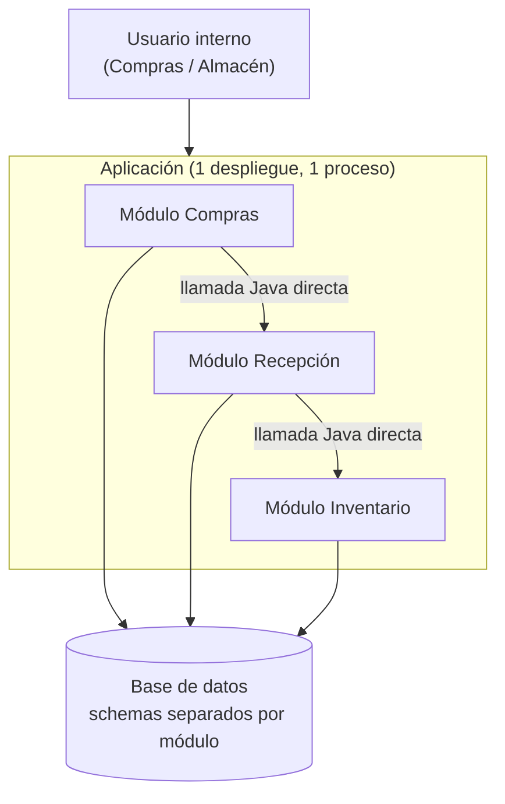
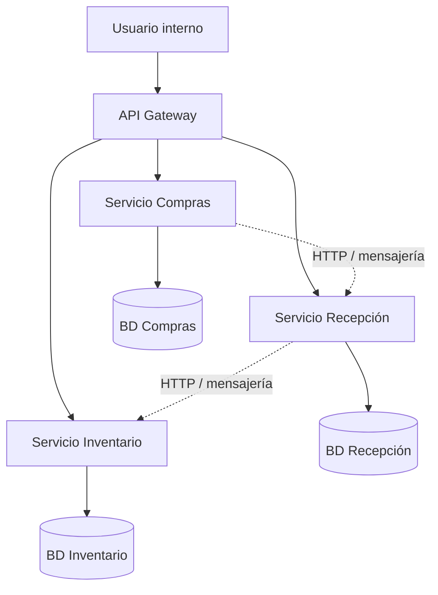
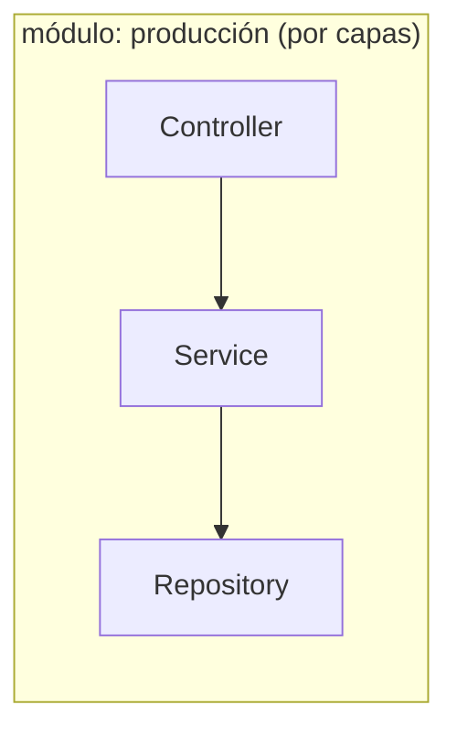
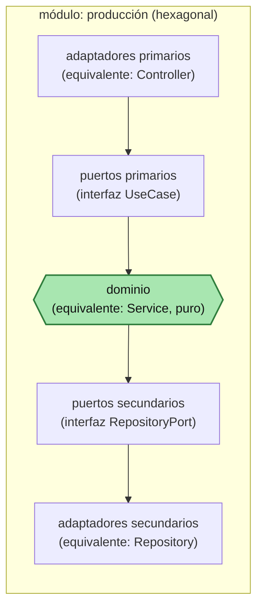
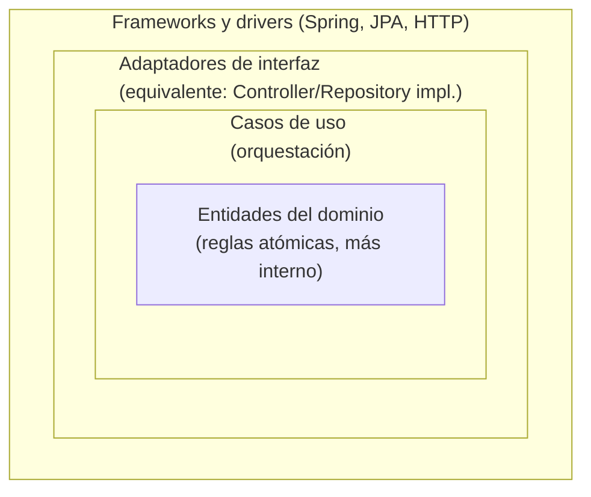
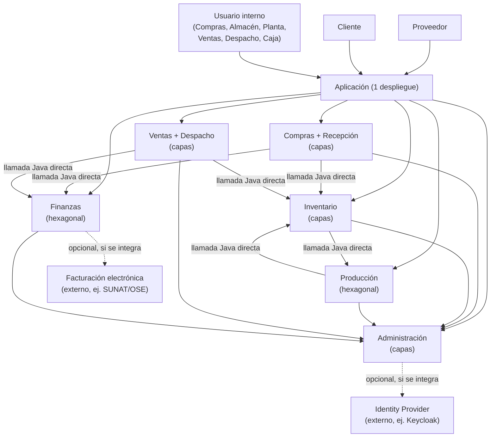

# Sistema Integral de Gestión de Producción y Comercialización

**Figura 1. Los 8 módulos del Sistema Integral de Gestión de Producción y Comercialización**

```text
 ┌───────────────────────┐
 │ 1. COMPRAS             │
 │ proveedores, cotiza-   │
 │ ciones, órdenes de     │
 │ compra                 │
 └───────────┬─────────────┘
             ▼
 ┌───────────────────────┐
 │ 2. RECEPCIÓN           │
 │ pesaje (bruto/tara/    │
 │ neto), humedad,        │
 │ impurezas, lotes       │
 └───────────┬─────────────┘
             ▼
 ┌───────────────────────┐
 │ 3. INVENTARIO          │◄────────────────────┐
 │ almacenes, ubicaciones,│                      │
 │ lotes, entradas/salidas│                      │
 └───────────┬─────────────┘                      │
             ▼                                    │
 ┌───────────────────────┐    productos terminados,
 │ 4. PRODUCCIÓN          │    subproductos, mermas
 │ fórmulas, órdenes,     │────────────────────────┘
 │ consumo, rendimiento   │
 └───────────┬─────────────┘
             │ (el flujo de venta sale del mismo
             │  Inventario de arriba, no de un
             │  segundo módulo)
             ▼
 ┌───────────────────────┐
 │ 5. VENTAS              │
 │ clientes, cotizaciones,│
 │ pedidos, precios       │
 └───────────┬─────────────┘
             ▼
 ┌───────────────────────┐
 │ 6. DESPACHO            │
 │ picking, transportista,│
 │ entrega, devoluciones  │
 └───────────┬─────────────┘
             ▼
          CLIENTE


        ═══════════ MÓDULOS DE SOPORTE ═══════════


 ┌────────────────────────────────────────────────┐
 │ 7. FINANZAS                                     │
 │ cuentas por pagar (de Compras), cuentas por     │
 │ cobrar (de Ventas), caja, cobranzas             │
 └────────────────────────────────────────────────┘

 ┌────────────────────────────────────────────────┐
 │ 8. ADMINISTRACIÓN                               │
 │ usuarios, roles, permisos, catálogos            │
 │ compartidos, parametrización, auditoría         │
 └────────────────────────────────────────────────┘


    ═══ CAPACIDADES TRANSVERSALES (no son módulos de despliegue) ═══


 ┌────────────────────────────────────────────────┐
 │ TRAZABILIDAD                                    │
 │ proveedor → lote de MP → orden de producción →  │
 │ lote de PT → venta → cliente (y a la inversa)   │
 └────────────────────────────────────────────────┘

 ┌────────────────────────────────────────────────┐
 │ COSTOS                                          │
 │ costo de producción, costo unitario, márgenes   │
 └────────────────────────────────────────────────┘
```

## Cómo implementarlo: monolito modular vs. microservicios

Igual que en el [Sistema académico (referencia)](acad.md), cualquiera de los 8 módulos de arriba puede construirse dentro de **un solo desplegable** (monolito modular) o como **servicios independientes** (microservicios) — la elección no cambia el modelo de dominio, cambia solo dónde termina un proceso y empieza otro. Los dos diagramas de abajo se quedan a nivel **contenedor** (C2 del C4 model): módulos/servicios y sus bases de datos, y cómo se llaman entre sí — sin bajar al detalle interno de cada uno (eso ya se ve en ADS S04, 2.4).

### A. Monolito modular — un solo despliegue

**Figura 2. Monolito modular (C2 — contenedores)**



Los tres módulos corren en el mismo proceso — `Compras` llama a `Recepción` y esta a `Inventario` con una llamada directa en Java (verificada en tiempo de compilación, p. ej. `ApplicationModules.verify()` de Spring Modulith), sin red de por medio.

### B. Microservicios — un despliegue por servicio

**Figura 3. Microservicios (C2 — contenedores)**



Cada servicio es su propio proceso, con su propia base de datos — la comunicación ya no es una llamada Java, es red (HTTP/mensajería), con todo lo que eso trae: *service discovery*, tolerancia a fallos, observabilidad distribuida.

### Lo que no cambia entre A y B

Un nivel más abajo (C3, no dibujado aquí — ver ADS S04, 2.4), cada módulo/servicio sigue siendo el mismo hexágono: dominio en el centro, puertos primarios/secundarios alrededor, adaptadores primarios/secundarios hacia el exterior. Lo único que cambia entre A y B es el borde exterior: si ese límite es una llamada de método dentro del mismo proceso, o una llamada de red entre dos procesos distintos. Por eso un módulo bien delimitado en A se puede extraer a microservicio en B sin rediseñar su interior: el puerto que ya tenía se convierte en el contrato de red.

### C3: dentro de un módulo/servicio — dos formas de organizarlo (zoom a `producción`)

Dentro de cada caja "Módulo Producción"/"Servicio Producción" de A y B hay todavía una decisión más: cómo se organiza el código *adentro*. Dos opciones, no una — la misma comparación que hace ADS S04 (2.3-2.4), aplicada aquí al módulo con más reglas de negocio reales del sistema.

**Figura 4. Por capas (organización tradicional)**



**Figura 5. Hexagonal (dominio aislado)**



Esto es lo que A y B esconden detrás de cada caja "Módulo Producción"/"Servicio Producción" — el mismo detalle que ADS S04 (2.4, Figura 6 de ese anexo) muestra con adaptadores concretos (REST, CLI, eventos por el lado primario; PostgreSQL/Oracle, báscula, laboratorio de calidad por el secundario) en vez de las etiquetas genéricas de aquí.

**Figura 6. Clean Architecture (si algún módulo llega a necesitarlo)**



Hexagonal es, en la práctica, un caso concreto de aplicación de Clean Architecture (SACAViX Tech, ver ADS S04 2.5) — no un tercer patrón aparte. La diferencia real de Clean sobre Hexagonal es separar formalmente **Entidades** (reglas atómicas) de **Casos de uso** (orquestación entre varias entidades), algo que el "dominio" de la Figura 5 todavía trata como una sola pieza. Esa separación solo aporta claridad cuando un módulo acumula muchos casos de uso complejos — ninguno de los 8 módulos la necesita hoy.

**Tabla 1. Capas vs. Hexagonal vs. Clean, dentro de un módulo**

| | Por capas | Hexagonal | Clean Architecture |
|---|---|---|---|
| **Ventaja** | Simple y rápido de construir — sin interfaces ni indirección extra, natural para CRUD. | Dominio aislado de la tecnología: se prueba sin base de datos ni báscula/laboratorio reales, y se cambia de proveedor (BD, pasarela de pago, servicio de facturación) escribiendo solo un adaptador nuevo. | Mismo aislamiento que Hexagonal, más una separación explícita entre reglas atómicas (Entidades) y orquestación (Casos de uso) — útil si un módulo tiene muchos casos de uso complejos que comparten las mismas entidades. |
| **Desventaja** | El dominio queda acoplado directo a Spring/JPA — cambiar de framework o de motor de base de datos obliga a tocar la lógica de negocio. | Más clases e interfaces que mantener; *over-engineering* si el módulo es CRUD simple sin reglas de negocio reales que proteger. | Todo el costo de Hexagonal, más una capa adicional que la mayoría de los módulos no necesita — el *over-engineering* de Hexagonal, un escalón más arriba. |
| **Cuándo usarla aquí** | La mayoría de los 8 módulos, al menos al inicio — CRUD con validaciones simples (Compras, Recepción, Ventas, Despacho, Administración). | Un módulo que acumule reglas de negocio genuinamente complejas — candidatos reales: `Producción` (fórmulas, consumo real vs. planificado, rendimientos, mermas) y `Finanzas` (saldos de cuentas por cobrar/pagar, con invariantes que proteger). | Ninguno de los 8 módulos lo justifica hoy — quedaría reservado para un módulo que, además de complejo, acumule tantos casos de uso que separarlos de las entidades aporte claridad real. |

No es una decisión de una sola vez para todo el sistema: cada módulo se evalúa por separado, con el mismo criterio de ADS S04 (2.11) — capas por defecto, hexagonal cuando el dominio ya lo justifica, Clean solo si además el volumen de casos de uso lo pide.

## Decisión aplicada: cadena operativa, producción, finanzas y el resto

**Una diferencia real con el [Sistema académico (referencia)](acad.md) antes de la tabla:** ahí, `Matrícula` era candidato a microservicio por **escala** — miles de estudiantes inscribiéndose al mismo tiempo por internet, mientras el resto del sistema tenía tráfico normal (ADS S04, 2.7). Aquí no aparece ese mismo argumento en ningún módulo: los usuarios son internos y acotados (compradores, almacenistas, operarios de planta, vendedores, despachadores, cajeros), y el cuello de botella real está en la **planta física** — la báscula, el laboratorio de calidad, la línea de producción — no en el tráfico digital. Por eso, a diferencia del ejemplo académico, ningún módulo tiene aquí un argumento de escala lo bastante fuerte como para justificar un proceso propio desde el diseño.

**Tabla 2. Decisión de arquitectura por módulo**

| Grupo | Módulos | Organización interna | Topología de despliegue | Por qué |
|---|---|---|---|---|
| **Base (universal)** | 8. Administración | **Capas** | **Monolito modular** (A) | Usuarios, roles, permisos y catálogos compartidos (unidades de medida, almacenes, motivos de merma/devolución) los consulta literalmente todo lo demás — CRUD de parametrización, sin regla de negocio propia que aislar. |
| **Cadena de abastecimiento** | 1-2: Compras, Recepción | **Capas** | **Monolito modular** (A) | CRUD con validaciones — cotizar/ordenar (Compras) y registrar pesaje/calidad (Recepción) no tienen hoy un agregado real que proteger más allá de "la orden existe" o "el lote quedó aceptado/rechazado". |
| **Núcleo de existencias** | 3. Inventario | **Capas** por defecto | **Monolito modular** (A) | Es la "base operativa" que Compras/Recepción/Producción/Ventas/Despacho leen y escriben constantemente — mientras el modelo siga siendo entradas/salidas/transferencias por lote, capas alcanza. Candidato a revisarse solo si el número de almacenes/ubicaciones crece al punto de necesitar un motor de reservas propio — se evalúa cuando el código lo pida, no antes. |
| **Núcleo de producción — excepción DDD** | 4. Producción | **Hexagonal desde el inicio** | **Monolito modular** (A) | Único candidato real a agregado DDD del sistema: una orden de producción con fórmula, consumo real vs. planificado, rendimiento y mermas — con un invariante genuino que proteger (lo que se consume no puede superar lo reservado en Inventario). Mismo criterio que `Finanzas del Estudiante` en el ejemplo académico: hexagonal por el dominio, no por volumen de tráfico. |
| **Comercial y logístico** | 5-6: Ventas, Despacho | **Capas** | **Monolito modular** (A) | Cotizar, tomar pedidos, hacer picking y despachar es gestión de registros con reglas simples (disponibilidad, condiciones comerciales) — sin complejidad de dominio ni volumen concurrente que hoy lo justifique. |
| **Administrativo-financiero — excepción DDD** | 7. Finanzas | **Hexagonal desde el inicio** | **Monolito modular al inicio** — candidato a extraerse a microservicio (B) solo si aparece un requisito real de aislamiento (auditoría independiente, integración de facturación electrónica) | Dueño real del saldo de cada cuenta por cobrar/pagar, con un invariante genuino: la suma de pagos o cobranzas nunca supera el monto original. Mismo patrón que `Finanzas del Estudiante` en el ejemplo académico — hexagonal por el agregado, no porque hoy haya un pico de tráfico que atender. |
| **Transversal** | Trazabilidad, Costos, Calidad, Reportes | **No aplica el eje hexagonal** | No son despliegues propios — se apoyan en los datos que ya generan los 8 módulos | Trazabilidad recorre proveedor→lote→orden→lote→venta→cliente consultando lo que Compras/Recepción/Inventario/Producción/Ventas/Despacho ya registran; Costos se arma con datos de Compras+Inventario+Producción+Finanzas; Calidad vive dentro de Recepción y Producción (no es un módulo aparte); Reportes es una vista de cada módulo sobre su propio ámbito. |

**Decisión de topología, en una frase:** el sistema entero arranca — y se queda, mientras el texto no diga lo contrario — como **monolito modular** (Figura 2): a diferencia del ejemplo académico, aquí ningún módulo tiene hoy un argumento real de escala o de sistema externo que justifique separarlo en su propio proceso. La única decisión arquitectónica real está **adentro**: `Producción` y `Finanzas` se organizan en **hexagonal** desde el día uno porque protegen un agregado genuino (consumo vs. reserva; saldo vs. pagos), y los seis módulos restantes se organizan en **capas** porque, por ahora, son CRUD con validaciones.

## C2 real: la decisión completa

**Figura 7. C2 (contenedores) con la decisión completa**



**Cómo leer el diagrama:** flecha sólida = llamada Java directa, mismo proceso — todos los módulos de negocio, porque los ocho viven en el mismo monolito modular. Flecha punteada = HTTP, proceso distinto — únicamente las dos integraciones externas opcionales (`Facturación electrónica`, `Identity Provider`), que hoy no están construidas: se agregan el día que el negocio realmente las necesite, no antes. Cada flecha muestra una dependencia, no una secuencia de pasos — el orden real está en la lista de abajo.

**Quién es quién:**

- **`Administración`**: la base universal — usuarios, roles, permisos, catálogos compartidos. La consulta todo lo demás. Puede delegar la autenticación a un Identity Provider externo (Keycloak) el día que el negocio lo pida, sin dejar de ser dueña de los catálogos y la parametrización propios.
- **`Compras + Recepción`**: la cadena de abastecimiento — desde la orden de compra hasta el lote aceptado en planta.
- **`Inventario`**: el núcleo de existencias — todo lo demás lee y escribe aquí, nunca al revés.
- **`Producción`**: el único módulo con un agregado DDD real — orden de producción, fórmula, consumo, rendimiento, mermas.
- **`Ventas + Despacho`**: el lado comercial — desde la cotización hasta la entrega confirmada al cliente.
- **`Finanzas`**: el segundo agregado DDD real — cuentas por cobrar (de Ventas) y por pagar (de Compras), con su propio saldo.
- **`Facturación electrónica`/`Identity Provider`**: sistemas externos opcionales — se integran, no se construyen, el día que aparezcan (cumplimiento tributario, SSO corporativo).

**El flujo, de punta a punta:**

1. `Compras` genera una orden de compra a un `Proveedor` (maíz u otro insumo/material de empaque), y de paso informa a `Finanzas` el compromiso de pago (cuenta por pagar programada, aún no exigible).
2. El proveedor entrega físicamente la mercadería y `Recepción` la registra: pesaje (bruto, tara, neto para el maíz), controles de calidad (humedad, impurezas) y la decisión de aceptar, observar o rechazar. Lo aceptado genera lotes y su correspondiente entrada en `Inventario`.
3. Cuando `Recepción` confirma la entrega, la cuenta por pagar de `Finanzas` pasa de "programada" a "exigible" según los términos pactados con el proveedor.
4. `Producción` toma una fórmula/receta, planifica una orden de producción y consulta a `Inventario` la disponibilidad real de materias primas, insumos y materiales de empaque antes de iniciar — no reserva de forma optimista.
5. Al ejecutar la orden, `Producción` registra el consumo real (que puede diferir del planificado), el rendimiento, las mermas y los subproductos, y entrega a `Inventario` los lotes de producto terminado resultantes (purina u otros derivados).
6. `Ventas` cotiza y toma pedidos contra la disponibilidad que le reporta `Inventario` (el mismo módulo del paso 2, con productos terminados en vez de materia prima), y al confirmar un pedido informa a `Finanzas` la cuenta por cobrar correspondiente al `Cliente`.
7. `Despacho` prepara el pedido aprobado (picking, selección de lotes, transporte) y confirma la entrega, generando la salida correspondiente en `Inventario`. Una devolución del cliente reingresa a `Inventario` (o queda observada/dada de baja) y ajusta la cuenta por cobrar en `Finanzas` si corresponde.
8. `Administración` no aparece en ningún paso del flujo de negocio — sostiene a los siete anteriores desde el inicio (usuarios, roles, catálogos, auditoría), igual que `Personas`/`Institucional` en el ejemplo académico.

**Tres aclaraciones que vale la pena dejar explícitas:**

- **`Inventario` no decide nada, solo refleja.** No decide cuánto comprar ni cuánto producir — esas decisiones son de `Compras` y `Producción`. `Inventario` únicamente registra el movimiento que cada módulo le informa y responde "cuánto hay disponible" cuando se le pregunta.
- **`Producción` no reserva stock de forma optimista.** Antes de iniciar una orden, confirma con `Inventario` la disponibilidad real de insumos — si no alcanza, la orden queda en espera o se ejecuta parcial, nunca se descuenta un consumo que la planta no puede cubrir.
- **`Finanzas` no conoce plan de cuentas contable ni centro de costo.** Cada cuenta por pagar o por cobrar lleva proveedor/cliente, concepto y referencia comercial (orden de compra, pedido) — lenguaje del negocio, no de contabilidad formal. Traducir eso a cuenta contable es trabajo de un sistema contable externo, el día que exista esa integración — nunca antes, mismo criterio que `ERP Administrativo` en el ejemplo académico.

La Figura 7 dibuja los 8 módulos completos — a diferencia del ejemplo académico (que mostraba 8 de 22 dominios como muestra), aquí el sistema completo cabe en un solo diagrama porque el dominio, aunque tiene reglas de negocio reales (fórmulas, saldos), tiene muchos menos módulos y ningún candidato genuino a microservicio o sistema externo obligatorio.
