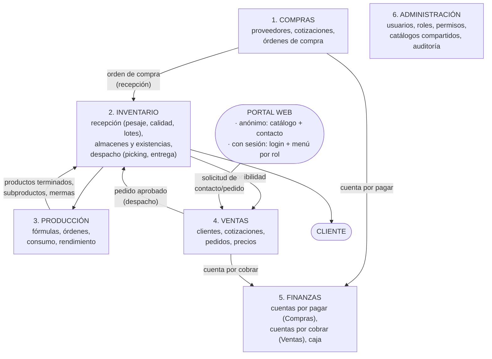
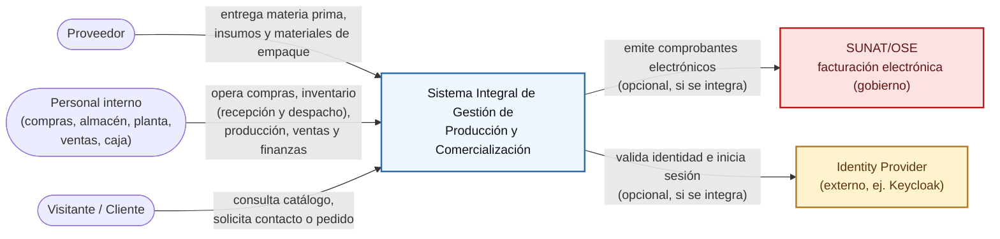
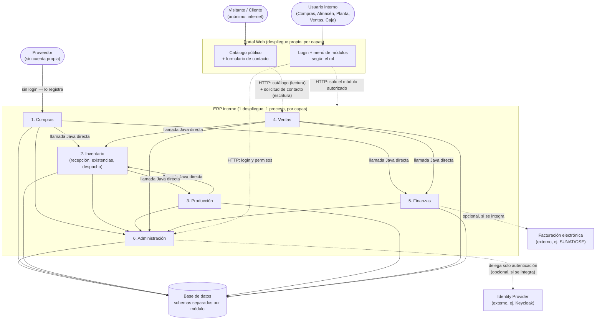

# Sistema Integral de Gestión de Producción y Comercialización

**Figura 1. Flujo funcional: los 6 módulos del ERP interno, con el Portal Web como entrada única**

Esta figura es el **flujo funcional**: qué módulos existen y en qué orden pasa la operación de negocio, sin entrar en cómo se despliega técnicamente cada uno (eso son las Figuras 2 y 3, más abajo — contexto, actores, procesos, base de datos, sistemas externos). Por eso todas las flechas se dibujan igual aquí: la diferencia entre "mismo proceso" y "HTTP a otro despliegue" no es información de negocio, es arquitectura.

`Inventario` concentra tres operaciones sobre el mismo almacén — **recepción** (lo que entra desde `Compras`), **existencias** (almacenes, ubicaciones, lotes, entradas/salidas) y **despacho** (lo que sale hacia el `Cliente` por un pedido de `Ventas`) — en vez de ser tres módulos separados. Es el mismo criterio que usa Odoo, el ERP de código abierto más usado: `purchase` y `sale` son apps separadas porque negocian con dos contrapartes distintas (proveedor y cliente), pero recibir y despachar son dos tipos de operación (`stock.picking`) dentro de una sola app, `stock` — no apps aparte, porque ambas son la misma naturaleza de trabajo: mover físicamente el almacén.

`Administración` no aparece conectada a ningún módulo en este diagrama porque no participa del flujo secuencial: sostiene a los demás de forma transversal (roles, catálogos, parametrización — ver su descripción más abajo), no en un punto fijo de la cadena.

Trazabilidad, Costos, Calidad y Reportes no son módulos ni despliegues — son capacidades que se apoyan en los datos de los seis módulos de arriba, por eso no tienen caja propia en el diagrama (se describen en "Calidad, costos, trazabilidad y reportes", más abajo).

El `Portal Web` tampoco es un módulo del ERP: vive fuera de la red interna, en su propio despliegue (ver "Arquitectura", más abajo). Se incluye en el diagrama porque es la puerta de entrada de todo lo demás. **Ningún usuario entra directo al ERP**: todos —visitante anónimo, comprador, personal de almacén, operario de planta, vendedor, cajero— pasan primero por el Portal. Lo que cambia es qué ve cada uno adentro: el visitante anónimo, catálogo y contacto; el usuario con sesión iniciada, el menú de los módulos que su rol le permite (definidos en `Administración`).

## Qué hace cada módulo

El sistema se organiza en seis módulos internos, cada uno con responsabilidades y límites explícitos — ningún módulo asume una función que le corresponde a otro, aunque el flujo de negocio los recorra en secuencia (Figura 1) —, más un componente adicional que mira hacia afuera: el `Portal Web`.

**1. Compras.** Gestiona proveedores, solicitudes de cotización, cotizaciones, órdenes de compra, precios, cantidades y condiciones de compra de materias primas, insumos de producción, materiales de empaque y demás artículos que la empresa necesita. Su alcance termina en la emisión y el seguimiento de la orden de compra — la recepción física es responsabilidad de `Inventario`, nunca de este módulo: `Compras` decide qué y cuánto comprar, no si lo que llegó cumple. `Proveedor` es un rol sobre `Persona` (natural o jurídica, dato que vive en `Administración`) — `Compras` no guarda su propia ficha de identidad ni de contacto.

**2. Inventario.** Ejecuta los movimientos físicos de existencias — materias primas, insumos, materiales de empaque, productos en proceso, productos terminados, subproductos y materiales auxiliares —, con tres operaciones sobre el mismo almacén:

- **Recepción**: registra la llegada física de lo que `Compras` ordenó — relación con la orden de compra, proveedor, procedencia, fecha y condiciones de llegada. Para materias primas como el maíz, además del pesaje (bruto, tara, neto) aplica los controles de calidad que la empresa defina (humedad, impurezas, entre otros). Decide aceptar, observar, rechazar o devolver al proveedor — solo lo aceptado genera lote y entra a existencias.
- **Existencias**: almacenes, ubicaciones, lotes, entradas, salidas, transferencias, ajustes y bajas. No decide nada por sí mismo (ver aclaraciones, más abajo): solo refleja el movimiento que cada operación le informa, y responde con exactitud cuánto hay disponible cuando se le pregunta.
- **Despacho**: convierte el pedido aprobado por `Ventas` en una entrega física — picking, selección de lotes, carga, transportista, vehículo, ruta y confirmación de entrega. También es el punto de entrada de las devoluciones del cliente — decide si el producto devuelto reingresa, queda observado, se reprocesa o se da de baja.

**3. Producción.** Transforma lo que `Inventario` tiene disponible en purina y otros derivados, siguiendo fórmulas o recetas. Administra órdenes de producción, cantidades planificadas frente a reales, el lote de materia prima consumido, y lo que resulta de ejecutar la orden: productos terminados, subproductos, mermas, desperdicios y reprocesos. Es también la fuente de la información necesaria para calcular el costo de producción — sin `Producción`, `Costos` no tiene de dónde partir.

**4. Ventas.** Gestiona clientes, cotizaciones, pedidos, listas de precios, descuentos y condiciones comerciales, tanto mayoristas como minoristas. Antes de comprometer un pedido, consulta a `Inventario` la disponibilidad real — nunca vende sobre una cifra que no verificó — y entrega el pedido aprobado a `Inventario` para su despacho. Igual que `Proveedor` en `Compras`, `Cliente` es un rol sobre `Persona` — la misma persona podría ser cliente de un almacén y, a la vez, proveedor de otro insumo, sin duplicar su documento de identidad en dos módulos.

**5. Finanzas.** Traduce a términos económicos lo que `Compras` y `Ventas` generan: cuentas por pagar (de las compras), cuentas por cobrar (de las ventas), facturación, pagos, anticipos, cobranzas y caja. Es, junto a `Producción`, el módulo con un agregado real que proteger (ver más abajo): el saldo de cada cuenta, con la garantía de que nunca se le aplica más pago o cobranza del que le corresponde.

**6. Administración.** No participa en el flujo de negocio (Figura 1) — lo sostiene desde abajo:

- **Institucional (configuración de la empresa)** — equivalente al dominio 1 del ejemplo académico: datos de la empresa, sucursales, almacenes y tiendas — la jerarquía física del negocio que los demás módulos referencian (`Inventario` registra un movimiento en un almacén ya configurado aquí; `Ventas` asocia un pedido a una tienda o sucursal), pero que `Administración` es quien crea y mantiene (detalle en "Configuración de la empresa", más abajo).
- **Personas** — equivalente al dominio 2 del ejemplo académico: registro único de persona natural o jurídica — documento de identidad o RUC, nombres o razón social, teléfonos, direcciones, correos —, del que `Proveedor` (en `Compras`), `Cliente` (en `Ventas`) y el `Usuario` que inicia sesión son roles que una misma persona puede tener, no tres fichas independientes. Evita duplicar el mismo documento de identidad en tres módulos, y resuelve en un solo lugar el caso real de que un cliente frecuente sea también la persona de contacto de un proveedor.
- **Plataforma transversal** — seguridad, roles, permisos, SSO, auditoría, parametrización, APIs: usuarios, roles, permisos, y el menú de módulos que cada rol ve en el `Portal Web` — el rol vive aquí, el menú del Portal solo lo refleja. Aquí es donde se traza la línea con Keycloak, si se integra: Keycloak resuelve la **autenticación** (confirmar que el usuario es quien dice ser, con su login y contraseña, y emitir un token) — es un producto genérico, no sabe qué es `Compras` ni `Ventas`. `Administración` resuelve la **autorización de negocio**: qué rol tiene ese usuario ya autenticado y qué módulos le da ese rol — una regla específica de este sistema que ningún Identity Provider conoce por sí solo. Delegar la autenticación a Keycloak no vacía a `Administración`: solo deja de guardar la contraseña, sigue siendo dueña del rol y de a qué da acceso. De ahí también vienen los catálogos compartidos (unidades de medida, categorías, presentaciones, motivos de devolución o de merma) y el registro de auditoría de lo que los usuarios hacen en el resto de módulos.

**Portal Web.** Es la única puerta de entrada — nadie accede a los otros seis módulos por otra vía. Para un visitante anónimo, es un sitio de promoción: catálogo de productos (ficha, descripción, imágenes) y un formulario de contacto para pedir información o un pedido. Cada envío llega a `Ventas` como una **solicitud de contacto**, que un vendedor revisa y decide si convierte en cotización o pedido real — no vende en línea, no hay carrito, checkout ni pago todavía. Para un usuario con sesión iniciada (comprador, personal de almacén, operario de planta, vendedor, cajero), el Portal muestra un **menú con los módulos a los que su rol le da acceso** — el mismo rol que administra `Administración` — y ahí adentro navega el módulo correspondiente (Compras, Inventario, Producción, etc.). La empresa ya anticipó una v2 con **ventas en línea** (carrito, pago); esta v1 se construye de manera que esa evolución no obligue a rehacerlo (ver "Arquitectura", más abajo).

### Tipos de artículos

El sistema distingue explícitamente entre lo que fluye por cada etapa, porque el mismo artículo cambia de naturaleza según en qué módulo está:

**Tabla 1. Tipos de artículo gestionados por el sistema**

| Tipo | Ejemplos | Dónde nace / dónde se consume |
|---|---|---|
| Materia prima | Maíz y otras materias primas de producción | Nace en `Inventario` (recepción), se consume en `Producción` |
| Insumo de producción | Vitaminas, minerales, aditivos y otros componentes | Nace en `Inventario` (recepción)/`Compras`, se consume en `Producción` |
| Material de empaque | Sacos, bolsas, envases, etiquetas | Nace en `Inventario` (recepción)/`Compras`, se consume en `Producción` |
| Producto en proceso | Intermedio de una orden de producción todavía no cerrada | Nace y se consume dentro de `Producción` |
| Producto terminado | Purina y otros derivados | Nace en `Producción`, se consume en `Ventas`/`Inventario` (despacho) |
| Subproducto | Resultado secundario de la transformación | Nace en `Producción` |
| Material auxiliar o consumible | Insumo de soporte que no forma parte del producto final | Se consume donde la operación lo requiera |

### Configuración de la empresa

Antes de que cualquier módulo registre un movimiento, `Administración` necesita tener configurada la jerarquía física del negocio — de dónde sale cada almacén y cada tienda:

**Tabla 2. Jerarquía de configuración de la empresa**

| Nivel | Qué es | Ejemplo |
|---|---|---|
| Empresa | La organización dueña del sistema | "Molinos XYZ S.A.C." |
| Sucursal | Una ubicación física de negocio de la empresa | Planta de producción, oficina administrativa |
| Almacén | Espacio físico de existencias dentro de una sucursal — lo que `Inventario` referencia en cada movimiento | Almacén de materia prima, almacén de producto terminado |
| Tienda | Punto de venta al público dentro de una sucursal, para la venta minorista presencial | Tienda de fábrica |

Hoy el sistema opera para **una sola empresa** (mono-tenant): una fila en `Empresa`, con sus sucursales, almacenes y tiendas colgando de ella. Si más adelante el negocio se ofrece como **SaaS** a varias empresas, `Empresa` es la entidad que se convierte en raíz de aislamiento (*tenant*): cada sucursal, almacén y tienda —y en cascada, cada movimiento de los otros cinco módulos— queda asociado a su `empresa_id`. Construir `Empresa` como entidad explícita desde ahora, aunque hoy exista una sola fila, evita rediseñar el modelo de datos cuando llegue ese momento — mismo criterio que ya se aplicó al `Portal Web` para la v2 de ventas en línea: la migración a SaaS no se construye hoy, pero tampoco se bloquea con un diseño que la ignore.

### Calidad, costos, trazabilidad y reportes: capacidades, no módulos aparte

Cuatro capacidades atraviesan los seis módulos sin ser un despliegue propio (ya adelantado en la Figura 1):

- **Calidad** vive donde ocurre el control real: en `Inventario` (durante la operación de recepción: parámetros, resultados y aceptación/rechazo de lo que llega) y en `Producción` (parámetros y resultados del proceso y del producto obtenido). No hay un módulo de "Calidad" separado porque el control siempre pertenece a quien genera el dato, no a un tercero que lo audita después.
- **Costos** se arma con lo que `Compras`, `Inventario`, `Producción` y `Finanzas` ya registran — materia prima, insumos, empaque, mermas y demás costos atribuibles — para llegar a costo de producción, costo unitario, márgenes y rentabilidad. No es una fuente de datos propia, es un cálculo sobre las demás.
- **Trazabilidad** es la capacidad de recorrer la cadena completa — proveedor, compra, recepción, lote de materia prima, movimiento de inventario, orden de producción, insumos usados, lote de producto terminado, venta y cliente — en ambos sentidos: hacia adelante (de un lote de materia prima a los clientes que recibieron algo hecho con él) y hacia atrás (de un producto terminado a los proveedores y lotes que lo originaron).
- **Reportes** los entrega cada módulo sobre su propio ámbito — adquisiciones y proveedores (`Compras`), existencias y movimientos, incluidas la recepción y el despacho (`Inventario`), consumo y rendimiento (`Producción`), operaciones comerciales (`Ventas`), operaciones económicas (`Finanzas`), usuarios y auditoría (`Administración`) — sin un módulo de reportería centralizado que dependa de todos los demás.

## Arquitectura: monolito modular, organizado por capas — y el Portal Web aparte

Las figuras de esta sección siguen el **modelo C4** (Context, Containers, Components, Code) de Simon Brown — cada nivel hace zoom sobre el anterior, sin saltarse ninguno ([c4model.com](https://c4model.com/)).

### Vista de contexto (C1)

La vista de contexto muestra el sistema completo como una sola caja negra: quién lo usa y con qué otros sistemas conversa — sin tecnología, y sin distinguir todavía entre `Portal Web` y ERP interno (esa distinción aparece recién en C2, la Figura 3). Mismo patrón que usa [c4model.com/diagrams/system-context](https://c4model.com/diagrams/system-context):

**Figura 2. Vista de contexto (C1)**

Ningún nombre de tecnología aparece aquí (nada de "Spring Boot", "Mermaid" ni "Oracle") — a este nivel eso no importa todavía, solo quién usa el sistema y con qué otros sistemas conversa. `Facturación electrónica` e `Identity Provider` se dibujan aunque hoy sean integraciones opcionales, sin construir, por la misma razón que en el ejemplo académico: C1 responde "con qué conversará el sistema", no "qué ya está construido" — eso se aclara en la etiqueta de cada flecha, no omitiendo la caja.

### Vista de contenedores (C2)

El **ERP interno** tiene usuarios acotados (compradores, personal de almacén, operarios de planta, vendedores, cajeros) y un cuello de botella real en la planta física — la báscula, el laboratorio de calidad, la línea de producción —, no en el tráfico digital. Sin un argumento de escala o de sistema externo que lo justifique, sus seis módulos se construyen como **un solo desplegable**: corren en el mismo proceso, se llaman entre sí con una llamada Java directa (verificada en tiempo de compilación, p. ej. `ApplicationModules.verify()` de Spring Modulith) y comparten una única base de datos con schemas separados por módulo.

Por dentro, los seis módulos se organizan **por capas** (`Controller` → `Service` → `Repository`): es la opción más simple y rápida de construir, y ninguno acumula hoy un caso de uso lo bastante complejo — ni siquiera `Producción` o `Finanzas` — como para pagar el costo extra de aislar el dominio (hexagonal/Clean, ADS S04 2.4-2.5). `Inventario` tampoco lo necesita solo por concentrar tres operaciones: cada una (recepción, existencias, despacho) sigue siendo simple por separado. Si eso cambia más adelante, se evalúa entonces, con el código real delante, no antes.

**El `Portal Web` es la única excepción real del sistema.** A diferencia de los seis módulos anteriores, aquí sí hay un argumento concreto de separación — el mismo criterio de ADS S04 (2.7, "servicios con necesidades de escala muy distintas entre sí") que ya usa el ejemplo académico para `Matrícula` y `Pagos en línea`:

- **Perímetro de seguridad distinto.** El Portal es lo único expuesto a internet — el ERP interno nunca debe quedar accesible directamente ni de casualidad. Para el visitante anónimo, el Portal solo conoce una vista de catálogo curada (nombre, descripción, imagen — no costos, no stock exacto, no datos de proveedor) y un único endpoint de escritura pública: recibir la solicitud de contacto. Para el usuario con sesión iniciada, el Portal valida sus credenciales y su rol contra `Administración` antes de dejarlo entrar a cualquier módulo — nunca asume el rol por su cuenta.
- **Tráfico con un patrón distinto.** Una campaña de marketing puede disparar visitas al catálogo sin ninguna relación con la carga del ERP interno (que depende de cuántos empleados están trabajando, no de cuánta gente ve un anuncio) — aunque ambos flujos (público y con sesión) entren por el mismo Portal.
- **Ya se sabe que va a crecer.** La empresa anticipó una v2 con ventas en línea (carrito, checkout, pasarela de pago) — ese es justo el tipo de crecimiento que conviene no tener acoplado al ERP interno desde el principio, para no separarlo después bajo presión.

Por eso el `Portal Web` se construye **desde el día uno como su propio desplegable** — la única capa de presentación de todo el sistema, tanto para el público como para el personal interno —, no como un séptimo módulo del monolito. Se organiza también **por capas** (mostrar catálogo, guardar un formulario, o pedirle a `Administración` el menú del usuario y redirigir al módulo autorizado — nada de eso exige aislar un dominio), pero como proceso aparte que le habla al ERP interno solo por su API, nunca a su base de datos directamente.

**Figura 3. Vista de contenedores (C2): el Portal Web como entrada única de todo el sistema**

**Figura 4. Por capas: la misma organización interna, en los dos despliegues**

**Cómo leer el diagrama:** flecha sólida = llamada Java directa, mismo proceso — dentro del ERP interno, porque sus seis módulos viven en el mismo monolito modular; también `Proveedor → Compras`, porque el proveedor no tiene cuenta propia, quien registra el dato es el personal de `Compras`. Flecha punteada = HTTP, proceso distinto — el `Portal Web` hablándole al ERP por su API (tanto la pública de catálogo/contacto como la protegida de cada módulo), y las dos integraciones externas opcionales (`Facturación electrónica`, `Identity Provider`), que hoy no están construidas: se agregan el día que el negocio realmente las necesite.

**Tabla 3. Por qué cada componente va donde va**

| Componente(s) | Despliegue | Por qué |
|---|---|---|
| `Administración` | ERP interno, por capas | Institucional + Personas + Plataforma transversal (dominios 1, 2 y 22 del ejemplo académico, juntos aquí por ser un sistema de 6 módulos) — configuración de la empresa, persona natural/jurídica, usuarios, roles, catálogos compartidos. Es también quien decide qué módulos ve cada usuario en el menú del Portal. |
| `Compras` | ERP interno, por capas | CRUD con validaciones — cotizar y ordenar no tiene hoy un caso más complejo que "la orden existe". |
| `Inventario` | ERP interno, por capas | Concentra recepción, existencias y despacho — es la base operativa que los demás módulos leen y escriben constantemente; ninguna de sus tres operaciones tiene hoy una regla más compleja que "el lote quedó aceptado/rechazado" o "la salida quedó confirmada". |
| `Producción` | ERP interno, por capas | El módulo con más reglas de negocio del sistema (fórmulas, consumo real vs. planificado, mermas) — pero todavía CRUD con validaciones sobre esas reglas, no un caso que hoy exija aislarse del framework. |
| `Ventas` | ERP interno, por capas | Cotizar y tomar pedidos es gestión de registros con reglas simples de disponibilidad y condiciones comerciales. |
| `Finanzas` | ERP interno, por capas | Cuentas por cobrar/pagar con un saldo que cuidar — que la suma de pagos no supere el monto se resuelve con una validación de servicio simple, sin necesitar aislar el dominio todavía. |
| `Portal Web` | **Despliegue propio, por capas** | Es la única presentación de todo el sistema (público y con sesión) — tráfico público/anónimo que no debe tocar el ERP interno directamente; escala distinta (campañas de marketing); va a crecer a ventas en línea en v2. Separarlo ahora evita rehacerlo bajo presión después. |
| Trazabilidad, Costos, Calidad, Reportes | No son despliegues | Se apoyan en los datos que ya generan los 6 módulos del ERP. |

**Decisión, en una frase:** el **ERP interno** es un **monolito modular** organizado **por capas**, sin excepciones entre sus seis módulos; el **`Portal Web`** es la única excepción del sistema completo — su propio despliegue, también por capas, porque a diferencia de los seis módulos internos sí tiene un argumento real de perímetro público y de escala distinta.

**Quién es quién:**

- **`Administración`**: junta Institucional, Personas y Plataforma transversal (dominios 1, 2 y 22 del ejemplo académico) — configuración de la empresa, persona natural/jurídica, usuarios, roles, permisos, catálogos compartidos. La consulta todo lo demás, incluido el `Portal Web` para saber qué módulos le muestra a cada usuario. Puede delegar la autenticación a un Identity Provider externo (Keycloak) el día que el negocio lo pida, sin dejar de ser dueña de los catálogos, los roles y la parametrización propios.
- **`Compras`**: negocia y ordena — proveedores, cotizaciones, órdenes de compra.
- **`Inventario`**: concentra tres operaciones sobre el almacén — recibe lo que `Compras` ordenó (pesaje, calidad, lotes), mantiene el núcleo de existencias que todo lo demás lee y escribe, y despacha lo que `Ventas` aprobó (picking, transporte, confirmación de entrega).
- **`Producción`**: el módulo con más reglas de negocio del sistema — orden de producción, fórmula, consumo, rendimiento, mermas.
- **`Ventas`**: negocia con el cliente — clientes, cotizaciones, pedidos, precios; entrega el pedido aprobado a `Inventario` para su despacho.
- **`Finanzas`**: cuentas por cobrar (de Ventas) y por pagar (de Compras), con su propio saldo.
- **`Portal Web`**: la entrada única del sistema, en su propio despliegue. Al visitante anónimo le muestra catálogo y contacto, y le entrega las solicitudes a `Ventas` sin convertirlas en pedido por sí mismo; al usuario con sesión le muestra el menú de módulos que su rol autoriza y lo deja operar ahí — nunca decide permisos por su cuenta, siempre se los pregunta a `Administración`.
- **`Facturación electrónica`/`Identity Provider`**: sistemas externos opcionales — se integran, no se construyen, el día que aparezcan (cumplimiento tributario, SSO corporativo).

**El flujo, de punta a punta:**

0. Un visitante anónimo entra al `Portal Web`, revisa el catálogo de productos y llena el formulario de contacto. El Portal envía esa solicitud al ERP interno; un vendedor la recibe en `Ventas`, se comunica con el interesado y, si prospera, la convierte manualmente en una cotización o un pedido — el Portal nunca genera un pedido por sí mismo (todavía no hay carrito ni pago; eso es v2). Ese mismo vendedor, para hacer esto, primero inició sesión en el `Portal Web` con su usuario: el Portal le pidió el rol a `Administración`, confirmó que tiene acceso a `Ventas`, y recién ahí le mostró la pantalla — el mismo camino que sigue cualquier otro empleado (comprador, personal de almacén, operario de planta, cajero) para entrar a su propio módulo.
1. `Compras` genera una orden de compra a un `Proveedor` (maíz u otro insumo/material de empaque), y de paso informa a `Finanzas` el compromiso de pago (cuenta por pagar programada, aún no exigible).
2. El proveedor entrega físicamente la mercadería e `Inventario` la registra (operación de recepción): pesaje (bruto, tara, neto para el maíz), controles de calidad (humedad, impurezas) y la decisión de aceptar, observar o rechazar. Lo aceptado genera lotes y su correspondiente entrada en existencias.
3. Cuando `Inventario` confirma la recepción, la cuenta por pagar de `Finanzas` pasa de "programada" a "exigible" según los términos pactados con el proveedor.
4. `Producción` toma una fórmula/receta, planifica una orden de producción y consulta a `Inventario` la disponibilidad real de materias primas, insumos y materiales de empaque antes de iniciar — no reserva de forma optimista.
5. Al ejecutar la orden, `Producción` registra el consumo real (que puede diferir del planificado), el rendimiento, las mermas y los subproductos, y entrega a `Inventario` los lotes de producto terminado resultantes (purina u otros derivados).
6. `Ventas` cotiza y toma pedidos contra la disponibilidad que le reporta `Inventario` (el mismo módulo del paso 2, con productos terminados en vez de materia prima), y al confirmar un pedido informa a `Finanzas` la cuenta por cobrar correspondiente al `Cliente`.
7. `Inventario` prepara el pedido aprobado por `Ventas` (operación de despacho: picking, selección de lotes, transporte) y confirma la entrega. Una devolución del cliente reingresa a existencias (o queda observada/dada de baja) y ajusta la cuenta por cobrar en `Finanzas` si corresponde.
8. `Administración` no genera ningún documento del flujo de negocio — pero sí aparece en cada paso, de forma implícita: es a quien el `Portal Web` le pregunta el rol antes de dejar entrar a `Compras`, `Inventario`, `Producción`, `Ventas` o `Finanzas` en los pasos 1-7. Sostiene a los cinco módulos operativos desde el inicio (usuarios, roles, catálogos, auditoría), igual que `Personas`/`Institucional` en el ejemplo académico.

**Siete aclaraciones que vale la pena dejar explícitas:**

- **`Inventario` no decide nada, solo ejecuta.** No decide cuánto comprar, cuánto producir ni si vender — esas decisiones son de `Compras`, `Producción` y `Ventas`. `Inventario` únicamente ejecuta el movimiento (recepción, entrada, salida, despacho) que cada módulo le informa y responde "cuánto hay disponible" cuando se le pregunta.
- **Recepción y despacho no son módulos aparte, y no es un atajo.** Ambos son la misma naturaleza de trabajo — mover físicamente el almacén — sin importar si el origen es una compra o el destino es una venta; por eso viven dentro de `Inventario`, igual que hace Odoo con su módulo `stock` frente a `purchase` y `sale`.
- **`Producción` no reserva stock de forma optimista.** Antes de iniciar una orden, confirma con `Inventario` la disponibilidad real de insumos — si no alcanza, la orden queda en espera o se ejecuta parcial, nunca se descuenta un consumo que la planta no puede cubrir.
- **`Finanzas` no conoce plan de cuentas contable ni centro de costo.** Cada cuenta por pagar o por cobrar lleva proveedor/cliente, concepto y referencia comercial (orden de compra, pedido) — lenguaje del negocio, no de contabilidad formal. Traducir eso a cuenta contable es trabajo de un sistema contable externo, el día que exista esa integración — nunca antes, mismo criterio que `ERP Administrativo` en el ejemplo académico.
- **El `Portal Web` no decide permisos, solo los aplica.** Que un usuario vea `Compras` o `Finanzas` en su menú lo decide el rol que le asignó `Administración`, no el Portal — si mañana cambia el rol de alguien, el menú cambia solo porque `Administración` cambió, sin tocar una línea del Portal.
- **La separación autenticación/autorización no depende de monolito modular vs. microservicios.** Es un eje aparte (ADS S04, 2.7): en microservicios, Keycloak seguiría resolviendo solo identidad, cada servicio se registraría como su propio *client* con sus propios roles, y el menú agregado por rol lo seguiría armando la aplicación (un *Backend for Frontend*, o la versión distribuida de `Administración`) — nunca el Identity Provider por sí solo, tenga el sistema 1 proceso o 10.
- **El `Portal Web` ya tiene sesión, pero no vende en línea todavía.** El login y el menú por rol (para el personal interno) se construyen en esta v1; lo que falta es el lado del cliente: carrito, checkout y pago. Eso es alcance de v2, y en ese momento se evalúa si el Portal necesita su propia base de datos o una integración con una pasarela de pago; nada de eso se construye ahora solo porque "ya se sabe que viene".

La Figura 3 dibuja los 6 módulos del ERP interno como un monolito modular, más el `Portal Web` como su única excepción — separado desde el día uno por perímetro público y por lo que se anticipa en v2, no por volumen de tráfico actual. A diferencia del ejemplo académico (22 dominios, con varios candidatos reales a microservicio), aquí el ERP interno no tiene ninguno: el `Portal Web` es el único componente del sistema completo que se construye fuera del monolito.
