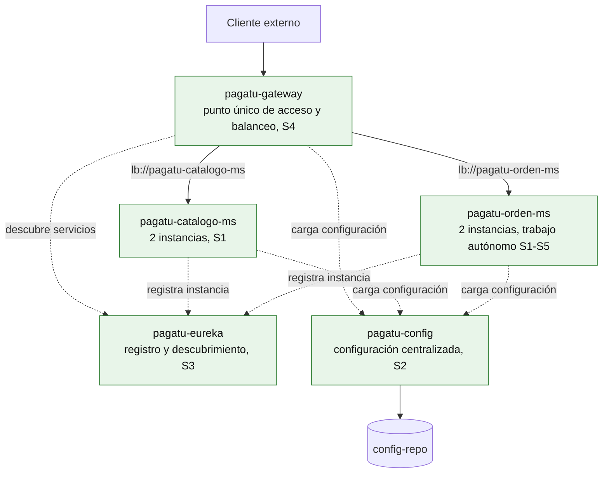

# Distribuidas - Producto de Unidad 1

**Esta es la plantilla-ejemplo del producto de Unidad 1 de Desarrollo de Aplicaciones Distribuidas.** La estructura (alcance de servicios, contrato REST, configuración por ambiente, arquitectura del sistema) es exigible a todos: servicio REST persistente, configuración externalizada por ambiente, registro y descubrimiento de servicios, punto único de acceso mediante Gateway, y distribución de tráfico entre instancias. El contenido de `pagatu` (nombres de microservicio, endpoints, puertos concretos) es el ejemplo real que muestra cómo se ve terminada — cada equipo reemplaza ese contenido por el de su propio dominio, declarado en su [Brief técnico](brief.md) de S2, sin cambiar la estructura.

## Producto

**Sistema distribuido base funcional, configurable y preparado para múltiples instancias.**

Implementa la base técnica del sistema distribuido: un servicio REST funcional, configuración centralizada, descubrimiento dinámico, acceso por Gateway y ejecución concurrente de instancias.

## 1. Alcance de servicios

**Tabla 1. Alcance de servicios (ejemplo `pagatu`)**

| Servicio | Rol | Sesión |
|---|---|---|
| `pagatu-config` | Config Server, configuración externalizada por ambiente. | S2 |
| `pagatu-eureka` | Registro y descubrimiento de servicios. | S3 |
| `pagatu-gateway` | Punto único de acceso y balanceo de carga. | S4 |
| `pagatu-catalogo-ms` | Microservicio guiado en clase, con dos recursos (categorías, productos) y dos instancias simultáneas. | S1, S3 |
| `pagatu-orden-ms` | Microservicio replicado como trabajo autónomo desde S1, migrado a Config Client y Eureka Client, con su propia ruta en el Gateway. | S1 (autónomo), S2-S4 (corregido para el cierre de unidad) |

## 2. Contrato REST

Todo el tráfico se resuelve a través de `pagatu-gateway` — ningún cliente externo llama directo a un puerto de instancia.

**Tabla 2. Contrato REST de referencia**

| Métodos | Endpoint | Propósito | Sesión relacionada |
|---|---|---|---|
| `GET`, `GET /{id}`, `POST`, `PUT`, `DELETE` | `/api/v1/categorias` | CRUD completo de categorías. | S1 |
| `GET`, `GET /{id}`, `POST`, `PUT`, `DELETE` | `/api/v1/productos` | CRUD completo de productos, con su categoría asociada. | S1 |
| `GET`, `GET /{id}`, `POST` | `/api/v1/ordenes` | Listar, consultar y registrar órdenes (`pagatu-orden-ms`, trabajo autónomo). | S1 (autónomo), ruta agregada en S4 |

## 3. Configuración por ambiente

**Tabla 3. Puertos por componente y ambiente**

| Componente | Puerto DEV | Puerto PROD (interno) | Puerto PROD (expuesto al host) |
|---|---|---|---|
| `pagatu-config` | `18888` | `8888` | `28888` |
| `pagatu-eureka` | `18761` | `8761` | `28761` (solo dashboard) |
| `pagatu-gateway` | `18080` | `8080` | `28080` (único puerto de negocio) |
| `pagatu-catalogo-ms` (2 instancias) | `8080` / `8081` | `8080` | Sin exponer |
| `pagatu-orden-ms` (2 instancias) | `8082` / `8083` | `8080` | Sin exponer |

El prefijo `1` identifica DEV, el prefijo `2` identifica PROD expuesto — mismo criterio usado desde S2. En PROD, solo `pagatu-gateway` publica un puerto de negocio al host (`28080`); `pagatu-config` y `pagatu-eureka` exponen su puerto solo para revisión administrativa del equipo, no para tráfico de clientes reales.

## 4. Arquitectura del sistema distribuido base

**Figura 1. Sistema distribuido base, Unidad I completa**



A diferencia del roadmap de S4 (donde `pagatu-gateway` era lo único nuevo del día), aquí los cinco componentes están en verde: la Unidad I completa un sistema donde ningún cliente externo conoce un puerto de instancia, ningún servicio tiene su configuración hardcodeada, y agregar o perder una instancia no requiere tocar nada fuera de `pagatu-eureka`.

## 5. Rúbrica de Evaluación

**Tabla 4. Rúbrica de evaluación de la Unidad 1**

| Criterio | Peso | CE / Nivel | A (20 pts) | B (15 pts) | C (10 pts) | D (5 pts) | Calificación obtenida |
|---|---:|---|---|---|---|---|---:|
| 1. Servicio REST funcional y persistente | 12% | CE023-N3 | Servicio ejecutable, persistente y documentado, verificado en vivo. | Servicio funcional, con documentación o persistencia parcial. | Servicio parcialmente funcional o sin persistencia verificable. | No presenta un servicio REST funcional. | |
| 2. Configuración externa por ambiente | 12% | CE023-N3 | Configuración externalizada, con diferencias reales y verificables entre DEV y PROD. | Configuración externalizada, con diferencias parciales entre ambientes. | Configuración parcialmente externa o sin diferencias claras. | No externaliza configuración. | |
| 3. Registro y descubrimiento de servicios operativo | 16% | CE023-N3 | Registro operativo, con instancias visibles y verificadas en el dashboard. | Registro operativo, con verificación parcial del dashboard. | Registro presente, sin verificación clara de instancias. | No evidencia registro de servicios. | |
| 4. Punto único de acceso mediante Gateway | 16% | CE023-N3 | Gateway operativo, con rutas hacia todos los servicios resueltas correctamente. | Gateway operativo, con al menos una ruta funcional. | Gateway definido, con rutas incompletas o con errores. | No evidencia Gateway funcional. | |
| 5. Distribución de tráfico entre instancias | 16% | CE023-N3 | Balanceo de carga verificado entre al menos dos instancias, con evidencia clara. | Balanceo verificado parcialmente o sobre una sola instancia. | Balanceo definido, sin verificación clara. | No evidencia balanceo de carga. | |
| 6. Evidencias de ejecución reproducible y documentación técnica básica | 8% | CE023-N3 | Evidencias completas, reproducibles por otra persona, con documentación clara. | Evidencias suficientes, con vacíos menores de documentación. | Evidencias parciales o poco reproducibles. | No presenta evidencias ni documentación. | |
| 7. Sustentación | 20% | CG | Sustenta con claridad y profesionalismo su aporte individual, respondiendo con precisión las preguntas del jurado. | Sustenta con solvencia, con detalles menores en claridad, orden o precisión. | Sustenta con dificultad; claridad, orden o precisión insuficientes. | No sustenta adecuadamente ni demuestra su aporte individual. | |

Nota final = suma de (`Peso` × `Puntos de la calificación obtenida`) / 100 × 20.

`CE023-N3` = Nivel 3 de la competencia CE023 (Programación). `CG` = Competencia General "Carácter y Aprendizaje Autónomo" del sílabo — no es CE023: los criterios 1-6 ya son la evidencia técnica, incluida su verificación en vivo; el criterio 7 verifica aporte individual y comunicación.

**Tabla 5. Subaspectos de la sustentación (Unidad 1)**

El criterio 7 se evalúa con los mismos 6 subaspectos de la sustentación integral del Proyecto Sello ([`u3-producto.md`](u3-producto.md#2-rubrica-de-evaluacion), Tabla 2) — exigibles desde esta primera sustentación de unidad, no solo en la sustentación final del curso.

| Subaspecto | Qué observa en Unidad 1 |
|---|---|
| 1. Aporte individual | Cada integrante demuestra lo que construyó (Tabla 2 de S5, preguntas de referencia). |
| 2. Comunicación y orden | Claridad, estructura, tiempo y lenguaje técnico durante la presentación. |
| 3. Presentación personal y actitud | Puntualidad, vestimenta limpia y adecuada, higiene, cabello ordenado, actitud profesional, respeto, honestidad y coherencia con los valores y principios cristianos de la institución. |
| 4. Repositorio y estándares | Topics académicos configurados desde S2 ([Guía del proyecto](index.md), sección 5), organización, commits y reproducibilidad del sistema base. |
| 5. MkDocs o equivalente | Documentación de Unidad 1 publicada, navegable y alineada con `u1-producto.md`. |
| 6. Pitch/demo ejecutiva | Introducción breve del sistema base y su avance (no reemplaza la demo técnica de la Tabla 3 de S5, la precede). |

Para usar la rúbrica con IA, solicita:

```text
Evalúa la sustentación y el producto (u1-producto.md, adaptado al dominio propio del equipo) usando la rúbrica de esta sección.
Para cada criterio selecciona la calificación obtenida: A=20, B=15, C=10, D=5.
Justifica brevemente cada nivel con evidencia concreta (endpoints, dashboard de registro, logs de balanceo).
Para el criterio 7, verifica explícitamente los 6 subaspectos de la Tabla 5 (aporte individual, comunicación, presentación personal, repositorio, MkDocs, pitch/demo) antes de asignar el nivel.
Calcula la nota final con la fórmula: suma de (Peso × Puntos de la calificación obtenida) / 100 × 20.
Indica 2 fortalezas y 2 recomendaciones para lo que sigue en Unidad II.
```

## 6. Trazabilidad y procedencia de la rúbrica

Los primeros seis criterios son cita literal de los criterios de evaluación del producto de la Unidad I en el sílabo de Desarrollo de Aplicaciones Distribuidas; el séptimo (Sustentación) corresponde a la sustentación exigida por el mismo sílabo (sesión 5, actividad 2).

**Con la malla curricular:** estos seis criterios son la base de la porción de plataforma distribuida del **Nivel 3 de CE023** (Programación) — esa porción se completa recién al cierre de las 3 unidades del curso (seguridad, mensajería, consistencia e observabilidad en Unidad 2; validación end-to-end en Unidad 3, aquí solo se evalúa la base de Unidad 1). Junto con la plataforma móvil (`MOV`), ambas conforman el Nivel 3 completo de la competencia; la integración de las cinco plataformas (consola, escritorio, web, distribuido, móvil) ocurre recién en `PI1`, Ciclo 8. El criterio 7 (Sustentación) es transversal y no forma parte de la definición de la competencia.
