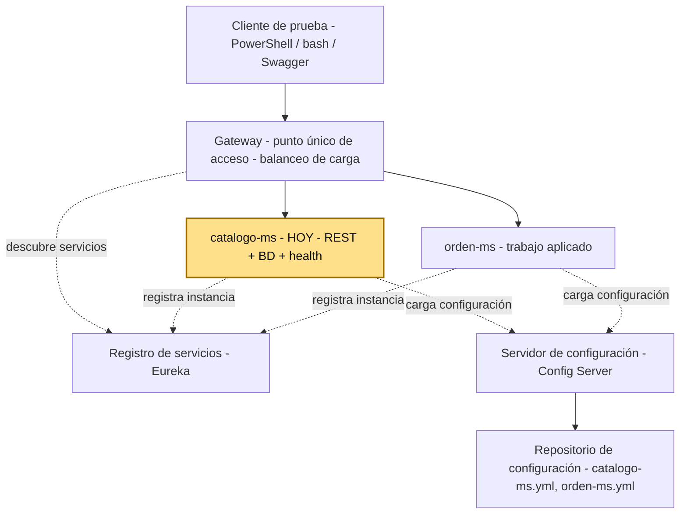
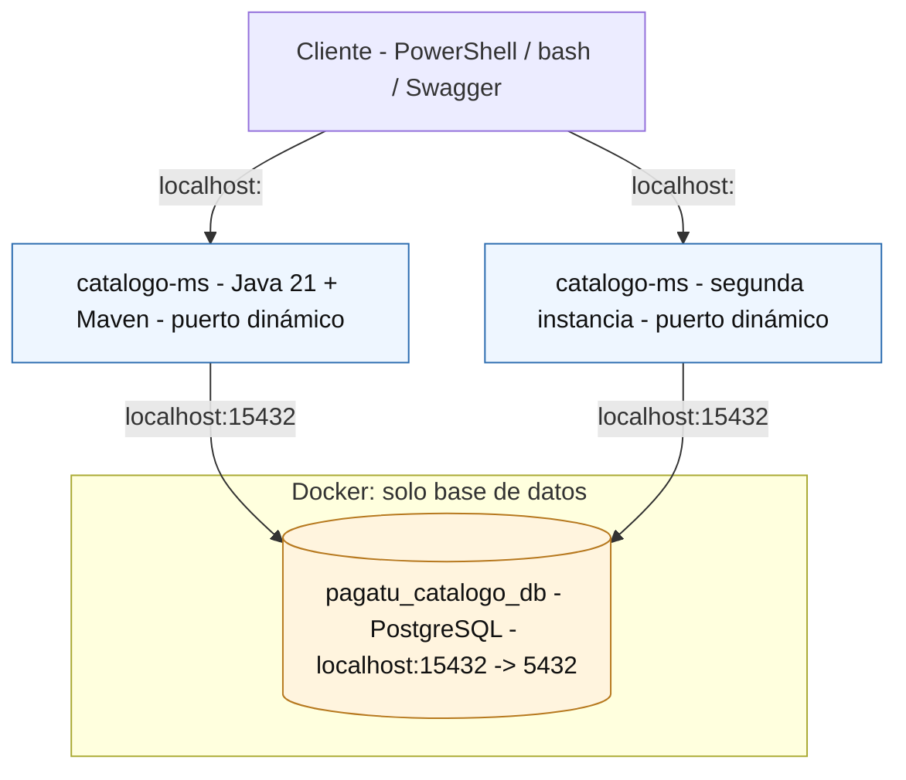
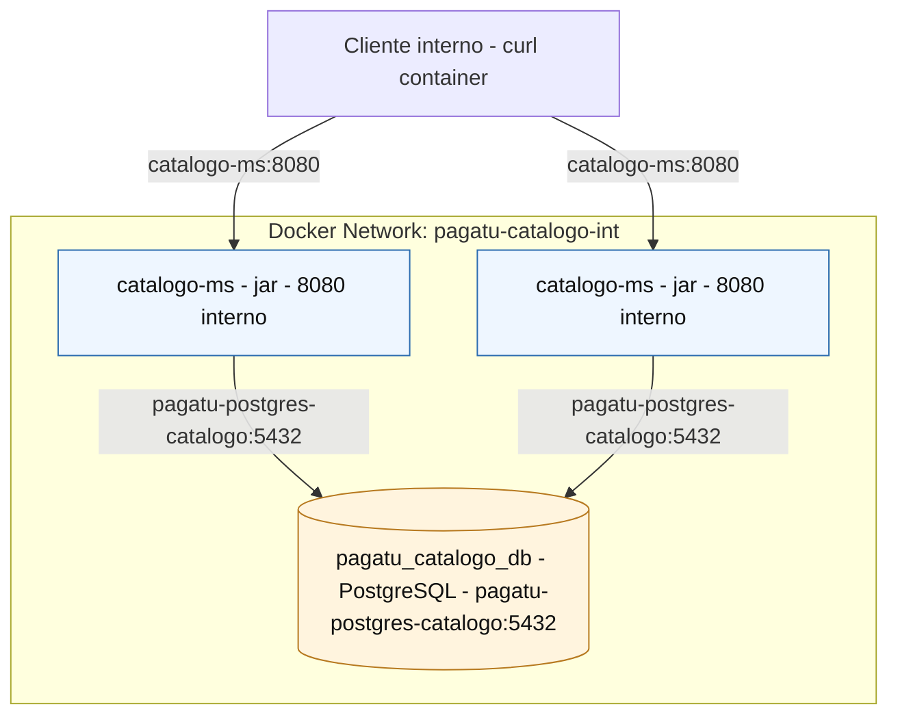

# S1 - Construcción de un servicio base para un sistema distribuido

## 1. Introducción

Tiempo: 20 min.

### 1.1 Contexto

Un sistema distribuido de comercio electrónico no nace como microservicios completos desde el primer día: nace de un primer servicio de negocio, bien delimitado, persistente y observable, que sirve como patrón para los siguientes. Esta sesión construye ese primer servicio, `catalogo-ms`, y deja establecidas las convenciones (estructura de capas, ejecución DEV/PROD local, trazabilidad) que se repetirán en cada microservicio del proyecto `pagatu`.

### 1.2 Índice

1. Arquitectura de microservicios y responsabilidad única.
2. Entornos de ejecución: DEV con Maven y PROD local con Docker.
3. Observabilidad y diagnóstico básico del servicio.
4. Construcción guiada de `catalogo-ms`.

### 1.3 Propósito de aprendizaje

Al concluir la clase, estarás en condiciones de:

- **Construir e implementar** un microservicio stateless con API REST, persistencia en PostgreSQL, validación de entradas, documentación de endpoints con Swagger, verificación de salud con Actuator y ejecución reproducible en desarrollo y en producción local con Docker.

### 1.4 Producto de sesión

`catalogo-ms` funcional con CRUD de categorías, PostgreSQL en Docker, Swagger, Actuator, README operativo y pruebas por shell.

### 1.5 Metodología

| Fase | Actividades | Orientaciones | Material |
|---|---|---|---|
| Revisión previa individual | Leer el sílabo de la Unidad 1 y el caso de la plataforma de comercio electrónico (ver 1.6). | Trabajo individual, antes de clase; preparar el entorno local (Java 21, Docker) si aún no está listo. | Sílabo DIST U1. |
| Clase presencial | Construcción guiada de `catalogo-ms`: entidad, CRUD, PostgreSQL, Flyway, Swagger, Actuator y filtro de trazabilidad. | Trabajo individual, siguiendo al docente paso a paso; consulta inmediata ante errores de arranque o de conexión a base de datos. | Pasos 3.1 a 3.5 de esta guía. |
| Evaluación formativa | Revisión en clase del servicio ejecutando en DEV, con múltiples instancias corriendo en paralelo. | La evidencia se completa y sustenta de forma individual, fuera del aula, según los criterios mínimos de la sección 4.2. | Plantilla de evidencia individual (4.1), rúbrica de evaluación (5.4). |

### 1.6 Motivación de la sesión

#### 1.6.1 Caso: plataforma de comercio electrónico

Una empresa desarrolla un sistema de comercio electrónico. Inicialmente, todo el sistema fue construido como una sola aplicación monolítica.

Con el crecimiento del negocio comienzan a aparecer problemas:

- El sistema tarda más en desplegarse.
- Errores en un módulo afectan a todo el sistema.
- Es difícil escalar partes específicas del sistema.
- Los equipos de desarrollo trabajan sobre el mismo código.

El equipo de ingeniería decide rediseñar la arquitectura del sistema utilizando microservicios.

Preguntas para los estudiantes:

1. ¿Qué problemas tiene la arquitectura monolítica en este caso?
2. ¿Por qué una empresa migraría a microservicios?
3. ¿Qué ventajas ofrece dividir el sistema en servicios?

En esta sesión se inicia ese rediseño construyendo el primer componente del sistema `pagatu`: `catalogo-ms`.

### 1.7 Ubicación en el curso

- Unidad: U1 - Sistema distribuido base orientado a producción.
- Producto de unidad: sistema distribuido base funcional, configurable y preparado para múltiples instancias, ejecutable en desarrollo y producción local en paralelo.
- Producto del curso: Proyecto Sello: sistema distribuido de microservicios end-to-end, configurable, escalable, seguro, resiliente, consistente, observable, integrado con frontend y defendido técnicamente.
- Avance del producto en esta sesión: primer microservicio REST funcional, persistente, observable y ejecutable fuera del IDE.

Roadmap para elaborar el producto de la unidad:



Hoy se construye el primer componente real de la U1: `catalogo-ms`. En las siguientes sesiones se agregan configuración centralizada, registro de servicios, múltiples instancias, Gateway y balanceo. La evaluación U1 valida el sistema base integrado construido con esos componentes.

## 2. Explica

Tiempo: 25 min.

### 2.1 Conceptos clave

Un microservicio debe tener responsabilidad clara, persistencia propia, configuración por ambiente y capacidad de ejecutarse de forma independiente.

Ejemplo: `catalogo-ms` se encarga de gestionar categorías, conceptos de pago y sus precios, con su propia base de datos. No debería guardar clientes, órdenes ni pagos. Si más adelante `orden-ms` necesita saber si un concepto de pago existe y cuál es su precio, consulta a `catalogo-ms` por red en lugar de leer directamente su base de datos.

### 2.2 Arquitectura del producto en `pagatu`

#### 2.2.1 DEV: aplicación fuera de Docker



#### 2.2.2 PROD local: aplicación dentro de Docker



Regla práctica:

- Si la aplicación corre fuera de Docker, usa `localhost` con el puerto expuesto por Docker.
- Si la aplicación corre dentro de Docker, usa el nombre del servicio y el puerto interno.

#### 2.2.3 Flujo de trabajo

1. Preparar ambiente.
2. Crear proyecto Spring Boot y levantar PostgreSQL DEV.
3. Construir el CRUD de `Categoria`.
4. Ejecutar y probar en DEV.
5. Preparar archivos de PROD local.
6. Ejecutar y probar en Docker.
7. Registrar evidencias y defender el resultado.

### 2.3 Observabilidad y diagnóstico

La observabilidad inicia desde S1 como hábito transversal. En esta sesión todavía no hay stack completo de métricas y paneles, pero el estudiante ya debe revisar señales básicas del servicio y usar los errores como insumo de diagnóstico.

#### 2.3.1 Señales básicas a revisar

- Logs de arranque.
- Puerto dinámico asignado.
- Estado de `/actuator/health`.
- Métricas de `/actuator/metrics`.
- Conexión a PostgreSQL.
- Migraciones Flyway ejecutadas.
- Errores de validación HTTP 400.
- Logs de contenedores con `docker compose logs`.

#### 2.3.2 Errores frecuentes y diagnóstico

| Problema | Causa probable | Solución |
|---|---|---|
| No conecta a BD | PostgreSQL apagado o puerto incorrecto | Revisar compose y variables |
| Swagger no abre | Puerto dinámico no identificado | Revisar consola o Eureka cuando aplique |
| Validación no responde | Falta `@Valid` o anotaciones | Revisar controlador y DTO |
| PROD local no responde desde host | El microservicio no publica puerto host | Probar desde red Docker o esperar Gateway |
| Escalado consume demasiados recursos | Muchas instancias locales | Usar máximo dos instancias |

## 3. Aplica: actividad práctica guiada

Tiempo: 2h.

En el laboratorio, el docente guía la construcción de `catalogo-ms` y los estudiantes verifican el resultado con comandos de consola. En `pagatu`, el docente guía `catalogo-ms` y el estudiante replica el patrón en `orden-ms` como trabajo aplicado. La versión actual usa monorepo, nombres con sufijo `-ms`, PostgreSQL y puertos dinámicos para los microservicios.

Hoja de ruta de la sesión práctica:

- **3.1** Preparar el ambiente local: Java 21, Docker y VS Code.
- **3.2** Crear el proyecto Spring Boot con las dependencias base.
- **3.3** Construir el CRUD de `Categoria`.
- **3.4** Ejecutar y probar el microservicio en DEV.
- **3.5** Simular escalamiento horizontal (múltiples instancias).

### 3.1 Preparar ambiente local: Java 21, Docker y VS Code

**Producto del paso:** ambiente local con Java 21, Docker, Docker Compose y VS Code verificados, listo para crear y ejecutar el microservicio.

Antes de crear el microservicio, el estudiante debe preparar el entorno DEV. En esta sesión Java se ejecuta en el host; Maven no se instala aparte (el proyecto trae Maven Wrapper desde que se crea en 3.2.1, ver 3.1.2); PostgreSQL no se instala en el host, se levanta con Docker desde el paso 3.2.

**Herramientas necesarias**

- Java 21 (Eclipse Temurin 21).
- Docker Desktop.
- VS Code.
- Extension Pack for Java.
- Spring Boot Extension Pack.

En las clases se trabajará con **VS Code** para mantener una guía común. Puedes usar otro IDE si ya lo dominas — por ejemplo **IntelliJ IDEA** —, pero entonces sigue tú mismo la equivalencia de cada paso, ya que las capturas y comandos de esta guía están pensados para VS Code. Aún usando otro IDE, la ejecución recomendada del microservicio será desde la consola de comandos, al estilo de un servidor Linux.

#### 3.1.1 Instalar o verificar Java 21

Se recomienda Eclipse Temurin 21, una distribución OpenJDK de soporte prolongado (LTS), instalada con el gestor de paquetes nativo de cada sistema operativo. Este workspace estandariza Java 21 LTS para todos los cursos y microservicios.

**Windows** — PowerShell como usuario normal:

```powershell
winget install --id EclipseAdoptium.Temurin.21.JDK --exact
```

**macOS** (con Homebrew ya instalado):

```bash
brew install --cask temurin@21
```

**Linux (Ubuntu/Debian)**:

```bash
sudo apt update
sudo apt install -y wget apt-transport-https gpg
wget -qO - https://packages.adoptium.net/artifactory/api/gpg/key/public | gpg --dearmor | sudo tee /etc/apt/trusted.gpg.d/adoptium.gpg > /dev/null
echo "deb https://packages.adoptium.net/artifactory/deb $(awk -F= '/^VERSION_CODENAME/{print$2}' /etc/os-release) main" | sudo tee /etc/apt/sources.list.d/adoptium.list
sudo apt update
sudo apt install -y temurin-21-jdk
```

Al finalizar, cierra y vuelve a abrir la terminal. Verifica la instalación:

```bash
java -version
```

Resultado esperado:

```text
openjdk version "21"
```

#### 3.1.2 Maven: no se instala aparte, se usa el Maven Wrapper

No instales Maven en el host. Cuando crees el proyecto con Spring Initializr (3.2.1), Spring genera automáticamente el **Maven Wrapper** (`mvnw` para macOS/Linux, `mvnw.cmd` para Windows) dentro de `services/catalogo-ms`: un script que descarga y cachea la versión exacta de Maven que el proyecto necesita, sin que tengas que instalarla ni gestionarla tú.

A partir de ese momento, cualquier comando Maven de esta guía se ejecuta con el wrapper, nunca con `mvn` a secas:

PowerShell:

```powershell
.\mvnw.cmd spring-boot:run
```

bash macOS/Linux:

```bash
./mvnw spring-boot:run
```

Esto evita el problema clásico de "en mi máquina compila con una versión de Maven y en la del compañero falla con otra" — todo el equipo usa la misma versión, la que define el propio proyecto.

#### 3.1.3 Instalar o verificar Docker Desktop y Docker Compose

Opcional recomendado: antes de iniciar el laboratorio, crea una cuenta gratuita en Docker Hub:

```text
https://hub.docker.com/signup
```

Docker funciona sin iniciar sesión, pero Docker Hub puede aplicar límites de descarga de imágenes. En equipos de laboratorio o redes compartidas, iniciar sesión ayuda a evitar bloqueos durante la descarga de imágenes como PostgreSQL.

PowerShell / bash macOS/Linux:

```bash
docker login
```

En Windows y macOS, Docker Compose se instala junto con Docker Desktop:

```text
https://www.docker.com/products/docker-desktop
```

En Linux puedes usar Docker Engine con el plugin Compose siguiendo la documentación oficial de Docker:

```text
https://docs.docker.com/engine/install/
https://docs.docker.com/compose/install/linux/
```

Verificar Docker:

PowerShell / bash macOS/Linux:

```bash
docker version
docker compose version
docker ps
```

Resultado esperado:

```text
Docker versión
Docker Compose versión
```

#### 3.1.4 Abrir el proyecto en VS Code

Ubícate en la raíz del monorepo `pagatu`, no dentro de un microservicio específico. VS Code soporta trabajar con múltiples proyectos/carpetas dentro del mismo workspace; abrir la raíz evita tener una ventana distinta por cada microservicio.

PowerShell / bash macOS/Linux:

```bash
cd c:/262/2625dist/pagatu
code .
```

Desde VS Code, confirma que se reconoce el proyecto Java y que las extensiones de Spring Boot están disponibles.

**Evidencia de cierre del paso 3.1**

- Salida de `java -version`.
- Salida de `docker version`.
- Salida de `docker compose version`.
- VS Code abierto en la raíz del repositorio `pagatu`.

### 3.2 Crear el proyecto Spring Boot desde VS Code con dependencias base

**Producto del paso:** proyecto Spring Boot creado en `services/catalogo-ms`, con `artifactId` `pagatu-catalogo-ms`, paquete `pe.edu.upeu.catalogo`, dependencias base instaladas, PostgreSQL DEV levantado en Docker y un endpoint web simple respondiendo desde el navegador o shell.

En este paso no basta con crear el proyecto. Como se agregan `Spring Data JPA`, `PostgreSQL Driver` y `Flyway`, Spring Boot intentará configurar una conexión a base de datos al arrancar. Por eso, si ejecutas el microservicio sin configurar y levantar PostgreSQL, el arranque fallará.

Ese fallo es útil para aprender: un microservicio con persistencia necesita una dependencia de infraestructura disponible. En el curso no usaremos H2 para ocultar el problema ni desactivaremos la conexión a BD; levantaremos PostgreSQL con Docker desde el inicio.

#### 3.2.1 Crear el proyecto con Spring Initializr desde VS Code

Desde la raíz del monorepo `pagatu`, abre VS Code y ejecuta el comando:

```text
Spring Initializr: Create a Maven Project
```

Usa la siguiente configuración:

| Campo | Valor |
|---|---|
| Project | Maven Project |
| Spring Boot | **4.0.7** |
| Language | Java |
| Java | 21 |
| Group Id | `pe.edu.upeu` |
| Artifact Id | `pagatu-catalogo-ms` |
| Package name | `pe.edu.upeu.catalogo` |
| Packaging | Jar |
| Ubicación | `services/catalogo-ms` |

Nota sobre la versión: el generador de Spring Initializr ya no ofrece ninguna versión 3.x — las únicas opciones son líneas 4.x. Se fija **4.0.7** por el mismo motivo verificado en LP2 (ver `docs/lp2/adr/ADR-003-spring-boot-4.md` del repo `bomerp`): dentro de la línea 4.x, SpringDoc OpenAPI declara compatibilidad solo hasta `4.1.0-M1`, así que 4.0.7 es la versión estable dentro de ese rango. Si al generar el proyecto ves `spring-boot-starter-web` reemplazado por `spring-boot-starter-webmvc`, o starters de prueba granulares en vez de uno solo, es esperado en esta línea de Boot — no lo corrijas.

Dependencias a seleccionar:

| Grupo | Dependencias | Propósito |
|---|---|---|
| API REST base | Spring Web, Validation | Exponer endpoints HTTP y validar entradas |
| Productividad | Lombok, Spring Boot DevTools | Reducir código repetitivo y facilitar ejecución en desarrollo |
| Documentación y operación | SpringDoc OpenAPI WebMvc UI, Spring Boot Actuator | Documentar la API con Swagger y verificar health |
| Persistencia | Spring Data JPA, PostgreSQL Driver, Flyway | Acceso a datos, conexión a PostgreSQL y migraciones de BD |

Nota sobre motor de base de datos: en DIST se trabaja con **PostgreSQL** (no Oracle — Oracle es el motor de LP2/BD2, fuera del alcance de este curso). Si el equipo prefiere **MySQL**, es una alternativa válida: cambia `PostgreSQL Driver` por `MySQL Driver` en el Initializr y `flyway-database-postgresql` por `flyway-mysql` en el `pom.xml` — el resto de la guía (Flyway, JPA, `ddl-auto: validate`) aplica igual, solo cambia el driver y la URL de conexión.

Nota: SpringDoc/Swagger documenta los endpoints del microservicio; no es infraestructura distribuida. La infraestructura distribuida inicia desde S2 con configuración centralizada.

Nota: el directorio del microservicio en el monorepo es `services/catalogo-ms`, pero el `artifactId` Maven usado por el proyecto actual es `pagatu-catalogo-ms`.

#### 3.2.2 Revisar dependencias PostgreSQL y Flyway

Abre `services/catalogo-ms/pom.xml` y verifica que existan las dependencias de persistencia para PostgreSQL:

```xml
<dependency>
    <groupId>org.flywaydb</groupId>
    <artifactId>flyway-core</artifactId>
</dependency>
<dependency>
    <groupId>org.flywaydb</groupId>
    <artifactId>flyway-database-postgresql</artifactId>
</dependency>
<dependency>
    <groupId>org.postgresql</groupId>
    <artifactId>postgresql</artifactId>
    <scope>runtime</scope>
</dependency>
```

#### 3.2.3 Ejecutar una primera vez y reconocer el fallo esperado

Ubícate en la carpeta del microservicio:

```powershell
# Windows (PowerShell o cmd)
cd services/catalogo-ms
.\mvnw.cmd spring-boot:run
```

```bash
# macOS / Linux
cd services/catalogo-ms
./mvnw spring-boot:run
```

Si todavía no existe configuración de base de datos, el error esperado será parecido a:

```text
APPLICATION FAILED TO START
Failed to configure a DataSource: 'url' attribute is not specified and no embedded datasource could be configured.
Reason: Failed to determine a suitable driver class
```

No se corrige quitando JPA ni usando H2. Se corrige declarando PostgreSQL DEV y levantando la base de datos con Docker.

#### 3.2.4 Crear `compose-dev.yml` para PostgreSQL DEV

En `services/catalogo-ms`, crea el archivo `compose-dev.yml`:

```yaml
name: pagatu-catalogo-dev

services:
  postgres-catalogo-dev:
    image: postgres:16-alpine
    container_name: pagatu-postgres-catalogo-dev
    restart: unless-stopped
    environment:
      POSTGRES_DB: pagatu_catalogo_db
      POSTGRES_USER: pagatu
      POSTGRES_PASSWORD: pagatu
    ports:
      - "15432:5432"
    volumes:
      - pagatu_catalogo_dev_data:/var/lib/postgresql/data

volumes:
  pagatu_catalogo_dev_data:
```

Levanta la base de datos:

PowerShell / bash macOS/Linux:

```bash
docker compose -f compose-dev.yml up -d
docker ps
```

#### 3.2.5 Configurar `application.yml` y `application-dev.yml`

En S1 la aplicación `catalogo-ms` se ejecuta en DEV con Maven desde el host. Solo PostgreSQL se ejecuta en Docker. Por eso la configuración debe apuntar a `localhost:15432`, que es el puerto publicado por el contenedor de base de datos.

En `src/main/resources`, crea o ajusta `application.yml` como configuración base:

```yaml
spring:
  application:
    name: catalogo-ms
  profiles:
    active: dev
```

Luego crea `application-dev.yml` para la configuración de desarrollo:

```yaml
server:
  port: 0

spring:
  datasource:
    url: jdbc:postgresql://localhost:15432/pagatu_catalogo_db
    username: pagatu
    password: pagatu
    driver-class-name: org.postgresql.Driver
  flyway:
    enabled: true
    locations: classpath:db/migration
  jpa:
    hibernate:
      ddl-auto: validate
    show-sql: true
    properties:
      hibernate:
        format_sql: true
  devtools:
    restart:
      enabled: true
    livereload:
      enabled: true

springdoc:
  swagger-ui:
    path: /swagger-ui.html

logging:
  level:
    pe.edu.upeu.catalogo: DEBUG

management:
  endpoints:
    web:
      exposure:
        include: health,info,metrics
  endpoint:
    health:
      show-details: always
```

Con `server.port: 0`, Spring Boot asigna un puerto libre automáticamente. Esto permite levantar varias instancias del mismo microservicio en paralelo sin cambiar el archivo de configuración.

En DEV, Flyway queda activo y ejecuta automáticamente `V1__create_categorias_table.sql` al arrancar la aplicación. JPA/Hibernate no crea tablas; solo valida que la entidad coincida con la estructura de la base de datos mediante `ddl-auto: validate`.

En S2 esta configuración se moverá progresivamente al Config Server. En S1 se mantiene local para que el alumno entienda primero qué necesita el microservicio para arrancar.

#### 3.2.6 Crear un endpoint temporal de saludo

Antes del CRUD, crea un controlador mínimo para comprobar que la aplicación web responde.

Archivo: `src/main/java/com/upeu/catalogo/controller/SaludoController.java`

```java
package pe.edu.upeu.catalogo.controller;

import org.springframework.web.bind.annotation.GetMapping;
import org.springframework.web.bind.annotation.RestController;

@RestController
public class SaludoController {

    @GetMapping("/saludo")
    public String saludo() {
        return "catalogo-ms activo";
    }
}
```

Este endpoint es temporal para validar el arranque web. Luego el foco pasará al CRUD de categorías.

#### 3.2.7 Ejecutar y comprobar que ya no falla

Antes de ejecutar la aplicación, comprueba desde la consola que PostgreSQL DEV está listo y que la base de datos existe.

PowerShell / bash macOS/Linux:

```bash
docker exec -it pagatu-postgres-catalogo-dev psql -U pagatu -d pagatu_catalogo_db -c "SELECT current_database();"
docker exec -it pagatu-postgres-catalogo-dev psql -U pagatu -d pagatu_catalogo_db -c "\dt"
```

Resultado esperado:

```text
current_database
------------------
pagatu_catalogo_db
```

Si `\dt` muestra `Did not find any relations`, está bien en este momento: aún no se ha creado la tabla `categorias`.

Con PostgreSQL DEV levantado y verificado, ejecuta la aplicación:

```powershell
# Windows (PowerShell o cmd)
.\mvnw.cmd spring-boot:run
```

```bash
# macOS / Linux
./mvnw spring-boot:run
```

Prueba el endpoint:

PowerShell:

```powershell
Invoke-RestMethod `
  -Method Get `
  -Uri "http://localhost:<puerto-asignado>/saludo"
```

bash macOS/Linux:

```bash
curl http://localhost:<puerto-asignado>/saludo
```

Resultado esperado:

```text
catalogo-ms activo
```

También puedes revisar Swagger usando el puerto que aparezca en la consola de arranque:

```text
http://localhost:<puerto-asignado>/swagger-ui/index.html
```

**Evidencia de cierre del paso 3.2**

- Proyecto creado en `services/catalogo-ms`.
- `pom.xml` con dependencias base y persistencia PostgreSQL.
- PostgreSQL DEV ejecutando en Docker.
- `application.yml` con perfil `dev` activo.
- `application-dev.yml` con puerto dinámico y conexión a PostgreSQL DEV.
- Endpoint `/saludo` respondiendo.

### 3.3 Construir el CRUD de `Categoria`

**Producto del paso:** CRUD de `Categoria` incorporado en `catalogo-ms`, incluyendo entidad, capas de aplicación, validaciones, filtro de trazabilidad y migración de base de datos, escritos directamente por el estudiante (sin depender de un repositorio externo).

En esta sesión se trabajará con la entidad `Categoria` como primer recurso del microservicio `catalogo-ms`. La entidad representa la tabla `categorias` y será la base para construir el CRUD. Cada archivo de este paso se crea directamente dentro de `services/catalogo-ms/src/main/java/com/upeu/catalogo` (o en `src/main/resources` cuando corresponda), siguiendo la misma estructura de carpetas usada en todo el curso:

```text
config
controller
dto
entity
exception
filter
mapper
repository
service
```

#### 3.3.1 Crear la entidad `Categoria`

Archivo: `entity/Categoria.java`

```java
package pe.edu.upeu.catalogo.entity;

import jakarta.persistence.*;
import lombok.*;

@Entity
@Table(name = "categorias")
@Getter
@Setter
@Builder
@NoArgsConstructor
@AllArgsConstructor
public class Categoria {

    @Id
    @GeneratedValue(strategy = GenerationType.IDENTITY)
    private Long id;

    @Column(name = "nombre", nullable = false, length = 100)
    private String nombre;

    @Column(name = "descripcion", length = 255)
    private String descripcion;
}
```

#### 3.3.2 Crear el repositorio, los DTO y el mapper

Archivo: `repository/CategoriaRepository.java`

```java
package pe.edu.upeu.catalogo.repository;

import pe.edu.upeu.catalogo.entity.Categoria;
import org.springframework.data.jpa.repository.JpaRepository;

public interface CategoriaRepository extends JpaRepository<Categoria, Long> {
}
```

Archivo: `dto/CategoriaRequest.java`

```java
package pe.edu.upeu.catalogo.dto;

import jakarta.validation.constraints.NotBlank;
import jakarta.validation.constraints.Size;
import lombok.Getter;
import lombok.Setter;

@Getter
@Setter
public class CategoriaRequest {

    @NotBlank
    @Size(max = 100)
    private String nombre;

    @Size(max = 255)
    private String descripcion;
}
```

Archivo: `dto/CategoriaResponse.java`

```java
package pe.edu.upeu.catalogo.dto;

import lombok.AllArgsConstructor;
import lombok.Builder;
import lombok.Getter;
import lombok.NoArgsConstructor;
import lombok.Setter;

@Getter
@Setter
@Builder
@NoArgsConstructor
@AllArgsConstructor
public class CategoriaResponse {
    private Long id;
    private String nombre;
    private String descripcion;
}
```

Archivo: `mapper/CategoriaMapper.java`

```java
package pe.edu.upeu.catalogo.mapper;

import pe.edu.upeu.catalogo.dto.CategoriaRequest;
import pe.edu.upeu.catalogo.dto.CategoriaResponse;
import pe.edu.upeu.catalogo.entity.Categoria;
import org.springframework.stereotype.Component;

@Component
public class CategoriaMapper {

    public Categoria toEntity(CategoriaRequest request) {
        return Categoria.builder()
                .nombre(request.getNombre())
                .descripcion(request.getDescripcion())
                .build();
    }

    public CategoriaResponse toResponse(Categoria categoria) {
        return CategoriaResponse.builder()
                .id(categoria.getId())
                .nombre(categoria.getNombre())
                .descripcion(categoria.getDescripcion())
                .build();
    }
}
```

#### 3.3.3 Crear las excepciones y el manejador global de errores

Archivo: `exception/ResourceNotFoundException.java`

```java
package pe.edu.upeu.catalogo.exception;

public class ResourceNotFoundException extends RuntimeException {
    public ResourceNotFoundException(String mensaje) {
        super(mensaje);
    }
}
```

Archivo: `exception/GlobalExceptionHandler.java`

```java
package pe.edu.upeu.catalogo.exception;

import org.springframework.http.HttpStatus;
import org.springframework.http.ResponseEntity;
import org.springframework.web.bind.MethodArgumentNotValidException;
import org.springframework.web.bind.annotation.ExceptionHandler;
import org.springframework.web.bind.annotation.RestControllerAdvice;

import java.time.Instant;
import java.util.HashMap;
import java.util.Map;

@RestControllerAdvice
public class GlobalExceptionHandler {

    @ExceptionHandler(ResourceNotFoundException.class)
    public ResponseEntity<Map<String, Object>> handleNotFound(ResourceNotFoundException ex) {
        Map<String, Object> body = new HashMap<>();
        body.put("timestamp", Instant.now().toString());
        body.put("status", HttpStatus.NOT_FOUND.value());
        body.put("error", "Not Found");
        body.put("message", ex.getMessage());
        return ResponseEntity.status(HttpStatus.NOT_FOUND).body(body);
    }

    @ExceptionHandler(MethodArgumentNotValidException.class)
    public ResponseEntity<Map<String, Object>> handleValidation(MethodArgumentNotValidException ex) {
        Map<String, Object> body = new HashMap<>();
        body.put("timestamp", Instant.now().toString());
        body.put("status", HttpStatus.BAD_REQUEST.value());
        body.put("error", "Bad Request");
        body.put("message", "Error de validación en los datos enviados");
        return ResponseEntity.status(HttpStatus.BAD_REQUEST).body(body);
    }
}
```

#### 3.3.4 Crear el servicio de aplicación

Archivo: `service/CategoriaService.java`

```java
package pe.edu.upeu.catalogo.service;

import pe.edu.upeu.catalogo.dto.CategoriaRequest;
import pe.edu.upeu.catalogo.dto.CategoriaResponse;
import pe.edu.upeu.catalogo.entity.Categoria;
import pe.edu.upeu.catalogo.exception.ResourceNotFoundException;
import pe.edu.upeu.catalogo.mapper.CategoriaMapper;
import pe.edu.upeu.catalogo.repository.CategoriaRepository;
import lombok.RequiredArgsConstructor;
import org.springframework.stereotype.Service;

import java.util.List;

@Service
@RequiredArgsConstructor
public class CategoriaService {

    private final CategoriaRepository categoriaRepository;
    private final CategoriaMapper categoriaMapper;

    public List<CategoriaResponse> listar() {
        return categoriaRepository.findAll().stream()
                .map(categoriaMapper::toResponse)
                .toList();
    }

    public CategoriaResponse obtener(Long id) {
        return categoriaMapper.toResponse(buscarOFallar(id));
    }

    public CategoriaResponse crear(CategoriaRequest request) {
        Categoria categoria = categoriaMapper.toEntity(request);
        return categoriaMapper.toResponse(categoriaRepository.save(categoria));
    }

    public CategoriaResponse actualizar(Long id, CategoriaRequest request) {
        Categoria categoria = buscarOFallar(id);
        categoria.setNombre(request.getNombre());
        categoria.setDescripcion(request.getDescripcion());
        return categoriaMapper.toResponse(categoriaRepository.save(categoria));
    }

    public void eliminar(Long id) {
        categoriaRepository.delete(buscarOFallar(id));
    }

    private Categoria buscarOFallar(Long id) {
        return categoriaRepository.findById(id)
                .orElseThrow(() -> new ResourceNotFoundException("Categoria no encontrada: " + id));
    }
}
```

#### 3.3.5 Crear el controlador REST

Archivo: `controller/CategoriaController.java`

```java
package pe.edu.upeu.catalogo.controller;

import pe.edu.upeu.catalogo.dto.CategoriaRequest;
import pe.edu.upeu.catalogo.dto.CategoriaResponse;
import pe.edu.upeu.catalogo.service.CategoriaService;
import jakarta.validation.Valid;
import lombok.RequiredArgsConstructor;
import org.springframework.http.HttpStatus;
import org.springframework.web.bind.annotation.*;

import java.util.List;

@RestController
@RequestMapping("/api/categorias")
@RequiredArgsConstructor
public class CategoriaController {

    private final CategoriaService categoriaService;

    @GetMapping
    public List<CategoriaResponse> listar() {
        return categoriaService.listar();
    }

    @GetMapping("/{id}")
    public CategoriaResponse obtener(@PathVariable Long id) {
        return categoriaService.obtener(id);
    }

    @PostMapping
    @ResponseStatus(HttpStatus.CREATED)
    public CategoriaResponse crear(@Valid @RequestBody CategoriaRequest request) {
        return categoriaService.crear(request);
    }

    @PutMapping("/{id}")
    public CategoriaResponse actualizar(@PathVariable Long id, @Valid @RequestBody CategoriaRequest request) {
        return categoriaService.actualizar(id, request);
    }

    @DeleteMapping("/{id}")
    @ResponseStatus(HttpStatus.NO_CONTENT)
    public void eliminar(@PathVariable Long id) {
        categoriaService.eliminar(id);
    }
}
```

La validación evita que el microservicio acepte datos incompletos antes de llegar a la base de datos: `@NotBlank` y `@Size(max = 100)` en `nombre` (dto/CategoriaRequest.java) junto con `@Valid` en el controlador rechazan con HTTP 400 cualquier solicitud sin nombre o con un nombre demasiado largo.

#### 3.3.6 Crear el filtro de trazabilidad `CorrelationIdFilter` y configurar logs

Este filtro agrega un identificador de trazabilidad a cada request usando el header `X-Trace-ID`. Si el cliente no lo envía, el filtro genera un UUID.

En S1 la trazabilidad es interna al microservicio:

```text
Cliente shell / Swagger -> Controller -> Service -> Repository -> BD
```

Todos los logs producidos durante esa petición pueden compartir el mismo `traceId`.

Archivo: `filter/CorrelationIdFilter.java`

```java
package pe.edu.upeu.catalogo.filter;

import jakarta.servlet.FilterChain;
import jakarta.servlet.ServletException;
import jakarta.servlet.http.HttpServletRequest;
import jakarta.servlet.http.HttpServletResponse;
import org.slf4j.MDC;
import org.springframework.stereotype.Component;
import org.springframework.web.filter.OncePerRequestFilter;

import java.io.IOException;
import java.util.UUID;

@Component
public class CorrelationIdFilter extends OncePerRequestFilter {

    public static final String TRACE_ID_HEADER = "X-Trace-ID";
    public static final String MDC_KEY = "traceId";

    @Override
    protected void doFilterInternal(HttpServletRequest request,
                                     HttpServletResponse response,
                                     FilterChain filterChain) throws ServletException, IOException {
        String traceId = request.getHeader(TRACE_ID_HEADER);
        if (traceId == null || traceId.isBlank()) {
            traceId = UUID.randomUUID().toString();
        }
        try {
            MDC.put(MDC_KEY, traceId);
            response.setHeader(TRACE_ID_HEADER, traceId);
            filterChain.doFilter(request, response);
        } finally {
            MDC.remove(MDC_KEY);
        }
    }
}
```

Crea también `src/main/resources/logback-spring.xml`. Este archivo define el formato de logs e incluye el `traceId` en cada línea (`[%X{traceId}]`), con salida por consola y por archivo en `logs/catalogo.log`:

```xml
<?xml version="1.0" encoding="UTF-8"?>
<configuration>
    <include resource="org/springframework/boot/logging/logback/defaults.xml"/>

    <property name="LOG_PATTERN"
              value="%d{yyyy-MM-dd HH:mm:ss.SSS} [%X{traceId}] %-5level %logger{36} - %msg%n"/>

    <appender name="CONSOLE" class="ch.qos.logback.core.ConsoleAppender">
        <encoder>
            <pattern>${LOG_PATTERN}</pattern>
        </encoder>
    </appender>

    <appender name="FILE" class="ch.qos.logback.core.rolling.RollingFileAppender">
        <file>logs/catalogo.log</file>
        <encoder>
            <pattern>${LOG_PATTERN}</pattern>
        </encoder>
        <rollingPolicy class="ch.qos.logback.core.rolling.TimeBasedRollingPolicy">
            <fileNamePattern>logs/catalogo-%d{yyyy-MM-dd}.log</fileNamePattern>
            <maxHistory>7</maxHistory>
        </rollingPolicy>
    </appender>

    <root level="INFO">
        <appender-ref ref="CONSOLE"/>
        <appender-ref ref="FILE"/>
    </root>
</configuration>
```

Más adelante, cuando se agreguen Gateway, Feign o frontend, el mismo header `X-Trace-ID` podrá propagarse entre componentes para trazabilidad distribuida.

#### 3.3.7 Revisar la migración Flyway

Crea la migración en `src/main/resources/db/migration/V1__create_categorias_table.sql`:

```sql
CREATE TABLE IF NOT EXISTS categorias (
    id BIGINT GENERATED BY DEFAULT AS IDENTITY,
    nombre VARCHAR(100) NOT NULL,
    descripcion VARCHAR(255),
    PRIMARY KEY (id)
);
```

En DEV y PROD local, Flyway ejecuta esta migración automáticamente al arrancar la aplicación. Luego Hibernate valida que la entidad `Categoria` coincida con la tabla mediante `ddl-auto: validate`.

#### 3.3.8 Revisar estructura resultante

Después de crear los archivos anteriores, revisa que la estructura de `catalogo-ms` quede similar a:

```text
src/main/java/com/upeu/catalogo
  config/
  controller/
    CategoriaController.java
    SaludoController.java
  dto/
    CategoriaRequest.java
    CategoriaResponse.java
  entity/
    Categoria.java
  exception/
    ResourceNotFoundException.java
    GlobalExceptionHandler.java
  filter/
    CorrelationIdFilter.java
  mapper/
    CategoriaMapper.java
  repository/
    CategoriaRepository.java
  service/
    CategoriaService.java
  CatalogoApplication.java
src/main/resources/db/migration
  V1__create_categorias_table.sql
src/main/resources
  logback-spring.xml
```

`config/` queda disponible para configuraciones locales del servicio (por ejemplo, un bean de OpenAPI); en S1 puede quedar vacío.

#### 3.3.9 Preguntas de verificación antes de ejecutar

Antes de ejecutar, la lectura del CRUD debe responder:

1. ¿Qué clase representa la tabla `categorias`?
2. ¿Qué archivo recibe la petición HTTP?
3. ¿Qué archivo concentra la lógica de aplicación?
4. ¿Qué archivo conversa con JPA?
5. ¿Qué DTO se usa para recibir datos desde la API?
6. ¿Qué excepción se devuelve cuando no existe una categoría?
7. ¿Para qué sirve `CorrelationIdFilter`?
8. ¿Cómo aparece el `traceId` en los logs?

### 3.4 Ejecutar y probar el microservicio en DEV

**Producto del paso:** microservicio ejecutando en desarrollo fuera del IDE, tabla `categorias` creada por Flyway, Swagger disponible, health activo y CRUD verificado por shell.

#### 3.4.1 Verificar PostgreSQL DEV

Verifica que PostgreSQL DEV siga activo:

PowerShell / bash macOS/Linux:

```bash
docker ps
```

#### 3.4.2 Ejecutar con Maven Wrapper

Ejecuta el microservicio:

```powershell
# Windows (PowerShell o cmd)
cd services/catalogo-ms
.\mvnw.cmd spring-boot:run
```

```bash
# macOS / Linux
cd services/catalogo-ms
./mvnw spring-boot:run
```

En la consola identifica el puerto asignado por Spring Boot. Debes ver una línea similar a:

```text
Tomcat started on port XXXXX
```

#### 3.4.3 Verificar tabla creada por Flyway

Luego verifica que Flyway haya creado la tabla en DEV:

PowerShell / bash macOS/Linux:

```bash
docker exec -it pagatu-postgres-catalogo-dev psql -U pagatu -d pagatu_catalogo_db -c "\dt"
docker exec -it pagatu-postgres-catalogo-dev psql -U pagatu -d pagatu_catalogo_db -c "\d categorias"
```

#### 3.4.4 Revisar Swagger

Abre Swagger usando el puerto que aparece en la consola:

```text
http://localhost:<puerto-asignado>/swagger-ui/index.html
```

Verifica que aparezcan las operaciones del controlador de categorías.

#### 3.4.5 Verificar health y metrics

Verifica `/actuator/health`:

PowerShell:

```powershell
Invoke-RestMethod `
  -Method Get `
  -Uri "http://localhost:<puerto-asignado>/actuator/health"
```

bash macOS/Linux:

```bash
curl http://localhost:<puerto-asignado>/actuator/health
```

Verifica `/actuator/metrics`. Este endpoint solo requiere `spring-boot-starter-actuator`; no necesita una librería adicional.

PowerShell:

```powershell
Invoke-RestMethod `
  -Method Get `
  -Uri "http://localhost:<puerto-asignado>/actuator/metrics"
```

bash macOS/Linux:

```bash
curl http://localhost:<puerto-asignado>/actuator/metrics
```

También puedes consultar una métrica específica:

PowerShell:

```powershell
Invoke-RestMethod `
  -Method Get `
  -Uri "http://localhost:<puerto-asignado>/actuator/metrics/jvm.memory.used"
```

bash macOS/Linux:

```bash
curl http://localhost:<puerto-asignado>/actuator/metrics/jvm.memory.used
```

Nota: para exponer `/actuator/prometheus` se requiere agregar `micrometer-registry-prometheus`.

#### 3.4.6 Probar CRUD por shell

Crea una categoría:

PowerShell:

```powershell
Invoke-RestMethod `
  -Method Post `
  -Uri "http://localhost:<puerto-asignado>/api/categorias" `
  -ContentType "application/json" `
  -Body '{"nombre":"Electrodomesticos","descripcion":"Linea blanca y pequenos electrodomesticos"}'
```

bash macOS/Linux:

```bash
curl -X POST http://localhost:<puerto-asignado>/api/categorias \
  -H "Content-Type: application/json" \
  -d '{"nombre":"Electrodomesticos","descripcion":"Linea blanca y pequenos electrodomesticos"}'
```

Lista todas las categorías:

```bash
curl http://localhost:<puerto-asignado>/api/categorias
```

Obtiene una categoría por id:

```bash
curl http://localhost:<puerto-asignado>/api/categorias/1
```

Actualiza una categoría:

```bash
curl -X PUT http://localhost:<puerto-asignado>/api/categorias/1 \
  -H "Content-Type: application/json" \
  -d '{"nombre":"Electrodomesticos","descripcion":"Linea blanca, pequenos y grandes electrodomesticos"}'
```

Elimina una categoría:

```bash
curl -X DELETE http://localhost:<puerto-asignado>/api/categorias/1
```

Prueba también un caso de validación fallida (sin `nombre`) y confirma que responde HTTP 400, y una consulta a un `id` inexistente y confirma que responde HTTP 404.

### 3.5 Simular escalamiento horizontal (múltiples instancias)

**Producto del paso:** dos instancias de `catalogo-ms` corriendo al mismo tiempo, cada una en un puerto distinto, ambas conectadas a la misma PostgreSQL DEV.

Un microservicio distribuido debe poder escalar horizontalmente: correr varias copias idénticas a la vez, cada una en su propio puerto, sin configuración fija que las haga chocar. Como `application-dev.yml` ya usa `server.port: 0`, Spring Boot le pide al sistema operativo un puerto libre cualquiera cada vez que arranca, en vez de uno fijo — por eso puedes levantar una segunda instancia sin tocar la configuración.

En dos terminales distintas, desde `services/catalogo-ms`:

```powershell
# Windows (PowerShell o cmd) - Terminal 1
.\mvnw.cmd spring-boot:run
```

```powershell
# Windows (PowerShell o cmd) - Terminal 2 (simultánea, con Postgres y la Terminal 1 ya corriendo)
.\mvnw.cmd spring-boot:run
```

```bash
# macOS / Linux - Terminal 1
./mvnw spring-boot:run
```

```bash
# macOS / Linux - Terminal 2 (simultánea, con Postgres y la Terminal 1 ya corriendo)
./mvnw spring-boot:run
```

Cada terminal imprime su propio puerto al arrancar:

```text
Tomcat started on port 54211 (http) with context path '/'
```

Verifica que ambas instancias responden por separado, con el endpoint de saludo y con `/actuator/health`:

PowerShell:

```powershell
Invoke-RestMethod -Method Get -Uri "http://localhost:<puerto-1>/saludo"
Invoke-RestMethod -Method Get -Uri "http://localhost:<puerto-2>/saludo"
Invoke-RestMethod -Method Get -Uri "http://localhost:<puerto-1>/actuator/health"
Invoke-RestMethod -Method Get -Uri "http://localhost:<puerto-2>/actuator/health"
```

bash macOS/Linux:

```bash
curl http://localhost:<puerto-1>/saludo
curl http://localhost:<puerto-2>/saludo
curl http://localhost:<puerto-1>/actuator/health
curl http://localhost:<puerto-2>/actuator/health
```

Resultado esperado: ambas responden `catalogo-ms activo` y `{"status":"UP"}`, cada una en su propio puerto, conectadas de forma independiente a la misma PostgreSQL DEV.

**Por qué importa esto en S1.** Todavía no hay Gateway ni balanceador de carga — eso llega en S4 ("Punto único de acceso y distribución de tráfico"). Pero la capacidad de correr múltiples instancias sin puerto fijo es la base técnica que un balanceador necesita para repartir tráfico entre copias del mismo servicio; practicarla desde S1 deja esa evidencia lista para cuando el Gateway integre esta pieza.

## 4. Crea: actividad autónoma

Tiempo: 4h fuera del aula.

Esta actividad autónoma se desarrolla sobre el proyecto de fin de curso del equipo. El producto de la unidad se construye por acumulación de los avances de cada sesión; por eso, la evidencia de esta sesión debe incorporarse a la documentación del proyecto y quedar trazable en GitHub.

### 4.1 Plantilla de evidencia individual

Entrega un PDF con el siguiente nombre:

El PDF de esta sesión debe generarse como impresión o exportación de la sección correspondiente en MkDocs o una herramienta equivalente. No se acepta un PDF armado manualmente fuera de la documentación del proyecto.

```text
S01_Equipo##_ApellidoNombre.pdf
```

Ejemplo:

```text
S01_Equipo03_QuispeAna.pdf
```

El PDF debe usar esta estructura. La primera sección define el trabajo autónomo; completa las demás con tus evidencias.

#### 4.1.1 Datos del estudiante

- Nombre:
- Equipo:
- Sesión: S01 - Construcción de un servicio base para un sistema distribuido
- Rol o aporte realizado:
- Link de GitHub:

#### 4.1.2 Trabajo autónomo realizado

Completa y evidencia estas tareas:

1. Replicar el patrón de `catalogo-ms` en otro servicio del dominio, por ejemplo `orden-ms`.
2. Ejecutar el microservicio en DEV con Maven Wrapper.
3. Probar el CRUD por PowerShell o bash.
4. Verificar Swagger, `/actuator/health` y `/actuator/metrics` en DEV.
5. Revisar la base de datos con comandos `psql`.
6. Ejecutar dos instancias del microservicio en paralelo (`server.port: 0`) y verificar que responden por separado.
7. Explicar por qué un microservicio debe poder escalar horizontalmente sin puerto fijo.

#### 4.1.3 Evidencia técnica

Incluye capturas o salidas de consola con una breve explicación debajo de cada una:

- Ejecución con `mvnw spring-boot:run` (Maven Wrapper).
- Prueba CRUD por shell.
- Swagger o lista de endpoints disponible.
- Respuesta de `/actuator/health`.
- Respuesta de `/actuator/metrics`.
- Consulta de tabla y registros con `psql`.
- Evidencia de las dos instancias corriendo en paralelo, con sus puertos y respuestas.

#### 4.1.4 Error o hallazgo

Describe al menos un error, diferencia o hallazgo técnico:

- Qué ocurrió.
- Cómo lo diagnosticaste.
- Cómo lo corregiste o qué aprendiste.

#### 4.1.5 Reflexión técnica breve

Responde en 5 a 8 líneas:

```text
¿Por qué un microservicio debe poder ejecutarse en desarrollo de forma reproducible y escalar horizontalmente sin puerto fijo?
```

### 4.2 Criterios mínimos de aceptación

La evidencia individual se considera completa si:

- El archivo respeta el nombre `S01_Equipo##_ApellidoNombre.pdf`.
- Incluye evidencias técnicas legibles.
- Muestra el microservicio funcionando en DEV.
- Muestra prueba de CRUD y base de datos.
- Muestra dos instancias corriendo en paralelo.
- Explica un aporte individual verificable.
- No contiene solo pantallazos: cada evidencia tiene una descripción breve.

## 5. Cierre evaluativo

Tiempo: 20 min.

Esta sección conecta el resultado de aprendizaje de la sesión con el producto que debe evidenciar cada estudiante.

### 5.1 Resultados esperados

Al finalizar la sesión, el estudiante debe demostrar que:

- El microservicio ejecuta en DEV con Maven Wrapper.
- PostgreSQL funciona en DEV.
- El CRUD de `Categoria` responde por shell.
- Swagger y `/actuator/health` funcionan en DEV.
- Flyway crea la tabla `categorias`.
- El microservicio puede levantar múltiples instancias en paralelo, sin puerto fijo.
- Puede explicar por qué escalar horizontalmente sin puerto fijo importa en un sistema distribuido.

### 5.2 Evidencia del producto de sesión

Cada estudiante entrega un PDF individual siguiendo la plantilla de la sección 4.1.

Nombre del archivo:

```text
S01_Equipo##_ApellidoNombre.pdf
```

La evidencia debe demostrar:

- Producto de sesión construido.
- Aporte individual verificable.
- Pruebas técnicas realizadas.
- Reflexión técnica breve.

La revisión se realiza con los criterios mínimos de aceptación de la sección 4.2 y la rúbrica de la sección 5.4.

Evidencia mínima que debe defender sobre el escalamiento horizontal:

| Aspecto | Instancia 1 | Instancia 2 |
|---|---|---|
| Puerto | Asignado por el SO (`server.port: 0`) | Asignado por el SO, distinto al de la Instancia 1 |
| Base de datos | Misma PostgreSQL DEV | Misma PostgreSQL DEV |
| Endpoint de saludo | `UP` en su propio puerto | `UP` en su propio puerto |
| `/actuator/health` | `UP`, conexión a BD independiente | `UP`, conexión a BD independiente |

### 5.3 Preguntas de defensa y reflexión

1. ¿Por qué un microservicio debe ser stateless?
2. ¿Qué responsabilidad tiene `catalogo-ms`?
3. ¿Cómo se prueba el servicio sin usar Postman?
4. ¿Qué evidencia demuestra que la BD fue usada?
5. ¿Por qué `server.port: 0` permite correr dos instancias sin que choquen?
6. ¿Qué componente hará falta más adelante para repartir tráfico entre esas instancias?
7. ¿Qué parte implementaste o replicaste individualmente?

### 5.4 Rúbrica de evaluación

| Dimensión | Peso | 3 - Logro destacado | 2 - Logro | 1 - Proceso | 0 - Inicio | Puntuación obtenida |
|---|---:|---|---|---|---|---:|
| 1. Microservicio funcional | 2 | Evidencia microservicio ejecutando, CRUD funcionando, health/metrics y Swagger en DEV. | Evidencia microservicio ejecutando y al menos una prueba funcional. | Evidencia arranque parcial o sin pruebas suficientes. | No evidencia el microservicio funcionando. | |
| 2. Persistencia y base de datos | 2 | Evidencia PostgreSQL DEV, Flyway y registros consultados con `psql`. | Evidencia tabla `categorias` y consultas básicas con `psql`. | Evidencia parcial de conexión a BD. | No evidencia uso de PostgreSQL ni tabla creada. | |
| 3. Escalamiento horizontal | 2 | Explica y evidencia dos instancias corriendo en paralelo, cada una respondiendo por su cuenta. | Evidencia dos instancias corriendo, sin verificar ambas por separado. | Evidencia solo una instancia. | No evidencia múltiples instancias. | |
| 4. Aporte individual verificable | 2 | Aporte claro, verificable y conectado al producto del equipo. | Aporte claro con archivo, comando o prueba realizada. | Aporte mencionado de forma general. | No se identifica aporte individual. | |
| 5. Diagnóstico de error o hallazgo | 1 | Analiza error/hallazgo, causa, solución y aprendizaje técnico. | Explica causa probable y solución parcial. | Menciona un problema sin explicarlo. | No presenta error ni hallazgo. | |
| 6. Reflexión técnica y orden | 1 | Reflexión técnica precisa, PDF ordenado, capturas legibles y explicaciones breves. | Reflexión clara y evidencias entendibles. | Reflexión superficial o evidencias poco legibles. | PDF desordenado o sin reflexión. | |

Puntuación acumulada = suma de (`Peso` * `Puntuación obtenida`) = ____.

Nota final = (`Puntuación acumulada` / 30) * 20 = ____.

Para usar la rúbrica con IA, solicita:

```text
Evalúa el PDF usando la rúbrica de la sesión.
Para cada dimensión selecciona la puntuación obtenida usando la escala Inicio=0, Proceso=1, Logro=2, Logro destacado=3.
Justifica brevemente cada puntuación.
Calcula la puntuación acumulada con la fórmula: suma de (Peso * Puntuación obtenida).
Calcula la nota final sobre 20 con la fórmula: (Puntuación acumulada / 30) * 20.
Indica 2 fortalezas y 2 recomendaciones.
```
