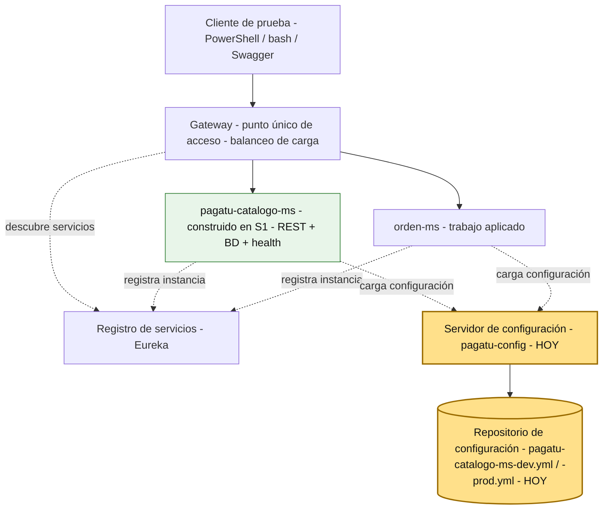
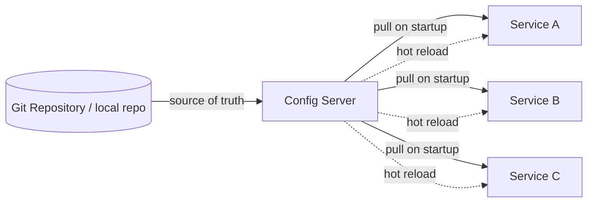
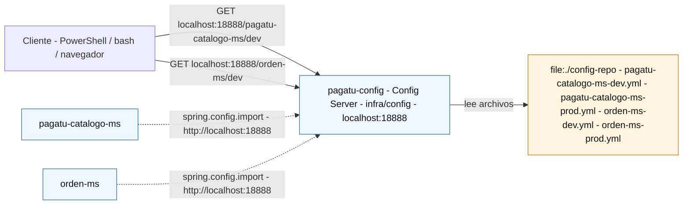
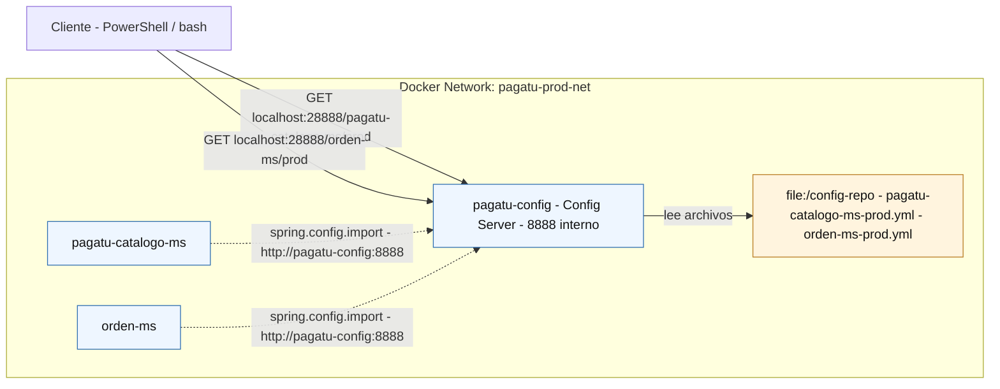

# S2 - Gestión Centralizada de Configuración y Ambientes

*Por: Angel Sullon Macalupu @asullom - 2026*

## 1. Introducción

Tiempo: 20 min.
 
### 1.1 Presentación de la sesión

`pagatu-catalogo-ms` guarda hoy su configuración en dos archivos propios: `application-dev.yml` y `application-prod.yml` (S1). Cuando `orden-ms` se sume al sistema (sección 4), va a necesitar prácticamente los mismos tipos de valores repetidos en sus propios archivos — con el riesgo real de que un ajuste se corrija en un servicio y se olvide en el otro. Esta sesión saca esa configuración de cada microservicio y la centraliza en un Config Server propio: `pagatu-config`. El porqué se desarrolla en 1.6, continuando el mismo camino hacia microservicios que empezó en S1.

### 1.2 Índice

1. El problema de la configuración duplicada entre microservicios.
2. Panorama de patrones de arquitectura de microservicios.
3. Config Server y config-repo: dos responsabilidades distintas.
4. Convención de nombres: `{aplicación}-{perfil}.yml`.
5. Config Server en DEV y en producción local.

### 1.3 Propósito de aprendizaje

Al concluir la clase, estarás en condiciones de:

- **Construir e implementar** un Config Server (Spring Cloud Config) que centraliza la configuración de `pagatu-catalogo-ms` por ambiente, verificando las consultas por HTTP y migrando el microservicio de S1 para leer su configuración externa en DEV y en producción local.

### 1.4 Producto de sesión

`pagatu-config` operativo en `infra/config`, con `config-repo` local (`pagatu-catalogo-ms-dev.yml`, `pagatu-catalogo-ms-prod.yml`), consultado por HTTP en ambos perfiles, y `pagatu-catalogo-ms` migrado para leer su configuración desde `pagatu-config` en DEV y en producción local con Docker.

### 1.5 Metodología

**Tabla 1. Metodología de la sesión**

| Actividades a Realizar en el Periodo | Orientaciones generales (Orientaciones Metodológicas) | Material de estudio recomendado |
|---|---|---|
| Revisión previa individual | Revisar `application-dev.yml` y `application-prod.yml` de `pagatu-catalogo-ms` (S1) y confirmar que el servicio sigue arrancando con Maven Wrapper. Trabajo individual, antes de clase; identificar qué valores son iguales y cuáles cambian entre DEV y PROD. | Evidencia individual de S1, `application-dev.yml`/`application-prod.yml` actuales. |
| Clase presencial | Construcción guiada de `pagatu-config`, `config-repo` y migración de `pagatu-catalogo-ms` a Config Client; verificación por HTTP en DEV y en producción local. Trabajo individual, siguiendo al docente paso a paso; consulta inmediata ante un perfil no encontrado o un microservicio que no arranca. | Pasos 3.1 a 3.13 de esta guía. |
| Evaluación formativa | Revisión en clase de `pagatu-config` respondiendo por HTTP en DEV y PROD local, y de `pagatu-catalogo-ms` arrancando con configuración externa. La evidencia se completa y sustenta de forma individual, fuera del aula, según los criterios mínimos de la sección 4.4. | Indicaciones de entrega (4.3), rúbrica de evaluación (4.6). |

### 1.6 Motivación de la sesión

#### 1.6.1 Caso: la configuración que no crece igual que el sistema

Retomando el caso de S1 (la plataforma de comercio electrónico que migró a microservicios): el equipo sigue creciendo, y con él, el número de servicios, cada uno con su propia configuración por ambiente. Un día alguien necesita cambiar un solo valor — un tiempo de espera, un límite de reintentos — y descubre que no basta con editar un archivo: hay que recompilar, generar un nuevo build y volver a desplegar el servicio, solo para que ese cambio tome efecto. Con un servicio es una molestia; con varios corriendo a la vez, cada ajuste menor se convierte en un ciclo completo de despliegue — y tarde o temprano alguien copia mal un valor entre dos servicios sin que nadie lo note, hasta que falla en el peor momento.

Esto no es un problema exclusivo de `pagatu`: con decenas de microservicios, gestionar la configuración individualmente en cada uno se vuelve inmanejable:

- Cada ajuste de configuración exige recompilar y volver a desplegar el servicio.
- Diferencias accidentales entre DEV y PROD, o valores hardcodeados.
- Ningún lugar único donde saber qué configuración usa cada servicio.
- Mayor riesgo de errores al levantar varias instancias a la vez.

Con dos servicios el problema ya es real; con diez, es prácticamente imposible mantener la configuración sincronizada a mano.

**Preguntas de análisis**

**Activación de conocimientos previos**

1. En S1 configuraste el mismo usuario y contraseña de PostgreSQL en dos archivos distintos: `compose-dev.yml` y `application-dev.yml`. ¿Qué hubiera pasado si cambiabas ese valor en uno de los dos y te olvidabas del otro?

**Comprensión de configuración centralizada**

1. ¿Cómo hacemos que los servicios lean su configuración desde un punto central sin recompilar ni duplicar valores?

### 1.7 Ubicación en el curso

- Unidad: U1 - Sistema distribuido base orientado a producción.
- Producto de unidad: sistema distribuido base funcional, configurable y preparado para múltiples instancias, ejecutable en desarrollo y producción local en paralelo.
- Producto del curso: Proyecto Sello: sistema distribuido de microservicios end-to-end, configurable, escalable, seguro, resiliente, consistente, observable, integrado con frontend y defendido técnicamente.
- Avance del producto en esta sesión: configuración externa por ambiente mediante Config Server, con `pagatu-catalogo-ms` migrado a Config Client.

**Figura 1. Roadmap del producto de la unidad**



Hoy se construye `pagatu-config` y se migra `pagatu-catalogo-ms` para leer su configuración desde ahí. En las siguientes sesiones se agrega registro de servicios (Eureka), Gateway y balanceo — todos ellos, igual que `pagatu-catalogo-ms` hoy, consultarán su configuración al mismo Config Server.

## 2. Explica

Tiempo: 25 min.

### 2.1 El problema de la configuración duplicada entre microservicios

`pagatu-catalogo-ms` guarda hoy su configuración en dos archivos propios: `application-dev.yml` y `application-prod.yml` (S1, 3.2.3 y 3.6.3). Cuando `orden-ms` se construya (sección 4) va a necesitar prácticamente los mismos tipos de valores — puerto, conexión a base de datos, perfil de Flyway, qué expone Actuator — repetidos en sus propios archivos. El caso de 1.6.1 muestra qué pasa cuando eso crece sin control: cambios repetidos en muchos archivos, diferencias accidentales entre DEV y PROD, y ningún lugar único donde saber qué configuración usa cada servicio.

### 2.2 Panorama de patrones de arquitectura de microservicios

Config Server no es una idea suelta: es uno de varios **patrones de arquitectura de microservicios** ya catalogados y documentados, agrupados por el problema que resuelven. El catálogo de SACAViX System Design (2026) organiza cerca de 95 patrones en 11 categorías:

**Tabla 2. Catálogo de patrones de arquitectura de microservicios, por categoría**

| Categoría | Cantidad | Patrones |
|---|---:|---|
| Fundamentales | 11 | API Gateway, Backend for Frontend, Strangler Fig, Sidecar Pattern, Service Registry, GraphQL Gateway, Anti-corruption Layer, Modular Monolith, Hexagonal Architecture, Service Mesh, Load Balancing. |
| Comunicación | 15 | Synchronous REST, Asynchronous Messaging, Event-Driven Architecture, Event Notification, Event-Carried State Transfer, Message Broker, Webhook, gRPC Communication, API Composition, Request-Reply Pattern, Publish-Subscribe, Message Filtering/Routing, Idempotency Key Pattern, Idempotent Consumer, Fire and Forget. |
| Datos | 10 | Event Sourcing, Saga Pattern, CQRS, Database per Service, Change Data Capture, Outbox Pattern, Polyglot Persistence, Transactional Log Tailing, Pulling Publisher, Two-Phase Commit. |
| Resiliencia | 10 | Circuit Breaker, Bulkhead, Retry Pattern, Timeout Pattern, Rate Limiting, Chaos Engineering, Caching Strategies, Fallback Pattern, Graceful Degradation, Backpressure. |
| Observabilidad | 9 | Distributed Tracing, Structured Logging, Metrics & Monitoring, Health Checks, Alerting & On-Call, Synthetic Monitoring, Error Tracking, Correlation ID, Audit Logging. |
| Seguridad | 5 | Zero Trust Security, OAuth2 / OpenID Connect, Secret Management, RBAC / Control de Acceso, API Key Management. |
| DevOps / Deployment | 8 | Blue-Green Deployment, Canary Deployment, Infrastructure as Code, Feature Toggles, Rolling Deployment, GitOps, CI/CD Pipeline, Trunk-Based Development. |
| Gobernanza | 7 | API Versioning, Contract Testing, Service Chassis, Schema Registry, Developer Portal, Schema Evolution, **Centralized Configuration**. |
| Escalabilidad | 7 | Materialized View, Database Sharding, Index Pattern, Read Replicas, Queue-Based Load Leveling, Consistent Hashing, Cell-Based Architecture. |
| Sincronización | 5 | Distributed Lock, Leader Election, Barrier / Rendezvous, Distributed Sequence Number, Distributed Semaphore. |
| Anti-patrones | 8 | Shared Database, Distributed Monolith, Chatty API, God Service, Shared Infrastructure, Nano-services, Everything-is-a-Service, Anemic Domain Model. |

*Nota.* Adaptado de *Catálogo de patrones*, por SACAViX, 2026, SACAViX System Design (<https://systemdesign.sacavix.com/patterns>).

El patrón de esta sesión, **Centralized Configuration**, está clasificado dentro de **Gobernanza** — no de "Infraestructura", que ya no existe como categoría separada en la versión actual del catálogo.

Ubicando lo ya construido y lo que viene en el curso dentro de este mismo catálogo:

**Tabla 3. Patrones del catálogo ya trabajados o próximos en el curso**

| Categoría | Patrón | Dónde aparece |
|---|---|---|
| Fundamentales | Service Registry | S3 — Eureka. |
| Fundamentales | API Gateway | S4 — punto único de acceso. |
| Fundamentales | Load Balancing | S4 — distribución de tráfico entre instancias. |
| Fundamentales | Backend for Frontend | S11 — integración con cliente frontend vía Gateway. |
| Comunicación | Publish-Subscribe | S8 — mensajería asíncrona entre servicios. |
| Comunicación | Idempotent Consumer | S9 — idempotencia en procesos de negocio distribuidos. |
| Datos | Database per Service | S1 — cada microservicio con su propia PostgreSQL. |
| Datos | Saga Pattern | S9 — consistencia eventual y compensación en procesos de negocio. |
| Resiliencia | Circuit Breaker | S6 — comunicación síncrona resiliente. |
| Seguridad | RBAC / Control de Acceso | S7 — seguridad distribuida y control de acceso (JWT propio, roles, Gateway como Resource Server). |
| Observabilidad | Distributed Tracing, Structured Logging, Metrics & Monitoring, Health Checks | S10 — observabilidad y diagnóstico. |
| Gobernanza | **Centralized Configuration** | **S2 (hoy)** — `pagatu-config` y `config-repo`. |

No todos los patrones del catálogo entran en el alcance del curso (por ejemplo, Database Sharding o CQRS no se trabajan) — el catálogo sirve para ubicar cada sesión dentro de un mapa más amplio, no como lista obligatoria.

### 2.3 Config Server y config-repo: dos responsabilidades distintas

**Config Server** es el componente que entrega configuración por HTTP; **config-repo** es donde viven los archivos de configuración en sí. Aunque en este curso ambos van a convivir dentro de la misma carpeta del proyecto (`infra/config`), son responsabilidades lógicamente distintas: uno atiende peticiones, el otro almacena archivos.

#### 2.3.1 Qué es el patrón de Configuración Centralizada

Según el catálogo de patrones SACAViX System Design (2026), **Centralized Configuration** es el patrón que centraliza la configuración de todos los microservicios en un repositorio o servicio dedicado, permitiendo gestión, versionado y actualización de configuración sin redespliegues.

**Problema:** con decenas de microservicios, gestionar configuración individualmente en cada servicio es inmanejable. Los cambios de configuración requieren redespliegues y es difícil mantener consistencia entre entornos.

**Contexto:** sistemas con múltiples microservicios que necesitan configuración externalizada, especialmente cuando hay múltiples entornos (dev, staging, prod) con diferentes configuraciones.

**Cómo funciona:** un Config Service centraliza toda la configuración. Los servicios obtienen su configuración al arrancar desde el Config Service. Los cambios de configuración pueden propagarse sin redespliegue. La configuración queda versionada en Git.

**Figura 2. Patrón de Configuración Centralizada**



*Nota.* Adaptado de *Centralized Configuration*, por SACAViX, 2026, SACAViX System Design — Centralized Config (<https://systemdesign.sacavix.com/patterns/centralized-config>).

Casos de uso del patrón, según el catálogo:

- Feature flags que deben cambiar sin redespliegue.
- Configuración de conexiones a bases de datos por entorno.
- Parámetros de lógica de negocio que cambian frecuentemente (timeouts, límites).

Trade-offs a considerar:

- El Config Service se vuelve un componente crítico (*single point of failure*).
- Latencia adicional al arranque mientras se obtiene la configuración.
- Configuración sensible requiere cifrado y gestión de *secrets*.

Errores comunes al implementarlo:

- No implementar caché local en los servicios (dependencia total del Config Service).
- Mezclar *secrets* y configuración normal sin seguridad adecuada.
- No versionar los cambios de configuración.

**Tabla 4. Madurez y atributos de calidad del patrón**

| Aspecto | Detalle |
|---|---|
| Nivel de madurez | Básico-Intermedio — relativamente simple de implementar con herramientas existentes. |
| Atributos de calidad | Mantenibilidad, Operabilidad, Deployabilidad. |

En esta sesión, `pagatu-config` implementa exactamente este patrón, con dos diferencias que conviene tener presentes desde ya:

- En vez de un repositorio Git remoto separado (el backend `git:` nativo de Spring Cloud Config, con su propia URL y credenciales) como *source of truth*, `config-repo` es una carpeta local dentro del propio proyecto — más simple para esta sesión, sin necesidad de gestionar un segundo repositorio. Ojo: esto **no** protege por sí solo las contraseñas de `config-repo` — como `pagatu` ya es un repositorio público en GitHub, cualquier archivo que se comitee ahí (local o no) queda visible igual. Los valores de esta sesión son de prueba (`pagatu`/`pagatu`); si más adelante se manejan credenciales reales, la protección real es la misma que ya usa `.env`/`.env.example` en `pagatu-catalogo-ms`: versionar solo plantillas y dejar el archivo con el valor real fuera de Git.
- **Ninguno de los tres trade-offs de arriba se resuelve en esta sesión**: `pagatu-config` no tiene caché local en los clientes (si se cae, un servicio que todavía no arrancó no consigue su configuración), no cifra *secrets* (las contraseñas de PostgreSQL viajan en texto plano dentro de `config-repo`) y es, literalmente, el punto único de falla del sistema en esta unidad. Son simplificaciones deliberadas para esta sesión — no la forma en que un Config Server se protege en un sistema en producción real.

Los servicios (`pagatu-catalogo-ms`, `orden-ms`) obtienen su configuración al arrancar (*pull on startup*, ver 3.9); la recarga en caliente (*hot reload*) queda fuera del alcance de esta sesión.

#### 2.3.2 Configuración en DEV

**Figura 3. Config Server y config-repo en DEV**



En DEV, `pagatu-config` corre con Maven Wrapper en el host:

```text
localhost:18888
config-repo: file:./config-repo
```

Se muestran dos servicios (`pagatu-catalogo-ms` y `orden-ms`) para que se entienda que Config Server no es exclusivo de uno — cualquier microservicio que se sume al sistema consulta el mismo lugar. En esta sesión solo `pagatu-catalogo-ms` se migra en clase (3.8); `orden-ms` se conecta como trabajo autónomo (sección 4).

#### 2.3.3 Configuración en PROD local

**Figura 4. Config Server y config-repo en producción local**



En PROD local, `pagatu-config` corre como contenedor:

```text
host: localhost:28888
docker interno: pagatu-config:8888
CONFIG_REPO_LOCATION=file:/config-repo
```

Conceptos de la sesión:

- **Config Server**: componente que entrega configuración por HTTP.
- **Config repo**: carpeta donde viven los archivos `*.yml` de configuración.
- **Perfil**: variante de configuración, por ejemplo `dev` o `prod`.
- **Config Client**: aplicación que lee su configuración desde Config Server (`pagatu-catalogo-ms`, desde 3.8).

### 2.4 Convención de nombres: `{aplicación}-{perfil}.yml`

Config Server busca el archivo de un servicio combinando `spring.application.name` con el perfil activo:

```text
{spring.application.name}-{profile}.yml
```

Para `pagatu-catalogo-ms`:

```text
pagatu-catalogo-ms-dev.yml
pagatu-catalogo-ms-prod.yml
```

**Error frecuente**: que `spring.application.name` no coincida exactamente con el nombre del archivo (por ejemplo, `catalogo-ms` en el código contra `pagatu-catalogo-ms-dev.yml` en el repo). Si no coinciden letra por letra, Config Server no encuentra ninguna configuración y el microservicio arranca con valores vacíos o falla.

### 2.5 Config Server en DEV y en producción local

**Tabla 5. URLs de Config Server por ambiente**

| Ambiente | Componente | URL o nombre |
|---|---|---|
| DEV | Config Server | `http://localhost:18888` |
| DEV | Config de `pagatu-catalogo-ms` | `http://localhost:18888/pagatu-catalogo-ms/dev` |
| PROD local | Config Server desde el host | `http://localhost:28888` |
| PROD local | Config Server desde otros contenedores | `http://pagatu-config:8888` |
| PROD local | Config de `pagatu-catalogo-ms` | `http://localhost:28888/pagatu-catalogo-ms/prod` |

En DEV, `pagatu-config` corre con Maven Wrapper en el host, igual que `pagatu-catalogo-ms` (mismo patrón de S1). En PROD local corre como contenedor `pagatu-config`, dentro de una red Docker compartida con `pagatu-catalogo-ms` (3.11).

El puerto sigue el mismo patrón ya establecido en S1 para distinguir DEV de PROD local sin chocar entre sí:

**Tabla 6. Puertos de host por componente y ambiente**

| Componente | Puerto DEV (host) | Puerto PROD local (host) |
|---|---|---|
| PostgreSQL | `15432` | `25432` |
| `pagatu-catalogo-ms` | `8080` | `28080` (no publicado por defecto, ver S1 Anexo) |
| `pagatu-config` | `18888` | `28888` |

### 2.6 Observabilidad: diagnosticar un perfil no encontrado

En esta sesión la observabilidad se enfoca en confirmar que `pagatu-config` está activo y entrega la configuración esperada.

**Tabla 7. Errores frecuentes y diagnóstico**

| Problema | Causa probable | Solución |
|---|---|---|
| 404 o respuesta vacía al consultar configuración | Nombre de aplicación o perfil incorrecto | Revisar que la URL coincida con `{app}-{profile}.yml` |
| Config Server no encuentra archivos | Ruta de `config-repo` incorrecta | En DEV revisar `file:./config-repo`; en PROD revisar `CONFIG_REPO_LOCATION` |
| Microservicio arranca con valores vacíos | No importa Config Server | Revisar `spring.config.import` en `application.yml` |
| Microservicio no arranca | Config Server apagado o URL incorrecta | Levantar Config Server primero y revisar `CONFIG_SERVER_URL` |
| Se consulta `prod` pero aparecen valores de `dev` | Perfil activo incorrecto | Revisar `SPRING_PROFILES_ACTIVE` |

## 3. Aplica: actividad práctica guiada

Tiempo: 3h.

**Actividad:** construcción de `pagatu-config` y migración de `pagatu-catalogo-ms` a Config Client, verificado en DEV y en producción local.

**Propósito de la actividad:** que cada estudiante construya un Config Server operativo, mueva la configuración de `pagatu-catalogo-ms` hacia `config-repo`, y verifique que el microservicio sigue funcionando igual que en S1, ahora con configuración externa.

**Orientaciones metodológicas:** el docente guía la construcción de `pagatu-config` y la migración de `pagatu-catalogo-ms` paso a paso frente a la clase; los estudiantes replican cada paso en su propio equipo, verificando cada consulta HTTP antes de avanzar al siguiente paso.

**Actividades para realizar:**

- **3.1** Crear la carpeta `infra`.
- **3.2** Crear el proyecto `pagatu-config`.
- **3.3** Habilitar Config Server.
- **3.4** Configurar `pagatu-config` para leer `config-repo` en DEV.
- **3.5** Probar `pagatu-config` en DEV.
- **3.6** Mover la configuración de `pagatu-catalogo-ms` a `config-repo`.
- **3.7** Consultar los perfiles por HTTP.
- **3.8** Conectar `pagatu-catalogo-ms` como Config Client.
- **3.9** Levantar `pagatu-catalogo-ms` en DEV con configuración externa.
- **3.10** Dockerizar `pagatu-config` para producción local.
- **3.11** Compartir red entre `pagatu-config` y `pagatu-catalogo-ms` en producción local.
- **3.12** Probar `pagatu-config` y `pagatu-catalogo-ms` en producción local.
- **3.13** Revisar logs y bajar el entorno.

### 3.1 Crear la carpeta `infra`

**Producto del paso:** carpeta `infra` preparada para alojar componentes de infraestructura del sistema.

Desde la raíz del repositorio `pagatu`:

```bash
mkdir infra
mkdir infra/config
```

Estructura esperada al iniciar la sesión:

```text
pagatu/
├── infra/
│   └── config/
└── services/
    └── pagatu-catalogo-ms/
```

### 3.2 Crear el proyecto `pagatu-config`

**Producto del paso:** proyecto Spring Boot `pagatu-config` creado dentro de `infra/config`.

Desde VS Code, usa Spring Initializr (`Spring Initializr: Create a Maven Project`):

**Tabla 8. Configuración del proyecto `pagatu-config` en Spring Initializr**

| Campo | Valor |
|---|---|
| Project | Maven Project |
| Spring Boot | **4.0.7** |
| Language | Java |
| Group Id | `pe.edu.upeu` |
| Artifact Id | `pagatu-config` |
| Package name | `pe.edu.upeu.config` |
| Packaging | Jar |
| Java | 21 |
| Dependencias | Seleccionar dependencias del proyecto |
| Ubicación sugerente | `infra/config` |

Dependencias a seleccionar:

**Tabla 9. Dependencias del proyecto `pagatu-config`**

| Grupo | Dependencias | Propósito |
|---|---|---|
| Spring Cloud | Config Server | Entregar configuración externa por HTTP |
| Ops | Spring Boot Actuator | Verificar health de `pagatu-config` |

En `pom.xml`, la dependencia clave es:

```xml
<dependency>
    <groupId>org.springframework.cloud</groupId>
    <artifactId>spring-cloud-config-server</artifactId>
</dependency>
```

Spring Cloud necesita su propio BOM, con la versión compatible con Spring Boot 4.0.7 — **Spring Cloud 2025.1.2** (release *Oakwood*):

```xml
<properties>
    <java.version>21</java.version>
    <spring-cloud.version>2025.1.2</spring-cloud.version>
</properties>

<dependencyManagement>
    <dependencies>
        <dependency>
            <groupId>org.springframework.cloud</groupId>
            <artifactId>spring-cloud-dependencies</artifactId>
            <version>${spring-cloud.version}</version>
            <type>pom</type>
            <scope>import</scope>
        </dependency>
    </dependencies>
</dependencyManagement>
```

**Error frecuente**: usar una versión de Spring Cloud anterior a 2025.1.x con Spring Boot 4. Las líneas de Spring Cloud anteriores (por ejemplo 2025.0.x) no son compatibles con Spring Boot 4.0.1 en adelante — el proyecto no compila o falla al arrancar con errores de beans que no encuentra.

### 3.3 Habilitar Config Server

**Producto del paso:** aplicación Spring Boot marcada como servidor de configuración.

En la clase principal, agrega `@EnableConfigServer`:

```java
package pe.edu.upeu.config;

import org.springframework.boot.SpringApplication;
import org.springframework.boot.autoconfigure.SpringBootApplication;
import org.springframework.cloud.config.server.EnableConfigServer;

@SpringBootApplication
@EnableConfigServer
public class PagatuConfigApplication {

    public static void main(String[] args) {
        SpringApplication.run(PagatuConfigApplication.class, args);
    }
}
```

### 3.4 Configurar `pagatu-config` para leer `config-repo` en DEV

**Producto del paso:** `config-repo` creado y `pagatu-config` configurado para leerlo en DEV.

Crea la carpeta del repositorio local de configuración:

```bash
mkdir infra/config/config-repo
```

En `infra/config/src/main/resources/application.yml`:

```yaml
server:
  port: 18888

spring:
  application:
    name: pagatu-config
  profiles:
    active: native
  cloud:
    config:
      server:
        native:
          search-locations: ${CONFIG_REPO_LOCATION:file:./config-repo}

management:
  endpoints:
    web:
      exposure:
        include: health,info,metrics
  endpoint:
    health:
      show-details: always
```

En DEV no se define ninguna variable de entorno: se usa el valor por defecto, `file:./config-repo`. Eso significa que Maven debe ejecutarse parado exactamente en `infra/config`, no en la raíz del repositorio.

### 3.5 Probar `pagatu-config` en DEV

**Producto del paso:** `pagatu-config` ejecutando en `localhost:18888`.

```bash
cd infra/config
mvnw spring-boot:run
```

Verifica health y metrics:

PowerShell:

```powershell
Invoke-RestMethod -Method Get -Uri "http://localhost:18888/actuator/health"
Invoke-RestMethod -Method Get -Uri "http://localhost:18888/actuator/metrics"
```

bash macOS/Linux:

```bash
curl http://localhost:18888/actuator/health
curl http://localhost:18888/actuator/metrics
```

`config-repo` todavía está vacío, así que `pagatu-config` responde `UP`, pero cualquier consulta a `/pagatu-catalogo-ms/dev` va a devolver una configuración sin propiedades — eso se resuelve en el siguiente paso.

### 3.6 Mover la configuración de `pagatu-catalogo-ms` a `config-repo`

**Producto del paso:** `pagatu-catalogo-ms-dev.yml` y `pagatu-catalogo-ms-prod.yml` creados en `config-repo`, con el mismo contenido que ya tenían `application-dev.yml` y `application-prod.yml` en S1.

Crea, dentro de `infra/config/config-repo`:

**`pagatu-catalogo-ms-dev.yml`** (mismo contenido que `application-dev.yml` de S1):

```yaml
server:
  port: 8080

spring:
  datasource:
    url: jdbc:postgresql://localhost:15432/pagatu_catalogo_db
    username: pagatu
    password: pagatu
    driver-class-name: org.postgresql.Driver
  flyway:
    enabled: true
    locations: classpath:db/migration
  jpa:
    hibernate:
      ddl-auto: validate
    show-sql: true
    properties:
      hibernate:
        format_sql: true
  devtools:
    restart:
      enabled: true
    livereload:
      enabled: true

springdoc:
  swagger-ui:
    path: /swagger-ui.html

logging:
  level:
    pe.edu.upeu.catalogo: DEBUG

management:
  endpoints:
    web:
      exposure:
        include: health,info,metrics
  endpoint:
    health:
      show-details: always
```

**`pagatu-catalogo-ms-prod.yml`** (mismo contenido que `application-prod.yml` de S1):

```yaml
server:
  port: 8080

spring:
  datasource:
    url: jdbc:postgresql://${DB_HOST}:${DB_PORT}/${DB_NAME}
    username: ${DB_USER}
    password: ${DB_PASS}
    driver-class-name: org.postgresql.Driver
  flyway:
    enabled: true
    locations: classpath:db/migration
  jpa:
    hibernate:
      ddl-auto: validate
    show-sql: false
    properties:
      hibernate:
        format_sql: false

springdoc:
  swagger-ui:
    enabled: false
  api-docs:
    enabled: false

management:
  endpoints:
    web:
      exposure:
        include: health,info,metrics
  endpoint:
    health:
      show-details: never
```

El `server.port: 8080` se mantiene **fijo**, igual que en S1 — la segunda instancia de `pagatu-catalogo-ms` sigue tomando su puerto por argumento de línea de comandos (`--server.port=8081`, S1 3.4.1), no por puerto dinámico.

### 3.7 Consultar los perfiles por HTTP

**Producto del paso:** configuración externa consultada sin levantar `pagatu-catalogo-ms`.

Con `pagatu-config` ejecutando (3.5):

PowerShell:

```powershell
Invoke-RestMethod -Method Get -Uri "http://localhost:18888/pagatu-catalogo-ms/dev"
Invoke-RestMethod -Method Get -Uri "http://localhost:18888/pagatu-catalogo-ms/prod"
```

bash macOS/Linux:

```bash
curl http://localhost:18888/pagatu-catalogo-ms/dev
curl http://localhost:18888/pagatu-catalogo-ms/prod
```

Resultado esperado:

- La respuesta indica `"name": "pagatu-catalogo-ms"`.
- La respuesta indica `"profiles": ["dev"]` (o `["prod"]` según la consulta).
- En `propertySources` aparece un archivo como `file:.../config-repo/pagatu-catalogo-ms-dev.yml`.
- Dentro de `source` se ven propiedades como `server.port`, `spring.datasource.url`, `spring.flyway.enabled`, `spring.jpa.hibernate.ddl-auto` y `management.endpoints.web.exposure.include`.

Si `pagatu-config` no muestra esas propiedades, no continúes al siguiente paso — corrige primero el nombre del archivo, el perfil o la ruta de `config-repo`.

#### 3.7.1 Probar una consulta incorrecta para aprender del error

Consulta un nombre que no coincide con `spring.application.name`:

```bash
curl http://localhost:18888/catalogo/dev
```

Resultado esperado: la consulta no devuelve la configuración de `pagatu-catalogo-ms-dev.yml`. El error conceptual es que `catalogo` no coincide con `pagatu-catalogo-ms` — este es justo el error frecuente de la Tabla 4.

### 3.8 Conectar `pagatu-catalogo-ms` como Config Client

**Producto del paso:** `pagatu-catalogo-ms` preparado para consumir configuración externa.

Este paso tiene tres cambios: agregar Config Client al `pom.xml`, dejar `application.yml` minimalista, y retirar `application-dev.yml`/`application-prod.yml` (ya migrados en 3.6).

**1. Declarar la versión de Spring Cloud y agregar el BOM en `services/pagatu-catalogo-ms/pom.xml`:**

```xml
<properties>
    <java.version>21</java.version>
    <spring-cloud.version>2025.1.2</spring-cloud.version>
</properties>
```

```xml
<dependencyManagement>
    <dependencies>
        <dependency>
            <groupId>org.springframework.cloud</groupId>
            <artifactId>spring-cloud-dependencies</artifactId>
            <version>${spring-cloud.version}</version>
            <type>pom</type>
            <scope>import</scope>
        </dependency>
    </dependencies>
</dependencyManagement>
```

**2. Agregar la dependencia de Config Client:**

```xml
<dependency>
    <groupId>org.springframework.cloud</groupId>
    <artifactId>spring-cloud-starter-config</artifactId>
</dependency>
```

**3. Dejar `services/pagatu-catalogo-ms/src/main/resources/application.yml` solo con lo esencial:**

```yaml
spring:
  application:
    name: pagatu-catalogo-ms
  profiles:
    active: dev
  config:
    import: "optional:configserver:${CONFIG_SERVER_URL:http://localhost:18888}"
```

**4. Elimina `application-dev.yml` y `application-prod.yml`** de `services/pagatu-catalogo-ms/src/main/resources/` — su contenido ya vive en `config-repo` (3.6); mantenerlos ahí duplicaría exactamente el problema de 1.6.1.

El prefijo `optional:` evita que `pagatu-catalogo-ms` falle al arrancar si `pagatu-config` está apagado — pero igual necesita una conexión real a PostgreSQL para funcionar, así que en la práctica sigue dependiendo de que `pagatu-config` esté disponible para recibir esos valores.

### 3.9 Levantar `pagatu-catalogo-ms` en DEV con configuración externa

**Producto del paso:** `pagatu-catalogo-ms` ejecutando con valores entregados por `pagatu-config`.

Terminal 1 (Config Server):

```bash
cd infra/config
mvnw spring-boot:run
```

Terminal 2 (base de datos + microservicio):

```bash
cd services/pagatu-catalogo-ms
docker compose -f compose-dev.yml up -d
mvnw spring-boot:run
```

Verifica en la consola de arranque:

- Nombre de aplicación `pagatu-catalogo-ms`.
- Perfil `dev`.
- Puerto `8080`.
- Conexión a PostgreSQL DEV.
- Configuración recibida desde `pagatu-config` (aparece un log de Spring Cloud Config indicando la fuente).

Prueba que el CRUD de S1 sigue funcionando igual:

PowerShell:

```powershell
Invoke-RestMethod -Method Get -Uri "http://localhost:8080/actuator/health"
Invoke-RestMethod -Method Get -Uri "http://localhost:8080/api/v1/categorias"
```

bash macOS/Linux:

```bash
curl http://localhost:8080/actuator/health
curl http://localhost:8080/api/v1/categorias
```

Resultado esperado: `/actuator/health` responde `UP`, `/api/v1/categorias` responde `200 OK` — el mismo comportamiento de S1, ahora con la configuración viniendo de `pagatu-config` en vez de un archivo local.

Puedes iniciar también la segunda instancia (S1, 3.4.1), en otra terminal:

```bash
cd services/pagatu-catalogo-ms
mvnw spring-boot:run "-Dspring-boot.run.arguments=--server.port=8081"
```

Ambas instancias leen la misma configuración centralizada desde `pagatu-config` y responden el mismo CRUD.

### 3.10 Dockerizar `pagatu-config` para producción local

**Producto del paso:** `pagatu-config` preparado para ejecutarse como contenedor.

`infra/config/Dockerfile` (mismo patrón multi-stage que el `Dockerfile` de `pagatu-catalogo-ms`, S1 3.6.1):

```dockerfile
FROM maven:3.9.9-eclipse-temurin-21 AS build
WORKDIR /app

COPY pom.xml .
RUN mvn -q -DskipTests dependency:go-offline

COPY src ./src
RUN mvn -q clean package -DskipTests

FROM eclipse-temurin:21-jre
WORKDIR /app

COPY --from=build /app/target/*.jar app.jar

EXPOSE 8888

ENTRYPOINT ["java", "-jar", "app.jar"]
```

`infra/compose.yml`:

```yaml
name: pagatu-infra-prod

services:
  config:
    build:
      context: ./config
      dockerfile: Dockerfile
    container_name: pagatu-config
    restart: unless-stopped
    ports:
      - "28888:8888"
    volumes:
      - ./config/config-repo:/config-repo
    environment:
      SERVER_PORT: 8888
      SPRING_PROFILES_ACTIVE: native
      CONFIG_REPO_LOCATION: file:/config-repo
    networks:
      - pagatu-prod-net

networks:
  pagatu-prod-net:
    name: pagatu-prod-net
```

En PROD local, `pagatu-config` usa `file:/config-repo` (ruta dentro del contenedor) — el volumen monta `infra/config/config-repo` del host en `/config-repo` dentro del contenedor, así que los mismos archivos de 3.6 se reutilizan sin duplicarlos.

### 3.11 Compartir red entre `pagatu-config` y `pagatu-catalogo-ms` en producción local

**Producto del paso:** `pagatu-catalogo-ms` conectado a la misma red Docker que `pagatu-config`, además de su propia red con PostgreSQL.

`pagatu-config` vive en un `compose.yml` distinto (`infra/compose.yml`) al de `pagatu-catalogo-ms` (`services/pagatu-catalogo-ms/compose.yml`) — son dos proyectos Docker Compose separados. Para que uno resuelva al otro por nombre (`http://pagatu-config:8888`), ambos deben compartir una red Docker declarada como **externa** desde el lado que no la crea.

`infra/compose.yml` (3.10) **crea** la red `pagatu-prod-net`. En `services/pagatu-catalogo-ms/compose.yml`, agrega esa misma red como externa, sin dejar de tener su propia red interna con PostgreSQL:

```yaml
  pagatu-catalogo-ms:
    build: .
    restart: unless-stopped
    depends_on:
      postgres-catalogo:
        condition: service_healthy
    environment:
      SPRING_PROFILES_ACTIVE: ${SPRING_PROFILES_ACTIVE}
      CONFIG_SERVER_URL: ${CONFIG_SERVER_URL}
      DB_HOST: pagatu-postgres-catalogo
      DB_PORT: 5432
      DB_NAME: ${DB_NAME}
      DB_USER: ${DB_USER}
      DB_PASS: ${DB_PASS}
    volumes:
      - ./logs:/app/logs
    networks:
      - pagatu-catalogo-int
      - pagatu-prod-net

networks:
  pagatu-catalogo-int:
    name: pagatu-catalogo-int
  pagatu-prod-net:
    external: true
```

`external: true` le dice a Compose "esta red ya existe, no la crees, solo únete" — si `pagatu-prod-net` no existe todavía (porque `infra` no se levantó primero), este `compose.yml` falla al arrancar con un error claro de red no encontrada. Ese es justo el orden que exige el siguiente paso.

Agrega también `CONFIG_SERVER_URL` a `.env` y `.env.example` de `pagatu-catalogo-ms`:

```env
SPRING_PROFILES_ACTIVE=prod
CONFIG_SERVER_URL=http://pagatu-config:8888

DB_NAME=pagatu_catalogo_db
DB_USER=pagatu
DB_PASS=pagatu
```

**Regla de orden de arranque en producción local:**

```text
1. Levantar infra (crea pagatu-prod-net y pagatu-config)
2. Levantar services/pagatu-catalogo-ms (se une a pagatu-prod-net ya creada)
```

### 3.12 Probar `pagatu-config` y `pagatu-catalogo-ms` en producción local

**Producto del paso:** ambos componentes ejecutando en Docker, con `pagatu-catalogo-ms` leyendo su configuración desde `pagatu-config`.

Primero, infraestructura:

```bash
cd infra
docker compose up -d --build
docker compose ps
```

Verifica `pagatu-config` en PROD local:

PowerShell:

```powershell
Invoke-RestMethod -Method Get -Uri "http://localhost:28888/actuator/health"
Invoke-RestMethod -Method Get -Uri "http://localhost:28888/pagatu-catalogo-ms/prod"
```

bash macOS/Linux:

```bash
curl http://localhost:28888/actuator/health
curl http://localhost:28888/pagatu-catalogo-ms/prod
```

Resultado esperado: `propertySources` debe apuntar a `file:/config-repo/pagatu-catalogo-ms-prod.yml`, con valores de PROD (`server.port: 8080`, `springdoc.swagger-ui.enabled: false`, etc.).

Luego, el microservicio:

```bash
cd services/pagatu-catalogo-ms
docker compose up -d --build --scale pagatu-catalogo-ms=2
```

Verifica health y CRUD desde dentro de la red (mismo patrón de S1, 3.7.3-3.7.4):

```bash
docker run --rm --network pagatu-catalogo-int curlimages/curl:8.10.1 -s http://pagatu-catalogo-ms:8080/actuator/health
docker run --rm --network pagatu-catalogo-int curlimages/curl:8.10.1 -s http://pagatu-catalogo-ms:8080/api/v1/categorias
```

Resultado esperado:

- `pagatu-catalogo-ms` arranca con perfil `prod`.
- El microservicio obtiene su configuración desde `http://pagatu-config:8888`.
- `/actuator/health` responde `UP`.
- `/api/v1/categorias` responde `200 OK`.
- Swagger no se prueba en PROD — sigue deshabilitado en `pagatu-catalogo-ms-prod.yml` (3.6), igual que en S1.

### 3.13 Revisar logs y bajar el entorno

**Producto del paso:** evidencia de logs revisada, entorno completo liberado.

```bash
docker compose ps
```

Revisa logs de `pagatu-config`:

```bash
docker compose logs --tail=80 config
```

(desde `infra`). Y de `pagatu-catalogo-ms` (desde `services/pagatu-catalogo-ms`):

```bash
docker compose logs --tail=80 pagatu-catalogo-ms
```

Al terminar la evidencia, baja **ambos** entornos, en orden inverso al que los levantaste:

```bash
cd services/pagatu-catalogo-ms
docker compose down

cd ../../infra
docker compose down
```

**Evidencia de aprendizaje:**

- `pagatu-config` operativo en DEV y en producción local, entregando `pagatu-catalogo-ms-dev.yml`/`-prod.yml` por HTTP.
- `pagatu-catalogo-ms` migrado a Config Client, funcionando igual que en S1 en ambos ambientes.
- Red compartida (`pagatu-prod-net`) entre dos proyectos Docker Compose distintos, documentada y probada.

## 4. Crea: actividad autónoma

Tiempo: 4h fuera del aula.

### 4.1 Actividad

Replicación autónoma del patrón de configuración centralizada en `orden-ms`, el microservicio construido de forma autónoma en S1 (4.1), documentada en evidencia individual.

Completa y evidencia estas tareas:

1. Crear `orden-ms-dev.yml` y `orden-ms-prod.yml` en `config-repo`, con los valores de ambiente de `orden-ms`.
2. Conectar `orden-ms` como Config Client (mismo patrón de 3.8).
3. Consultar por HTTP la configuración de `orden-ms` en `dev` y en `prod`.
4. Verificar que `orden-ms` sigue funcionando igual que antes de la migración.
5. Comparar `pagatu-catalogo-ms-dev.yml` con `pagatu-catalogo-ms-prod.yml` e identificar al menos un valor que antes estaba hardcodeado y ahora no.
6. Explicar, con tus propias palabras, cómo Config Server separa código y configuración.

### 4.2 Propósito

Que cada estudiante demuestre, de forma individual y fuera del aula, que puede reproducir el patrón construido en clase sin el acompañamiento del docente, aplicándolo sobre un microservicio distinto al trabajado en clase.

### 4.3 Indicaciones

Entrega un PDF con el siguiente nombre:

```text
S02_Equipo##_ApellidoNombre.pdf
```

Cada captura de pantalla del informe debe mostrar, sin recortar, el reloj del sistema (fecha y hora) y tu usuario o foto de perfil (Windows, VS Code o navegador) visibles en pantalla — es lo que permite verificar que la evidencia es tuya y que corresponde al momento real de tu trabajo.

#### 4.3.1 Estructura del informe

**Datos del estudiante**

- Nombre:
- Equipo:
- Sesión: S02 - Gestión Centralizada de Configuración y Ambientes
- Rol o aporte realizado:
- Link de GitHub:

**Evidencia técnica**

Incluye capturas o extractos con una breve explicación debajo de cada uno, organizados en los mismos 4 bloques de la rúbrica (4.6):

1. *`pagatu-config` operativo*
    - Captura de `pagatu-config` respondiendo `/actuator/health` en DEV y en producción local.
2. *Configuración externa de `orden-ms`*
    - `orden-ms-dev.yml` y `orden-ms-prod.yml` creados en `config-repo`.
    - Consultas HTTP a `/orden-ms/dev` y `/orden-ms/prod`.
3. *`orden-ms` como Config Client funcional*
    - Evidencia de `orden-ms` arrancando con configuración externa y respondiendo su propio health/endpoint.
4. *Comparación DEV/PROD y comprensión*
    - Comparación entre `pagatu-catalogo-ms-dev.yml` y `pagatu-catalogo-ms-prod.yml`, con el valor identificado en la tarea 5.
    - Explicación propia de cómo Config Server separa código y configuración.

**Error o hallazgo**

Describe un error real: un perfil no encontrado, un nombre de aplicación que no coincidió con el archivo, o un microservicio que no arrancó por no encontrar `pagatu-config`.

**Reflexión técnica breve**

Responde en 5 a 8 líneas:

```text
¿Cómo ayuda Config Server cuando el sistema crece a muchos microservicios
e instancias? Relaciona tu respuesta con el caso de 1.6.1.
```

### 4.4 Criterios mínimos de aceptación

La evidencia individual se considera completa si:

- `pagatu-config` responde en DEV y en producción local, con evidencia real de ambos.
- `orden-ms-dev.yml` y `orden-ms-prod.yml` existen en `config-repo`, con valores propios de `orden-ms`.
- `orden-ms` arranca leyendo su configuración desde `pagatu-config`, no desde archivos locales.
- La comparación DEV/PROD identifica al menos un valor real, no genérico.
- Cada captura de la evidencia técnica muestra el reloj del sistema y el usuario/perfil visible, sin recortar.
- Las fechas y horas de las capturas son coherentes con el historial de commits de su repositorio en GitHub.
- Incluye un error o hallazgo técnico diagnosticado.
- Incluye la reflexión técnica breve solicitada.

### 4.5 Preguntas de defensa

1. ¿Qué problema resuelve la configuración centralizada?
2. ¿Qué diferencia hay entre Config Server y config-repo?
3. ¿Cómo se forma la URL `/{application}/{profile}`?
4. ¿Qué debe coincidir exactamente entre `spring.application.name` y los archivos de `config-repo`?
5. ¿Qué cambia entre DEV y producción local para `pagatu-config`?
6. ¿Cómo diagnosticas un perfil no encontrado?
7. ¿Por qué `pagatu-catalogo-ms` y `pagatu-config` necesitan compartir una red Docker en producción local?

### 4.6 Rúbrica de evaluación

**Tabla 10. Rúbrica de evaluación**

| Criterio | Peso (%) | A (20 pts) | B (15 pts) | C (10 pts) | D (5 pts) | Nivel obtenido |
|---|---:|---|---|---|---|---:|
| 1. `pagatu-config` operativo* | 25 | `pagatu-config` funcional en DEV y producción local, con health y perfiles correctos en ambos. | Funcional en DEV, con evidencia parcial en producción local. | Arranca pero sin verificación clara de health o perfiles. | No evidencia `pagatu-config` funcionando. | |
| 2. Configuración externa de `orden-ms`* | 25 | `orden-ms-dev.yml`/`-prod.yml` completos, con diferencias claras entre ambientes. | Archivos presentes con diferencias parciales. | Un solo perfil o configuración incompleta. | No evidencia separación entre código y configuración. | |
| 3. `orden-ms` como Config Client* | 25 | `orden-ms` arranca leyendo Config Server y responde funcionalmente en ambos ambientes. | Arranca leyendo Config Server y responde en al menos un ambiente. | Arranque parcial o sin prueba funcional. | No demuestra conexión de `orden-ms` con `pagatu-config`. | |
| 4. Comparación DEV/PROD y comprensión* | 25 | Comparación precisa con valor real identificado; explicación clara de Config Server. | Comparación correcta con explicación básica. | Comparación superficial o explicación imprecisa. | No compara ni explica el patrón. | |

\* Agregado manual.

Nota final = suma de (`Peso` / 100 × `Puntos del nivel obtenido`) = ____ / 20.

Para usar la rúbrica con IA, solicita:

```text
Evalúa el PDF usando la rúbrica de la sesión.
Para cada criterio selecciona el nivel obtenido usando la escala A=20, B=15, C=10, D=5 puntos.
Justifica brevemente cada nivel asignado.
Verifica que cada captura muestre reloj del sistema y usuario/perfil visible, y que las fechas sean coherentes con el historial de commits de GitHub. Si falta esta evidencia o hay inconsistencias, indícalo explícitamente antes de calificar.
Calcula la nota final con la fórmula: suma de (Peso/100 × Puntos del nivel obtenido), directamente sobre 20.
Indica 2 fortalezas y 2 recomendaciones.
```

## 5. Cierre

Tiempo: 5 min.

**Resumen breve:** hoy `pagatu-catalogo-ms` dejó de guardar su propia configuración: `pagatu-config` centraliza los valores de DEV y PROD en `config-repo`, y el microservicio los consume por HTTP en vez de leerlos de archivos locales — la base sobre la que, en las siguientes sesiones, se conectarán también Eureka, el Gateway y cada nuevo microservicio del sistema.

**Dinámica participativa:** cada estudiante comparte en una frase un error o hallazgo real que tuvo al migrar `pagatu-catalogo-ms` (o `orden-ms`) a Config Client.

**Metacognición:** ¿qué parte del patrón de configuración centralizada te costó más entender — la separación Config Server/config-repo, la convención de nombres, o la red compartida en producción local?

**Proyección:** en S3 se agrega el registro y descubrimiento dinámico de servicios con Eureka, sobre este mismo `pagatu-config` — cada microservicio que se registre en Eureka también consultará su configuración aquí, sin que el patrón de hoy cambie.

## Bibliografía

- VMware Tanzu / Broadcom Inc. (2026). *Spring Cloud Config reference documentation*. https://docs.spring.io/spring-cloud-config/reference/
- VMware Tanzu / Broadcom Inc. (2026). *Spring Cloud 2025.1.2 (aka Oakwood) release notes*. https://spring.io/blog/2026/06/11/spring-cloud-2025-1-2-aka-oakwood-has-been-released/
- Broadcom Inc. (2025). *Spring Boot reference documentation* (versión 4.0.7). VMware Tanzu. https://docs.spring.io/spring-boot/index.html
- SACAViX. (2026). *Catálogo de patrones*. SACAViX System Design. https://systemdesign.sacavix.com/patterns
- SACAViX. (2026). *Centralized Configuration*. SACAViX System Design — Centralized Config. https://systemdesign.sacavix.com/patterns/centralized-config
