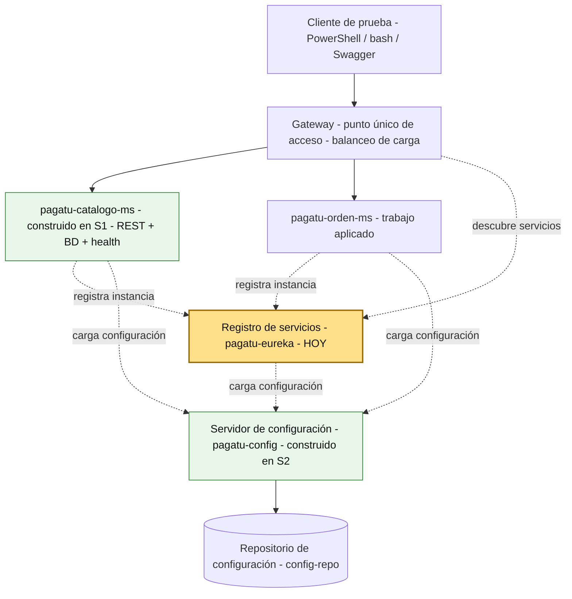
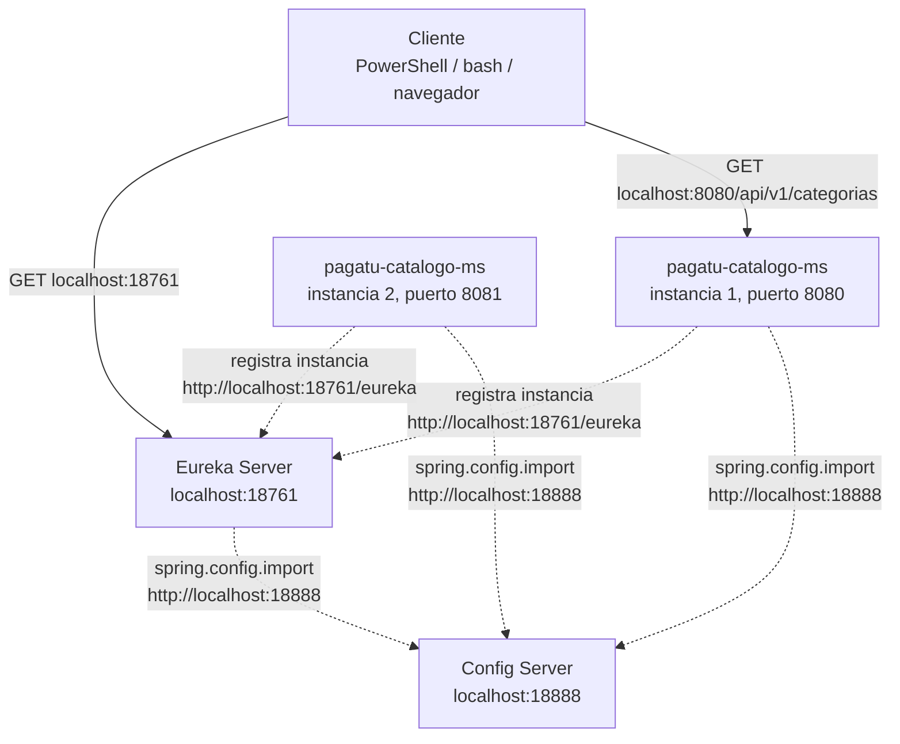
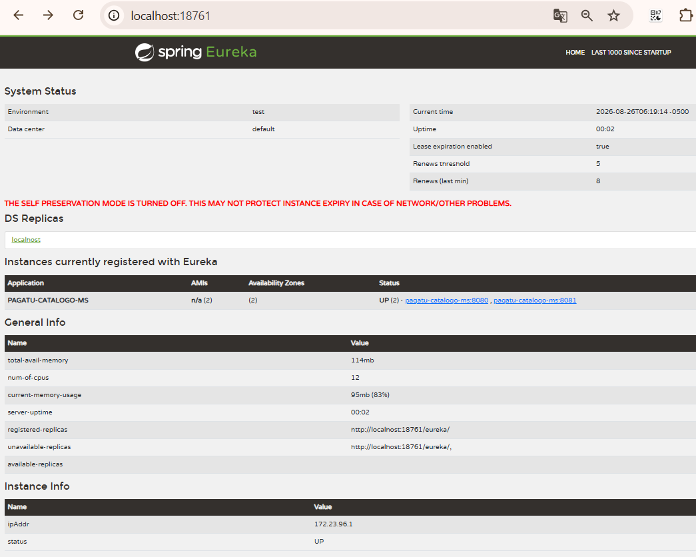

# S3 - Registro, Descubrimiento y Ejecución Concurrente de Servicios

*Por: Angel Sullon Macalupu @asullom - 2026*

## 1. Introducción

Tiempo: 20 min.

### 1.1 Presentación de la sesión

Hasta ahora, cualquier cliente que necesitaba llamar a un microservicio tenía que conocer de antemano su host y su puerto exactos — una URL fija, escrita a mano en la configuración. Eso funciona con un servicio y una instancia, pero deja de funcionar en cuanto aparece una segunda instancia del mismo servicio, o un servicio nuevo que nadie anticipó. Esta sesión resuelve exactamente eso: un servidor de registro donde cada microservicio anuncia su propia existencia al arrancar, y cualquier otro componente lo encuentra por nombre lógico, sin conocer su dirección de antemano — incluso cuando hay varias instancias corriendo a la vez.

### 1.2 Índice

1. Registro de servicios.
2. El patrón Service Registry en la arquitectura de microservicios.
3. Descubrimiento de servicios.
4. Ejecución concurrente de servicios.
5. Observabilidad de instancias registradas.

### 1.3 Propósito de aprendizaje

Al concluir la clase, estarás en condiciones de:

- **Incorporar** un servidor de registro y descubrimiento de servicios, conectar un microservicio como cliente, y verificar múltiples instancias activas del mismo servicio localizables por nombre lógico, sin que el cliente necesite conocer el puerto de cada una.

### 1.4 Producto de sesión

`pagatu-eureka` operativo en `infra/pagatu-eureka`, con `pagatu-catalogo-ms` registrado como cliente Eureka y ejecutando dos instancias simultáneas (puerto fijo `8080`/`8081`, igual que desde S1), visibles por nombre lógico en el dashboard — sin que ningún cliente necesite memorizar en qué puerto responde cada una. De forma opcional (según los recursos de cómputo disponibles), también Prometheus y Loki en pie en `infra/pagatu-observability`, recolectando métricas y logs de esas mismas instancias — Prometheus las encuentra preguntándole a `pagatu-eureka`, no por una lista de direcciones escrita a mano.

### 1.5 Metodología

**Tabla 1. Metodología de la sesión**

| Actividades a Realizar en el Periodo | Orientaciones generales (Orientaciones Metodológicas) | Material de estudio recomendado |
|---|---|---|
| Revisión previa individual | Confirmar que `pagatu-config` y `pagatu-catalogo-ms` (S2) siguen arrancando en DEV. Trabajo individual, antes de clase; identificar qué pasaría si `pagatu-catalogo-ms` necesitara dos instancias corriendo a la vez hoy mismo, con el puerto `8080` fijo que usa desde S1. | Evidencia individual de S2, `pagatu-catalogo-ms-dev.yml` actual. |
| Clase presencial | Construcción guiada de `pagatu-eureka` y conexión de `pagatu-catalogo-ms` como cliente, con dos instancias verificadas en el dashboard. Trabajo individual, siguiendo al docente paso a paso; consulta inmediata ante un servicio que no aparece registrado. Quien cuente con los recursos de cómputo puede continuar con Prometheus y Loki (3.10-3.14, opcional) y con producción local (3.15, opcional). | Pasos 3.1 a 3.9 de esta guía (3.10-3.15 son opcionales). |
| Evaluación formativa | Revisión en clase de `pagatu-eureka` respondiendo por HTTP y de dos instancias de `pagatu-catalogo-ms` visibles en el dashboard. La evidencia se completa y sustenta de forma individual, fuera del aula, según los criterios mínimos de la sección 4.4. | Indicaciones de entrega (4.3), rúbrica de evaluación (4.6). |

### 1.6 Motivación de la sesión

#### 1.6.1 Caso: el puerto que ya no alcanza

`pagatu-catalogo-ms` arranca hoy en el puerto `8080`, fijo — S1 (3.4.1) ya mostró que una segunda instancia necesita que alguien le pase `--server.port=8081` a mano, y que cualquier cliente que quiera repartir tráfico entre ambas tiene que conocer los dos puertos de antemano. Eso todavía es manejable con dos instancias de un solo servicio. El problema real aparece cuando el sistema crece: varios microservicios, cada uno con varias instancias, y nadie escribiendo a mano una lista de puertos que cambia cada vez que algo se reinicia, se cae o se agrega.

La solución no es "recordar mejor" las direcciones — es que ningún cliente necesite conocerlas: cada instancia se anuncia sola al arrancar, en un lugar único, con un nombre lógico (`pagatu-catalogo-ms`, no `localhost:8080`); quien la necesite pregunta por ese nombre, no por una dirección fija.

**Preguntas de análisis**

**Activación de conocimientos previos**

1. En S1 (3.4.1), la segunda instancia de `pagatu-catalogo-ms` necesitó un puerto distinto pasado a mano (`--server.port=8081`). ¿Qué tendría que hacer un cliente para repartir peticiones entre esa instancia y la original, hoy, sin ningún componente nuevo?

**Comprensión de registro y descubrimiento**

1. ¿Qué diferencia hay entre conocer la dirección de un servicio y conocer su nombre lógico?
2. Si dos instancias del mismo microservicio ya corren en puertos distintos (8080 y 8081), ¿qué falta para que un cliente no tenga que memorizar cuál es cuál?

### 1.7 Ubicación en el curso

- Unidad: U1 - Sistema distribuido base orientado a producción.
- Producto de unidad: sistema distribuido base funcional, configurable y preparado para múltiples instancias.
- Producto del curso: sistema distribuido de microservicios end-to-end, configurable, escalable, seguro, resiliente, consistente, observable, integrado con frontend y defendido técnicamente.
- Avance del producto en esta sesión: registro y descubrimiento de servicios operativo, con `pagatu-catalogo-ms` ejecutando múltiples instancias localizables por nombre lógico.

**Figura 1. Roadmap del producto de la unidad**



Hoy se construye `pagatu-eureka` y se conecta `pagatu-catalogo-ms` como cliente. `pagatu-orden-ms` (todavía sin Config Client ni Eureka Client) se conecta como trabajo autónomo (sección 4) — el mismo patrón, aplicado sobre el segundo microservicio.

## 2. Explica

Tiempo: 25 min.

### 2.1 Arquitectura de la sesión

**Figura 2. Registro y descubrimiento en DEV**



En DEV, los componentes principales corren con Maven en el host:

```text
Config Server: http://localhost:18888
Eureka Server: http://localhost:18761
Microservicios: puerto fijo por instancia (8080, 8081, ...)
```

Lectura del diagrama: el cliente ya no necesita saber en qué puerto responde `pagatu-catalogo-ms` — cada instancia se anuncia a `pagatu-eureka` al arrancar, y es Eureka quien resuelve el nombre lógico (`pagatu-catalogo-ms`) a una dirección real, en el momento en que alguien pregunta. La configuración de los tres componentes (incluido el propio `pagatu-eureka`) sigue viniendo de `pagatu-config`, exactamente como desde S2 — registro y configuración son dos preguntas distintas, a dos servidores distintos. Este diagrama es el mapa que guía el resto de la explicación: cada apartado siguiente desarrolla uno de sus componentes, en el mismo orden del Índice (1.2).

### 2.2 Registro de servicios

**Registro de servicios**: el componente (`pagatu-eureka`, un **Eureka Server**) donde cada microservicio anuncia su propia existencia al arrancar — nombre lógico, dirección real y un **heartbeat** (latido) periódico que confirma que la instancia sigue viva. Si una instancia deja de enviar heartbeat (latido) (se cayó, se apagó), Eureka la retira del registro después de un tiempo, sin que nadie tenga que notificarlo a mano.

**Error frecuente**: pensar que Eureka "descubre" servicios activamente, buscándolos en la red. Es al revés — cada instancia se registra por su cuenta, empujando la información hacia Eureka (*self-registration*); Eureka nunca sale a buscar quién está corriendo.

### 2.3 El patrón Service Registry en la arquitectura de microservicios

Lo construido en 2.2 no es una solución aislada de `pagatu` — es la implementación de **Service Registry** (también llamado *Service Discovery*), uno de los patrones de arquitectura de microservicios más conocidos. Según Rajput (2019), Eureka implementa este patrón como una base de datos de registro que permite que los microservicios se registren y se den de baja automáticamente, eliminando la necesidad de configurar endpoints de servicio de forma fija.

**Problema que resuelve:** en un sistema con varios microservicios, cada uno con varias instancias que pueden aparecer, moverse o desaparecer en cualquier momento, ningún cliente puede mantener a mano una lista actualizada de direcciones válidas. Codificar esas direcciones de forma fija hace que el sistema deje de tolerar cambios de escala sin intervención manual.

**Contexto en el que aplica:** sistemas distribuidos donde el número de instancias de un mismo servicio varía (por escalado, caídas o despliegues), y donde ningún cliente puede asumir una dirección fija de antemano.

**Cómo funciona:** cada instancia se registra a sí misma ante un servidor de registro al arrancar (*self-registration*, ya visto en 2.2) y renueva su registro periódicamente mediante *heartbeat* (latido). Quien necesita comunicarse con el servicio consulta al registro por su nombre lógico, en vez de guardar una dirección fija (*client-side* o *server-side discovery*, según quién resuelva la dirección — en esta sesión, cada cliente de Eureka la resuelve del lado del cliente).

**Casos de uso típicos:**

- Servicios que escalan horizontalmente, con instancias que aparecen y desaparecen sin aviso previo.
- Entornos donde las direcciones de red no son estables (contenedores, orquestadores, nube).
- Un Gateway o balanceador que necesita repartir tráfico entre todas las instancias vivas de un servicio (adelanto de S4).

**Trade-offs a considerar:**

- El propio servidor de registro se vuelve un componente crítico: si no está disponible, ningún cliente nuevo puede descubrir instancias (aunque las ya conectadas suelen seguir funcionando con lo último que resolvieron).
- Hay una ventana de tiempo entre que una instancia se cae y el registro deja de anunciarla (mientras vence su último *heartbeat* [latido]).

**Errores comunes al implementarlo:**

- Reutilizar el mismo puerto en dos instancias que deben correr a la vez sin coordinarlas (el error que evita asignar puertos distintos a mano en 2.5/3.9).
- Asumir que una instancia que aparece en el registro sigue necesariamente viva en este instante exacto — el registro refleja el último *heartbeat* (latido) recibido, no el estado en tiempo real.

*Nota.* Adaptado de *Implementing Microservice Registry with Eureka*, por D. Rajput, 2019, Dinesh on Java (<https://dineshonjava.com/implementing-microservice-registry-with-eureka/>). Fuente temporal mientras el catálogo de patrones de SACAViX System Design (<https://systemdesign.sacavix.com/patterns>), usado en S2, no vuelve a estar disponible.

`pagatu-eureka` es la implementación concreta de este patrón para el curso; en la Figura 2 ya se ve funcionando junto al resto del sistema.

### 2.4 Descubrimiento de servicios

**Descubrimiento de servicios**: la capacidad de encontrar una instancia real preguntando solo por su nombre lógico (`spring.application.name`, el mismo que ya identifica a cada microservicio en `pagatu-config` desde S2), sin conocer host ni puerto de antemano. Quien pregunta puede ser otro microservicio, o — a partir de S4 — el Gateway, que reparte tráfico entre todas las instancias que Eureka le devuelva para ese nombre.

El nombre lógico es literalmente el mismo dato que ya existe desde S2: `spring.application.name` identifica al microservicio ante `pagatu-config` (`/pagatu-catalogo-ms/dev`) y, desde hoy, también ante `pagatu-eureka` — un solo nombre, dos usos.

### 2.5 Ejecución concurrente de servicios

**Ejecución concurrente**: varias instancias del mismo microservicio corriendo a la vez, cada una anunciándose a Eureka bajo el mismo nombre lógico. En DEV, cada instancia sigue arrancando con un puerto fijo asignado a mano (`8080`, `8081`, ...) — el mismo mecanismo de S1 (3.4.1) —, porque varias instancias comparten el mismo host y necesitan puertos distintos para no chocar entre sí. Lo que cambia hoy no es cómo se elige el puerto, sino que ya nadie fuera de la propia instancia necesita conocerlo: cada una se registra con su dirección real, y quien la busca pregunta por el nombre lógico, no por el puerto.

**Tabla 2. Antes (S1-S2) vs. hoy: cómo se identifica una instancia**

| | Antes (S1-S2) | Hoy (con Eureka) |
|---|---|---|
| Segunda instancia | Necesita `--server.port=8081` a mano (S1, 3.4.1) | Mismo mecanismo: puerto distinto a mano (3.9) |
| Cómo la encuentra un cliente | Conociendo el puerto exacto de antemano | Preguntando a Eureka por el nombre lógico `pagatu-catalogo-ms` |
| Qué pasa si se cae | El cliente sigue intentando la misma dirección, sin saber que ya no responde | Eureka deja de devolverla después de perder su heartbeat (latido) |

**Error frecuente**: pensar que Eureka exige puertos asignados automáticamente por el sistema operativo. No es así — lo que exige es que cada instancia tenga un puerto *distinto*, elegido de la forma que sea (a mano en DEV, aislado por contenedor en PROD); lo nuevo es que ese puerto deja de ser algo que el cliente necesita memorizar.

### 2.6 Observabilidad de instancias registradas

Quien consulta el registro de Eureka no tiene que ser otro microservicio del negocio. Cualquier herramienta de monitoreo puede usar el mismo registro como fuente de descubrimiento — para saber qué instancias existen y dónde recolectar sus métricas y registros de actividad (*logs*), sin que nadie mantenga a mano una lista de direcciones que cambia cada vez que se agrega o se cae una instancia. Es el mismo mecanismo de descubrimiento de 2.4, aplicado a un consumidor distinto del registro: no un microservicio que atiende peticiones de negocio, sino una herramienta que observa al resto del sistema desde afuera.

En esta sesión, esa idea se aplica de forma opcional (3.10-3.14) con dos herramientas concretas — **Prometheus** para métricas y **Loki** para logs, ambas descubriendo instancias vía `pagatu-eureka` — pero el concepto no depende de esas dos herramientas específicas: cualquier sistema de observabilidad que sepa consultar un registro de servicios puede aprovechar el mismo mecanismo.

## 3. Aplica: actividad práctica guiada

Tiempo: 2h.

**Actividad:** construcción de `pagatu-eureka` y conexión de `pagatu-catalogo-ms` como cliente, verificado con dos instancias simultáneas en el dashboard (Producto de la sesión en 1.4).

**Propósito de la actividad:** que cada estudiante levante un servidor de registro real, conecte un microservicio existente como cliente, y verifique — con evidencia, no de memoria — que dos instancias del mismo servicio son localizables por nombre lógico.

**Orientaciones metodológicas:** el docente guía la construcción de `pagatu-eureka` y la conexión de `pagatu-catalogo-ms` paso a paso frente a la clase; los estudiantes replican cada paso en su propio equipo, verificando el dashboard antes de avanzar al siguiente paso.

**Actividades para realizar:**

- **3.1** Verificar el punto de partida.
- **3.2** Crear el proyecto `pagatu-eureka`.
- **3.3** Habilitar Eureka Server.
- **3.4** Configurar `pagatu-eureka` como Config Client.
- **3.5** Crear la configuración de `pagatu-eureka` en `config-repo`.
- **3.6** Probar `pagatu-eureka` en DEV.
- **3.7** Conectar `pagatu-catalogo-ms` como cliente Eureka.
- **3.8** Levantar `pagatu-catalogo-ms` y verificar el registro.
- **3.9** Levantar una segunda instancia y verificar múltiples instancias.
- **3.10** Exponer métricas de `pagatu-catalogo-ms` para Prometheus (opcional).
- **3.11** Crear `pagatu-observability` con Prometheus (descubrimiento vía Eureka) (opcional).
- **3.12** Verificar targets descubiertos y métricas recolectadas (opcional).
- **3.13** Enviar logs de `pagatu-catalogo-ms` a Loki (opcional).
- **3.14** Verificar logs en Loki (opcional).
- **3.15** Registro y observabilidad en producción local (opcional).

### 3.1 Verificar el punto de partida

**Punto de partida común:** todo el equipo debe comenzar exactamente desde el mismo estado, no desde su propio avance individual. Clona la rama `s02-configuracion-centralizada` (el snapshot de cierre de S2 — incluye `pagatu-config` y `pagatu-catalogo-ms` migrado a Config Client):

```bash
git clone --branch s02-configuracion-centralizada https://github.com/262dist/pagatu.git
```

**Producto del paso:** confirmación de que `pagatu-config` y `pagatu-catalogo-ms` siguen funcionando en DEV, antes de tocar código nuevo.

**Requisito antes de continuar:**

```powershell
cd infra/pagatu-config
.\mvnw.cmd spring-boot:run
```

En otra terminal:

```powershell
cd services/pagatu-catalogo-ms
docker compose -f compose-dev.yml up -d
.\mvnw.cmd spring-boot:run
```

Confirma que `http://localhost:8080/actuator/health` responde `UP`, con configuración recibida desde `pagatu-config`. Si falla, el problema es anterior a esta sesión (S1-S2), no de los pasos 3.2 en adelante.

### 3.2 Crear el proyecto `pagatu-eureka`

**Producto del paso:** proyecto Spring Boot `pagatu-eureka` creado dentro de `infra/pagatu-eureka`.

Desde VS Code, usa Spring Initializr (`Spring Initializr: Create a Maven Project`):

**Tabla 3. Configuración del proyecto `pagatu-eureka` en Spring Initializr**

| Campo | Valor |
|---|---|
| Project | Maven Project |
| Spring Boot | **4.0.7** |
| Language | Java |
| Group Id | `pe.edu.upeu` |
| Artifact Id | `pagatu-eureka` |
| Package name | `pe.edu.upeu.eureka` |
| Packaging | Jar |
| Java | 21 |
| Ubicación sugerente | `infra/pagatu-eureka` |

Dependencias a seleccionar:

**Tabla 4. Dependencias del proyecto `pagatu-eureka`**

| Grupo | Dependencias | Propósito |
|---|---|---|
| Spring Cloud | Eureka Server | Registro y descubrimiento de servicios |
| Spring Cloud | Config Client | Leer configuración desde `pagatu-config` |
| Ops | Spring Boot Actuator | Verificar health de `pagatu-eureka` |
| Productividad | Spring Boot DevTools | Facilitar ejecución en desarrollo |

En `pom.xml`, la dependencia clave:

```xml
<dependency>
    <groupId>org.springframework.cloud</groupId>
    <artifactId>spring-cloud-starter-netflix-eureka-server</artifactId>
</dependency>
```

Mismo BOM de Spring Cloud que ya usa `pagatu-config` (S2, 3.3) — **Spring Cloud 2025.1.2** (*Oakwood*):

```xml
<properties>
    <java.version>21</java.version>
    <spring-cloud.version>2025.1.2</spring-cloud.version>
</properties>

<dependencyManagement>
    <dependencies>
        <dependency>
            <groupId>org.springframework.cloud</groupId>
            <artifactId>spring-cloud-dependencies</artifactId>
            <version>${spring-cloud.version}</version>
            <type>pom</type>
            <scope>import</scope>
        </dependency>
    </dependencies>
</dependencyManagement>
```

### 3.3 Habilitar Eureka Server

**Producto del paso:** aplicación Spring Boot marcada como servidor de registro.

```java
package pe.edu.upeu.eureka;

import org.springframework.boot.SpringApplication;
import org.springframework.boot.autoconfigure.SpringBootApplication;
import org.springframework.cloud.netflix.eureka.server.EnableEurekaServer;

@SpringBootApplication
@EnableEurekaServer
public class PagatuEurekaApplication {

    public static void main(String[] args) {
        SpringApplication.run(PagatuEurekaApplication.class, args);
    }
}
```

### 3.4 Configurar `pagatu-eureka` como Config Client

**Producto del paso:** `pagatu-eureka` preparado para leer su propia configuración desde `pagatu-config` — el mismo patrón que ya sigue `pagatu-catalogo-ms` desde S2, aplicado ahora a este componente nuevo.

En `infra/pagatu-eureka/src/main/resources/application.yml`:

```yaml
spring:
  application:
    name: pagatu-eureka
  profiles:
    active: dev
  config:
    import: "optional:configserver:${CONFIG_SERVER_URL:http://localhost:18888}"
```

`pagatu-eureka` no es una excepción al patrón de S2 — es la confirmación de que cualquier componente nuevo del sistema, incluida la propia infraestructura, consulta `pagatu-config` de la misma forma.

### 3.5 Crear la configuración de `pagatu-eureka` en `config-repo`

**Producto del paso:** `pagatu-eureka-dev.yml` y `pagatu-eureka-prod.yml` creados en `config-repo`.

**`infra/pagatu-config/config-repo/pagatu-eureka-dev.yml`**

```yaml
server:
  port: 18761

eureka:
  server:
    enable-self-preservation: false
  instance:
    hostname: localhost
  client:
    register-with-eureka: false
    fetch-registry: false
    service-url:
      defaultZone: http://localhost:18761/eureka/

management:
  endpoints:
    web:
      exposure:
        include: health,info,metrics
  endpoint:
    health:
      show-details: always
```

**Error frecuente**: sin `service-url.defaultZone` propio, la sección "General Info" del dashboard (`registered-replicas`, `unavailable-replicas`) muestra un valor de relleno del framework — `http://localhost:8761/eureka/`, el puerto por defecto de Eureka, **sin** el prefijo `1` de DEV — aunque `pagatu-eureka` esté corriendo en `18761`. No afecta el funcionamiento (con `register-with-eureka`/`fetch-registry` en `false`, ese valor no se usa para nada real, es solo informativo), pero declarar `service-url.defaultZone` con el puerto correcto evita la confusión y mantiene la convención de puertos (1 = DEV, 2 = PROD) también en esta pantalla.

**Error frecuente**: por la misma razón que en 3.7 (el hostname `algo.mshome.net` en vez de `localhost`), la sección "Instance Info" del propio `pagatu-eureka` puede mostrar un `ipAddr` como `172.23.96.1` — la IP del adaptador de red virtual que crea Docker Desktop/WSL2 en Windows. `eureka.instance.hostname` e `ip-address` son propiedades **independientes**: fijar el hostname no cambia esa IP. A propósito **se deja sin fijar**: el `ipAddr` queda dinámico, autodetectado según la IP real de cada máquina — solo `hostname: localhost` se fuerza, para que los enlaces del dashboard sean consistentes entre estudiantes; el `ipAddr` mostrado en "Instance Info" no afecta el funcionamiento, es solo información de `pagatu-eureka` sobre sí mismo y puede variar de una laptop a otra sin problema.

**Error frecuente**: con solo 1 o 2 instancias registradas, el dashboard de Eureka suele mostrar un banner rojo de "EMERGENCY! EUREKA MAY BE INCORRECTLY CLAIMING INSTANCES ARE UP WHEN THEY'RE NOT..." — es el modo de **autopreservación**: Eureka espera un mínimo de *heartbeats* (latidos) por minuto según el número de instancias registradas, y con tan pocas instancias casi siempre cae por debajo del umbral, aunque todo funcione bien. `enable-self-preservation: false` lo desactiva **solo en DEV**, donde el número de instancias es deliberadamente bajo; en PROD (real o local) esta protección se deja activada, porque ahí sí cumple su función — evitar que una partición de red temporal des-registre instancias que en realidad siguen vivas.

Con `enable-self-preservation: false`, el dashboard va a mostrar en su lugar un banner distinto: "THE SELF PRESERVATION MODE IS TURNED OFF...". Ese es solo informativo, no una alarma — confirma que la protección está apagada a propósito. **No lo vuelvas a `true` en DEV**: si lo haces, al detener una instancia con Ctrl+C en 3.9, es probable que Eureka entre en autopreservación (por el bajo número de instancias) y la deje listada como `UP` sin expirarla nunca — justo lo contrario de lo que pide verificar la Tabla 5.

**`infra/pagatu-config/config-repo/pagatu-eureka-prod.yml`**

```yaml
server:
  port: 8761

eureka:
  client:
    register-with-eureka: false
    fetch-registry: false
    service-url:
      defaultZone: http://pagatu-eureka:8761/eureka/

management:
  endpoints:
    web:
      exposure:
        include: health,info,metrics
  endpoint:
    health:
      show-details: never
```

`register-with-eureka: false` y `fetch-registry: false` porque `pagatu-eureka` es el propio servidor de registro — no tiene sentido que se registre a sí mismo como si fuera un cliente más.

### 3.6 Probar `pagatu-eureka` en DEV

**Producto del paso:** `pagatu-eureka` ejecutando en `localhost:18761`, con configuración recibida desde `pagatu-config`.

Con `pagatu-config` ya ejecutando (3.1):

```powershell
cd infra/pagatu-eureka
.\mvnw.cmd spring-boot:run
```

Verifica:

PowerShell:

```powershell
Invoke-RestMethod -Method Get -Uri "http://localhost:18761/actuator/health"
```

bash macOS/Linux:

```bash
curl http://localhost:18761/actuator/health
```

Abre el dashboard en el navegador:

```text
http://localhost:18761
```

Resultado esperado: el dashboard carga, con la sección "Instances currently registered with Eureka" vacía todavía — nada se ha conectado como cliente hasta este punto.

### 3.7 Conectar `pagatu-catalogo-ms` como cliente Eureka

**Producto del paso:** `pagatu-catalogo-ms` preparado para registrarse en `pagatu-eureka`, manteniendo puerto fijo en DEV (igual que desde S1).

**1. Agregar la dependencia de Eureka Client** en `services/pagatu-catalogo-ms/pom.xml` (la versión y el BOM de Spring Cloud ya están ahí desde S2, 3.9):

```xml
<dependency>
    <groupId>org.springframework.cloud</groupId>
    <artifactId>spring-cloud-starter-netflix-eureka-client</artifactId>
</dependency>
```

**2. Agregar la configuración de Eureka en `config-repo/pagatu-catalogo-ms-dev.yml`** (junto a lo que ya existe desde S2 — `server.port: 8080` se queda tal cual está, no se toca):

```yaml
eureka:
  instance:
    hostname: localhost
    instance-id: ${spring.application.name}:${server.port}
  client:
    service-url:
      defaultZone: http://localhost:18761/eureka
```

En DEV seguimos con puerto fijo, igual que desde S1 — lo único nuevo es que ahora ese puerto (`instance-id`) queda anunciado a `pagatu-eureka`. Para la segunda instancia (3.9) se sigue el mismo mecanismo ya usado en S1 (3.4.1): pasar un puerto distinto por línea de comandos (`--server.port=8081`), no un puerto asignado al azar.

**Error frecuente**: olvidar el override de puerto al levantar la segunda instancia. Sin `--server.port=8081`, la segunda instancia intenta usar el mismo `8080` fijo de `config-repo` y no llega a arrancar (`Address already in use`).

**Error frecuente**: sin `hostname: localhost`, Eureka registra cada instancia con el nombre de red que reporte el sistema operativo — en Windows, muchas veces algo como `tu-usuario.mshome.net` (el dominio que asigna la red virtual de Docker Desktop/WSL2), no `localhost`. El enlace del dashboard sigue funcionando porque ese nombre resuelve a la propia máquina, pero cambia de un equipo a otro — fijar `hostname: localhost` hace que el enlace sea el mismo, predecible, en cualquier laptop del curso.

**3. Agregar la configuración equivalente en `config-repo/pagatu-catalogo-ms-prod.yml`:**

```yaml
eureka:
  instance:
    instance-id: ${spring.application.name}:${random.value}
  client:
    service-url:
      defaultZone: http://pagatu-eureka:8761/eureka
```

En PROD local, a diferencia de DEV, el `instance-id` sí necesita un componente aleatorio (`${random.value}`): con `docker compose --scale`, todas las réplicas comparten el mismo `server.port` fijo dentro de su propio contenedor — sin ese valor aleatorio, dos réplicas se registrarían con el mismo `instance-id` y Eureka las trataría como una sola.

### 3.8 Levantar `pagatu-catalogo-ms` y verificar el registro

**Producto del paso:** `pagatu-catalogo-ms` visible en el dashboard de `pagatu-eureka`, respondiendo en el puerto fijo de siempre (`8080`).

Con `pagatu-config` y `pagatu-eureka` ya ejecutando (3.1, 3.6):

```powershell
cd services/pagatu-catalogo-ms
.\mvnw.cmd spring-boot:run
```

Abre el dashboard:

```text
http://localhost:18761
```

Resultado esperado: aparece `PAGATU-CATALOGO-MS` en "Instances currently registered with Eureka", con un `Status` de `UP` y una dirección que incluye el puerto `8080`.

Verifica que el CRUD de S1-S2 sigue funcionando, en el mismo puerto de siempre:

PowerShell:

```powershell
Invoke-RestMethod -Method Get -Uri "http://localhost:8080/api/v1/categorias"
```

bash macOS/Linux:

```bash
curl http://localhost:8080/api/v1/categorias
```

### 3.9 Levantar una segunda instancia y verificar múltiples instancias

**Producto del paso:** dos instancias de `pagatu-catalogo-ms` registradas a la vez, cada una en su propio puerto fijo (`8080` y `8081`).

En otra terminal, sin detener la primera instancia, pasa un puerto distinto por línea de comandos (mismo mecanismo de S1, 3.4.1):

```powershell
cd services/pagatu-catalogo-ms
.\mvnw.cmd spring-boot:run "-Dspring-boot.run.arguments=--server.port=8081"
```

Refresca el dashboard:

```text
http://localhost:18761
```

Resultado esperado: `PAGATU-CATALOGO-MS` ahora lista **dos** direcciones distintas, `localhost:8080` y `localhost:8081` — el mismo nombre lógico, dos instancias con puerto fijo conocido de antemano, cada una anunciada a Eureka.

**Figura 3. Dashboard de Eureka con `pagatu-catalogo-ms` en dos instancias**



**Tabla 5. Verificación de múltiples instancias antes de continuar**

| Verificación | Resultado esperado |
|---|---|
| Consola de arranque de cada instancia | Una en `8080`, la otra en `8081` |
| Dashboard de `pagatu-eureka` | Dos entradas para `PAGATU-CATALOGO-MS`, ambas `UP` |
| `GET /api/v1/categorias` contra `8080` y contra `8081` | `200 OK` en ambas instancias, de forma independiente |
| Detener una instancia (Ctrl+C) | Tras perder su heartbeat (latido), esa entrada desaparece del dashboard sin intervención manual |

### 3.10 Exponer métricas de `pagatu-catalogo-ms` para Prometheus

!!! note "3.10 a 3.14 son opcionales"
    El alcance evaluado de S3 termina en 3.9 (dos instancias de `pagatu-catalogo-ms` registradas en DEV, 2.2-2.4). Levantar Prometheus, Loki y Promtail junto con Eureka, dos instancias de `pagatu-catalogo-ms` y `pagatu-config` a la vez puede exigir más memoria y CPU de la que tiene la laptop de un estudiante — por eso estos cinco pasos quedan como contenido adicional, no como requisito para cerrar la sesión ni para la evaluación (4.4, 4.6). Quien pueda completarlos, sustenta la aplicación práctica de 2.3 (Service Registry aplicado a un consumidor distinto del registro) con evidencia real, no solo en teoría.

**Producto del paso:** `pagatu-catalogo-ms` exponiendo un endpoint de métricas en formato Prometheus.

Agrega la dependencia en `services/pagatu-catalogo-ms/pom.xml`:

```xml
<dependency>
    <groupId>io.micrometer</groupId>
    <artifactId>micrometer-registry-prometheus</artifactId>
    <scope>runtime</scope>
</dependency>
```

En `config-repo/pagatu-catalogo-ms-dev.yml`, agrega `prometheus` a los endpoints ya expuestos desde S1:

```yaml
management:
  endpoints:
    web:
      exposure:
        include: health,info,metrics,prometheus
```

Reinicia ambas instancias de `pagatu-catalogo-ms` (3.8, 3.9) y verifica, contra `8080` y contra `8081`:

PowerShell:

```powershell
Invoke-RestMethod -Method Get -Uri "http://localhost:8080/actuator/prometheus"
```

bash macOS/Linux:

```bash
curl http://localhost:8080/actuator/prometheus
```

Resultado esperado: una respuesta en texto plano, con métricas como `process_uptime_seconds` o `http_server_requests_seconds_count`.

### 3.11 Crear `pagatu-observability` con Prometheus (descubrimiento vía Eureka)

**Producto del paso:** Prometheus corriendo en Docker, configurado para descubrir instancias preguntándole a `pagatu-eureka` — no con una lista de direcciones escrita a mano.

Crea `infra/pagatu-observability/prometheus/prometheus.yml`:

```yaml
global:
  scrape_interval: 15s

scrape_configs:
  - job_name: "pagatu-microservicios"
    eureka_sd_configs:
      - server: "http://host.docker.internal:18761/eureka"
    metrics_path: "/actuator/prometheus"
    relabel_configs:
      - source_labels: [__meta_eureka_app_name]
        target_label: application
```

`eureka_sd_configs` es la pieza clave: Prometheus consulta el registro de `pagatu-eureka` igual que lo haría cualquier otro cliente de descubrimiento (2.6), y ajusta su lista de *targets* automáticamente cada vez que una instancia aparece o desaparece del registro.

Crea `infra/pagatu-observability/compose-dev.yml`:

```yaml
services:
  pagatu-prometheus:
    image: prom/prometheus:latest
    container_name: pagatu-prometheus
    restart: unless-stopped
    ports:
      - "19090:9090"
    volumes:
      - ./prometheus/prometheus.yml:/etc/prometheus/prometheus.yml:ro
    extra_hosts:
      - "host.docker.internal:host-gateway"
```

`extra_hosts` con `host-gateway` es necesario en Linux para que `host.docker.internal` resuelva al host — en Docker Desktop (Windows/macOS) ya funciona sin esa línea, pero dejarla no daña nada.

Levanta el contenedor:

```bash
cd infra/pagatu-observability
docker compose -f compose-dev.yml up -d
```

### 3.12 Verificar targets descubiertos y métricas recolectadas

**Producto del paso:** confirmación de que Prometheus descubrió, por su cuenta, las dos instancias de `pagatu-catalogo-ms` ya registradas en Eureka (3.9).

Abre en el navegador:

```text
http://localhost:19090/targets
```

Resultado esperado: dos *targets* bajo el job `pagatu-microservicios`, uno por instancia de `pagatu-catalogo-ms`, ambos en estado `UP` — ninguno escrito a mano en `prometheus.yml`.

**Tabla 6. Verificación de observabilidad antes de continuar**

| Verificación | Resultado esperado |
|---|---|
| `GET /actuator/prometheus` en cada instancia | Métricas en texto plano, `200 OK` |
| `http://localhost:19090/targets` | Dos targets `pagatu-microservicios`, ambos `UP`, sin configuración manual de direcciones |
| Detener una instancia de `pagatu-catalogo-ms` | El target correspondiente pasa a `DOWN` tras el siguiente scrape, sin editar `prometheus.yml` |

**Error frecuente**: si los targets aparecen en `0/0` o vacíos, la causa más común es que `host.docker.internal` no resuelve desde el contenedor de Prometheus — revisa `extra_hosts` en `compose-dev.yml`, o reemplaza temporalmente por la IP real del host en `prometheus.yml` para descartar el problema.

### 3.13 Enviar logs de `pagatu-catalogo-ms` a Loki

**Producto del paso:** Promtail leyendo los logs que `pagatu-catalogo-ms` ya escribe a archivo desde S1, y enviándolos a Loki.

`pagatu-catalogo-ms` ya escribe a archivo desde S1 (3.3.2, `logback-spring.xml`) — no hace falta agregar nada a `config-repo` para esto: `logging.file.name` no tendría efecto aquí, porque el `logback-spring.xml` del proyecto fija la ruta del archivo directamente (`logs/catalogo.log`), sin usar esa propiedad. Ambas instancias (3.8, 3.9) ya escriben, por simplicidad, al mismo archivo dentro de `services/pagatu-catalogo-ms/logs/` — el que arma cada noche `logs/catalogo.log` (el activo) y lo rota a `logs/catalogo-AAAA-MM-DD.log` (histórico, hasta 7 días).

Crea `infra/pagatu-observability/promtail/promtail-config.yml`:

```yaml
server:
  http_listen_port: 9080

positions:
  filename: /tmp/positions.yaml

clients:
  - url: http://pagatu-loki:3100/loki/api/v1/push

scrape_configs:
  - job_name: pagatu-catalogo-ms
    static_configs:
      - targets: [localhost]
        labels:
          application: pagatu-catalogo-ms
          __path__: /var/log/pagatu-catalogo-ms/*.log
```

Agrega Loki y Promtail a `infra/pagatu-observability/compose-dev.yml` (junto a `pagatu-prometheus`, 3.11):

```yaml
  pagatu-loki:
    image: grafana/loki:latest
    container_name: pagatu-loki
    restart: unless-stopped
    ports:
      - "13100:3100"

  pagatu-promtail:
    image: grafana/promtail:latest
    container_name: pagatu-promtail
    restart: unless-stopped
    volumes:
      - ./promtail/promtail-config.yml:/etc/promtail/config.yml:ro
      - ../../services/pagatu-catalogo-ms/logs:/var/log/pagatu-catalogo-ms:ro
    command: -config.file=/etc/promtail/config.yml
    depends_on:
      - pagatu-loki
```

Vuelve a levantar el stack con el archivo actualizado:

```bash
cd infra/pagatu-observability
docker compose -f compose-dev.yml up -d
```

**Error frecuente**: si ambas instancias de `pagatu-catalogo-ms` corren desde la misma carpeta `services/pagatu-catalogo-ms`, comparten el mismo archivo de log — las líneas de las dos instancias quedan entremezcladas en `catalogo.log`. Para esta sesión es una simplificación aceptada; no es necesario separar los archivos por instancia.

### 3.14 Verificar logs en Loki

**Producto del paso:** confirmación de que los logs de `pagatu-catalogo-ms` llegan a Loki, sin revisar el archivo local a mano.

Consulta directamente a Loki (reemplaza el rango de tiempo si tu consulta no devuelve nada):

PowerShell:

```powershell
Invoke-RestMethod -Method Get -Uri "http://localhost:13100/loki/api/v1/query_range?query={application=`"pagatu-catalogo-ms`"}"
```

bash macOS/Linux:

```bash
curl -G http://localhost:13100/loki/api/v1/query_range --data-urlencode 'query={application="pagatu-catalogo-ms"}'
```

Resultado esperado: una respuesta JSON con líneas de log reales de `pagatu-catalogo-ms` (por ejemplo, el mensaje de arranque de Tomcat en el puerto `8080` u `8081`).

### 3.15 Registro y observabilidad en producción local (opcional)

!!! note "3.15 es opcional"
    El alcance evaluado de S3 termina en 3.9 (dos instancias de `pagatu-catalogo-ms` registradas en DEV, 2.2-2.4) — igual que 3.10 a 3.14 (Prometheus/Loki), producción local con Docker es contenido adicional, no un requisito para cerrar la sesión ni para la evaluación (4.4, 4.6).

**Producto del paso:** `pagatu-eureka` y `pagatu-catalogo-ms` operativos en Docker, dentro de la misma red compartida ya establecida en S2 (`pagatu-prod-net`) — y, opcionalmente, Prometheus y Loki descubriendo esas mismas instancias en ese mismo ambiente.

Agrega `pagatu-eureka` a `infra/compose.yml` (junto a `pagatu-config`, S2 3.11):

```yaml
  pagatu-eureka:
    build:
      context: ./pagatu-eureka
      dockerfile: Dockerfile
    container_name: pagatu-eureka
    restart: unless-stopped
    ports:
      - "28761:8761"
    environment:
      SPRING_PROFILES_ACTIVE: prod
      CONFIG_SERVER_URL: http://pagatu-config:8888
    networks:
      - pagatu-prod-net
```

`infra/pagatu-eureka/Dockerfile` (mismo patrón multi-stage que `pagatu-config`, S2 3.11).

Levanta infraestructura y microservicio, en ese orden (mismo criterio de S2, 3.12):

```bash
cd infra
docker compose up -d --build
docker compose ps
```

```bash
cd ../services/pagatu-catalogo-ms
docker compose up -d --build --scale pagatu-catalogo-ms=2
```

Verifica:

```powershell
Invoke-RestMethod -Method Get -Uri "http://localhost:28761/actuator/health"
```

```text
http://localhost:28761
```

Resultado esperado: `pagatu-eureka` responde en `28761`, y las instancias de `pagatu-catalogo-ms` aparecen registradas usando `http://pagatu-eureka:8761/eureka` (la URL interna de la red Docker, no la de host).

**Prometheus y Loki en producción local**

Este bloque es la versión en PROD de 3.10-3.14 — mismas dos herramientas, con una diferencia clave: en PROD, Prometheus y Loki no le hablan a `host.docker.internal`, sino directamente al nombre del servicio dentro de `pagatu-prod-net` (`pagatu-eureka`), igual que ya hace `pagatu-catalogo-ms` para su propia configuración (S2, 3.12).

**1. Agregar el volumen de logs a `services/pagatu-catalogo-ms/compose.yml`**, para que Promtail pueda leerlos desde otro contenedor. El `logback-spring.xml` del proyecto (S1, 3.3.2) ya escribe a `logs/catalogo.log`, una ruta relativa al `WORKDIR` del `Dockerfile` (`/app`, S1 3.6.1) — el volumen se monta ahí, en `/app/logs`, no en una ruta inventada:

```yaml
  pagatu-catalogo-ms:
    volumes:
      - pagatu-catalogo-logs:/app/logs

volumes:
  pagatu-catalogo-logs:
    name: pagatu-catalogo-logs
```

No hace falta tocar `config-repo/pagatu-catalogo-ms-prod.yml` — igual que en DEV (3.13), `logging.file.name` no tendría efecto porque `logback-spring.xml` ya fija la ruta del archivo directamente.

**2. Crear `infra/pagatu-observability/prometheus/prometheus-prod.yml`:**

```yaml
global:
  scrape_interval: 15s

scrape_configs:
  - job_name: "pagatu-microservicios"
    eureka_sd_configs:
      - server: "http://pagatu-eureka:8761/eureka"
    metrics_path: "/actuator/prometheus"
    relabel_configs:
      - source_labels: [__meta_eureka_app_name]
        target_label: application
```

**3. Crear `infra/pagatu-observability/promtail/promtail-config-prod.yml`:**

```yaml
server:
  http_listen_port: 9080

positions:
  filename: /tmp/positions.yaml

clients:
  - url: http://pagatu-loki:3100/loki/api/v1/push

scrape_configs:
  - job_name: pagatu-catalogo-ms
    static_configs:
      - targets: [localhost]
        labels:
          application: pagatu-catalogo-ms
          __path__: /app/logs/*.log
```

**4. Crear `infra/pagatu-observability/compose-prod.yml`:**

```yaml
services:
  pagatu-prometheus:
    image: prom/prometheus:latest
    container_name: pagatu-prometheus
    restart: unless-stopped
    ports:
      - "29090:9090"
    volumes:
      - ./prometheus/prometheus-prod.yml:/etc/prometheus/prometheus.yml:ro
    networks:
      - pagatu-prod-net

  pagatu-loki:
    image: grafana/loki:latest
    container_name: pagatu-loki
    restart: unless-stopped
    ports:
      - "23100:3100"
    networks:
      - pagatu-prod-net

  pagatu-promtail:
    image: grafana/promtail:latest
    container_name: pagatu-promtail
    restart: unless-stopped
    volumes:
      - ./promtail/promtail-config-prod.yml:/etc/promtail/config.yml:ro
      - pagatu-catalogo-logs:/app/logs:ro
    command: -config.file=/etc/promtail/config.yml
    depends_on:
      - pagatu-loki
    networks:
      - pagatu-prod-net

networks:
  pagatu-prod-net:
    external: true

volumes:
  pagatu-catalogo-logs:
    external: true
```

`pagatu-catalogo-logs` se declara `external: true` porque el volumen ya existe — lo creó `services/pagatu-catalogo-ms/compose.yml` en el paso 1; este archivo solo se conecta a él, mismo patrón ya usado para `pagatu-prod-net` (S2, 3.11).

Reconstruye `pagatu-catalogo-ms` (para que tome el volumen nuevo) y levanta el stack de observabilidad:

```bash
cd services/pagatu-catalogo-ms
docker compose up -d --build --scale pagatu-catalogo-ms=2

cd ../../infra/pagatu-observability
docker compose -f compose-prod.yml up -d
```

Verifica:

```text
http://localhost:29090/targets
```

```powershell
Invoke-RestMethod -Method Get -Uri "http://localhost:23100/loki/api/v1/query_range?query={application=`"pagatu-catalogo-ms`"}"
```

Resultado esperado: mismo comportamiento que en DEV (3.12, 3.14) — targets descubiertos automáticamente vía Eureka, y logs de ambas réplicas consultables en Loki (recuerda que, igual que en DEV, ambas réplicas comparten el mismo archivo de log dentro del volumen).

Al terminar, baja los tres entornos en orden inverso (mismo patrón de S2, 3.14):

```bash
cd infra/pagatu-observability
docker compose -f compose-prod.yml down

cd ../../services/pagatu-catalogo-ms
docker compose down

cd ../../infra
docker compose down
```

**Evidencia de aprendizaje:**

- `pagatu-eureka` operativo en DEV, leyendo su configuración desde `pagatu-config`.
- `pagatu-catalogo-ms` registrado con puerto fijo, visible en el dashboard.
- Dos instancias simultáneas de `pagatu-catalogo-ms`, verificadas de forma independiente.
- (Opcional) Prometheus y Loki recolectando métricas y logs de esas instancias en DEV, descubiertas vía Eureka.
- (Opcional) `pagatu-eureka` y `pagatu-catalogo-ms` operativos también en producción local, con Prometheus y Loki replicando el mismo comportamiento vía el nombre de servicio `pagatu-eureka`.

## 4. Crea: actividad autónoma

Tiempo: 3h fuera del aula.

### 4.1 Actividad

Conexión autónoma de `pagatu-orden-ms` al sistema de registro y descubrimiento, documentada en evidencia individual.

`pagatu-orden-ms` todavía no tiene Config Client (S2 lo dejó como trabajo autónomo) ni Eureka Client — este trabajo autónomo hace las dos cosas juntas, en el mismo orden en que ya se hicieron para `pagatu-catalogo-ms` (S2 y S3, respectivamente). Si tu equipo ya migró `pagatu-orden-ms` a Config Client como parte del trabajo autónomo de S2, salta directo al paso 3 de la lista siguiente.

Completa y evidencia estas tareas:

1. Migrar `pagatu-orden-ms` a Config Client (mismo patrón de S2, 3.9): mover `application-dev.yml`/`application-prod.yml` a `config-repo` como `orden-ms-dev.yml`/`orden-ms-prod.yml`, y dejar `application.yml` minimalista.
2. Verificar por HTTP que `pagatu-config` entrega la configuración de `orden-ms` en `dev` y en `prod`.
3. Agregar Eureka Client a `pagatu-orden-ms`, manteniendo su puerto fijo de DEV (`orden-ms-dev.yml`) tal como quedó en el paso 1 — mismo patrón de 3.7, `instance-id: ${spring.application.name}:${server.port}`.
4. Levantar `pagatu-orden-ms` y verificar que se registra en `pagatu-eureka` con ese puerto fijo.
5. Levantar una segunda instancia de `pagatu-orden-ms`, pasando un puerto distinto por línea de comandos (mismo mecanismo de 3.9), y verificar ambas en el dashboard.
6. Explicar, con tus propias palabras, por qué el cliente ya no necesita conocer el puerto de ninguna de las dos instancias de `pagatu-orden-ms`, aunque ambos sean fijos y elegidos a mano.

**Opcional** (solo si completaste 3.10 a 3.14 con `pagatu-catalogo-ms`, y tu equipo cuenta con los recursos de cómputo):

7. Agregar `micrometer-registry-prometheus` y el endpoint `prometheus` a `pagatu-orden-ms` (mismo patrón de 3.10), y verificar que aparece como target nuevo en `http://localhost:19090/targets` **sin tocar `prometheus.yml`** — el descubrimiento vía Eureka ya cubre cualquier servicio que se registre, no solo `pagatu-catalogo-ms`.
8. Verificar que `pagatu-orden-ms` también escribe sus logs a un archivo dentro de `services/pagatu-orden-ms/logs/`. Si tu equipo copió el `logback-spring.xml` de `pagatu-catalogo-ms` (S1, 3.3.2) al crear el proyecto (mismo patrón de 3.13, sin agregar `logging.file.name` — no tendría efecto), ya debería estar escribiendo ahí; si no, agrégalo siguiendo ese mismo archivo como referencia, ajustando el nombre del logger. Súmalo al mismo bind-mount de Promtail (3.13) y verifica sus logs en Loki con una consulta filtrando `application="pagatu-orden-ms"`.

### 4.2 Propósito

Que cada estudiante demuestre, de forma individual y fuera del aula, que puede reproducir el patrón de registro y descubrimiento construido en clase sin el acompañamiento del docente, aplicándolo sobre un microservicio que todavía no lo tenía.

Esta actividad autónoma se desarrolla sobre el proyecto de fin de curso del equipo. El producto de la unidad se construye por acumulación de los avances de cada sesión; por eso, la evidencia de esta sesión debe incorporarse a la documentación del proyecto y quedar trazable en GitHub.

### 4.3 Indicaciones

Entrega un PDF con el siguiente nombre:

```text
S03_Equipo##_ApellidoNombre.pdf
```

Cada captura de pantalla del informe debe mostrar, sin recortar, el reloj del sistema (fecha y hora) y tu usuario o foto de perfil (Windows, VS Code o navegador) visibles en pantalla — es lo que permite verificar que la evidencia es tuya y que corresponde al momento real de tu trabajo.

#### 4.3.1 Estructura del informe

**Datos del estudiante**

- Nombre:
- Equipo:
- Sesión: S03 - Registro, Descubrimiento y Ejecución Concurrente de Servicios
- Rol o aporte realizado:
- Link de GitHub:

**Evidencia técnica**

Incluye capturas o extractos con una breve explicación debajo de cada uno, organizados en los mismos 4 bloques de la rúbrica (4.6):

1. *`pagatu-eureka` operativo*
    - Captura del dashboard con `pagatu-catalogo-ms` registrado (trabajo de clase).
2. *`pagatu-orden-ms` migrado a Config Client*
    - `orden-ms-dev.yml`/`orden-ms-prod.yml` en `config-repo`, con consulta HTTP verificada.
3. *`pagatu-orden-ms` registrado con múltiples instancias*
    - Dos instancias de `pagatu-orden-ms` visibles en el dashboard, cada una con su propio puerto fijo.
4. *Comprensión del patrón*
    - Explicación propia de por qué el cliente ya no necesita conocer el puerto de cada instancia, aunque ambos sean fijos.

**Opcional** (si tu equipo completó Prometheus/Loki, 3.10-3.14):

5. *Prometheus y Loki extendidos a `pagatu-orden-ms`*
    - Captura de `pagatu-orden-ms` como target nuevo en Prometheus (sin editar `prometheus.yml`), y de una consulta a Loki con logs propios de `pagatu-orden-ms`.

**Error o hallazgo**

Describe un error real: un servicio que no aparecía registrado, un puerto fijo que impidió una segunda instancia, o un nombre lógico que no coincidió entre `config-repo` y Eureka.

**Reflexión técnica breve**

Responde en 5 a 8 líneas:

```text
¿Por qué el registro y descubrimiento de servicios es un prerrequisito para
el Gateway y el balanceo de carga que se construyen en S4?
```

**Anexo: Feedback de la sesión**

Pega esta página como la última hoja del PDF, con tus respuestas.

1. ¿Cuál es el aprendizaje más importante que te llevas de la clase de hoy?
2. ¿Qué punto de la clase te resultó más confuso o te dejó con dudas?
3. ¿Tienes alguna pregunta que te gustaría que sea respondida la siguiente clase?
4. Sobre tu nivel de comprensión de la clase de hoy, marca una opción:
    - ¡Entendido! - Lo domino y podría explicarlo.
    - Más o menos. - Entendí la idea general, pero tengo dudas.
    - Necesito ayuda. - Me siento perdido/a con este tema.
5. ¿Cómo puedo ayudarte a comprender mejor el tema?
6. Pensando en tu participación y esfuerzo en la clase de hoy, ¿cómo te autoevaluarías? Marca una opción:
    - Muy Comprometido/a: Me esforcé al máximo.
    - Comprometido/a: Sé que podría haberme esforzado un poco más.
    - Poco Comprometido/a: Hoy no di mi mejor esfuerzo.
7. Mi satisfacción con la clase fue... (califica del 1 al 10, donde 1 es insatisfecho y 10 es muy satisfecho).

### 4.4 Criterios mínimos de aceptación

La evidencia individual se considera completa si:

- El archivo respeta el nombre solicitado.
- `pagatu-eureka` responde en DEV, con `pagatu-catalogo-ms` registrado (evidencia de clase).
- `pagatu-orden-ms` tiene su configuración externalizada en `config-repo` (`dev` y `prod`).
- `pagatu-orden-ms` se registra en `pagatu-eureka` con al menos una instancia visible.
- Se evidencian dos instancias de `pagatu-orden-ms` con puertos fijos distintos, o se justifica explícitamente por qué no se logró.
- Cada captura de la evidencia técnica muestra el reloj del sistema y el usuario/perfil visible, sin recortar.
- Las fechas y horas de las capturas son coherentes con el historial de commits de su repositorio en GitHub.
- Incluye un error o hallazgo técnico diagnosticado.
- Incluye la reflexión técnica breve solicitada.
- Incluye el Anexo de feedback de la sesión respondido, como última página del PDF.

### 4.5 Preguntas de defensa

1. ¿Por qué `pagatu-eureka` no se registra a sí mismo (`register-with-eureka: false`)?
2. ¿Qué pasaría si intentaras levantar la segunda instancia de `pagatu-catalogo-ms` sin el override `--server.port=8081`?
3. ¿Cómo verificaste que `pagatu-orden-ms` quedó correctamente registrado, y no solo que el proceso arrancó?
4. ¿Qué le pasa a una instancia en el dashboard de Eureka si dejas de enviarle heartbeat (latido) (por ejemplo, la detienes con Ctrl+C)?
5. ¿Por qué el nombre lógico (`spring.application.name`) es el mismo dato que ya usa `pagatu-config` desde S2?
6. Además de un microservicio, ¿qué otro tipo de componente podría usar el registro de Eureka para descubrir instancias, sin que nadie le escriba direcciones a mano? (ver 2.6)

### 4.6 Rúbrica de evaluación

**Tabla 7. Rúbrica de evaluación**

| Criterio | Peso (%) | A (20 pts) | B (15 pts) | C (10 pts) | D (5 pts) | Nivel obtenido |
|---|---:|---|---|---|---|---:|
| 1. `pagatu-eureka` operativo* | 25 | `pagatu-eureka` funcional en DEV, con `pagatu-catalogo-ms` registrado y verificado en el dashboard. | Funcional en DEV, con verificación parcial del dashboard. | Arranca pero sin verificación clara del registro. | No evidencia `pagatu-eureka` funcionando. | |
| 2. `pagatu-orden-ms` migrado a Config Client* | 25 | `orden-ms-dev.yml`/`orden-ms-prod.yml` completos y verificados por HTTP. | Archivos presentes con verificación parcial. | Migración incompleta o sin verificar. | No evidencia migración a Config Client. | |
| 3. `pagatu-orden-ms` con múltiples instancias* | 25 | Dos instancias registradas, con puertos fijos distintos verificados. | Una instancia registrada correctamente. | Registro parcial o sin verificar el puerto de cada instancia. | No evidencia registro de `pagatu-orden-ms`. | |
| 4. Comprensión del patrón* | 25 | Explicación clara y correcta de registro, descubrimiento y por qué el cliente no necesita conocer el puerto (patrón Service Registry, 2.3). | Explicación correcta con detalles menores. | Explicación superficial o imprecisa. | No explica el patrón. | |

\* Agregado manual.

Nota final = suma de (`Peso` / 100 × `Puntos del nivel obtenido`) = ____ / 20.

**Bonificación opcional** (no forma parte de los 100 puntos anteriores; súmala solo si el criterio 1-4 ya llegó a A): +2 puntos si se evidencia Prometheus y Loki operativos, con targets descubiertos vía Eureka (3.10-3.14) para `pagatu-catalogo-ms` y, si además se hizo en `pagatu-orden-ms` (4.1, ítems opcionales 7-8), +2 puntos adicionales.

Para usar la rúbrica con IA, solicita:

```text
Evalúa el PDF usando la rúbrica de la sesión.
Para cada criterio selecciona el nivel obtenido usando la escala A=20, B=15, C=10, D=5 puntos.
Justifica brevemente cada nivel asignado.
Verifica que cada captura muestre reloj del sistema y usuario/perfil visible, y que las fechas sean coherentes con el historial de commits de GitHub. Si falta esta evidencia o hay inconsistencias, indícalo explícitamente antes de calificar.
Calcula la nota final con la fórmula: suma de (Peso/100 × Puntos del nivel obtenido), directamente sobre 20.
Indica 2 fortalezas y 2 recomendaciones.
```

## 5. Cierre

Tiempo: 5 min.

**Resumen breve:** hoy el cliente de `pagatu-catalogo-ms` dejó de necesitar el puerto exacto de cada instancia — `pagatu-eureka` centraliza el registro, cada instancia (con su puerto fijo, `8080`/`8081`, igual que desde S1) se anuncia sola al arrancar, y dos instancias simultáneas quedaron verificadas por nombre lógico, no por dirección memorizada de antemano. Quien tuvo los recursos de cómputo para completarlo, vio además a Prometheus y Loki recolectando métricas y logs de esas mismas instancias, encontrándolas por descubrimiento — no por una lista escrita a mano.

**Dinámica participativa:** en una ronda rápida, cada estudiante comparte en una frase qué vio cambiar en el dashboard de Eureka al detener una instancia con Ctrl+C.

**Metacognición:** ¿qué parte de la sesión te costó más entender — que el cliente ya no necesite conocer el puerto, el heartbeat (latido), o que el mismo registro de Eureka sirva para que un microservicio encuentre a otro y para que una herramienta como Prometheus encuentre a ambos?

**Proyección:** en S4 se agrega el Gateway, sobre este mismo `pagatu-eureka` — el punto único de acceso que reparte tráfico entre todas las instancias que Eureka ya sabe encontrar. Para quien ya tenga Prometheus y Loki en pie desde hoy, se agrega Grafana con paneles que visualizan lo que ambos vienen recolectando.

## Bibliografía

- Rajput, D. (2019). *Implementing microservice registry with Eureka*. Dinesh on Java. https://dineshonjava.com/implementing-microservice-registry-with-eureka/
- VMware Tanzu / Broadcom Inc. (2026). *Spring Cloud Netflix reference documentation*. https://docs.spring.io/spring-cloud-netflix/reference/
- Netflix. (2024). *Eureka Wiki*. https://github.com/Netflix/eureka/wiki
- VMware Tanzu / Broadcom Inc. (2026). *Spring Cloud 2025.1.2 (aka Oakwood) release notes*. https://spring.io/blog/2026/06/11/spring-cloud-2025-1-2-aka-oakwood-has-been-released/
- Prometheus Authors. (2026). *Eureka service discovery configuration*. https://prometheus.io/docs/prometheus/latest/configuration/configuration/#eureka_sd_config
- Grafana Labs. (2026). *Loki documentation*. https://grafana.com/docs/loki/latest/
- Grafana Labs. (2026). *Promtail documentation*. https://grafana.com/docs/loki/latest/send-data/promtail/
