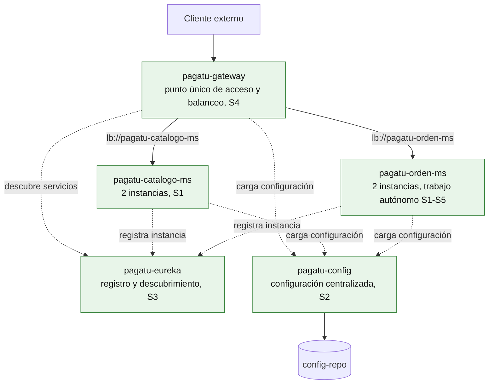

# S5 - Evaluación de la Unidad I

## 1. Propósito de la evaluación

Esta sesión no enseña contenido nuevo: cierra la Unidad I de **Desarrollo de Aplicaciones Distribuidas**. El sílabo (sesión 5) define dos actividades para esta evaluación:

1. Resolver la evaluación teórico-práctica de los temas de la Unidad I (sesiones 1 a 4).
2. Presentar y sustentar el Sistema distribuido base funcional, configurable y preparado para múltiples instancias.

## 2. Producto evaluado

Del sílabo, el producto de la Unidad I es:

> Implementa la base técnica del sistema distribuido: un servicio REST funcional, configuración centralizada, descubrimiento dinámico, acceso por Gateway y ejecución concurrente de instancias.

**Lo que sigue (2.1-2.4) es el ejemplo `pagatu` del docente, no una plantilla obligatoria.** Cada equipo tiene su propio dominio, declarado en su [Brief técnico](../proyecto-sello/brief.md) de la sesión 2 — no todos siguen `pagatu`. Lo que sí es exigible a todos es la estructura: servicio REST persistente, configuración externalizada por ambiente, registro y descubrimiento de servicios, punto único de acceso mediante Gateway, y distribución de tráfico entre instancias.

### Lo que acumulaste sesión por sesión

Este producto no se construye en S5: se ensambla con lo que cada sesión anterior ya te pidió sobre tu propio proyecto.

**Tabla 1. De la sesión al sistema evaluado**

| Sesión | Qué produjiste (tu propio proyecto) | Dónde queda en tu sistema evaluado |
|---|---|---|
| S1 | Microservicio base con CRUD REST completo, persistencia en PostgreSQL con Flyway, Swagger, Actuator y ejecución con múltiples instancias en paralelo. | 2.1 Alcance de servicios y 2.2 Contrato REST |
| S2 | Configuración externalizada por ambiente (DEV/PROD) leída desde un Config Server propio. | 2.3 Configuración por ambiente |
| S3 | Registro y descubrimiento dinámico de tus servicios, con múltiples instancias verificadas de forma independiente. | 2.4 Arquitectura del sistema distribuido base |
| S4 | Punto único de acceso con Gateway, rutas resueltas por descubrimiento y balanceo de carga verificado entre instancias. | 2.4 Arquitectura del sistema distribuido base |
| S5 (esta sesión) | Ensamblas todo lo anterior en un sistema único y lo sustentas. | El sistema completo + sección 4 de esta guía |

Lo que sustentas en S5 es **tu propio sistema**: los servicios que tú construiste, sobre tu propio dominio — no el de `pagatu`. Las secciones 2.1-2.4 muestran cómo se ve ese sistema terminado usando el ejemplo del docente; tu entregable real tiene la misma estructura, pero con el contenido que tú construiste en S1-S4.

### 2.1 Alcance de servicios (ejemplo `pagatu`)

- `pagatu-config`: Config Server, configuración externalizada por ambiente (S2).
- `pagatu-eureka`: registro y descubrimiento de servicios (S3).
- `pagatu-gateway`: punto único de acceso y balanceo de carga (S4).
- `pagatu-catalogo-ms`: microservicio guiado en clase, con dos recursos (categorías, productos) y dos instancias simultáneas (S1, S3).
- `pagatu-orden-ms`: microservicio replicado como trabajo autónomo desde S1, migrado a Config Client y Eureka Client, con su propia ruta en el Gateway (S2-S4, corregido para el cierre de unidad).

### 2.2 Contrato REST (ejemplo `pagatu`)

Todo el tráfico se resuelve a través de `pagatu-gateway` — ningún cliente externo llama directo a un puerto de instancia.

**Tabla 2. Contrato REST de referencia (ejemplo `pagatu`)**

| Métodos | Endpoint | Propósito | Sesión relacionada |
|---|---|---|---|
| `GET`, `GET /{id}`, `POST`, `PUT`, `DELETE` | `/api/v1/categorias` | CRUD completo de categorías. | S1 |
| `GET`, `GET /{id}`, `POST`, `PUT`, `DELETE` | `/api/v1/productos` | CRUD completo de productos, con su categoría asociada. | S1 |
| `GET`, `GET /{id}`, `POST` | `/api/v1/ordenes` | Listar, consultar y registrar órdenes (`pagatu-orden-ms`, trabajo autónomo). | S1 (autónomo), ruta agregada en S4 |

### 2.3 Configuración por ambiente (ejemplo `pagatu`)

**Tabla 3. Puertos por componente y ambiente (ejemplo `pagatu`)**

| Componente | Puerto DEV | Puerto PROD (interno) | Puerto PROD (expuesto al host) |
|---|---|---|---|
| `pagatu-config` | `18888` | `8888` | `28888` |
| `pagatu-eureka` | `18761` | `8761` | `28761` (solo dashboard) |
| `pagatu-gateway` | `18080` | `8080` | `28080` (único puerto de negocio) |
| `pagatu-catalogo-ms` (2 instancias) | `8080` / `8081` | `8080` | Sin exponer |
| `pagatu-orden-ms` (2 instancias) | `8082` / `8083` | `8080` | Sin exponer |

El prefijo `1` identifica DEV, el prefijo `2` identifica PROD expuesto — mismo criterio usado desde S2. En PROD, solo `pagatu-gateway` publica un puerto de negocio al host (`28080`); `pagatu-config` y `pagatu-eureka` exponen su puerto solo para revisión administrativa del equipo, no para tráfico de clientes reales.

### 2.4 Arquitectura del sistema distribuido base (ejemplo `pagatu`)

**Figura 1. Sistema distribuido base, Unidad I completa (ejemplo `pagatu`)**



A diferencia del roadmap de S4 (donde `pagatu-gateway` era lo único nuevo del día), aquí los cinco componentes están en verde: la Unidad I completa un sistema donde ningún cliente externo conoce un puerto de instancia, ningún servicio tiene su configuración hardcodeada, y agregar o perder una instancia no requiere tocar nada fuera de `pagatu-eureka`.

## 3. Evaluación teórico-práctica (S1-S4)

Cubre los cuatro temas dictados antes de esta sesión. El docente puede tomarla escrita, oral o mixta.

**Tabla 4. Temario de la evaluación teórico-práctica**

| Sesión | Tema | Qué puede evaluar el docente |
|---|---|---|
| S1 | Arquitectura de un microservicio, persistencia y ejecución reproducible | Responsabilidad única, capas internas, PostgreSQL con Flyway, documentación con Swagger, verificación de salud y ejecución con múltiples instancias. |
| S2 | Gestión centralizada de configuración y ambientes | Config Server, externalización de configuración fuera del código, diferencias reales entre DEV y PROD. |
| S3 | Registro, descubrimiento y ejecución concurrente de servicios | Patrón Service Registry, registro dinámico, descubrimiento por nombre lógico, observabilidad de instancias registradas. |
| S4 | Punto único de acceso y distribución de tráfico | Gateway, rutas, resolución `lb://`, balanceo de carga round-robin y por qué es suficiente para instancias idénticas sin estado propio. |

Preguntas de referencia (el docente puede formular equivalentes):

1. ¿Por qué tu microservicio no debería depender de un puerto fijo asignado a mano, y cómo verificaste que corre con múltiples instancias en paralelo?
2. ¿Qué diferencia hay entre una propiedad fija en el código y una leída desde tu Config Server, y por qué esa diferencia importa entre DEV y PROD?
3. Si detienes una instancia de tu servicio, ¿cómo se entera tu registro de servicios de que ya no está disponible, y por qué no es instantáneo?
4. ¿Por qué la dirección `lb://` que usa tu Gateway no es una dirección real, y qué componente la resuelve?
5. ¿Qué algoritmo de balanceo de carga usa tu Gateway por defecto, y por qué es suficiente para instancias idénticas sin estado propio?

## 4. Sustentación del sistema

**Tabla 5. Distribución de tiempo por integrante**

| Momento | Tiempo | Propósito |
|---|---:|---|
| Presentación técnica | 8 min | Explicar el sistema (sección 2), las decisiones tomadas y su evolución desde S1. |
| Demo técnica | 5 min | Ejecutar el CRUD, el registro de instancias y el balanceo de carga en vivo, incluido un caso de error o caída de instancia. |
| Preguntas individuales | 5 min | Verificar dominio y aporte propio, con base en la Tabla 4. |

**Tabla 6. Entregables obligatorios**

| Entregable | Evidencia mínima | Criterio de aceptación |
|---|---|---|
| Producto de unidad | Sección 2 de esta guía, con el dominio propio del equipo | Coherente con el sílabo y con el código real ejecutable |
| Evidencia de configuración | `-dev`/`-prod` verificables, sin credenciales versionadas | Config Server operativo, diferencias reales entre ambientes |
| Evidencia de registro y balanceo | Dashboard del registro con instancias `UP`, peticiones consecutivas resueltas por instancias distintas vía Gateway | Trazabilidad verificable con logs, no solo documentada |
| Sustentación individual | Preguntas y defensa por integrante (sección 3) | Autoría demostrada |

Secuencia sugerida de presentación:

1. Presentar el alcance de servicios (2.1) y el contrato REST (2.2).
2. Ejecutar el CRUD completo en vivo de un recurso: un caso de éxito y un caso inválido (`400`) o no encontrado (`404`).
3. Mostrar la configuración externalizada (2.3): el mismo artefacto, con valores distintos en DEV y en PROD.
4. Mostrar el dashboard del registro de servicios con las instancias registradas.
5. Ejecutar peticiones consecutivas a través del Gateway y evidenciar el balanceo entre instancias en los logs.
6. Detener una instancia en vivo y mostrar que el Gateway deja de enviarle tráfico sin que el cliente lo note.
7. Cerrar explicando al menos una decisión propia distinta a la del ejemplo `pagatu` (dominio, recurso, o algún ajuste propio del patrón).

Criterios mínimos de aceptación:

- El sistema arranca en DEV con todos sus componentes: Config Server, registro de servicios, Gateway y al menos dos microservicios.
- Al menos un microservicio corre con dos instancias simultáneas, registradas y balanceadas.
- El CRUD completo del recurso principal funciona con un caso de éxito y uno de error.
- La configuración por ambiente (DEV/PROD) es verificable y no está hardcodeada en el código.
- Cada integrante responde individualmente al menos una pregunta de la Tabla 4.

## 5. Rúbrica de evaluación

Los seis criterios son cita literal de los criterios de evaluación del producto de la Unidad I en el sílabo de Desarrollo de Aplicaciones Distribuidas.

**Tabla 7. Rúbrica de evaluación**

| Criterio | Peso | A (20 pts) | B (15 pts) | C (10 pts) | D (5 pts) | Nivel obtenido |
|---|---:|---|---|---|---|---:|
| 1. Servicio REST funcional y persistente | 15% | Servicio ejecutable, persistente y documentado, verificado en vivo. | Servicio funcional, con documentación o persistencia parcial. | Servicio parcialmente funcional o sin persistencia verificable. | No presenta un servicio REST funcional. | |
| 2. Configuración externa por ambiente | 15% | Configuración externalizada, con diferencias reales y verificables entre DEV y PROD. | Configuración externalizada, con diferencias parciales entre ambientes. | Configuración parcialmente externa o sin diferencias claras. | No externaliza configuración. | |
| 3. Registro y descubrimiento de servicios operativo | 20% | Registro operativo, con instancias visibles y verificadas en el dashboard. | Registro operativo, con verificación parcial del dashboard. | Registro presente, sin verificación clara de instancias. | No evidencia registro de servicios. | |
| 4. Punto único de acceso mediante Gateway | 20% | Gateway operativo, con rutas hacia todos los servicios resueltas correctamente. | Gateway operativo, con al menos una ruta funcional. | Gateway definido, con rutas incompletas o con errores. | No evidencia Gateway funcional. | |
| 5. Distribución de tráfico entre instancias | 20% | Balanceo de carga verificado entre al menos dos instancias, con evidencia clara. | Balanceo verificado parcialmente o sobre una sola instancia. | Balanceo definido, sin verificación clara. | No evidencia balanceo de carga. | |
| 6. Evidencias de ejecución reproducible y documentación técnica básica | 10% | Evidencias completas, reproducibles por otra persona, con documentación clara. | Evidencias suficientes, con vacíos menores de documentación. | Evidencias parciales o poco reproducibles. | No presenta evidencias ni documentación. | |

Nota final = suma de (`Peso` × `Puntos del nivel obtenido`) / 100 × 20 = ____.

Para usar la rúbrica con IA, solicita:

```text
Evalúa la sustentación y el producto (sección 2 de esta guía, adaptada al dominio propio del equipo) usando la rúbrica de esta sesión.
Para cada criterio selecciona el nivel obtenido: A=20, B=15, C=10, D=5.
Justifica brevemente cada nivel con evidencia concreta (endpoints, dashboard de registro, logs de balanceo).
Calcula la nota final con la fórmula: suma de (Peso × Puntos del nivel obtenido) / 100 × 20.
Indica 2 fortalezas y 2 recomendaciones para lo que sigue en Unidad II.
```
