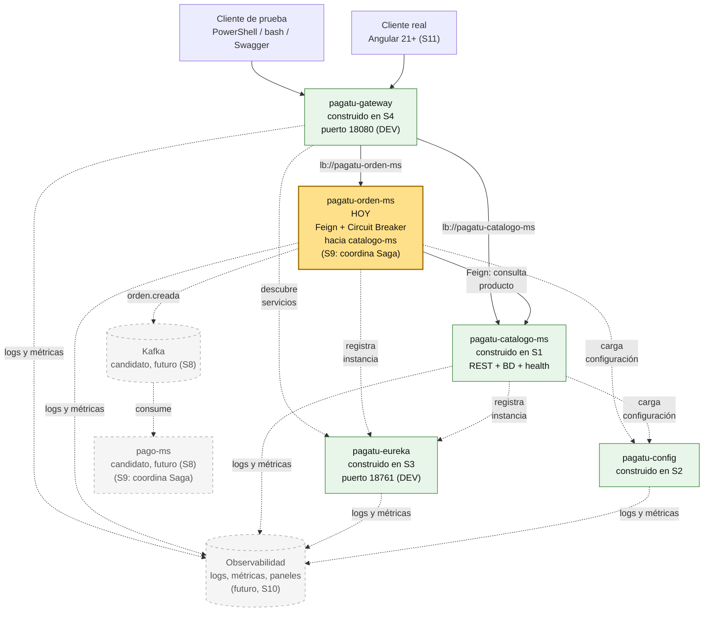
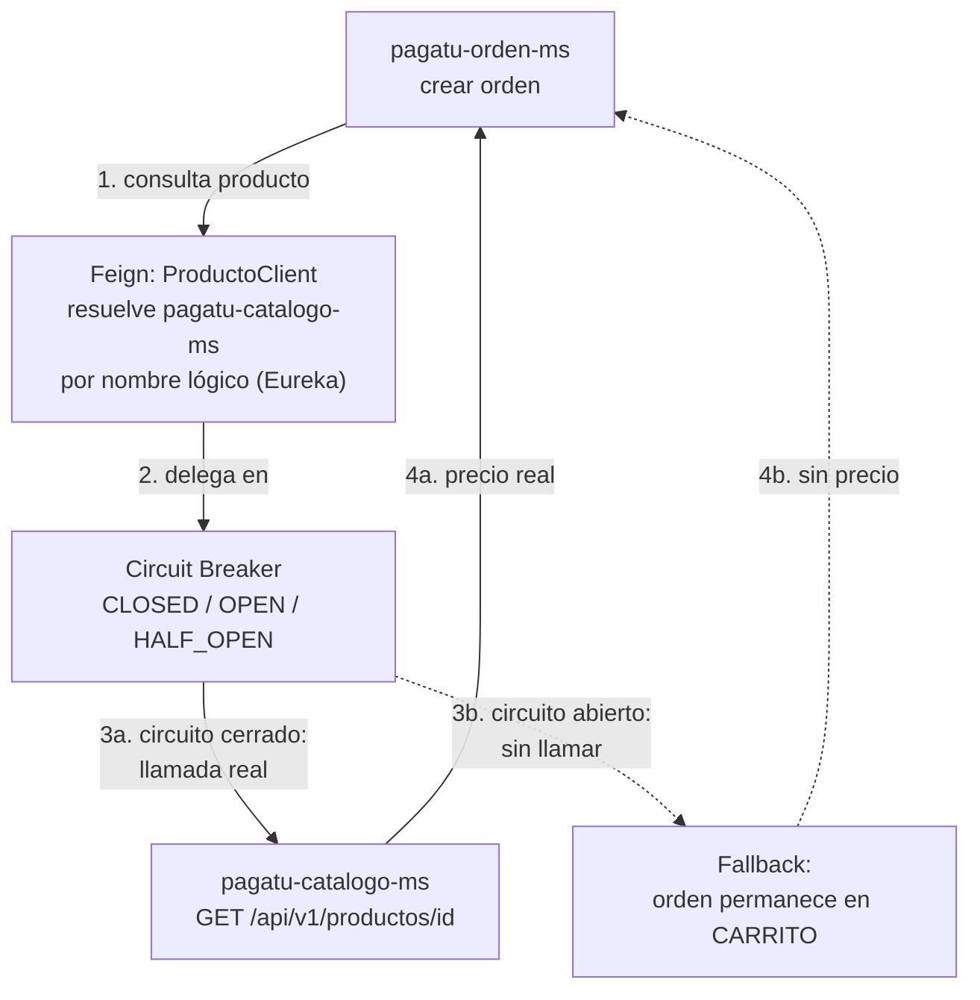
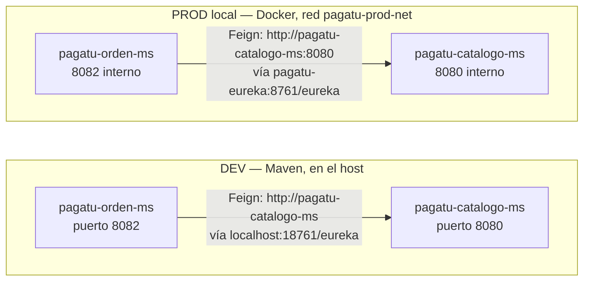
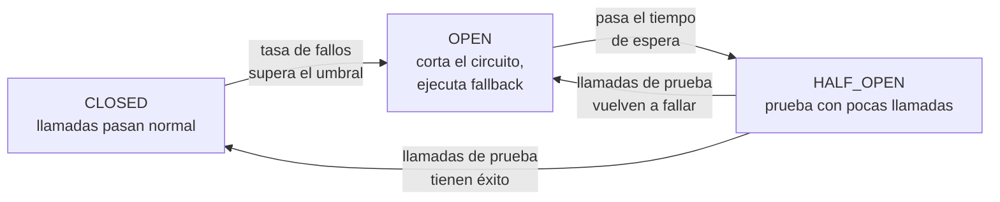
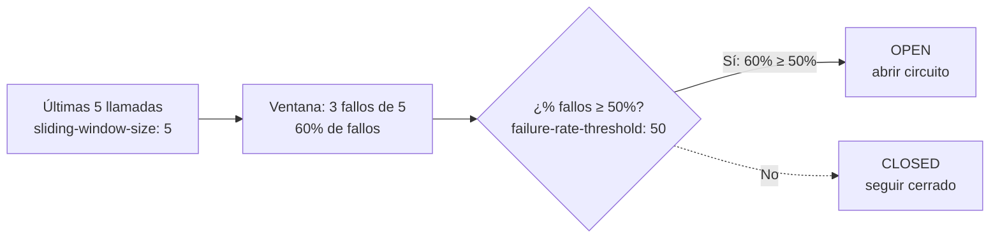
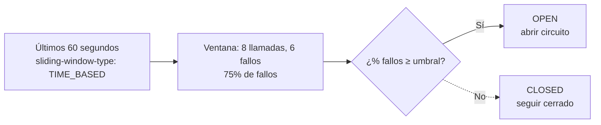

# S6 - Comunicación síncrona resiliente entre servicios

*Por: Angel Sullon Macalupu @asullom - 2026*

## 1. Introducción

Tiempo: 20 min.

### 1.1 Presentación de la sesión

Hasta S5, `pagatu-catalogo-ms` fue el único microservicio con CRUD completo — cada operación resolvía todo con su propia base de datos, sin necesitar nada de otro servicio. Esta sesión construye `pagatu-orden-ms`, el segundo microservicio del proyecto, y con él aparece un problema nuevo: para registrar una orden, `pagatu-orden-ms` necesita el precio *real* de cada producto — un dato que vive en la base de datos de `pagatu-catalogo-ms`, no en la propia. Esta sesión resuelve ese problema en dos partes, en orden: primero cómo se hace esa llamada entre servicios (Feign), después qué hacer cuando esa llamada falla (Circuit Breaker).

### 1.2 Índice

1. Comunicación declarativa entre microservicios.
2. Circuit Breaker: respuesta controlada ante fallos.
3. Observabilidad y diagnóstico.

### 1.3 Propósito de aprendizaje

Al concluir la clase, estarás en condiciones de:

- **Construir e implementar** un segundo microservicio persistente y observable, que consulta a otro microservicio ya existente de forma declarativa por su nombre lógico en el registro de servicios, protegiendo esa llamada con un patrón de tolerancia a fallos (Circuit Breaker) que evita que un servicio caído tumbe también al que lo consulta.

### 1.4 Producto de sesión

`pagatu-orden-ms` funcional — con CRUD de órdenes, conectado a Config Server y a Eureka — que al registrar una orden consulta a `pagatu-catalogo-ms` (por Feign) para validar y copiar el precio real de cada producto, con una respuesta controlada (Circuit Breaker) si `pagatu-catalogo-ms` no responde.

### 1.5 Metodología

**Tabla 1. Metodología de la sesión**

| Actividades a Realizar en el Periodo | Orientaciones generales (Orientaciones Metodológicas) | Material de estudio recomendado |
|---|---|---|
| Revisión previa individual | Confirmar que `pagatu-config`, `pagatu-eureka`, `pagatu-gateway` y `pagatu-catalogo-ms` (S2-S4) siguen arrancando en DEV. Revisar el estado propio de `pagatu-orden-ms`, si ya se avanzó algo en la actividad autónoma de S2 (4.1). Trabajo individual, antes de clase. | Evidencia individual de S2-S4, [Alcance por microservicio y proyecto base](../proyecto-sello/alcance-microservicios.md) (si aún no se revisó). |
| Clase presencial | Construcción guiada de `pagatu-orden-ms` de punta a punta, conexión por Feign hacia `pagatu-catalogo-ms`, y protección de esa llamada con Circuit Breaker. Trabajo individual, siguiendo al docente paso a paso; consulta inmediata ante errores de conexión entre servicios. | Pasos 3.1 a 3.23 de esta guía. |
| Evaluación formativa | Revisión en clase de `pagatu-orden-ms` registrando una orden con precio real (caso correcto) y con `pagatu-catalogo-ms` detenido (caso de error controlado). La evidencia se completa y sustenta de forma individual, fuera del aula, según los criterios mínimos de la sección 4.4. | Indicaciones de entrega (4.3), rúbrica de evaluación (4.6). |

### 1.6 Motivación de la sesión

#### 1.6.1 Caso: la orden que necesita un precio que no es suyo

`pagatu-orden-ms` guarda órdenes y sus líneas de detalle. Cada línea necesita un precio — pero `pagatu-orden-ms` no es dueño de ningún precio: los precios viven en `productos`, dentro de la base de datos de `pagatu-catalogo-ms`. Copiar el precio a mano (pedirle al cliente que lo mande en el request) no sirve: cualquiera podría mandar un precio inventado. La única fuente confiable del precio real es preguntarle directamente a `pagatu-catalogo-ms`.

Eso obliga a una llamada HTTP entre dos microservicios — y abre una pregunta que S1-S5 no tuvieron que responder: ¿qué pasa si, justo cuando alguien intenta crear una orden, `pagatu-catalogo-ms` está caído, lento, o responde con error? Sin nada que lo controle, ese fallo se propaga sin control y tumba también a `pagatu-orden-ms`, aunque el problema real esté en el otro servicio.

**Preguntas de análisis**

**Activación de conocimientos previos**

1. ¿Por qué `pagatu-orden-ms` no puede simplemente copiar la tabla `productos` en su propia base de datos?
2. Si `pagatu-catalogo-ms` no respondiera justo cuando alguien crea una orden, ¿qué debería pasar con esa orden?

**Comprensión de comunicación resiliente**

1. ¿Qué diferencia hay entre llamar a otro microservicio por su dirección fija (`http://localhost:8080`) y llamarlo por su nombre lógico en Eureka?
2. ¿Por qué "esperar más tiempo" (un timeout más largo) no es lo mismo que "dejar de intentar" (un circuito abierto)?

En esta sesión se construye `pagatu-orden-ms` y se resuelven, en orden, las dos partes de ese problema: cómo se hace la llamada (Feign) y qué hacer cuando falla (Circuit Breaker).

### 1.7 Ubicación en el curso

- Unidad: U2 - Sistema distribuido robusto.
- Producto del curso: Proyecto Sello: sistema distribuido de microservicios end-to-end, configurable, escalable, seguro, resiliente, consistente, observable, integrado con frontend y defendido técnicamente.
- Producto de unidad: sistema distribuido seguro, resiliente, consistente, observable e integrado con cliente frontend.
- Avance del producto en esta sesión: segundo microservicio del proyecto (`pagatu-orden-ms`), con comunicación síncrona resiliente hacia `pagatu-catalogo-ms`.

**Figura 1. Roadmap del producto de la unidad**



`config-repo` (el repositorio de archivos que lee `pagatu-config`) no se dibuja: es un detalle de implementación de `pagatu-config`, no una pieza que la Unidad 2 trate por separado.

Hoy se construye `pagatu-orden-ms`, el segundo microservicio del proyecto, con comunicación resiliente hacia `pagatu-catalogo-ms` (ya registrado en Eureka desde S3, ya expuesto por el Gateway desde S4). `pagatu-cliente-ms` queda como trabajo autónomo (sección 4) — el mismo patrón de construcción, aplicado sobre un tercer microservicio.

El resto de piezas del diagrama todavía no existe, y se muestra igual porque ya está agendado en el sílabo de esta misma unidad, no porque se esté adelantando:

- **Cliente Angular real** — se integra recién en S11, "Integración con cliente frontend"; hasta entonces, el único cliente es el de prueba.
- **JWT sobre `pagatu-gateway`** — S7, "Seguridad distribuida y control de acceso"; no se dibuja como componente nuevo porque es una capa sobre el Gateway que ya existe, no un servicio aparte.
- **Kafka y `pago-ms`** — S8, "Mensajería asíncrona entre servicios"; `pagatu-orden-ms`, construido hoy, es candidato natural a publicar el primer evento del proyecto (`orden.creada`).
- **Saga entre `orden-ms` y `pago-ms`** — S9, "Consistencia distribuida en procesos de negocio"; no se dibuja como componente aparte porque no es un microservicio propio — es lógica de coordinación y compensación que vive dentro de `pagatu-orden-ms` y `pago-ms` (por eso ambos nodos ya anotan "S9: coordina Saga"), activada cuando un pago falla después de confirmada la orden.
- **Observabilidad** — S10, "Observabilidad y diagnóstico de sistemas distribuidos"; logs, health, métricas y paneles de diagnóstico sobre cada servicio, no solo sobre el tráfico que cruza el Gateway. Monitorear únicamente el Gateway dejaría ciego justo lo que esta sesión construye: la llamada Feign de `pagatu-orden-ms` a `pagatu-catalogo-ms` nunca pasa por el Gateway, y el estado del Circuit Breaker vive dentro de `pagatu-orden-ms`. `pagatu-eureka` se monitorea por la misma razón que Gateway: es una dependencia de tráfico en vivo — cada resolución `lb://` lo consulta en ese instante, y si está degradado, el enrutamiento puede caer sobre instancias muertas. `pagatu-config`, en cambio, se monitorea por un motivo distinto: los microservicios leen su configuración solo al arrancar (*pull on startup*, S2, 3.10), así que si `pagatu-config` cae después de que todo ya arrancó, el tráfico en vivo no lo nota — el problema aparece recién en el próximo reinicio o escalado. Protege la capacidad de operar, no el tráfico de ahora mismo.

  **Que Eureka ya "monitoree" las instancias no reemplaza a Observabilidad — responden preguntas distintas.** Eureka solo confirma que una instancia sigue viva (recibió su heartbeat) y dónde está; no agrega logs, no mide latencia ni uso de recursos, y no sabe nada del estado interno de un servicio. Ejemplo con lo de hoy: si el Circuit Breaker de `pagatu-orden-ms` está en `OPEN` y todas las órdenes se quedan en `CARRITO` sin poder avanzar, Eureka lo seguiría mostrando como `UP` — la instancia está viva, el problema es de lógica de negocio degradada, invisible para un registro de servicios. Eso solo lo revela Observabilidad (Actuator + métricas de Resilience4j, S10).

## 2. Explica

Tiempo: 25 min.

### 2.1 Arquitectura de la sesión

**Figura 2. De `pagatu-orden-ms` a `pagatu-catalogo-ms`, con Feign y Circuit Breaker**



Lectura del diagrama: `pagatu-orden-ms` nunca llama directo a una dirección de `pagatu-catalogo-ms` — llama a través de Feign (paso 1-2), que resuelve el nombre lógico contra Eureka, y esa llamada queda envuelta en un Circuit Breaker (paso 3) que decide, según el historial reciente de fallos, si intenta la llamada real o ejecuta de inmediato el *fallback*. Los dos caminos (3a con precio real, 3b sin precio) terminan igual (paso 4): la orden se guarda de todas formas, con o sin precio confirmado — eso lo decide el código de `crear()` (3.17), no un componente aparte. Este diagrama es el mapa que guía el resto de la explicación: **2.2 desarrolla los pasos 1-2** (Feign, cómo se resuelve la llamada); **2.3 desarrolla los pasos 3-4** (Circuit Breaker, qué pasa cuando la llamada real falla) — en el mismo orden del Índice (1.2).

Ese mecanismo es el mismo en DEV y en producción local — lo que cambia es la red por la que viaja la llamada:

**Figura 3. La misma llamada Feign, en DEV y en producción local**



En DEV, ambos microservicios corren con Maven en el host y se descubren entre sí contra `localhost:18761/eureka` (S3); en producción local, los dos corren dentro de `pagatu-prod-net` (S4) y se descubren contra `pagatu-eureka:8761/eureka` — Feign resuelve el nombre lógico `pagatu-catalogo-ms` igual en los dos casos, sin que el código de `ProductoClient` (3.12) cambie una sola línea entre ambientes.

### 2.2 Comunicación declarativa entre microservicios

Cualquier microservicio que necesita datos que pertenecen a otro se comunica a través de su API, nunca accediendo directamente a su base de datos — cada microservicio es dueño exclusivo de los datos que administra, uno de los principios centrales de la arquitectura de microservicios. Esa llamada se puede escribir a mano (un cliente HTTP genérico), o de forma **declarativa**: una interfaz anotada describe el endpoint, y un framework arma la llamada HTTP por debajo, sin una sola línea que construya la URL o parsee la respuesta a mano.

Que un cliente resuelva el nombre lógico de un servicio consultando directamente a un registro (en vez de pasar por un intermediario como un Gateway) es, además, un patrón con nombre propio: **Client-Side Service Discovery** (Richardson, s.f.) — el mismo mecanismo que ya aplican, sin nombrarlo así, cualquier Gateway que resuelve `lb://` y cualquier cliente de un registro de servicios, aplicado ahora a una llamada entre microservicios en vez de a una ruta externa.

**OpenFeign** (Spring Cloud Team, 2024) es la implementación concreta de ambas ideas que usa `pagatu-orden-ms` hoy: una interfaz anotada con `@FeignClient(name = "...")`, con un método anotado como si fuera un `@Controller` (`@GetMapping`), es en tiempo de ejecución un cliente HTTP completo. `name` no es una dirección fija: es el `spring.application.name` con el que el otro servicio ya está registrado en `pagatu-eureka` (S3) — Feign resuelve ese nombre contra Eureka en tiempo de ejecución, el mismo mecanismo de balanceo de carga que ya usa el Gateway desde S4.

**DTO entre servicios**: el contrato que un microservicio expone a otros no es su entidad JPA. `pagatu-orden-ms` no necesita todo lo que `Producto` guarda en `pagatu-catalogo-ms` — necesita el mínimo para armar una línea de orden: id, nombre y precio. Por la misma razón, `id_producto` en `orden_detalles` no lleva `FOREIGN KEY` hacia `productos` (ver 3.3): esa tabla vive en la base de datos de otro microservicio, y la única forma válida de llegar a ella es esta llamada declarativa, nunca una relación directa entre bases de datos separadas.

**Error frecuente**: llamar a `pagatu-catalogo-ms` por su dirección fija (`http://localhost:8080`) en vez de por su nombre lógico (`pagatu-catalogo-ms`) registrado en Eureka. Funciona en la laptop de quien lo escribió y se rompe apenas hay una segunda instancia (S3, puerto `8081`) o el sistema corre en Docker (S4) con otra red — exactamente el problema que Eureka y el Gateway ya resuelven para las llamadas *externas* desde S3-S4; Feign aplica el mismo criterio a las llamadas *internas*.

### 2.3 Circuit Breaker: respuesta controlada ante fallos

En una llamada síncrona entre dos microservicios, si el servicio que responde no está disponible, responde lento, o falla, y no hay nada que lo controle, esa excepción se propaga tal cual hacia quien hizo la llamada — un problema del servicio que falló termina siendo, también, un problema del que lo consume.

**Circuit Breaker** (interruptor de circuito) evita ese contagio: envuelve una llamada que puede fallar y decide, según cuántas veces falló recientemente, si sigue intentando la llamada real o si corta el circuito y ejecuta de inmediato una alternativa (*fallback*) — sin siquiera intentar una llamada que probablemente va a fallar. El patrón fue descrito formalmente por Fowler (2014) y popularizado como práctica de ingeniería de producción por Nygard (2018); `pagatu-orden-ms` lo implementa hoy con Resilience4j (Resilience4j, 2024), la librería concreta detrás de `@CircuitBreaker` (3.15-3.17).

**Tabla 2. Los tres estados de un Circuit Breaker**

| Estado | Qué hace | Cuándo pasa al siguiente |
|---|---|---|
| **CLOSED** (cerrado) | Deja pasar las llamadas normalmente hacia el servicio real. | Si la tasa de fallos supera el umbral configurado, pasa a `OPEN`. |
| **OPEN** (abierto) | Corta el circuito: ninguna llamada llega al servicio real, se ejecuta el *fallback* de inmediato. | Después de un tiempo de espera configurado, pasa a `HALF_OPEN` para probar si el servicio ya se recuperó. |
| **HALF_OPEN** (medio abierto) | Deja pasar un número limitado de llamadas de prueba hacia el servicio real. | Si esas llamadas de prueba tienen éxito, vuelve a `CLOSED`; si vuelven a fallar, regresa a `OPEN`. |

**Figura 4. Ciclo de estados del Circuit Breaker**



En esta sesión, Feign (2.2) ya resuelve *cómo* se hace la llamada de `pagatu-orden-ms` hacia `pagatu-catalogo-ms`; Circuit Breaker, con Resilience4j (3.15-3.17), decide *qué pasa* cuando esa llamada específica falla.

**Fallback**: el método que se ejecuta en vez de la llamada real cuando el circuito está `OPEN`, o cuando la llamada real lanza una excepción. Recibe los mismos parámetros que el método protegido, más la excepción real (`Throwable`) — permite decidir una respuesta controlada en vez de dejar que el error se propague sin control.

**Error frecuente**: confundir *timeout* con Circuit Breaker. Un timeout solo decide cuánto tiempo esperar antes de dar por fallida una llamada puntual; el Circuit Breaker decide, además, si vale la pena *seguir intentando* después de varios fallos seguidos — sin él, cada llamada nueva esperaría su propio timeout completo contra un servicio que ya se sabe caído, en vez de fallar rápido.

**Dos formas de contar la tasa de fallos.** Según SACAViX System Design (2026), un Circuit Breaker puede decidir cuándo abrirse de dos formas distintas — y solo una de las dos es la que `pagatu-orden-ms` aplica hoy.

**Criterio de apertura aplicado en esta sesión: Count-based Sliding Window.** Cuenta el resultado de las últimas N llamadas, sin importar cuánto tiempo tomen en ocurrir — es exactamente lo que ya configuramos en 3.16 (`sliding-window-size: 5`, `failure-rate-threshold: 50`), aunque hasta ahora no le habíamos puesto nombre al criterio:

**Figura 5. Count-based Sliding Window, con la configuración real de `pagatu-orden-ms`**



*Nota.* Adaptado de *Circuit Breaker* (SACAViX System Design, 2026), con los valores reales de `pagatu-orden-ms` (3.16) en vez del ejemplo genérico de la fuente.

Es predecible en cuántas muestras analiza (siempre las últimas 5), pero en un servicio con tráfico bajo la ventana puede tardar en llenarse, retrasando la detección de una falla real — con solo 2 o 3 órdenes al día, `pagatu-orden-ms` podría tardar horas en acumular 5 llamadas y recién ahí evaluar si `pagatu-catalogo-ms` está fallando.

**Criterio no aplicado, para contraste: Time-based Sliding Window.** Cuenta las llamadas dentro de una ventana de tiempo fija, sin importar cuántas ocurrieron:

**Figura 6. Time-based Sliding Window, ejemplo genérico (no es el criterio de esta sesión)**



*Nota.* Adaptado de *Circuit Breaker* (SACAViX System Design, 2026).

Reacciona de forma más consistente en el tiempo real (siempre evalúa "el último minuto", sin importar el volumen), pero con tráfico bajo puede evaluar el umbral con muy pocas muestras (en el ejemplo, solo 8 llamadas en 60 segundos), haciendo el porcentaje poco confiable. Resilience4j usa Count-based por defecto — el mismo tipo que ya configuramos en 3.16, sin necesidad de declararlo explícitamente; cambiar a Time-based exige agregar `sliding-window-type: TIME_BASED` a la configuración, algo que esta sesión no hace.

**Slow Call Rate, fuera del alcance de esta sesión.** Además de contar fallos por excepción, un Circuit Breaker puede abrirse si el porcentaje de llamadas *lentas* (más de un umbral de duración configurado, por ejemplo 2 segundos) supera un umbral propio — una llamada que tarda 8 segundos bloqueando un hilo es tan dañina para el sistema como una que falla con una excepción. `pagatu-orden-ms` no lo configura hoy; queda como una mejora posible, no como algo que falte en esta sesión.

**Trade-offs y errores comunes** (SACAViX System Design, 2026): agrega complejidad al cliente que llama al servicio, y exige un fallback adecuado — sin uno, el patrón no protege nada. Los umbrales (tasa de fallos, tamaño de ventana) necesitan calibrarse con datos reales, no un valor arbitrario, y un umbral demasiado sensible puede abrir el circuito por un simple pico de tráfico momentáneo. **No monitorear el estado del circuito en producción** es, según esa misma fuente, uno de los errores más comunes al implementar este patrón — la razón concreta por la que 2.4 y la Figura 1 (1.7) insisten en conectar Observabilidad a `pagatu-orden-ms`, no solo al Gateway.

**Patrones relacionados** (SACAViX System Design, 2026; fuera del alcance de esta sesión): *Bulkhead* (aísla recursos — por ejemplo, un pool de conexiones propio por dependencia — para que agotar uno no afecte a los demás); *Retry Pattern* (reintenta una llamada fallida antes de darla por perdida, normalmente combinado con Circuit Breaker, nunca en su reemplazo); *Timeout Pattern* (decide cuánto esperar antes de dar por fallida una llamada puntual, ver el "Error frecuente" anterior); *Rate Limiting* (limita cuántas llamadas se permiten en un periodo, para proteger al servicio que las recibe, no al que las hace).

### 2.4 Observabilidad y diagnóstico

Cuando una llamada entre dos servicios falla, diagnosticar el problema exige más que revisar el propio código: hay que poder rastrear una misma petición a través de los servicios que atravesó, y conocer el estado interno de cualquier mecanismo de tolerancia a fallos que la haya interceptado — sin eso, un fallo controlado (el fallback) es indistinguible de un error real para quien solo mira el resultado final.

En esta sesión, eso significa revisar logs de `pagatu-orden-ms`, logs de `pagatu-catalogo-ms`, el `traceId` de cada petición (mismo `CorrelationIdFilter` de S1, 3.3.2, replicado en `pagatu-orden-ms` en 3.2.2), `/actuator/health` de ambos servicios, y en qué estado quedó el Circuit Breaker (`CLOSED`/`OPEN`/`HALF_OPEN`) cuando `pagatu-catalogo-ms` no responde.

## 3. Aplica: actividad práctica guiada

Tiempo: 4h.

**Actividad:** construcción guiada de `pagatu-orden-ms`, el segundo microservicio del proyecto, que consulta a `pagatu-catalogo-ms` por Feign para validar y copiar el precio real de cada producto, con una respuesta controlada (Circuit Breaker) cuando esa llamada falla (Producto de la sesión en 1.4).

**Propósito de la actividad:** que cada estudiante construya un microservicio que depende de otro ya existente, resolviendo esa dependencia de forma declarativa (Feign, por nombre lógico contra Eureka) y con una respuesta de negocio controlada cuando el servicio consultado no responde (Circuit Breaker) — verificando ambos casos con evidencia real (capturas del estado `OPEN`, no solo el caso feliz).

**Orientaciones metodológicas:** en el laboratorio, el docente construye `pagatu-orden-ms` paso a paso frente a la clase, en el mismo orden de las tres partes de la sesión — primero el microservicio completo (Parte A), después la conexión Feign (Parte B), al final el Circuit Breaker (Parte C) —; los estudiantes replican cada paso en su propio equipo, y provocan ellos mismos la caída de `pagatu-catalogo-ms` (3.21-3.22) para verificar el fallback en su propia consola, no solo leyendo el resultado esperado en la guía.

**Actividades para realizar:**

*Parte A — Construir `pagatu-orden-ms`:*

- **3.1** Crear el proyecto base de `pagatu-orden-ms`.
- **3.2** Levantar la base de datos de `pagatu-orden-ms`.
- **3.2.1** Crear las excepciones y el manejador global de errores.
- **3.2.2** Crear el filtro de trazabilidad `CorrelationIdFilter` y configurar logs.
- **3.3** Crear la migración Flyway de `pagatu-orden-ms`.
- **3.4** Crear las entidades `Orden` y `OrdenDetalle`.
- **3.5** Crear los DTO de entrada y salida.
- **3.6** Crear repositorio, servicio y controlador base (sin Feign todavía).
- **3.7** Conectar `pagatu-orden-ms` a `pagatu-config`.
- **3.8** Conectar `pagatu-orden-ms` a `pagatu-eureka`.
- **3.9** Agregar la ruta de `pagatu-orden-ms` al Gateway.
- **3.9.1** Probar `pagatu-orden-ms` de punta a punta (sin Feign todavía).

*Parte B — Tema 1: Feign, `pagatu-orden-ms` consulta `pagatu-catalogo-ms`:*

- **3.10** Agregar la dependencia de OpenFeign.
- **3.11** Crear el DTO de producto.
- **3.12** Crear el cliente Feign hacia `pagatu-catalogo-ms`.
- **3.13** Integrar el cliente Feign en `OrdenServiceImpl`.

*Parte C — Tema 2: Circuit Breaker, respuesta controlada si `pagatu-catalogo-ms` falla:*

- **3.14** Probar el problema sin protección todavía.
- **3.15** Agregar la dependencia de Resilience4j.
- **3.16** Configurar el Circuit Breaker nombrado `catalogo`.
- **3.17** Proteger la llamada a `pagatu-catalogo-ms` con `@CircuitBreaker`.
- **3.18** Levantar infraestructura en DEV.
- **3.19** Levantar `pagatu-catalogo-ms` y `pagatu-orden-ms` en DEV.
- **3.20** Probar el flujo correcto (Feign funcionando).
- **3.21** Probar el Circuit Breaker: `pagatu-catalogo-ms` caído.
- **3.22** Provocar la apertura del circuito.
- **3.23** Validar trazabilidad en logs.

**Punto de partida común:** todo el equipo debe comenzar exactamente desde donde quedó S4 (Gateway y balanceo de carga), no desde su propio avance individual. Clona la rama `s04-gateway-lb`:

```bash
git clone --branch s04-gateway-lb https://github.com/262dist/pagatu.git
```

Levanta en DEV los servicios base ya construidos hasta S4 (`pagatu-config`, `pagatu-eureka`, `pagatu-gateway`, `pagatu-catalogo-ms`) antes de tocar código nuevo — si alguno falla en arrancar, el problema es de una sesión anterior, no de esta. Recién a partir de aquí continúa con las tres partes de la sesión, en orden: primero se construye `pagatu-orden-ms` como microservicio completo (sin Feign todavía) — si ya avanzaste esto como parte del trabajo autónomo de S1 (4.1, CRUD base), S2 (4.1, Config Client) o S3 (4.1, Eureka Client), verifica que coincide con 3.1-3.9 (incluye las clases de trazabilidad, 3.2.1-3.2.2, que S1 sí pedía replicar) y continúa desde la Parte B; después se conecta a `pagatu-catalogo-ms` con Feign (Tema 1), y al final se protege esa llamada con Circuit Breaker (Tema 2).

### Parte A — Construir `pagatu-orden-ms`

#### 3.1 Crear el proyecto base de `pagatu-orden-ms`

**Producto del paso:** proyecto `pagatu-orden-ms` creado, con las mismas dependencias base que `pagatu-catalogo-ms` (S1).

**Tabla 3. Configuración de `pagatu-orden-ms` en Spring Initializr**

| Campo | Valor |
|---|---|
| Project | Maven Project |
| Spring Boot | **4.1.1** |
| Language | Java |
| Group Id | `pe.edu.upeu` |
| Artifact Id | `pagatu-orden-ms` |
| Package name | `pe.edu.upeu.orden` |
| Packaging | Jar |
| Java | 21 |
| Dependencias | Spring Web, Validation, Lombok, Spring Boot DevTools, SpringDoc OpenAPI WebMvc UI, Spring Boot Actuator, Spring Data JPA, PostgreSQL Driver, Flyway — las mismas de `pagatu-catalogo-ms` (S1, Tabla 4). Agrega también **Prometheus** (categoría *Observability*, la ofrece el propio buscador de Spring Initializr — agrega `io.micrometer:micrometer-registry-prometheus`, scope `runtime`): si ya tienes `obs/` corriendo (Prometheus descubre por Eureka, S3 3.11), `pagatu-orden-ms` queda visible ahí desde que arranca, sin ningún paso adicional. **Además**, agrega MapStruct a mano en el `pom.xml` (S1, 3.5.20) — a diferencia de Prometheus, Spring Initializr no lo ofrece como opción, y sin él el proyecto no compila apenas escribas el primer `Mapper`. |
| Ubicación sugerida | `services/pagatu-orden-ms` |

El puerto de base de datos (`15434` DEV / `25434` PROD local) y el nombre `pagatu_orden_db` ya estaban reservados desde la arquitectura del proyecto (`docs/index.md`) — no se inventan en esta sesión. El puerto de aplicación en DEV (`8082`, fijo) sigue el mismo criterio de S1 (puerto fijo, sin argumento) — distinto de `8080`, que ya usa `pagatu-catalogo-ms`. `prometheus` se agrega a `management.endpoints.web.exposure.include` en `pagatu-orden-ms-dev.yml` (3.7) junto a `health,info,metrics`, igual que ya hace `pagatu-catalogo-ms-dev.yml` desde S3 — sin ese endpoint expuesto, la dependencia sola no sirve de nada.

#### 3.2 Levantar la base de datos de `pagatu-orden-ms`

**Producto del paso:** PostgreSQL de `pagatu-orden-ms` corriendo en DEV.

**`services/pagatu-orden-ms/compose-dev.yml`:**

```yaml
name: pagatu-orden-dev

services:
  postgres-orden-dev:
    image: postgres:16-alpine
    container_name: pagatu-postgres-orden-dev
    restart: unless-stopped
    environment:
      POSTGRES_DB: pagatu_orden_db
      POSTGRES_USER: pagatu
      POSTGRES_PASSWORD: pagatu
    ports:
      - "15434:5432"
    volumes:
      - pagatu_orden_dev_data:/var/lib/postgresql/data

volumes:
  pagatu_orden_dev_data:
```

PowerShell / bash macOS/Linux:

```bash
cd services/pagatu-orden-ms
docker compose -f compose-dev.yml up -d
```

Antes de seguir, comprueba desde la consola que PostgreSQL DEV está listo y que la base de datos existe — mismo criterio que S1 (3.2.4):

PowerShell / bash macOS/Linux:

```bash
docker exec -it pagatu-postgres-orden-dev psql -U pagatu -d pagatu_orden_db -c "SELECT current_database();"
docker exec -it pagatu-postgres-orden-dev psql -U pagatu -d pagatu_orden_db -c "\dt"
```

Resultado esperado: `current_database` devuelve `pagatu_orden_db`, y `\dt` responde `No relations found.` (o "Did not find any relations.") — todavía no hay tablas, porque la migración Flyway (3.3) ni siquiera se ha creado. Es solo la prueba de que el contenedor está arriba y la base existe.

#### 3.2.1 Crear las excepciones y el manejador global de errores

**Producto del paso:** `pagatu-orden-ms` con el mismo manejo de errores que `pagatu-catalogo-ms` desde S1 — no algo que se improvise sesión a sesión.

Estas clases son **compartidas**: no son específicas de `Orden` ni de `OrdenDetalle`, cualquier módulo de `pagatu-orden-ms` las reutiliza tal cual. Es exactamente el mismo par de clases que ya existe en `pagatu-catalogo-ms` (S1, 3.3.1), copiado y reempaquetado.

**`exception/ResourceNotFoundException.java`**

```java
package pe.edu.upeu.orden.exception;

public class ResourceNotFoundException extends RuntimeException {
    public ResourceNotFoundException(String mensaje) {
        super(mensaje);
    }
}
```

**`exception/GlobalExceptionHandler.java`**

```java
package pe.edu.upeu.orden.exception;

import org.springframework.http.HttpStatus;
import org.springframework.http.ResponseEntity;
import org.springframework.web.bind.MethodArgumentNotValidException;
import org.springframework.web.bind.annotation.ExceptionHandler;
import org.springframework.web.bind.annotation.RestControllerAdvice;

import java.time.Instant;
import java.util.HashMap;
import java.util.Map;

@RestControllerAdvice
public class GlobalExceptionHandler {

    @ExceptionHandler(ResourceNotFoundException.class)
    public ResponseEntity<Map<String, Object>> handleNotFound(ResourceNotFoundException ex) {
        Map<String, Object> body = new HashMap<>();
        body.put("timestamp", Instant.now().toString());
        body.put("status", HttpStatus.NOT_FOUND.value());
        body.put("error", "Not Found");
        body.put("message", ex.getMessage());
        return ResponseEntity.status(HttpStatus.NOT_FOUND).body(body);
    }

    @ExceptionHandler(MethodArgumentNotValidException.class)
    public ResponseEntity<Map<String, Object>> handleValidation(MethodArgumentNotValidException ex) {
        Map<String, Object> body = new HashMap<>();
        body.put("timestamp", Instant.now().toString());
        body.put("status", HttpStatus.BAD_REQUEST.value());
        body.put("error", "Bad Request");
        body.put("message", "Error de validación en los datos enviados");
        return ResponseEntity.status(HttpStatus.BAD_REQUEST).body(body);
    }
}
```

`findById()` (3.6) todavía usa `RuntimeException` a mano en vez de `ResourceNotFoundException` — queda así, sin tocar, no es parte de esta sesión: el enfoque de hoy es la comunicación entre servicios, no cerrar ese detalle pendiente del CRUD base.

#### 3.2.2 Crear el filtro de trazabilidad `CorrelationIdFilter` y configurar logs

**Producto del paso:** `pagatu-orden-ms` generando el mismo `traceId` por petición que `pagatu-catalogo-ms` desde S1 — la pieza que 2.4 y 3.23 (más abajo) dan por hecha.

Mismo filtro, mismo criterio que S1 (3.3.2): agrega un identificador de trazabilidad a cada request usando el header `X-Trace-ID` — si el cliente no lo envía, el filtro genera un UUID.

**`filter/CorrelationIdFilter.java`**

```java
package pe.edu.upeu.orden.filter;

import jakarta.servlet.FilterChain;
import jakarta.servlet.ServletException;
import jakarta.servlet.http.HttpServletRequest;
import jakarta.servlet.http.HttpServletResponse;
import org.slf4j.MDC;
import org.springframework.stereotype.Component;
import org.springframework.web.filter.OncePerRequestFilter;

import java.io.IOException;
import java.util.UUID;

@Component
public class CorrelationIdFilter extends OncePerRequestFilter {

    public static final String TRACE_ID_HEADER = "X-Trace-ID";
    public static final String MDC_KEY = "traceId";

    @Override
    protected void doFilterInternal(HttpServletRequest request,
                                     HttpServletResponse response,
                                     FilterChain filterChain) throws ServletException, IOException {
        String traceId = request.getHeader(TRACE_ID_HEADER);
        if (traceId == null || traceId.isBlank()) {
            traceId = UUID.randomUUID().toString();
        }
        try {
            MDC.put(MDC_KEY, traceId);
            response.setHeader(TRACE_ID_HEADER, traceId);
            filterChain.doFilter(request, response);
        } finally {
            MDC.remove(MDC_KEY);
        }
    }
}
```

Crea también `src/main/resources/logback-spring.xml`, con salida por consola y por archivo en `logs/orden.log`:

```xml
<?xml version="1.0" encoding="UTF-8"?>
<configuration>
    <include resource="org/springframework/boot/logging/logback/defaults.xml"/>

    <property name="LOG_PATTERN"
              value="%d{yyyy-MM-dd HH:mm:ss.SSS} [%X{traceId}] %-5level %logger{36} - %msg%n"/>

    <appender name="CONSOLE" class="ch.qos.logback.core.ConsoleAppender">
        <encoder>
            <pattern>${LOG_PATTERN}</pattern>
        </encoder>
    </appender>

    <appender name="FILE" class="ch.qos.logback.core.rolling.RollingFileAppender">
        <file>logs/orden.log</file>
        <encoder>
            <pattern>${LOG_PATTERN}</pattern>
        </encoder>
        <rollingPolicy class="ch.qos.logback.core.rolling.TimeBasedRollingPolicy">
            <fileNamePattern>logs/orden-%d{yyyy-MM-dd}.log</fileNamePattern>
            <maxHistory>7</maxHistory>
        </rollingPolicy>
    </appender>

    <root level="INFO">
        <appender-ref ref="CONSOLE"/>
        <appender-ref ref="FILE"/>
    </root>
</configuration>
```

Este `traceId` identifica una petición **dentro de** `pagatu-orden-ms` (3.23: la llamada a `consultarProducto`, la excepción capturada, el fallback ejecutado, todo bajo el mismo valor en `logs/orden.log`) — no viaja todavía dentro de la llamada Feign hacia `pagatu-catalogo-ms`, que genera su propio `traceId` independiente para esa petición entrante. Propagar un mismo `traceId` de extremo a extremo entre microservicios (un `RequestInterceptor` de Feign que copie el valor del MDC al header saliente) queda fuera del alcance de esta sesión.

**(Opcional) Conectar `logs/orden.log` a Loki.** Si ya construiste `obs/` en S3 (3.13-3.14), `pagatu-orden-ms` puede sumarse al mismo Promtail sin levantar nada nuevo — mismo criterio que Prometheus (Tabla 3): agrega un `job_name` más en `obs/promtail/promtail-config-dev.yml` y `obs/promtail/promtail-config.yml`:

```yaml
  - job_name: pagatu-orden-ms
    static_configs:
      - targets: [localhost]
        labels:
          application: pagatu-orden-ms
          __path__: /var/log/pagatu-orden-ms/*.log
```

Y un bind-mount más al servicio `pagatu-promtail`, en `obs/compose-dev.yml` y `obs/compose.yml`:

```yaml
      - ../services/pagatu-orden-ms/logs:/var/log/pagatu-orden-ms:ro
```

Reinicia el stack (`cd obs && docker compose -f compose-dev.yml up -d`) para que tome el cambio. En PROD local, este mount queda listo pero vacío hasta que exista un `compose.yml` propio de `pagatu-orden-ms` (fuera del alcance de esta sesión) que bind-monte `./logs:/app/logs`, igual que ya hace `pagatu-catalogo-ms` — sin eso, no hay ningún archivo de log que Promtail pueda leer del lado de producción.

#### 3.3 Crear la migración Flyway de `pagatu-orden-ms`

**Producto del paso:** tablas `ordenes` y `orden_detalles` creadas.

Crea:

```text
services/pagatu-orden-ms/src/main/resources/db/migration/V1__create_orden_tables.sql
```

Pega:

```sql
CREATE TABLE IF NOT EXISTS ordenes (
    id BIGINT GENERATED BY DEFAULT AS IDENTITY,
    id_cliente BIGINT,
    nombre_cliente VARCHAR(150),
    direccion_cliente VARCHAR(200),
    fecha_creacion TIMESTAMP NOT NULL DEFAULT now(),
    estado VARCHAR(20) NOT NULL DEFAULT 'CARRITO',
    tipo_comprobante VARCHAR(20) NOT NULL DEFAULT 'BOLETA_SIMPLE',
    metodo_pago VARCHAR(20) NOT NULL,
    momento_pago VARCHAR(20) NOT NULL DEFAULT 'ADELANTADO',
    total NUMERIC(10,2),
    expira_en TIMESTAMP,
    PRIMARY KEY (id)
);

CREATE TABLE IF NOT EXISTS orden_detalles (
    id BIGINT GENERATED BY DEFAULT AS IDENTITY,
    id_orden BIGINT NOT NULL REFERENCES ordenes(id),
    id_producto BIGINT NOT NULL,
    nombre_producto VARCHAR(150),
    cantidad INTEGER NOT NULL,
    precio_unitario NUMERIC(10,2),
    PRIMARY KEY (id)
);
```

`id_orden` sí es una llave foránea normal (`REFERENCES ordenes(id)`): `ordenes` y `orden_detalles` viven en la misma base de datos de `pagatu-orden-ms`. `id_producto`, en cambio, **no** lleva `REFERENCES` — el producto vive en la base de datos de `pagatu-catalogo-ms`, otro microservicio con su propia base de datos; validar que exista y obtener su precio real es responsabilidad del código (la llamada Feign de la Parte B), no de una llave foránea entre bases de datos separadas. `precio_unitario` acepta `NULL` a propósito: una línea que no pudo validarse contra `pagatu-catalogo-ms` (Parte C, Circuit Breaker) queda registrada sin precio confirmado, en vez de no registrarse en absoluto. `id_producto`, en cambio, sigue siendo `NOT NULL` incluso en ese mismo escenario de falla: ese valor nunca se consulta a `pagatu-catalogo-ms`, llega directo en el request (`item.getIdProducto()`, 3.5) — lo único que depende de la llamada externa (y por eso puede faltar) es el precio, no el identificador del producto que el cliente pidió. `id_cliente`, en cambio, sí acepta `NULL` — pero no por la misma razón que `precio_unitario`, y no en todos los casos. La regla de negocio depende de quién registra la orden: si la registra el personal de `pagatu` (mostrador, venta al contado sin cuenta), el cliente puede no estar identificado y `id_cliente` queda en `NULL`; si la registra el propio cliente por autoservicio web, `id_cliente` es obligatorio — sin él, la orden no tiene dueño. Esta sesión solo construye el primer caso: el único cliente que existe hasta S11 ("Integración con cliente frontend") es el cliente de prueba (Figura 1, 1.7), que cumple el mismo rol que el personal de `pagatu` operando manualmente. Por eso `id_cliente` queda `NULL`-able aquí, sin ninguna validación condicional en el código: exigirla ahora sería validar un canal (autoservicio web) que todavía no existe en el sistema. Cuando S11 construya ese canal, esa sesión es la que debe declarar `id_cliente` obligatorio en el punto donde el propio cliente autenticado crea su orden — no algo que esta sesión tenga que anticipar. `nombre_cliente` y `direccion_cliente` quedan declaradas desde ahora, por la misma razón que `tipo_comprobante`/`metodo_pago`/`momento_pago`: el negocio real de `pagatu` las necesita en la orden (una orden es un documento histórico — igual que el precio, el nombre y la dirección del cliente en el momento de la venta no deben depender de una consulta en vivo a otro servicio más adelante). A diferencia de esas tres columnas, no llevan `DEFAULT` ni `NOT NULL`: ningún valor por defecto tiene sentido para un nombre o una dirección, y nada las llena todavía en esta sesión — quedan en `NULL` hasta que `pagatu-cliente-ms` exista y `pagatu-orden-ms` las copie desde ahí, con el mismo patrón de Feign ya aplicado hoy a `precio_unitario` (3.11-3.13). `tipo_comprobante`, `metodo_pago` y `momento_pago` quedan declarados desde ahora (el negocio real de `pagatu` los necesita), aunque esta sesión no profundiza en sus reglas — eso se retoma cuando `pago-ms` procese el pago real.

`nombre_producto` se agrega por la misma razón de fondo que ya justifica `precio_unitario`: una orden es un documento histórico, y el nombre de un producto en `pagatu-catalogo-ms` puede cambiar después de la venta (una corrección de tipeo, un reetiquetado comercial) sin que eso deba alterar lo que la orden ya registró que se vendió. Guardarlo copiado en `orden_detalles`, en vez de volver a consultarlo cada vez que alguien lee la orden, es exactamente el mismo criterio del "Error frecuente" de abajo, aplicado al nombre en vez de al precio. Es `NULL`-able por la misma razón que `precio_unitario`: una línea que no pudo validarse contra `pagatu-catalogo-ms` (Parte C) tampoco tiene nombre confirmado que copiar.

Esta sesión no guarda `subtotal` como columna propia, a propósito: es siempre `cantidad × precio_unitario`, un valor derivado que cualquier consulta puede calcular al vuelo — persistirlo aparte solo crearía una segunda fuente de verdad que podría desincronizarse del precio real si alguien actualiza uno sin el otro. `total` sí es una columna real de `ordenes` (una decisión de negocio, no solo aritmética: qué línea entra en la suma cuando alguna no tiene precio, ver más abajo), pero ya no lleva `NOT NULL DEFAULT 0`: una orden puede quedar sin un total definitivo, y forzar un `0` numérico ahí sería indistinguible de "esta orden vale cero soles" para quien solo mire la columna.

`expira_en` pertenece al carrito completo, no a cada línea: una orden en `CARRITO` tiene un plazo (por ejemplo, 30 minutos desde que se creó o se modificó por última vez) antes de que el sistema la dé por abandonada. Esta sesión declara la columna (`NULL`-able, sin `DEFAULT`) pero no llega a poblarla con un valor real ni a construir el proceso que la revise (un job programado, o una consulta al momento de leer la orden, que compare `expira_en` contra la hora actual y decida si la orden pasó a `EXPIRADA`) — eso es trabajo de una sesión futura de autoservicio (S11), cuando exista de verdad un carrito que un cliente construye a lo largo de varias peticiones, no una orden que `crear()` arma completa en una sola llamada. Declararla ya, aunque no se use todavía, evita otra migración más adelante sobre una tabla que para entonces ya tendrá filas reales. Una precisión importante para cuando esa sesión exista: pasar de `CARRITO` a `PENDIENTE_PAGO` no reinicia el plazo automáticamente — el vencimiento se decide sobre el carrito, no sobre cada estado por el que pasa.

**Por qué `estado` arranca en `CARRITO`, no en `PENDIENTE`.** A diferencia de una versión anterior de este diseño, `CARRITO` ya no es aquí un valor por defecto sin efecto práctico: cuando la validación contra `pagatu-catalogo-ms` falla (Parte C, Circuit Breaker), la orden se queda en `CARRITO` en vez de avanzar — exactamente el mismo estado con el que se creó, no uno especial de "esperando validación". Esto es deliberado y calza con el negocio real: una orden cuyos precios no se pudieron confirmar todavía no es una orden confirmada, sigue siendo, en esencia, un carrito al que le falta completar la validación antes de poder pagar. Hasta S11 ("Integración con cliente frontend"), `crear()` construye y valida una orden completa en una sola llamada — nunca hay un carrito de verdad, con productos que se agregan de a uno antes de confirmar —, pero el nombre y el comportamiento del estado ya son los correctos: cuando S11 construya ese flujo de autoservicio, no hace falta renombrar nada ni cambiar la lógica de qué pasa cuando una orden se queda "atrás", porque `CARRITO` ya significa exactamente eso desde hoy.

**Error frecuente**: probar `pagatu-orden-ms` con una versión anterior de este archivo (por ejemplo, mientras el diseño de `ordenes`/`orden_detalles` todavía estaba cambiando), y volver a intentar arrancar la aplicación después de editar `V1__create_orden_tables.sql`. Flyway falla con `Validate failed: Migrations have failed validation... Migration checksum mismatch for migration version 1` — no es un error de sintaxis SQL, es que `flyway_schema_history` (en la base de datos) ya tiene registrado el checksum de la versión *anterior* de este mismo archivo, y ya no coincide con el archivo actual. Como en DEV la base de datos es desechable, la solución no es editar `flyway_schema_history` a mano ni correr `flyway repair` — es resetear el volumen y dejar que Flyway aplique la migración desde cero:

```bash
docker compose -f compose-dev.yml down -v
docker compose -f compose-dev.yml up -d
```

#### 3.4 Crear las entidades `Orden` y `OrdenDetalle`

Crea:

```text
services/pagatu-orden-ms/src/main/java/pe/edu/upeu/orden/entity/EstadoOrden.java
```

```java
package pe.edu.upeu.orden.entity;

public enum EstadoOrden {
    CARRITO,
    PENDIENTE_PAGO,
    PAGADA,
    CANCELADA,
    EXPIRADA
}
```

`estado` se maneja con un `enum`, no con `String` a mano, por la misma razón que ya se aplica en otros proyectos del mismo tipo de arquitectura: un typo en un literal de texto (`"PENDIENTE_PGO"`) compila igual y falla recién en tiempo de ejecución — un valor de `EstadoOrden` que no existe ni siquiera compila. `PENDIENTE_PAGO` es el nombre correcto para lo que antes se llamaba `CONFIRMADA`: cuando `pagatu-catalogo-ms` valida todos los productos y `pagatu-orden-ms` calcula el total definitivo, la orden todavía no está pagada — solo está lista para que el cliente pague. Llamarla `CONFIRMADA` sugería un punto final que todavía no existe en el negocio real de `pagatu`; `PENDIENTE_PAGO` describe justo el paso que sigue. `PAGADA`, `CANCELADA` y `EXPIRADA` son distintas a las otras dos: ningún código de esta sesión las asigna todavía — no hay ningún `crear()`, controlador ni fallback que las use —, pero quedan declaradas desde ahora porque es exactamente el tipo de cambio que conviene evitar más adelante: agregar valores nuevos a un `enum` que ya está en producción, con filas reales guardadas con los otros dos, es una migración de código sin riesgo; renombrar o reordenar valores existentes si no se previó el caso sí lo sería.

`PAGADA` en concreto anticipa el diseño con el que ya se viene pensando el pago (`pago-ms`, eventos con Kafka): `pagatu-orden-ms` publica un evento (`orden.pendiente-pago` o similar) cuando una orden llega a `PENDIENTE_PAGO`, `pago-ms` procesa el pago en su propio dominio, y en algún momento le avisa de vuelta a `pagatu-orden-ms` (otro evento, `pago.completado` o similar) para que la orden refleje que ya se pagó — sin ese valor propio, `pagatu-orden-ms` no tendría dónde guardar esa confirmación sin volver a consultar `pago-ms` cada vez que alguien pregunta si una orden está pagada, el mismo problema que ya se evitó con `precio_unitario`/`nombre_producto` copiados en vez de consultados en vivo. `CANCELADA` y `EXPIRADA` cubren dos formas distintas de que una orden nunca llegue a pagarse: `CANCELADA` es una decisión activa (el cliente o el negocio la descartan), `EXPIRADA` es que el plazo de `expira_en` se cumplió sin que nadie la confirmara ni la pagara — dos causas distintas que conviene poder distinguir después, en vez de colapsarlas en un solo "no se completó". Ambas comparten además una misma implicación de negocio, documentada aquí como referencia y explícitamente fuera del alcance de esta sesión: si el stock de un producto se descuenta al agregarlo al carrito (como plantea el diseño completo de autoservicio), una orden que termina en `CANCELADA` o `EXPIRADA` debe devolver ese stock reservado — sin ese paso, el inventario quedaría bloqueado indefinidamente por carritos que nunca se pagaron. Esta sesión no implementa esa reserva ni esa devolución de stock (no existe todavía una tabla de movimientos de stock en `pagatu-catalogo-ms`, ni una llamada Feign para liberarlo): solo deja el `enum` y la columna `expira_en` listos para cuando esa lógica se construya. Cuando esas sesiones futuras (Kafka, `pago-ms`, S11 autoservicio) construyan ese flujo completo, el `enum` ya tiene los valores correctos esperándolos, sin tocar ninguna fila ya guardada.

Crea:

```text
services/pagatu-orden-ms/src/main/java/pe/edu/upeu/orden/entity/Orden.java
```

```java
package pe.edu.upeu.orden.entity;

import jakarta.persistence.*;
import lombok.*;
import java.math.BigDecimal;
import java.time.LocalDateTime;
import java.util.ArrayList;
import java.util.List;

@Entity
@Table(name = "ordenes")
@Getter
@Setter
@Builder
@NoArgsConstructor
@AllArgsConstructor
public class Orden {

    @Id
    @GeneratedValue(strategy = GenerationType.IDENTITY)
    private Long id;

    @Column(name = "id_cliente")
    private Long idCliente;

    @Column(name = "nombre_cliente", length = 150)
    private String nombreCliente;

    @Column(name = "direccion_cliente", length = 200)
    private String direccionCliente;

    @Column(name = "fecha_creacion", nullable = false)
    @Builder.Default
    private LocalDateTime fechaCreacion = LocalDateTime.now();

    @Enumerated(EnumType.STRING)
    @Column(nullable = false, length = 20)
    @Builder.Default
    private EstadoOrden estado = EstadoOrden.CARRITO;

    @Column(name = "tipo_comprobante", nullable = false, length = 20)
    @Builder.Default
    private String tipoComprobante = "BOLETA_SIMPLE";

    @Column(name = "metodo_pago", nullable = false, length = 20)
    private String metodoPago;

    @Column(name = "momento_pago", nullable = false, length = 20)
    @Builder.Default
    private String momentoPago = "ADELANTADO";

    private BigDecimal total;

    @Column(name = "expira_en")
    private LocalDateTime expiraEn;

    @OneToMany(mappedBy = "orden", cascade = CascadeType.ALL, orphanRemoval = true)
    @Builder.Default
    private List<OrdenDetalle> detalles = new ArrayList<>();
}
```

`@Enumerated(EnumType.STRING)` es la única opción correcta aquí, no la que aparece primero en el autocompletado (`EnumType.ORDINAL`, la posición numérica del valor dentro del `enum`). Con `ORDINAL`, la columna guardaría `0`/`1`/`2` en vez de `CARRITO`/`PENDIENTE_PAGO`/`PAGADA` — ilegible para cualquiera que mire la tabla directo, y, peor, frágil ante el propio código: si alguien reordena los valores del `enum` en `EstadoOrden.java` (o inserta uno nuevo en medio), todas las filas ya guardadas cambian de significado sin que nadie haya tocado la base de datos. La migración (3.3) no cambia en nada: sigue siendo `estado VARCHAR(20)`, sea `String` o `enum` del lado de Java — `@Enumerated(EnumType.STRING)` es lo que hace que Hibernate escriba y lea el nombre del valor, no un número.

Crea:

```text
services/pagatu-orden-ms/src/main/java/pe/edu/upeu/orden/entity/OrdenDetalle.java
```

```java
package pe.edu.upeu.orden.entity;

import jakarta.persistence.*;
import lombok.*;
import java.math.BigDecimal;

@Entity
@Table(name = "orden_detalles")
@Getter
@Setter
@Builder
@NoArgsConstructor
@AllArgsConstructor
public class OrdenDetalle {

    @Id
    @GeneratedValue(strategy = GenerationType.IDENTITY)
    private Long id;

    @ManyToOne(fetch = FetchType.LAZY)
    @JoinColumn(name = "id_orden", nullable = false)
    private Orden orden;

    @Column(name = "id_producto", nullable = false)
    private Long idProducto;

    @Column(name = "nombre_producto", length = 150)
    private String nombreProducto;

    @Column(nullable = false)
    private Integer cantidad;

    @Column(name = "precio_unitario")
    private BigDecimal precioUnitario;
}
```

`OrdenDetalle` no tiene una relación `@ManyToOne` hacia ninguna entidad `Producto` — no existe tal entidad dentro de `pagatu-orden-ms`. Solo guarda `idProducto` (un `Long` simple) y, desde la Parte B, una copia del nombre y del precio consultados a `pagatu-catalogo-ms` en el momento de crear la orden.

#### 3.5 Crear los DTO de entrada y salida

Crea:

```text
services/pagatu-orden-ms/src/main/java/pe/edu/upeu/orden/dto/DetalleOrdenRequest.java
```

```java
package pe.edu.upeu.orden.dto;

import jakarta.validation.constraints.NotNull;
import jakarta.validation.constraints.Positive;
import lombok.*;

@Getter
@Setter
@Builder
@NoArgsConstructor
@AllArgsConstructor
public class DetalleOrdenRequest {

    @NotNull
    private Long idProducto;

    @NotNull
    @Positive
    private Integer cantidad;
}
```

Crea:

```text
services/pagatu-orden-ms/src/main/java/pe/edu/upeu/orden/dto/OrdenRequest.java
```

```java
package pe.edu.upeu.orden.dto;

import jakarta.validation.Valid;
import jakarta.validation.constraints.NotBlank;
import jakarta.validation.constraints.NotEmpty;
import lombok.*;
import java.util.List;

@Getter
@Setter
@Builder
@NoArgsConstructor
@AllArgsConstructor
public class OrdenRequest {

    private Long idCliente;

    @NotBlank
    private String metodoPago;

    @NotEmpty
    @Valid
    private List<DetalleOrdenRequest> detalles;
}
```

Crea:

```text
services/pagatu-orden-ms/src/main/java/pe/edu/upeu/orden/dto/DetalleOrdenResponse.java
```

```java
package pe.edu.upeu.orden.dto;

import lombok.*;
import java.math.BigDecimal;

@Getter
@Setter
@Builder
@NoArgsConstructor
@AllArgsConstructor
public class DetalleOrdenResponse {
    private Long idProducto;
    private String nombreProducto;
    private Integer cantidad;
    private BigDecimal precioUnitario;
    private BigDecimal subtotal;
}
```

Crea:

```text
services/pagatu-orden-ms/src/main/java/pe/edu/upeu/orden/dto/OrdenResponse.java
```

```java
package pe.edu.upeu.orden.dto;

import lombok.*;
import java.math.BigDecimal;
import java.time.LocalDateTime;
import java.util.List;

@Getter
@Setter
@Builder
@NoArgsConstructor
@AllArgsConstructor
public class OrdenResponse {
    private Long id;
    private Long idCliente;
    private LocalDateTime fechaCreacion;
    private String estado;
    private BigDecimal total;
    private List<DetalleOrdenResponse> detalles;
}
```

`nombreProducto` en `DetalleOrdenResponse` sí tiene su columna propia en `pagatu-orden-ms` (`nombre_producto`, 3.3) — se copia desde `pagatu-catalogo-ms` una sola vez, al crear la orden (Parte B), no en cada lectura: mismo criterio que `precioUnitario`, por la misma razón (una orden ya creada no debe cambiar porque el catálogo cambió después). `subtotal`, en cambio, no tiene columna: se calcula al armar la respuesta (`precioUnitario × cantidad`, 3.6), nunca se guarda. `tipoComprobante` y `momentoPago` no se piden en `OrdenRequest`: quedan con el valor por defecto de la entidad (3.4) hasta que una sesión posterior trabaje esas reglas de negocio; esta sesión se enfoca en la comunicación entre servicios, no en el ciclo completo de facturación.

#### 3.6 Crear repositorio, servicio y controlador base (sin Feign todavía)

Crea:

```text
services/pagatu-orden-ms/src/main/java/pe/edu/upeu/orden/repository/OrdenRepository.java
```

```java
package pe.edu.upeu.orden.repository;

import pe.edu.upeu.orden.entity.Orden;
import org.springframework.data.jpa.repository.JpaRepository;

public interface OrdenRepository extends JpaRepository<Orden, Long> {
}
```

Crea:

```text
services/pagatu-orden-ms/src/main/java/pe/edu/upeu/orden/service/OrdenService.java
```

```java
package pe.edu.upeu.orden.service;

import pe.edu.upeu.orden.dto.OrdenRequest;
import pe.edu.upeu.orden.dto.OrdenResponse;
import java.util.List;

public interface OrdenService {
    OrdenResponse crear(OrdenRequest request);
    OrdenResponse findById(Long id);
    List<OrdenResponse> listar();
}
```

Crea:

```text
services/pagatu-orden-ms/src/main/java/pe/edu/upeu/orden/service/OrdenServiceImpl.java
```

```java
package pe.edu.upeu.orden.service;

import pe.edu.upeu.orden.dto.*;
import pe.edu.upeu.orden.entity.Orden;
import pe.edu.upeu.orden.entity.OrdenDetalle;
import pe.edu.upeu.orden.repository.OrdenRepository;
import lombok.RequiredArgsConstructor;
import org.springframework.stereotype.Service;
import org.springframework.transaction.annotation.Transactional;
import java.math.BigDecimal;
import java.util.ArrayList;
import java.util.List;
import java.util.stream.Collectors;

@Service
@RequiredArgsConstructor
public class OrdenServiceImpl implements OrdenService {

    private final OrdenRepository ordenRepository;

    @Override
    @Transactional
    public OrdenResponse crear(OrdenRequest request) {
        Orden orden = Orden.builder()
                .idCliente(request.getIdCliente())
                .metodoPago(request.getMetodoPago())
                .build();

        List<OrdenDetalle> detalles = new ArrayList<>();

        for (DetalleOrdenRequest item : request.getDetalles()) {
            detalles.add(OrdenDetalle.builder()
                    .orden(orden)
                    .idProducto(item.getIdProducto())
                    .nombreProducto(null) // se completa en la Parte B, con Feign
                    .cantidad(item.getCantidad())
                    .precioUnitario(null) // se completa en la Parte B, con Feign
                    .build());
        }

        orden.setDetalles(detalles);

        Orden guardada = ordenRepository.save(orden);
        return toResponse(guardada);
    }

    @Override
    @Transactional(readOnly = true)
    public OrdenResponse findById(Long id) {
        Orden orden = ordenRepository.findById(id)
                .orElseThrow(() -> new RuntimeException("Orden no encontrada: " + id));
        return toResponse(orden);
    }

    @Override
    @Transactional(readOnly = true)
    public List<OrdenResponse> listar() {
        return ordenRepository.findAll().stream()
                .map(this::toResponse)
                .collect(Collectors.toList());
    }

    private OrdenResponse toResponse(Orden orden) {
        List<DetalleOrdenResponse> detalles = orden.getDetalles().stream()
                .map(d -> DetalleOrdenResponse.builder()
                        .idProducto(d.getIdProducto())
                        .nombreProducto(d.getNombreProducto())
                        .cantidad(d.getCantidad())
                        .precioUnitario(d.getPrecioUnitario())
                        .subtotal(d.getPrecioUnitario() == null
                                ? null
                                : d.getPrecioUnitario().multiply(BigDecimal.valueOf(d.getCantidad())))
                        .build())
                .collect(Collectors.toList());

        return OrdenResponse.builder()
                .id(orden.getId())
                .idCliente(orden.getIdCliente())
                .fechaCreacion(orden.getFechaCreacion())
                .estado(orden.getEstado().name())
                .total(orden.getTotal())
                .detalles(detalles)
                .build();
    }
}
```

`subtotal` en `toResponse()` nunca lee un campo de `OrdenDetalle` — no existe tal campo (3.3, 3.4) — se calcula ahí mismo, cada vez que se arma la respuesta. Si `precioUnitario` es `null` (una línea sin validar todavía), `subtotal` también queda `null`, en vez de calcular un producto con un valor que no existe. `.estado(orden.getEstado().name())` convierte el `enum` de vuelta a texto (`"PENDIENTE_PAGO"`, `"CARRITO"`) al cruzar hacia `OrdenResponse` — el `enum` `EstadoOrden` (3.4) es un detalle interno de `pagatu-orden-ms`, no algo que el contrato JSON expuesto a otros clientes deba conocer; `OrdenResponse.estado` sigue siendo `String`, sin cambios.

Crea:

```text
services/pagatu-orden-ms/src/main/java/pe/edu/upeu/orden/controller/OrdenController.java
```

```java
package pe.edu.upeu.orden.controller;

import pe.edu.upeu.orden.dto.OrdenRequest;
import pe.edu.upeu.orden.dto.OrdenResponse;
import pe.edu.upeu.orden.service.OrdenService;
import jakarta.validation.Valid;
import lombok.RequiredArgsConstructor;
import org.springframework.http.HttpStatus;
import org.springframework.web.bind.annotation.*;
import java.util.List;

@RestController
@RequestMapping("/api/v1/ordenes")
@RequiredArgsConstructor
public class OrdenController {

    private final OrdenService ordenService;

    @PostMapping
    @ResponseStatus(HttpStatus.CREATED)
    public OrdenResponse crear(@Valid @RequestBody OrdenRequest request) {
        return ordenService.crear(request);
    }

    @GetMapping
    public List<OrdenResponse> listar() {
        return ordenService.listar();
    }

    @GetMapping("/{id}")
    public OrdenResponse findById(@PathVariable Long id) {
        return ordenService.findById(id);
    }
}
```

`listar()` va sobre la ruta raíz (`@GetMapping`, sin `/{id}`) — mismo patrón que `CategoriaController`/`ProductoController` desde S1: un `GET` a `/api/v1/ordenes` sin identificador devuelve la colección completa, uno con `/{id}` devuelve un solo recurso. `OrdenRepository.findAll()` (heredado de `JpaRepository`, sin código propio que escribir) ya alcanza para esto — no necesita una consulta a medida como sí la necesitó `ProductoService` (S1) para traer la categoría relacionada.

**Producto del paso:** en este punto, `pagatu-orden-ms` ya guarda y lista órdenes con sus detalles, pero cada `precioUnitario` y `nombreProducto` queda vacío — todavía no consulta a `pagatu-catalogo-ms`. Eso se resuelve en la Parte B.

#### 3.7 Conectar `pagatu-orden-ms` a `pagatu-config`

**Producto del paso:** `pagatu-orden-ms` leyendo configuración externa, mismo patrón que `pagatu-catalogo-ms` desde S2.

En `services/pagatu-orden-ms/src/main/resources/application.yml`:

```yaml
spring:
  application:
    name: pagatu-orden-ms
  profiles:
    active: dev
  config:
    import: "optional:configserver:${CONFIG_SERVER_URL:http://localhost:18888}"
```

`optional:` evita que `pagatu-orden-ms` falle al arrancar si `pagatu-config` estuviera caído (degrada a la configuración local en vez de no arrancar); `${CONFIG_SERVER_URL:http://localhost:18888}` deja `18888` como valor por defecto en DEV, pero permite sobreescribirlo con una variable de entorno en otros ambientes — mismo patrón exacto que ya usa `pagatu-catalogo-ms` desde S2.

Crea, en `infra/pagatu-config/config-repo`:

```text
infra/pagatu-config/config-repo/pagatu-orden-ms-dev.yml
```

```yaml
server:
  port: 8082

spring:
  datasource:
    url: jdbc:postgresql://localhost:15434/pagatu_orden_db
    username: pagatu
    password: pagatu
    driver-class-name: org.postgresql.Driver
  flyway:
    enabled: true
    locations: classpath:db/migration
  jpa:
    hibernate:
      ddl-auto: validate
    show-sql: true
    properties:
      hibernate:
        format_sql: true

springdoc:
  swagger-ui:
    path: /swagger-ui.html

logging:
  level:
    pe.edu.upeu.orden: DEBUG

management:
  endpoints:
    web:
      exposure:
        include: health,info,metrics,prometheus
  endpoint:
    health:
      show-details: always
```

Crea:

```text
infra/pagatu-config/config-repo/pagatu-orden-ms-prod.yml
```

```yaml
server:
  port: 8080

spring:
  datasource:
    url: jdbc:postgresql://${DB_HOST}:${DB_PORT}/${DB_NAME}
    username: ${DB_USER}
    password: ${DB_PASS}
    driver-class-name: org.postgresql.Driver
  flyway:
    enabled: true
    locations: classpath:db/migration
  jpa:
    hibernate:
      ddl-auto: validate
    show-sql: false
    properties:
      hibernate:
        format_sql: false

springdoc:
  swagger-ui:
    enabled: false
  api-docs:
    enabled: false

management:
  endpoints:
    web:
      exposure:
        include: health,info,metrics,prometheus
  endpoint:
    health:
      show-details: never

eureka:
  instance:
    instance-id: ${spring.application.name}:${random.value}
  client:
    service-url:
      defaultZone: http://pagatu-eureka:8761/eureka
```

`server.port` **no** se repite igual en DEV y en PROD local, a propósito: `8082` es un valor exclusivo de DEV, elegido solo para no chocar con `pagatu-catalogo-ms` (`8080`) mientras ambos corren sueltos en el mismo `localhost` con Maven (3.1). En PROD local, cada microservicio vive en su propio contenedor, con su propia red interna — nada compite por el `8080` "natural" de Spring Boot, así que no hace falta ese corrimiento: mismo criterio que ya aplican `pagatu-config`, `pagatu-eureka` y `pagatu-gateway` desde S3-S4 (sus puertos DEV con prefijo `1` vuelven a su valor natural en PROD). Que `pagatu-catalogo-ms` y `pagatu-orden-ms` compartan el mismo `8080` *interno* en PROD no es un choque: son contenedores distintos, cada uno con su propio espacio de puertos — Docker los distingue por nombre de servicio (`pagatu-catalogo-ms:8080` y `pagatu-orden-ms:8080` son direcciones completamente distintas dentro de `pagatu-prod-net`), no por el número de puerto a secas. Ninguno de los dos publica ese `8080` al host — solo `pagatu-gateway` lo hace, en su propio puerto de negocio (`28080`, S4).

**Antes de ejecutar `pagatu-orden-ms`, confirma que `pagatu-config` realmente sirve estos archivos** — mismo criterio que S2 (3.8), y el paso que evita perder tiempo depurando un microservicio que arranca con la configuración por defecto en vez de la real. Con `pagatu-config` corriendo (3.18, más abajo, o ya arrancado si vienes siguiendo la sesión en orden):

PowerShell:

```powershell
Invoke-RestMethod -Method Get -Uri "http://localhost:18888/pagatu-orden-ms/dev"
Invoke-RestMethod -Method Get -Uri "http://localhost:18888/pagatu-orden-ms/prod"
```

bash macOS/Linux:

```bash
curl http://localhost:18888/pagatu-orden-ms/dev
curl http://localhost:18888/pagatu-orden-ms/prod
```

Resultado esperado:

- La respuesta indica `"name": "pagatu-orden-ms"` y `"profiles": ["dev"]` (o `["prod"]`).
- En `propertySources` aparece un archivo como `file:.../config-repo/pagatu-orden-ms-dev.yml`.
- Dentro de `source` se ven propiedades reales: `server.port` (`8082`), `spring.datasource.url`, `spring.flyway.enabled`.

**Si `propertySources` sale vacío (`[]`), no continúes al siguiente paso.** Es la señal exacta de que `pagatu-config` no encontró el archivo — normalmente porque el nombre no coincide letra por letra con `spring.application.name` (`pagatu-orden-ms`, no `orden-ms`): Spring Cloud Config busca `{spring.application.name}-{perfil}.yml`, así que un archivo mal nombrado responde `200 OK` igual, pero sin ninguna propiedad — el error no se ve como un error, se ve como una orden que arranca en el puerto por defecto (`8080`) sin `datasource.url` configurado, mucho más difícil de diagnosticar ya con la aplicación corriendo que revisando esta respuesta ahora.

#### 3.8 Conectar `pagatu-orden-ms` a `pagatu-eureka`

**Producto del paso:** `pagatu-orden-ms` registrado en Eureka, mismo patrón que `pagatu-catalogo-ms` desde S3.

En `pom.xml`, agrega Eureka Discovery Client (ya lo tiene `pagatu-catalogo-ms` desde S3).

Agrega, al final de `pagatu-orden-ms-dev.yml` (3.7) — junto a lo que ya existe, `server.port: 8082` se queda tal cual está, no se toca:

```yaml
eureka:
  instance:
    hostname: localhost
    prefer-ip-address: false
    instance-id: ${spring.application.name}:${server.port}
  client:
    service-url:
      defaultZone: http://localhost:18761/eureka
```

Y al final de `pagatu-orden-ms-prod.yml`:

```yaml
eureka:
  instance:
    prefer-ip-address: true
    instance-id: ${spring.application.name}:${random.value}
  client:
    service-url:
      defaultZone: http://pagatu-eureka:8761/eureka
```

En DEV seguimos con puerto fijo, igual que `pagatu-catalogo-ms` desde S1-S3: el `instance-id` usa `${server.port}` directamente, no `${random.value}`. Si alguna vez necesitas una segunda instancia de `pagatu-orden-ms` en paralelo, se levanta igual que la segunda instancia de `pagatu-catalogo-ms` (S1, 3.4.1; S3, 3.9): pasando un puerto distinto por línea de comandos (`--server.port=8083`), no un puerto asignado al azar. En PROD local, con `docker compose --scale`, todas las réplicas comparten el mismo `8082` interno — por eso ahí sí hace falta `${random.value}` (mismo criterio que S3, 633-639, aplicado a este segundo microservicio).

#### 3.9 Agregar la ruta de `pagatu-orden-ms` al Gateway

**Producto del paso:** `pagatu-orden-ms` accesible a través del Gateway, no solo por su puerto directo.

En `config-repo/pagatu-gateway-dev.yml` y `config-repo/pagatu-gateway-prod.yml` (ver S4, 3.9), agrega esta ruta, junto a las que ya existen para `pagatu-catalogo-ms`:

```yaml
            - id: pagatu-orden-ordenes
              uri: lb://pagatu-orden-ms
              predicates:
                - Path=/api/v1/ordenes/**
```

#### 3.9.1 Probar `pagatu-orden-ms` de punta a punta (sin Feign todavía)

**Producto del paso:** confirmación de que todo lo construido en la Parte A funciona junto — proyecto, BD, migración, entidades, DTOs, repositorio/servicio/controlador, excepciones, `traceId`, Config Client, Eureka Client y ruta del Gateway — antes de empezar Feign.

Con `pagatu-config`, `pagatu-eureka` y `pagatu-orden-ms` corriendo (BD levantada, 3.2), crea una orden directo contra `pagatu-orden-ms` (`8082`):

PowerShell:

```powershell
Invoke-RestMethod -Method Post -Uri "http://localhost:8082/api/v1/ordenes" `
  -ContentType "application/json" `
  -Body '{"idCliente": 1, "metodoPago": "YAPE_PLIN", "detalles": [{"idProducto": 1, "cantidad": 2}]}'
```

bash macOS/Linux:

```bash
curl -X POST http://localhost:8082/api/v1/ordenes \
  -H "Content-Type: application/json" \
  -d '{"idCliente": 1, "metodoPago": "YAPE_PLIN", "detalles": [{"idProducto": 1, "cantidad": 2}]}'
```

Resultado esperado — `201 Created`:

```json
{
  "id": 1,
  "idCliente": 1,
  "fechaCreacion": "2026-09-17T10:08:26.725204",
  "estado": "CARRITO",
  "total": null,
  "detalles": [
    {
      "idProducto": 1,
      "nombreProducto": null,
      "cantidad": 2,
      "precioUnitario": null,
      "subtotal": null
    }
  ]
}
```

**`estado: "CARRITO"`, con `nombreProducto`/`precioUnitario`/`subtotal`/`total` en `null`, es el resultado correcto de la Parte A — no un error.** `crear()` (3.6) todavía no le asigna ningún estado explícito a la orden, así que queda con el valor por defecto de la entidad (`@Builder.Default`, 3.4); nada en esta parte consulta todavía a `pagatu-catalogo-ms` para copiar nombre y precio real. Resolver justo eso es el tema de hoy — Feign en la Parte B, Circuit Breaker en la Parte C. Si tu respuesta luce así, la Parte A está completa.

Revisa también que la respuesta trae el header `X-Trace-ID` (o `x-trace-id`, según el cliente) — confirma que `CorrelationIdFilter` (3.2.2) está funcionando. Prueba también `GET http://localhost:8082/api/v1/ordenes` (3.6) y confirma que la orden recién creada aparece en la lista; y, si ya completaste 3.9, la misma petición POST funciona igual contra `http://localhost:18080/api/v1/ordenes` (a través del Gateway, sin usar el puerto `8082` directo).

### Parte B — Tema 1: Feign, `pagatu-orden-ms` consulta `pagatu-catalogo-ms`

**(Opcional) ¿Te quedaste atrás en la Parte A?** Clona la rama `s06-orden-ms-base` — es el checkpoint con `pagatu-orden-ms` completo tal como queda al cerrar 3.9 (proyecto, BD, migración, entidades, DTOs, repositorio/servicio/controlador, excepciones, `traceId`, Config Client, Eureka Client y ruta del Gateway; sin Feign todavía):

```bash
git clone --branch s06-orden-ms-base https://github.com/262dist/pagatu.git
```

Verifica que arranca igual que en 3.9.1 antes de seguir con Feign.

#### 3.10 Agregar la dependencia de OpenFeign

**Producto del paso:** `pagatu-orden-ms` preparado para usar OpenFeign.

En `services/pagatu-orden-ms/pom.xml`:

```xml
<dependency>
    <groupId>org.springframework.cloud</groupId>
    <artifactId>spring-cloud-starter-openfeign</artifactId>
</dependency>
```

En la clase principal de `pagatu-orden-ms`, habilita Feign:

```java
package pe.edu.upeu.orden;

import org.springframework.boot.SpringApplication;
import org.springframework.boot.autoconfigure.SpringBootApplication;
import org.springframework.cloud.openfeign.EnableFeignClients;

@SpringBootApplication
@EnableFeignClients
public class OrdenApplication {
    public static void main(String[] args) {
        SpringApplication.run(OrdenApplication.class, args);
    }
}
```

#### 3.11 Crear el DTO de producto

**Producto del paso:** contrato de datos recibido desde `pagatu-catalogo-ms`.

Crea:

```text
services/pagatu-orden-ms/src/main/java/pe/edu/upeu/orden/dto/ProductoDto.java
```

```java
package pe.edu.upeu.orden.dto;

import lombok.*;
import java.math.BigDecimal;

@Getter
@Setter
@Builder
@NoArgsConstructor
@AllArgsConstructor
public class ProductoDto {
    private Long id;
    private String nombre;
    private BigDecimal precio;
    private Boolean activo;
}
```

Este DTO no es una copia de la entidad `Producto` de `pagatu-catalogo-ms` (S1) — es solo lo que `pagatu-orden-ms` necesita para armar una línea de orden: identificarlo, mostrarlo, calcular su subtotal y confirmar que sigue activo para la venta.

#### 3.12 Crear el cliente Feign hacia `pagatu-catalogo-ms`

**Producto del paso:** cliente Feign que consulta `pagatu-catalogo-ms` por nombre lógico.

Crea:

```text
services/pagatu-orden-ms/src/main/java/pe/edu/upeu/orden/client/ProductoClient.java
```

```java
package pe.edu.upeu.orden.client;

import pe.edu.upeu.orden.dto.ProductoDto;
import org.springframework.cloud.openfeign.FeignClient;
import org.springframework.web.bind.annotation.GetMapping;
import org.springframework.web.bind.annotation.PathVariable;

@FeignClient(name = "pagatu-catalogo-ms")
public interface ProductoClient {

    @GetMapping("/api/v1/productos/{id}")
    ProductoDto findById(@PathVariable("id") Long id);
}
```

`name = "pagatu-catalogo-ms"` es, literalmente, el mismo valor que `pagatu-catalogo-ms` ya usa como `spring.application.name` desde S1 — Feign no necesita ninguna URL: resuelve ese nombre contra `pagatu-eureka` en tiempo de ejecución, el mismo Eureka donde `pagatu-catalogo-ms` ya está registrado desde S3. `/api/v1/productos/{id}` ya existe: es el `findById` del CRUD de `Producto` construido en S1 (3.5.8) — esta sesión no crea ningún endpoint nuevo en `pagatu-catalogo-ms`, solo lo consume desde otro servicio.

#### 3.13 Integrar el cliente Feign en `OrdenServiceImpl`

**Producto del paso:** `pagatu-orden-ms` calcula el precio real de cada línea consultando a `pagatu-catalogo-ms`, en vez de dejarlo vacío.

Agrega el campo `productoClient` (`private final ProductoClient productoClient;`) junto a `ordenRepository` en `OrdenServiceImpl` — `@RequiredArgsConstructor` genera el constructor con ambos automáticamente. Reemplaza el cuerpo de `crear()` (3.6) por esta versión:

```java
@Override
@Transactional
public OrdenResponse crear(OrdenRequest request) {
    Orden orden = Orden.builder()
            .idCliente(request.getIdCliente())
            .metodoPago(request.getMetodoPago())
            .build();

    List<OrdenDetalle> detalles = new ArrayList<>();
    BigDecimal total = BigDecimal.ZERO;

    for (DetalleOrdenRequest item : request.getDetalles()) {
        ProductoDto producto = productoClient.findById(item.getIdProducto());

        BigDecimal subtotal = producto.getPrecio()
                .multiply(BigDecimal.valueOf(item.getCantidad()));
        total = total.add(subtotal);

        detalles.add(OrdenDetalle.builder()
                .orden(orden)
                .idProducto(item.getIdProducto())
                .nombreProducto(producto.getNombre())
                .cantidad(item.getCantidad())
                .precioUnitario(producto.getPrecio())
                .build());
    }

    orden.setDetalles(detalles);
    orden.setTotal(total);
    orden.setEstado(EstadoOrden.PENDIENTE_PAGO);

    Orden guardada = ordenRepository.save(orden);
    return toResponse(guardada);
}
```

**Producto del paso, verificado:** con `pagatu-catalogo-ms` corriendo y registrado en Eureka, crear una orden ahora sí devuelve el nombre y el precio real de cada producto, copiados desde `pagatu-catalogo-ms` en el momento de la venta: si el nombre o el precio de un producto cambian después, una orden ya creada no debe recalcularse sola — es un documento histórico, no una vista en vivo del catálogo.

**Error frecuente**: dejar `precioUnitario`/`nombreProducto` sin copiar y, en su lugar, guardar solo `idProducto` y volver a consultar `pagatu-catalogo-ms` cada vez que alguien lee la orden. Eso hace que el total (o el nombre mostrado) de una orden ya cerrada cambie solo porque el producto cambió después en el catálogo.

### Parte C — Tema 2: Circuit Breaker, respuesta controlada si `pagatu-catalogo-ms` falla

Con Feign ya funcionando (Parte B), `crear()` depende por completo de que `pagatu-catalogo-ms` responda. Esta parte prueba, a propósito, qué pasa cuando no responde — y lo corrige.

#### 3.14 Probar el problema sin protección todavía

**Producto del paso:** confirmar, de primera mano, que sin Circuit Breaker el fallo de `pagatu-catalogo-ms` tumba también a `pagatu-orden-ms`.

Con `pagatu-catalogo-ms` **detenido**, intenta crear una orden (3.19, más abajo). La petición debe fallar con un error `500` genérico, y el stack trace de `pagatu-orden-ms` en consola debe mostrar una excepción de conexión rechazada (`FeignException` o similar) — el fallo de un servicio ajeno se propagó tal cual.

#### 3.15 Agregar la dependencia de Resilience4j

**Producto del paso:** `pagatu-orden-ms` preparado para usar Circuit Breaker.

En `services/pagatu-orden-ms/pom.xml`:

```xml
<dependency>
    <groupId>io.github.resilience4j</groupId>
    <artifactId>resilience4j-spring-boot4</artifactId>
    <version>2.4.0</version>
</dependency>
```

**El artefacto correcto es `resilience4j-spring-boot4`, no `resilience4j-spring-boot3`** — a pesar de que el nombre de la dependencia en versiones anteriores de este mismo proyecto (S1-S5) siempre siguió el patrón `-boot3`, Resilience4j publica un artefacto **separado** para Spring Boot 4 (el que usa `pagatu-orden-ms` desde 3.1, `4.1.1`), no una sola dependencia que sirva para ambos. Si usas `resilience4j-spring-boot3` por costumbre (aunque fijes la versión a `2.4.0`), la propia librería lo detecta en tiempo de ejecución y falla el arranque con un mensaje explícito: `"Module 'io.github.resilience4j:resilience4j-spring-boot3' is only compatible with Spring Boot 3.x"`, con la solución ya indicada en el mismo error (`Action: Update your project to use 'io.github.resilience4j:resilience4j-spring-boot4'`). El import de Java no cambia (`io.github.resilience4j.circuitbreaker.annotation.CircuitBreaker` sigue viniendo de `resilience4j-annotations`, un módulo compartido) — el único cambio real es el `artifactId` en el `pom.xml`.

#### 3.16 Configurar el Circuit Breaker nombrado `catalogo`

**Producto del paso:** parámetros del Circuit Breaker declarados en la configuración externa.

Agrega, al final de `pagatu-orden-ms-dev.yml` (3.7-3.8):

```yaml
resilience4j:
  circuitbreaker:
    instances:
      catalogo:
        sliding-window-size: 5
        failure-rate-threshold: 50
        wait-duration-in-open-state: 10s
        permitted-number-of-calls-in-half-open-state: 3
```

**Tabla 4. Qué decide cada parámetro**

| Parámetro | Qué decide |
|---|---|
| `sliding-window-size` | Cuántas llamadas recientes se cuentan para calcular la tasa de fallos. |
| `failure-rate-threshold` | Porcentaje de fallos, dentro de esa ventana, que abre el circuito. |
| `wait-duration-in-open-state` | Cuánto tiempo se mantiene `OPEN` antes de pasar a `HALF_OPEN` a probar de nuevo. |
| `permitted-number-of-calls-in-half-open-state` | Cuántas llamadas de prueba se permiten en `HALF_OPEN` antes de decidir si vuelve a `CLOSED` o a `OPEN`. |

`catalogo` (el nombre de esta instancia) no es un valor arbitrario: es exactamente el mismo texto que va a usarse en `@CircuitBreaker(name = "catalogo", ...)` en el siguiente paso — si los dos nombres no coinciden, Resilience4j aplica la configuración por defecto en vez de esta, sin avisar con ningún error.

#### 3.17 Proteger la llamada a `pagatu-catalogo-ms` con `@CircuitBreaker`

**Producto del paso:** llamada protegida, con un método de respuesta alternativa.

**❌ Antes — la versión que parece razonable, pero no activa el Circuit Breaker.** El primer instinto es agregar `consultarProducto()`/`fallbackProducto()` como dos métodos más dentro de `OrdenServiceImpl`, junto a `crear()`, y llamarlos como `this.consultarProducto(...)` (o simplemente `consultarProducto(...)`, que es lo mismo):

```java
@Service
@RequiredArgsConstructor
public class OrdenServiceImpl implements OrdenService {

    private final OrdenRepository ordenRepository;
    private final ProductoClient productoClient;

    @Override
    @Transactional
    public OrdenResponse crear(OrdenRequest request) {
        // ...
        ProductoDto producto = consultarProducto(item.getIdProducto()); // llamada dentro de la MISMA clase
        // ...
    }

    @CircuitBreaker(name = "catalogo", fallbackMethod = "fallbackProducto") // se ignora en silencio
    public ProductoDto consultarProducto(Long idProducto) {
        return productoClient.findById(idProducto);
    }

    public ProductoDto fallbackProducto(Long idProducto, Throwable ex) {
        return null;
    }
}
```

Esto **compila perfecto, arranca sin errores, y en apariencia funciona** — hasta que `pagatu-catalogo-ms` realmente se cae. Ahí sí falla: la petición responde `500` con el stack trace de Feign, exactamente igual que en 3.14, como si `@CircuitBreaker` nunca se hubiera escrito.

**Por qué falla — el proxy nunca se activa.** `@CircuitBreaker` funciona con un *proxy*: Spring envuelve el bean real con un objeto intermedio que intercepta la llamada, cuenta fallos y decide si ejecuta el método real o el fallback. Ese proxy solo intercepta llamadas que llegan **desde afuera del bean** — por ejemplo, cuando `OrdenController` llama a `ordenService.crear(...)`, esa sí pasa por el proxy de `OrdenServiceImpl`. Pero una vez que la ejecución ya está *dentro* de `crear()`, llamar a `this.consultarProducto(...)` es una llamada directa de Java a Java: el objeto `this` ahí es la instancia real, no el proxy — Spring nunca se entera de que ocurrió. Esto se llama *auto-invocación* (self-invocation), y es el mismo problema que ya afecta a `@Transactional`/`@Cacheable`/`@Async` cuando se llaman así.

**Figura 7. Por qué la auto-invocación deja `@CircuitBreaker` sin efecto**

```mermaid
flowchart TB
    subgraph Antes["❌ Antes: consultarProducto() dentro de OrdenServiceImpl"]
        direction LR
        C1["OrdenController"] -->|"1\. llamada externa"| P1["Proxy de OrdenServiceImpl"]
        P1 -->|"2\. delega en"| R1["OrdenServiceImpl real<br/>crear()"]
        R1 -.->|"3\. this.consultarProducto()<br/>Java puro, sin pasar por Spring"| M1["consultarProducto()<br/>@CircuitBreaker IGNORADO"]
    end

    subgraph Despues["✅ Después: consultarProducto() en ProductoConsultaService"]
        direction LR
        C2["OrdenController"] -->|"1\. llamada externa"| P2["Proxy de OrdenServiceImpl"]
        P2 -->|"2\. delega en"| R2["OrdenServiceImpl real<br/>crear()"]
        R2 -->|"3\. productoConsultaService.consultarProducto()<br/>cruza a otro bean"| P3["Proxy de ProductoConsultaService"]
        P3 -->|"4\. @CircuitBreaker SÍ se aplica aquí"| R3["ProductoConsultaService real<br/>consultarProducto()"]
    end
```



La diferencia entre los dos caminos no es el código dentro de `consultarProducto()` — es *quién* recibe la llamada. En el camino de abajo, `productoConsultaService` es una referencia inyectada a otro bean completo, con su propio proxy — cruzar ese límite es justo lo que activa la intercepción de Resilience4j.

**✅ Después — la corrección: sacar el método a otro bean.** Crea:

```text
services/pagatu-orden-ms/src/main/java/pe/edu/upeu/orden/service/ProductoConsultaService.java
```

```java
package pe.edu.upeu.orden.service;

import io.github.resilience4j.circuitbreaker.annotation.CircuitBreaker;
import pe.edu.upeu.orden.client.ProductoClient;
import pe.edu.upeu.orden.dto.ProductoDto;
import lombok.RequiredArgsConstructor;
import lombok.extern.slf4j.Slf4j;
import org.springframework.stereotype.Service;

@Slf4j
@Service
@RequiredArgsConstructor
public class ProductoConsultaService {

    private final ProductoClient productoClient;

    @CircuitBreaker(name = "catalogo", fallbackMethod = "fallbackProducto")
    public ProductoDto consultarProducto(Long idProducto) {
        return productoClient.findById(idProducto);
    }

    public ProductoDto fallbackProducto(Long idProducto, Throwable ex) {
        log.warn("[CATALOGO] Fallback activado para idProducto {}. Motivo: {}", idProducto, ex.getMessage());
        return null;
    }
}
```

No agregues el import de `CircuitBreaker` a mano en el orden equivocado — VS Code lo resuelve automáticamente al guardar (`io.github.resilience4j.circuitbreaker.annotation.CircuitBreaker`).

`log.warn(...)` en `fallbackProducto` no es solo para la consola: ese mismo mensaje cae en `logs/orden.log` (el `CorrelationIdFilter` de 3.2.2 ya le agrega el `traceId` de la petición), y si conectaste `pagatu-orden-ms` a Loki (3.2.2, sección opcional), queda consultable en Grafana con `{application="pagatu-orden-ms"} |= "Fallback activado"` — una forma de ver, sin entrar a la consola del servidor, cuántas veces el circuito tuvo que usar el fallback y con qué `idProducto`. `ex.getMessage()` alcanza aquí (no hace falta el stack completo): la decisión de negocio ya es la misma sin importar el motivo exacto (mismo criterio que justifica no usar `ex` en el resto de `fallbackProducto`), el log es solo para que quede evidencia de que ocurrió.

Ahora reemplaza el cuerpo de `crear()` en `OrdenServiceImpl`, e inyecta `ProductoConsultaService` en vez de `ProductoClient` directamente (`private final ProductoConsultaService productoConsultaService;`, junto a `ordenRepository`):

```java
@Override
@Transactional
public OrdenResponse crear(OrdenRequest request) {
    Orden orden = Orden.builder()
            .idCliente(request.getIdCliente())
            .metodoPago(request.getMetodoPago())
            .build();

    List<OrdenDetalle> detalles = new ArrayList<>();
    BigDecimal total = BigDecimal.ZERO;
    boolean validacionCompleta = true;

    for (DetalleOrdenRequest item : request.getDetalles()) {
        ProductoDto producto = productoConsultaService.consultarProducto(item.getIdProducto());

        if (producto == null) {
            validacionCompleta = false;
            detalles.add(OrdenDetalle.builder()
                    .orden(orden)
                    .idProducto(item.getIdProducto())
                    .nombreProducto(null)
                    .cantidad(item.getCantidad())
                    .precioUnitario(null)
                    .build());
            continue;
        }

        BigDecimal subtotal = producto.getPrecio()
                .multiply(BigDecimal.valueOf(item.getCantidad()));
        total = total.add(subtotal);

        detalles.add(OrdenDetalle.builder()
                .orden(orden)
                .idProducto(item.getIdProducto())
                .nombreProducto(producto.getNombre())
                .cantidad(item.getCantidad())
                .precioUnitario(producto.getPrecio())
                .build());
    }

    orden.setDetalles(detalles);
    orden.setTotal(validacionCompleta ? total : null);
    orden.setEstado(validacionCompleta ? EstadoOrden.PENDIENTE_PAGO : EstadoOrden.CARRITO);

    Orden guardada = ordenRepository.save(orden);
    return toResponse(guardada);
}
```

`OrdenServiceImpl` ya no necesita `ProductoClient` directamente — quítalo del constructor si lo tenías ahí desde la Parte B (3.13); ahora solo `ProductoConsultaService` lo usa, internamente. La llamada `productoConsultaService.consultarProducto(...)` sí cruza un límite real entre beans (de `OrdenServiceImpl` a `ProductoConsultaService`), así que Spring sí intercepta la llamada con el proxy del Circuit Breaker — exactamente lo que la auto-invocación de la versión anterior no permitía.

`fallbackProducto` recibe los mismos parámetros que `consultarProducto` (`idProducto`), más la excepción real (`ex`) — aquí no se usa `ex` porque la decisión de negocio es la misma sin importar *por qué* falló (`pagatu-catalogo-ms` caído, timeout, error 500): la orden se guarda igual, esa línea queda sin precio ni nombre confirmados, y la orden completa se queda en `CARRITO` en vez de romper toda la operación — el mismo estado con el que se creó, no uno especial de "esperando validación": una orden cuyos precios no se pudieron confirmar todavía no dejó de ser, en esencia, un carrito.

**`orden.setTotal(validacionCompleta ? total : null)` no es una comprobación cosmética.** Antes de esta condición, `total` terminaba guardando la suma de *solo* las líneas que sí se validaron — un número real, con dos decimales, indistinguible de un total completo para cualquiera que lo mirara, aunque a la orden le faltara confirmar el precio de otra línea más. Una orden que se queda en `CARRITO` con `total: null` es honesta sobre lo que sabe: "todavía no se puede calcular un importe final" — mostrar la suma parcial como si fuera el total, y dejar que alguien la cobre o la muestre como definitiva, es exactamente el error que esta condición evita. El total real, completo, recién se calcula cuando el cliente vuelve a intentar (fuera del alcance de esta sesión: esta sesión no reintenta nada automáticamente) y `pagatu-catalogo-ms` puede validar todas las líneas, momento en el que la orden pasa a `PENDIENTE_PAGO`.

**Error frecuente**: anotar `@CircuitBreaker` directamente sobre `crear()` en vez de sobre un método más chico que solo hace la llamada a `pagatu-catalogo-ms`. Si todo el método queda protegido, un fallback tendría que reconstruir toda la respuesta de la orden — mucho más difícil de mantener que un fallback que solo decide qué hacer cuando un producto puntual no se pudo consultar.

**Error frecuente, más fácil de cometer que el anterior**: mover `consultarProducto`/`fallbackProducto` de vuelta a `OrdenServiceImpl` "para no crear una clase de más" — parece inofensivo, compila igual, pero rompe el Circuit Breaker en silencio (la auto-invocación explicada arriba). No hay ningún error en consola que lo delate: `pagatu-catalogo-ms` caído sigue devolviendo `500` con el stack trace de Feign, exactamente como en 3.14, en vez de la orden en `CARRITO` que se espera. Si después de 3.18-3.20 la orden nunca cae en `CARRITO` y el `500` no desaparece, esta es la primera causa a revisar — confirma que `consultarProducto` sigue en una clase separada (`ProductoConsultaService`), no en `OrdenServiceImpl`.

#### 3.18 Levantar infraestructura en DEV

PowerShell / bash macOS/Linux:

```bash
cd infra/pagatu-config
mvn spring-boot:run
```

En otra terminal:

```bash
cd infra/pagatu-eureka
mvn spring-boot:run
```

En otra terminal:

```bash
cd infra/pagatu-gateway
mvn spring-boot:run
```

#### 3.19 Levantar `pagatu-catalogo-ms` y `pagatu-orden-ms` en DEV

PowerShell / bash macOS/Linux:

```bash
cd services/pagatu-catalogo-ms
docker compose -f compose-dev.yml up -d
mvn spring-boot:run
```

En otra terminal:

```bash
cd services/pagatu-orden-ms
docker compose -f compose-dev.yml up -d
mvn spring-boot:run
```

#### 3.20 Probar el flujo correcto (Feign funcionando)

Con `pagatu-catalogo-ms` corriendo y al menos un producto ya sembrado (S1), crea una orden:

PowerShell:

```powershell
Invoke-RestMethod -Method Post -Uri "http://localhost:18080/api/v1/ordenes" `
  -ContentType "application/json" `
  -Body '{"idCliente": 1, "metodoPago": "YAPE_PLIN", "detalles": [{"idProducto": 1, "cantidad": 2}]}'
```

bash macOS/Linux:

```bash
curl -X POST http://localhost:18080/api/v1/ordenes \
  -H "Content-Type: application/json" \
  -d '{"idCliente": 1, "metodoPago": "YAPE_PLIN", "detalles": [{"idProducto": 1, "cantidad": 2}]}'
```

Resultado esperado: `estado: "PENDIENTE_PAGO"`, con `nombreProducto`, `precioUnitario` y `total` calculados con el nombre y el precio reales que `pagatu-orden-ms` recibió de `pagatu-catalogo-ms` por Feign.

#### 3.21 Probar el Circuit Breaker: `pagatu-catalogo-ms` caído

Detén `pagatu-catalogo-ms` (`Ctrl+C` en su terminal) y repite la misma petición de 3.20.

Resultado esperado: la petición **no** falla con `500` — responde `201` con `estado: "CARRITO"`, `total: null` (2.3, 3.17) y `precioUnitario`/`nombreProducto` en `null` en el detalle que no pudo validarse. Este es el mismo escenario de 3.14, ahora controlado.

#### 3.22 Provocar la apertura del circuito

Con `pagatu-catalogo-ms` todavía caído, repite la misma petición de 3.20 al menos 5 veces seguidas (el `sliding-window-size` configurado en 3.16). A partir de cierto punto, el circuito debería pasar a `OPEN` — las siguientes llamadas ejecutan el fallback de inmediato, sin siquiera intentar la conexión de red (revisa el log: la respuesta ya no debería tardar el tiempo de un timeout de red, sino ser inmediata).

#### 3.23 Validar trazabilidad en logs

Revisa los logs de `pagatu-orden-ms` para confirmar, con el `traceId` de cada petición: la llamada Feign hacia `pagatu-catalogo-ms`, la excepción capturada cuando falla, y la ejecución del fallback.

**Evidencia de aprendizaje:**

- `pagatu-orden-ms` operativo en DEV, registrado en `pagatu-eureka` y con configuración externa desde `pagatu-config`.
- Orden creada con éxito, con `nombreProducto`/`precioUnitario`/`total` reales, obtenidos de `pagatu-catalogo-ms` por Feign (sin dirección fija).
- Orden creada con `pagatu-catalogo-ms` detenido, con `estado: CARRITO` y `total: null` en vez de un error `500`.
- Circuito capturado en sus tres estados (`CLOSED`/`OPEN`/`HALF_OPEN`), con al menos una captura del estado `OPEN`.
- Logs de `pagatu-orden-ms` con el `traceId` de una petición, mostrando la llamada Feign y la ejecución del fallback.

## 4. Crea: actividad autónoma

Tiempo: 4h fuera del aula.

### 4.1 Actividad

Construcción de `pagatu-cliente-ms`, replicando el mismo patrón aplicado hoy a `pagatu-orden-ms` (Parte A), documentada en evidencia individual.

Completa y evidencia estas tareas:

1. Construir `pagatu-cliente-ms` ([Alcance por microservicio y proyecto base](../proyecto-sello/alcance-microservicios.md)), con el mismo patrón de proyecto, base de datos, entidad, DTO, repositorio, servicio, controlador, Config Server y Eureka aplicado hoy a `pagatu-orden-ms`.
2. Evidenciar la llamada declarativa (Feign) de `pagatu-orden-ms` hacia `pagatu-catalogo-ms`.
3. Probar el caso exitoso y el error controlado (Circuit Breaker) con `pagatu-catalogo-ms` detenido.
4. Explicar por qué no se comparte base de datos entre los tres microservicios del proyecto.
5. Registrar aporte individual.

### 4.2 Propósito

Que cada estudiante demuestre, de forma individual y fuera del aula, que puede replicar el patrón de construcción de un microservicio y aplicar comunicación resiliente sin el acompañamiento del docente.

Esta actividad autónoma se desarrolla sobre el proyecto de fin de curso del equipo. El producto de la unidad se construye por acumulación de los avances de cada sesión; por eso, la evidencia de esta sesión debe incorporarse a la documentación del proyecto y quedar trazable en GitHub.

### 4.3 Indicaciones

Entrega un PDF con el siguiente nombre:

```text
S06_Equipo##_ApellidoNombre.pdf
```

Cada captura de pantalla del informe debe mostrar, sin recortar, el reloj del sistema (fecha y hora) y tu usuario o foto de perfil (Windows, VS Code o navegador) visibles en pantalla — es lo que permite verificar que la evidencia es tuya y que corresponde al momento real de tu trabajo.

#### 4.3.1 Estructura del informe

**Datos del estudiante**

- Nombre:
- Equipo:
- Sesión: S06 - Comunicación síncrona resiliente entre servicios
- Rol o aporte realizado:
- Link de GitHub:

**Evidencia técnica**

Incluye capturas o extractos con una breve explicación debajo de cada uno, organizados en los mismos 4 bloques de la rúbrica (4.6):

1. *`pagatu-orden-ms` construido*
    - Captura del microservicio corriendo, registrado en Eureka y con configuración externa (trabajo de clase).
2. *Comunicación Feign*
    - Petición exitosa creando una orden, con precio real obtenido de `pagatu-catalogo-ms`.
3. *Circuit Breaker*
    - `pagatu-catalogo-ms` detenido, orden creada igual con `estado: CARRITO`, y captura del estado `OPEN`.
4. *`pagatu-cliente-ms` construido*
    - Microservicio replicado, registrado en Eureka y con configuración externa (trabajo autónomo).

**Error o hallazgo**

Describe un error real: un `name` de `@FeignClient` que no coincidía con el `spring.application.name` real, un Circuit Breaker que nunca abrió porque el `sliding-window-size` no se alcanzó, o una inyección fallida por olvidar el campo `final`.

**Reflexión técnica breve**

Responde en 5 a 8 líneas:

```text
¿Por qué proteger la llamada a pagatu-catalogo-ms con Circuit Breaker
es distinto de simplemente aumentar el timeout de esa llamada?
```

**Anexo: Feedback de la sesión**

Pega esta página como la última hoja del PDF, con tus respuestas.

1. ¿Cuál es el aprendizaje más importante que te llevas de la clase de hoy?
2. ¿Qué punto de la clase te resultó más confuso o te dejó con dudas?
3. ¿Tienes alguna pregunta que te gustaría que sea respondida la siguiente clase?
4. Sobre tu nivel de comprensión de la clase de hoy, marca una opción:
    - ¡Entendido! - Lo domino y podría explicarlo.
    - Más o menos. - Entendí la idea general, pero tengo dudas.
    - Necesito ayuda. - Me siento perdido/a con este tema.
5. ¿Cómo puedo ayudarte a comprender mejor el tema?
6. Pensando en tu participación y esfuerzo en la clase de hoy, ¿cómo te autoevaluarías? Marca una opción:
    - Muy Comprometido/a: Me esforcé al máximo.
    - Comprometido/a: Sé que podría haberme esforzado un poco más.
    - Poco Comprometido/a: Hoy no di mi mejor esfuerzo.
7. Mi satisfacción con la clase fue... (califica del 1 al 10, donde 1 es insatisfecho y 10 es muy satisfecho).

### 4.4 Criterios mínimos de aceptación

- PDF con nombre correcto.
- `pagatu-cliente-ms` evidenciado, registrado en Eureka y con configuración externa.
- Evidencia de comunicación por Feign entre `pagatu-orden-ms` y `pagatu-catalogo-ms`.
- Evidencia de caso correcto y de error controlado con Circuit Breaker (no solo mencionado, con captura del estado `OPEN`).
- Aporte individual verificable.

### 4.5 Preguntas de defensa

1. ¿Por qué `id_producto` en `orden_detalles` no lleva `FOREIGN KEY`, a diferencia de `id_orden`?
2. ¿Qué problema resuelve Feign que no resolvía llamar a `pagatu-catalogo-ms` con una dirección fija?
3. ¿Qué diferencia hay entre un timeout y un Circuit Breaker?
4. ¿Qué pasa con una orden si `pagatu-catalogo-ms` está caído, y por qué esa respuesta es mejor que un error `500`?
5. ¿Cómo demuestras que el circuito pasó de `CLOSED` a `OPEN`?

### 4.6 Rúbrica de evaluación

| Dimensión | Peso | 3 - Logro destacado | 2 - Logro | 1 - Proceso | 0 - Inicio | Puntuación obtenida |
|---|---:|---|---|---|---|---:|
| 1. `pagatu-cliente-ms` construido | 2 | Microservicio completo: entidad, DTO, repositorio, servicio, controlador, registrado en Eureka y con configuración externa. | Microservicio funcional con partes menores incompletas. | Microservicio parcial. | No evidencia el microservicio nuevo. | |
| 2. Comunicación Feign | 2 | Evidencia llamada declarativa por nombre lógico, sin dirección fija, con DTO propio. | Evidencia llamada funcional con Feign. | Evidencia parcial o poco clara. | No evidencia comunicación por Feign. | |
| 3. Circuit Breaker | 2 | Evidencia los tres estados (`CLOSED`/`OPEN`/`HALF_OPEN`) con capturas y explica el fallback. | Evidencia fallback funcional ante fallo. | Circuit Breaker configurado pero no probado a fallar. | No evidencia Circuit Breaker. | |
| 4. Contrato y datos | 1 | Usa DTOs propios en ambos servicios, sin exponer entidades JPA. | Usa contrato funcional. | Contrato parcial o confuso. | No evidencia contrato. | |
| 5. Observabilidad | 1 | Evidencia logs/`traceId` del flujo completo, éxito y fallo. | Evidencia logs suficientes. | Evidencia limitada. | No evidencia diagnóstico. | |
| 6. Aporte individual | 1 | Aporte claro y verificable. | Aporte identificable. | Aporte general. | No se identifica aporte. | |
| 7. Orden y reflexión | 1 | PDF ordenado y reflexión técnica clara. | Evidencia suficiente. | Evidencia poco clara. | PDF insuficiente. | |

Puntuación acumulada = suma de (`Peso` × `Puntuación obtenida`) = ____.

Nota final = (`Puntuación acumulada` / 30) × 20 = ____.

Para usar la rúbrica con IA, solicita:

```text
Evalúa el PDF usando la rúbrica de la sesión.
Para cada dimensión selecciona la puntuación obtenida usando la escala Inicio=0, Proceso=1, Logro=2, Logro destacado=3.
Justifica brevemente cada puntuación.
Calcula la puntuación acumulada con la fórmula: suma de (Peso × Puntuación obtenida).
Calcula la nota final sobre 20 con la fórmula: (Puntuación acumulada / 30) × 20.
Indica 2 fortalezas y 2 recomendaciones.
```

## 5. Cierre

Tiempo: 5 min.

**Resumen breve:** hoy el sistema ganó su segundo microservicio (`pagatu-orden-ms`) y su primera comunicación resiliente entre servicios: Feign resuelve la llamada por nombre lógico contra Eureka, y Circuit Breaker decide qué hacer cuando esa llamada falla — sin que un servicio caído tumbe al que lo consulta.

**Dinámica participativa:** en una ronda rápida, cada estudiante comparte en una frase qué vio cambiar en el log de `pagatu-orden-ms` cuando el circuito pasó de `CLOSED` a `OPEN`.

**Metacognición:** ¿qué parte de la sesión te costó más entender — que Feign resuelve el nombre lógico contra Eureka en vez de una dirección fija, o que el fallback no es un error sino una respuesta de negocio válida (la orden se queda en `CARRITO`)?

**Proyección:** S7 protege las rutas de `pagatu-gateway` con seguridad distribuida (JWT); S8 agrega mensajería asíncrona entre servicios desacoplados, con Kafka. Es muy probable que `pagatu-orden-ms` —el mismo que se construyó hoy— sea el productor del primer evento del proyecto (`orden.creada`), consumido por un microservicio de pagos que todavía no existe. Ninguna comunicación de hoy queda obsoleta: Kafka resuelve un problema distinto (desacoplar en el tiempo, para que ninguno de los dos servicios necesite que el otro esté arriba en el mismo instante) — no reemplaza a Feign+Circuit Breaker donde sí hace falta una respuesta inmediata, como el precio real de un producto al crear la orden.

## Bibliografía

- Richardson, C. (s.f.). *Pattern: Client-side service discovery*. microservices.io. https://microservices.io/patterns/client-side-discovery.html
- SACAViX. (2026). *Circuit Breaker*. SACAViX System Design — Circuit Breaker. https://systemdesign.sacavix.com/patterns/circuit-breaker
- Fowler, M. (2014). *CircuitBreaker*. https://martinfowler.com/bliki/CircuitBreaker.html
- Nygard, M. (2018). *Release It!: Design and Deploy Production-Ready Software* (2nd ed.). Pragmatic Bookshelf.
- Spring Cloud Team. (2024). *Spring Cloud OpenFeign Reference Documentation*. https://docs.spring.io/spring-cloud-openfeign/reference/
- Resilience4j. (2024). *CircuitBreaker*. https://resilience4j.readme.io/docs/circuitbreaker
