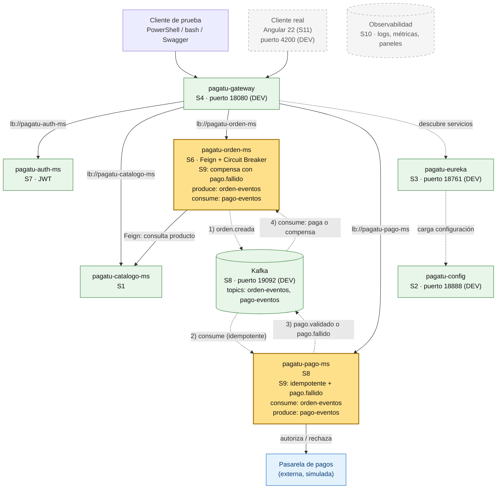
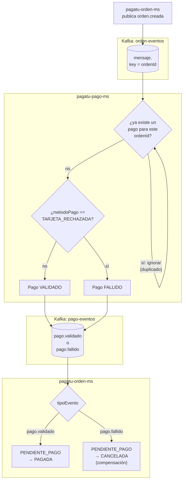
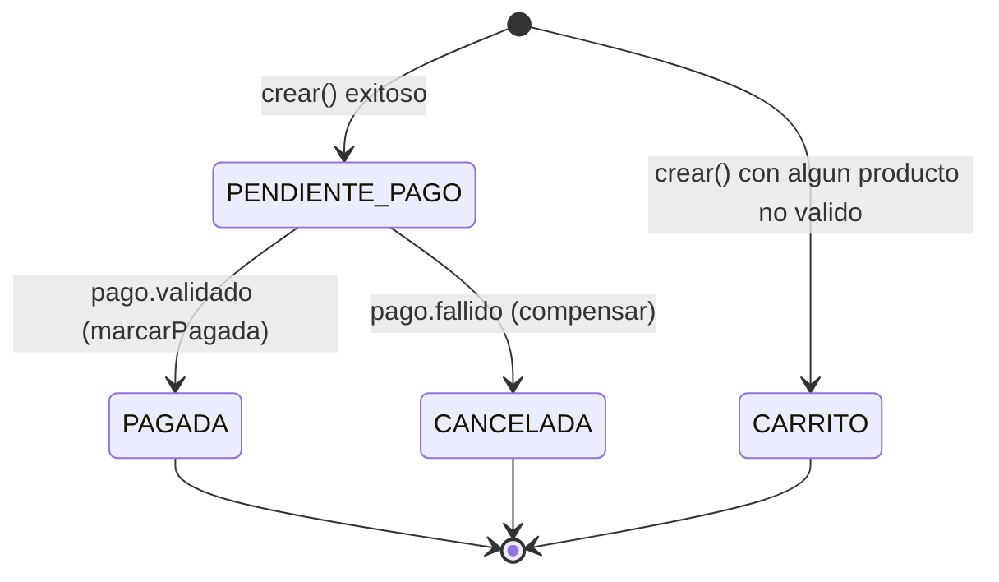

# S9 - Consistencia Distribuida en Procesos de Negocio

*Por: Angel Sullon Macalupu @asullom - 2026*

## 1. Introducción

Tiempo: 20 min.

### 1.1 Presentación de la sesión

S8 dejó dos preguntas abiertas a propósito (su 4.5, pregunta 7, y su Proyección): *"si Kafka entrega un mensaje al menos una vez, ¿qué problema puede causar en `pagatu-pago-ms`, y por qué hoy no está resuelto?"* — y la pasarela de pagos externa, simulada desde S7, donde **el pago siempre se valida**. Esta sesión responde las dos. Primero, en vivo: vas a reenviar un `orden.creada` ya procesado y ver a `pagatu-pago-ms` romperse contra su propia restricción `UNIQUE` de base de datos, una y otra vez, porque hoy nada le dice "esto ya lo vi". Después lo arreglas con **idempotencia**. Segundo: la pasarela deja de validar todo siempre — aparece `pago.fallido`, y `pagatu-orden-ms` tiene que **compensar** una orden que ya había confirmado. Las dos piezas juntas — pasos que se repiten sin romper nada, y pasos que se deshacen cuando algo falla más adelante — son lo que la literatura de sistemas distribuidos llama una **Saga coreografiada**, el patrón que ya está construido desde S8 sin que esta guía le hubiera puesto nombre todavía.

### 1.2 Índice

1. Entrega al menos una vez: por qué los duplicados son inevitables.
2. Idempotencia: consumidores seguros ante reintentos.
3. El patrón Saga coreografiada.
4. Compensación: deshacer un paso ya confirmado.
5. Simular el fallo de un paso, a propósito.
6. Observabilidad del flujo completo: éxito y compensación.

### 1.3 Propósito de aprendizaje

Al concluir la clase, estarás en condiciones de:

- **Diagnosticar** el efecto real de un mensaje duplicado sobre un consumidor Kafka, **implementar** idempotencia para tolerarlo sin romper nada, **diseñar y construir** el paso compensador de una Saga coreografiada cuando un paso remoto falla, y **documentar** el flujo de negocio completo —estados, transiciones y compensaciones— con evidencia real de ambos casos.

### 1.4 Producto de sesión

`pagatu-pago-ms` idempotente ante un `orden.creada` duplicado: lo reconoce y lo ignora, sin crear un segundo pago ni caerse. Un nuevo estado `FALLIDO` en `Pago`, con una forma explícita de simular el rechazo de un pago (`metodoPago: "TARJETA_RECHAZADA"`), publicando `pago.fallido` en ese caso en vez de `pago.validado`. `pagatu-orden-ms` consumiendo `pago.fallido` y **compensando** la orden (`PENDIENTE_PAGO → CANCELADA`, reutilizando un estado que ya existía sin usarse desde S6), con la misma protección contra duplicados que `marcarPagada` ya tenía desde S8. Y el flujo de negocio completo, con sus estados, sus transiciones y sus dos compensaciones posibles, documentado de punta a punta.

### 1.5 Metodología

**Tabla 1. Metodología de la sesión**

| Actividades a Realizar en el Periodo | Orientaciones generales (Orientaciones Metodológicas) | Material de estudio recomendado |
|---|---|---|
| Revisión previa individual | Repasar S8 completo (3.13-3.19): el contrato de los dos eventos, `OrdenEventosConsumer`/`PagoEventosConsumer`, y la pregunta 7 de 4.5 ("¿por qué hoy no está resuelto?"). Confirmar que `pagatu-orden-ms` y `pagatu-pago-ms` siguen corriendo con una orden ya pasada a `PAGADA`. Trabajo individual, antes de clase. | S8 completo, en especial 2.5-2.6 y 3.13-3.19. |
| Clase presencial | Reproducir el bug de duplicados, agregar idempotencia a `pagatu-pago-ms`, simular el fallo de un pago, y consumir `pago.fallido` compensando la orden en `pagatu-orden-ms`. Trabajo individual, siguiendo al docente paso a paso; consulta inmediata ante un log que no muestra lo esperado. | Pasos 3.1 a 3.9 de esta guía. |
| Evaluación formativa | Revisión en clase de los tres casos con evidencia real: duplicado ignorado, pago rechazado con la orden compensada, y compensación también idempotente. La evidencia se completa y sustenta de forma individual, fuera del aula, según los criterios mínimos de la sección 4.4. | Indicaciones de entrega (4.3), rúbrica de evaluación (4.6). |

### 1.6 Motivación de la sesión

#### 1.6.1 Caso: la señal que se repitió sola, sin que nadie la detuviera

El 1 de agosto de 2012, Knight Capital Group desplegó un módulo de *trading* nuevo en ocho servidores de producción — pero el despliegue falló en uno de ellos: ese octavo servidor conservó una bandera de código antigua que, por error, volvió a activar una función obsoleta (*Power Peg*), ya retirada años antes. Durante los 45 minutos siguientes, **cada orden normal del mercado que llegaba** —miles de señales por minuto, el tráfico de siempre— disparaba de nuevo esa función obsoleta en ese servidor, sin que ningún mecanismo reconociera "esta señal ya la procesé de esta forma" ni detuviera la repetición. El resultado: 4 millones de ejecuciones sobre 397 millones de acciones, y una pérdida de aproximadamente 440 millones de dólares en menos de una hora.

Fuente: U.S. Securities and Exchange Commission. (2013). *In the Matter of Knight Capital Americas LLC* (Release No. 34-70694). https://www.sec.gov/litigation/admin/2013/34-70694.pdf

El problema de fondo no fue que llegaran muchas señales — eso es justamente lo que un sistema de *trading* espera recibir sin parar. El problema fue que ese servidor **no tenía ninguna noción de qué señales ya había procesado de esa forma**: cada mensaje nuevo volvía a disparar la acción completa, sin ningún guardia que comparara contra un estado ya resuelto. Es exactamente el mismo mecanismo (a una escala mucho menor y sin consecuencias financieras) que vas a provocar tú mismo en 3.2, contra tu propio `pagatu-pago-ms`.

**Preguntas de análisis**

**Activación de conocimientos previos**

1. En S8, `pagatu-pago-ms` nunca revisa si ya existe un pago para un `ordenId` antes de crear uno. ¿Qué tendría que pasar para que el mismo `orden.creada` llegara dos veces?
2. Kafka garantiza entrega **al menos una vez** (*at-least-once*), no exactamente una vez. ¿Por qué garantizar "exactamente una vez" de verdad es mucho más difícil de lo que suena?

**Comprensión de idempotencia y compensación**

1. Si `pagatu-pago-ms` simplemente ignorara **cualquier** mensaje repetido de `orden-eventos` sin revisar nada más, ¿qué problema distinto introduciría eso?
2. `pagatu-orden-ms` ya protege `marcarPagada` contra duplicados desde S8 (solo actúa si la orden está `PENDIENTE_PAGO`). ¿Por qué esa misma guardia, aplicada también a la compensación de hoy, no es una casualidad sino el mismo patrón repetido a propósito?

### 1.7 Ubicación en el curso

- Unidad: U2 - Sistema distribuido robusto.
- Producto del curso: sistema distribuido de microservicios end-to-end, configurable, escalable, seguro, resiliente, consistente, observable, integrado con frontend y defendido técnicamente.
- Producto de unidad: sistema distribuido seguro, resiliente, consistente, observable e integrado con cliente frontend.
- Avance del producto en esta sesión: `pagatu-pago-ms` idempotente, simulación de fallo de pago con `pago.fallido`, y compensación de la orden en `pagatu-orden-ms`.

**Figura 1. Roadmap del producto de la unidad**



*Leyenda.* Este diagrama es el mismo de S7/S8; solo cambia el color: verde = construido en sesiones anteriores, amarillo = se trabaja hoy, gris punteado = todavía no existe, azul = sistema externo.

**Hoy:** `pagatu-pago-ms` y `pagatu-orden-ms` no cambian de lugar en el diagrama — siguen hablándose por los mismos dos topics de S8. Lo que cambia es **qué hacen** cuando un mensaje se repite, y **qué pasa** cuando la pasarela (simulada) rechaza un pago.

## 2. Explica

Tiempo: 30 min.

### 2.1 Arquitectura de la sesión

**Figura 2. Los dos caminos posibles de un pago, y la idempotencia en cada consumidor**



El camino feliz (`pago.validado` → `PAGADA`) es el de S8, sin ningún cambio. Lo nuevo son dos guardias (`Idem` en `pagatu-pago-ms`, y su equivalente simétrico dentro de `marcarPagada`/`compensar` en `pagatu-orden-ms`) y una bifurcación (`Simula`/`Rama`) que decide cuál de los dos finales le toca a la orden. Cada apartado siguiente desarrolla una pieza, en el mismo orden del Índice (1.2).

### 2.2 Entrega al menos una vez: por qué los duplicados son inevitables

Kafka (y la mayoría de sistemas de mensajería distribuidos) garantizan **at-least-once delivery** (*entrega al menos una vez*): un mensaje publicado **va a llegar**, pero puede llegar **más de una vez**. La causa más común no es un error de Kafka: es que el consumidor procesa el mensaje, pero el *commit* del offset (la marca de "ya leí hasta aquí") se pierde antes de confirmarse — por un reinicio del consumidor, una partición que se reasigna a otra instancia, o simplemente la ventana entre procesar y confirmar. Cuando eso pasa, el consumidor vuelve a arrancar desde el último offset confirmado, y **reprocesa** mensajes que ya había procesado.

La alternativa, **exactly-once delivery** (*entrega exactamente una vez*), existe como garantía formal en Kafka (transacciones *producer-to-consumer*), pero exige coordinar productor y consumidor dentro de la misma transacción distribuida — mucho más costoso, y fuera del alcance de este curso. La práctica estándar en sistemas distribuidos no es perseguir "exactamente una vez" al nivel del transporte: es aceptar "al menos una vez" y hacer que **procesar el mismo mensaje dos veces no tenga efecto distinto a procesarlo una sola**. Eso es idempotencia (2.3), y es la responsabilidad del consumidor, no de Kafka.

**Tabla 2. Qué garantiza Kafka, y qué le corresponde al consumidor**

| | Lo garantiza Kafka | Lo garantiza el consumidor |
|---|---|---|
| El mensaje llega | Sí, al menos una vez | — |
| El mensaje llega en orden, dentro de su partición | Sí | — |
| El mensaje nunca llega duplicado | **No** | Idempotencia (2.3) |
| Procesar el duplicado no causa un efecto doble | — | Sí, si el consumidor lo implementa |

### 2.3 Idempotencia: consumidores seguros ante reintentos

Una operación es **idempotente** cuando aplicarla una vez o aplicarla diez veces produce el mismo resultado. `PUT /api/v1/productos/5` con el mismo cuerpo es idempotente: el producto 5 queda igual sin importar cuántas veces se repita la petición. `POST /api/v1/ordenes` **no** lo es por diseño: cada llamada crea una orden nueva — por eso un cliente HTTP nunca debería reintentar un `POST` fallido sin que el servidor tenga forma de reconocer el reintento.

Un consumidor de eventos enfrenta el mismo problema, sin que nadie se lo haya pedido explícitamente: Kafka puede volver a entregarle un mensaje que ya procesó (2.2), y `pagatu-pago-ms` hoy no tiene ninguna forma de distinguir "esto es nuevo" de "esto ya lo vi". La solución estándar: antes de ejecutar la acción, revisar si ya existe evidencia de que se ejecutó — en este caso, `uk_pagos_orden` (S8, 3.10) ya es exactamente esa evidencia, con una ventaja adicional: al ser una restricción `UNIQUE` en la base de datos, protege incluso si **dos instancias** de `pagatu-pago-ms` procesaran el mismo mensaje al mismo tiempo (una condición de carrera que una simple revisión en memoria no evitaría). 3.3 usa las dos capas juntas: una revisión explícita (clara de leer, rápida en el caso normal) y la restricción `UNIQUE` como respaldo (la que de verdad garantiza la propiedad, incluso en el caso raro de una carrera real).

**Error frecuente**: ignorar **cualquier** mensaje repetido sin revisar nada más, en vez de revisar si la acción específica ya se ejecutó. Eso resolvería el duplicado de hoy, pero descartaría silenciosamente un mensaje legítimo que *coincidiera* en alguna clave superficial — la idempotencia se verifica contra el **resultado** de la operación (¿ya existe el pago de esta orden?), no contra "si ya vi este mensaje antes" en abstracto.

### 2.4 El patrón Saga coreografiada

Una operación de negocio que cruza varios servicios, cada uno con su propia base de datos, no puede envolverse en una única transacción ACID (*Atomicity, Consistency, Isolation, Durability*) como si fuera una sola base — eso exigiría una transacción distribuida (*two-phase commit*), costosa y poco escalable en un sistema con microservicios independientes. El patrón **Saga** resuelve esto de otra forma: la operación completa se parte en una secuencia de **pasos locales**, cada uno con su propia transacción local y corto, y cada paso que pueda fallar define su **compensación** — una acción que deshace el efecto de negocio de los pasos ya confirmados, sin poder revertir la base de datos de otro servicio directamente (porque no tiene acceso a ella).

Hay dos formas de coordinar una Saga (Richardson, 2018):

- **Orquestada**: un componente central (un *orchestrator*) le dice a cada servicio, paso a paso, qué hacer y cuándo compensar. Centraliza la lógica de la Saga completa en un solo lugar, a costa de ese componente central.
- **Coreografiada** (la que ya construiste, sin el nombre, desde S8): no hay ningún coordinador — cada servicio reacciona a los eventos del anterior y publica el suyo propio. `pagatu-orden-ms` no sabe que existe un paso de compensación en curso cuando publica `orden.creada`; simplemente reacciona cuando le llega `pago.fallido`, igual que reaccionaba a `pago.validado`.

**Tabla 3. Los pasos de la Saga de `pagatu`, con su compensación**

| Paso | Servicio | Si falla | Compensación |
|---|---|---|---|
| 1. Registrar la orden | `pagatu-orden-ms` | No se publica nada (S6: falla antes de la transacción local) | No aplica — nada que compensar, no se confirmó nada |
| 2. Validar el pago | `pagatu-pago-ms` | La pasarela (simulada) rechaza el pago | Publica `pago.fallido` en vez de `pago.validado` |
| 3. Confirmar la orden | `pagatu-orden-ms` | — (último paso) | Al recibir `pago.fallido`: `PENDIENTE_PAGO → CANCELADA` |

*Nota.* Adaptado de *Pattern: Saga*, por Richardson, C., 2018, microservices.io (https://microservices.io/patterns/data/saga.html).

La compensación del paso 3 no es "deshacer la orden como si nunca hubiera existido" (eso sería borrarla, perdiendo la trazabilidad de que existió y falló) — es una **transición de estado nueva** (`CANCELADA`) que dice, de forma permanente y auditable, que esa orden se registró y su pago fue rechazado. Es el mismo criterio que ya se aplicó con `anular`/`ANULADA` en los cursos hermanos de este mismo ciclo (BomERP): una compensación deja rastro, no reescribe la historia.

### 2.5 Compensación: deshacer un paso ya confirmado

Técnicamente, `compensar` (3.6) es casi idéntico a `marcarPagada` (S8): busca la orden, verifica una precondición de estado, y transiciona. La diferencia está en qué significa ese cambio para el negocio: `marcarPagada` **avanza** el proceso (la orden sigue su curso normal); `compensar` lo **revierte** (el proceso no puede continuar, y hay que dejarlo en un estado final consistente con lo que realmente pasó). Ambas comparten la misma guardia de idempotencia — ninguna de las dos actúa si la orden ya no está `PENDIENTE_PAGO` —, porque ambas son, en el fondo, reacciones a un evento que Kafka puede entregar más de una vez (2.2, 2.3): una Saga coreografiada sin consumidores idempotentes no es una Saga confiable, es una carrera entre duplicados.

### 2.6 Simular el fallo de un paso, a propósito

Desde S7, la pasarela de pagos externa se simula siempre validando (*"La pasarela de pagos externa se simula hoy: el pago siempre se valida"*). Probar un camino de compensación sin que un paso falle realmente es imposible — por eso esta sesión introduce un **gatillo determinista**: `metodoPago: "TARJETA_RECHAZADA"` hace que `pagatu-pago-ms` simule un rechazo, siempre, de forma reproducible. No es aleatorio a propósito: una prueba de evidencia necesita un resultado repetible, no "a veces falla, a veces no" — eso dificultaría demostrar el camino de compensación con una captura de pantalla confiable.

### 2.7 Observabilidad del flujo completo: éxito y compensación

El mismo criterio de logs de S8 (`component`, `eventType`, `ordenId`, `status`) se extiende con dos valores nuevos de `status`: `ignored` (un duplicado reconocido y descartado, en cualquiera de los dos servicios) y `compensated` (una compensación aplicada, en `pagatu-orden-ms`). Seguir un mismo `ordenId` a través de los logs de ambos servicios sigue siendo la forma de reconstruir, de punta a punta, qué pasó con una orden — ahora con dos finales posibles en vez de uno.

## 3. Aplica: actividad práctica guiada

Tiempo: 3h.

**Actividad:** reproducción guiada del problema de duplicados, idempotencia en `pagatu-pago-ms`, simulación del fallo de un pago, y compensación de la orden en `pagatu-orden-ms` (Producto de la sesión en 1.4).

**Propósito de la actividad:** que cada estudiante vea el efecto real de un evento duplicado antes de arreglarlo, implemente idempotencia con una revisión explícita respaldada por la restricción `UNIQUE` ya existente, y construya el paso de compensación completo de una Saga coreografiada, con evidencia real de los tres casos (duplicado, fallo con compensación, y compensación también idempotente).

**Orientaciones metodológicas:** el docente provoca primero el bug en vivo frente a la clase (Parte A), lo arregla, simula el fallo de pago y construye la compensación (Parte B), y cierra verificando que la propia compensación también es idempotente (Parte C); los estudiantes replican cada paso en su propia laptop y provocan ellos mismos el duplicado y el fallo para ver los tres resultados reales en su propia consola.

**Actividades para realizar:**

*Parte A — Reproducir el problema y agregar idempotencia a `pagatu-pago-ms`:*

- **3.1** Verificar el punto de partida.
- **3.2** Reproducir un evento duplicado (el bug, a propósito).
- **3.3** Agregar idempotencia a `pagatu-pago-ms`.
- **3.4** Probar que el duplicado ya no rompe nada.

*Parte B — Simular el fallo de un pago y compensar en `pagatu-orden-ms`:*

- **3.5** Agregar el estado `FALLIDO` y simular el rechazo del pago.
- **3.6** Consumir `pago.fallido` y compensar la orden en `pagatu-orden-ms`.
- **3.7** Probar el fallo de pago de punta a punta.

*Parte C — Verificar la idempotencia de la compensación:*

- **3.8** Probar que la compensación también es idempotente.

*Parte D — Documentar:*

- **3.9** Documentar el flujo de negocio: estados, transiciones y compensaciones.

**Punto de partida común:** todo el equipo debe comenzar exactamente desde donde quedó S8. Levanta `pagatu-config`, `pagatu-eureka`, `pagatu-gateway`, `pagatu-auth-ms`, Kafka, `pagatu-catalogo-ms`, `pagatu-orden-ms` y `pagatu-pago-ms` (S1-S8), confirma que una orden nueva sigue llegando a `PAGADA` por eventos (S8, 3.19) antes de tocar código nuevo.

### Parte A — Reproducir el problema y agregar idempotencia a `pagatu-pago-ms`

#### 3.1 Verificar el punto de partida

**Producto del paso:** confirmación de que el flujo completo de S8 (`PENDIENTE_PAGO → PAGADA` por eventos) sigue funcionando, con una orden real para reutilizar en 3.2.

Crea una orden con el token de `CLIENTE` (como en S8, 3.19) y confirma que llega a `PAGADA`. Anota su `id` — la vas a reutilizar en 3.2.

#### 3.2 Reproducir un evento duplicado (el bug, a propósito)

**Producto del paso:** evidencia real de que `pagatu-pago-ms`, hoy, no tolera un `orden.creada` repetido.

En Kafka UI (`http://localhost:18085`), abre el topic `orden-eventos` → *Messages*, busca el mensaje de la orden de 3.1 (filtra por su *key*, el `ordenId`) y copia su valor JSON completo. Ve a *Produce Message*, pega la misma *key* y el mismo valor, y publícalo de nuevo — estás simulando exactamente lo que pasaría si Kafka reentregara ese mensaje.

Mira el log de `pagatu-pago-ms` de inmediato. Resultado esperado: una excepción, repetida varias veces (reintentos del manejador de errores por defecto de Spring Kafka), con un mensaje de la forma `duplicate key value violates unique constraint "uk_pagos_orden"` — `pagoRepository.save(...)` intentó crear un **segundo** pago para el mismo `ordenId`, y la restricción `UNIQUE` de la tabla (S8, 3.10) lo rechazó, pero nada en el código estaba preparado para esa excepción.

**Error frecuente**: esto **no** es un error de la guía ni un bug de tu código — es el comportamiento real de S8, sin ninguna protección de idempotencia, con un mensaje duplicado real. Es exactamente el punto: vas a arreglarlo en 3.3.

#### 3.3 Agregar idempotencia a `pagatu-pago-ms`

**Producto del paso:** un `orden.creada` repetido se reconoce y se ignora, sin excepción y sin un segundo pago.

**`services/pagatu-pago-ms/src/main/java/pe/edu/upeu/pago/repository/PagoRepository.java`** — agrega la consulta:

```java
package pe.edu.upeu.pago.repository;

import org.springframework.data.jpa.repository.JpaRepository;
import pe.edu.upeu.pago.entity.Pago;
import java.util.Optional;

public interface PagoRepository extends JpaRepository<Pago, Long> {
    Optional<Pago> findByOrdenId(Long ordenId);
}
```

**`services/pagatu-pago-ms/src/main/java/pe/edu/upeu/pago/service/PagoServiceImpl.java`** — reemplaza el método `procesar`:

```java
    private static final String PAGO_VALIDADO = "pago.validado";

    @Override
    @Transactional
    public void procesar(OrdenCreadaEvento orden) {
        if (pagoRepository.findByOrdenId(orden.getOrdenId()).isPresent()) {
            log.warn("component=processor ordenId={} status=ignored motivo=\"pago ya procesado (evento duplicado)\"",
                    orden.getOrdenId());
            return;
        }

        Pago pago;
        try {
            pago = pagoRepository.save(Pago.builder()
                    .ordenId(orden.getOrdenId())
                    .monto(orden.getTotal())
                    .metodoPago(orden.getMetodoPago())
                    .estado(EstadoPago.VALIDADO)
                    .fechaPago(LocalDateTime.now())
                    .build());
        } catch (DataIntegrityViolationException ex) {
            log.warn("component=processor ordenId={} status=ignored motivo=\"pago ya procesado (condicion de carrera)\"",
                    orden.getOrdenId());
            return;
        }

        producer.publicarTrasCommit(PagoValidadoEvento.builder()
                .tipoEvento(PAGO_VALIDADO)
                .ordenId(pago.getOrdenId())
                .monto(pago.getMonto())
                .estado(pago.getEstado().name())
                .origen(nombreServicio)
                .timestamp(Instant.now().toEpochMilli())
                .build());

        log.info("component=processor ordenId={} estado={} status=processed", pago.getOrdenId(), pago.getEstado());
    }
```

Agrega el import que falta:

```java
import org.springframework.dao.DataIntegrityViolationException;
```

Dos capas, no una sola (2.3): `findByOrdenId` resuelve el caso normal (un reintento real de Kafka, uno detrás de otro) sin tocar la base de datos con un intento de escritura que sabes que va a fallar. El `try`/`catch` sobre `DataIntegrityViolationException` es el respaldo para el caso raro — dos mensajes llegando casi al mismo tiempo, ambos pasando la revisión antes de que ninguno guarde — donde la única garantía real es la restricción `UNIQUE` de la base de datos, no una revisión en memoria.

#### 3.4 Probar que el duplicado ya no rompe nada

**Producto del paso:** evidencia de que el mismo mensaje de 3.2, repetido, ya no genera un segundo pago ni una excepción.

Reinicia `pagatu-pago-ms`. Repite exactamente la publicación manual de 3.2 (mismo *key*, mismo valor JSON, desde Kafka UI). Resultado esperado en el log: `component=processor ordenId=... status=ignored motivo="pago ya procesado (evento duplicado)"` — sin ninguna excepción.

Confirma en la base de datos que sigue habiendo un solo pago:

```bash
docker exec -it pagatu-postgres-pago-dev psql -U pagatu -d pagatu_pago_db -c "SELECT COUNT(*) FROM pagos WHERE orden_id = ID_DE_TU_ORDEN;"
```

Resultado esperado: `1`.

### Parte B — Simular el fallo de un pago y compensar en `pagatu-orden-ms`

#### 3.5 Agregar el estado `FALLIDO` y simular el rechazo del pago

**Producto del paso:** un pago con `metodoPago: "TARJETA_RECHAZADA"` se guarda como `FALLIDO` y publica `pago.fallido` en vez de `pago.validado`.

**`services/pagatu-pago-ms/src/main/java/pe/edu/upeu/pago/entity/EstadoPago.java`:**

```java
package pe.edu.upeu.pago.entity;

public enum EstadoPago {
    VALIDADO,
    FALLIDO
}
```

**`PagoServiceImpl.java`** — agrega la constante y la bifurcación dentro de `procesar` (después de la guardia de idempotencia de 3.3, antes del `try`):

```java
    private static final String PAGO_FALLIDO = "pago.fallido";
    private static final String METODO_RECHAZADO = "TARJETA_RECHAZADA";
```

```java
        boolean rechazado = METODO_RECHAZADO.equalsIgnoreCase(orden.getMetodoPago());
        EstadoPago estadoResultante = rechazado ? EstadoPago.FALLIDO : EstadoPago.VALIDADO;

        Pago pago;
        try {
            pago = pagoRepository.save(Pago.builder()
                    .ordenId(orden.getOrdenId())
                    .monto(orden.getTotal())
                    .metodoPago(orden.getMetodoPago())
                    .estado(estadoResultante)
                    .fechaPago(LocalDateTime.now())
                    .build());
        } catch (DataIntegrityViolationException ex) {
            log.warn("component=processor ordenId={} status=ignored motivo=\"pago ya procesado (condicion de carrera)\"",
                    orden.getOrdenId());
            return;
        }

        String tipoEventoResultante = rechazado ? PAGO_FALLIDO : PAGO_VALIDADO;
        producer.publicarTrasCommit(PagoValidadoEvento.builder()
                .tipoEvento(tipoEventoResultante)
                .ordenId(pago.getOrdenId())
                .monto(pago.getMonto())
                .estado(pago.getEstado().name())
                .origen(nombreServicio)
                .timestamp(Instant.now().toEpochMilli())
                .build());
```

`"TARJETA_RECHAZADA"` no es un método de pago real de la pasarela (simulada): es un valor que esta sesión reserva a propósito, para que el fallo sea determinista y reproducible (2.6) — en un sistema real, la decisión vendría de la respuesta real de la pasarela, nunca del valor que el propio cliente envía.

#### 3.6 Consumir `pago.fallido` y compensar la orden en `pagatu-orden-ms`

**Producto del paso:** `pagatu-orden-ms` reacciona a `pago.fallido` igual que ya reacciona a `pago.validado`, pero compensando en vez de confirmar.

En **`OrdenService.java`**, agrega la operación:

```java
    void compensar(Long ordenId);
```

En **`OrdenServiceImpl.java`**, agrega el método, después de `marcarPagada`:

```java
    @Override
    @Transactional
    public void compensar(Long ordenId) {
        Orden orden = ordenRepository.findById(ordenId).orElse(null);
        if (orden == null || orden.getEstado() != EstadoOrden.PENDIENTE_PAGO) {
            log.warn("component=processor ordenId={} status=ignored motivo=\"la orden no existe o ya no esta pendiente de pago\"", ordenId);
            return;
        }
        orden.setEstado(EstadoOrden.CANCELADA);
        log.info("component=processor ordenId={} estado={} status=compensated", ordenId, orden.getEstado());
    }
```

**`services/pagatu-orden-ms/src/main/java/pe/edu/upeu/orden/messaging/PagoEventosConsumer.java`** — reemplaza el cuerpo de la clase:

```java
    private static final String PAGO_VALIDADO = "pago.validado";
    private static final String PAGO_FALLIDO = "pago.fallido";

    private final OrdenService ordenService;

    @KafkaListener(topics = "${app.kafka.topic.pagos}")
    public void alRecibirPago(PagoValidadoEvento evento) {
        switch (evento.getTipoEvento()) {
            case PAGO_VALIDADO -> {
                log.info("component=consumer eventType={} ordenId={} status=consumed",
                        evento.getTipoEvento(), evento.getOrdenId());
                ordenService.marcarPagada(evento.getOrdenId());
            }
            case PAGO_FALLIDO -> {
                log.info("component=consumer eventType={} ordenId={} status=consumed",
                        evento.getTipoEvento(), evento.getOrdenId());
                ordenService.compensar(evento.getOrdenId());
            }
            default -> log.warn("component=consumer eventType={} status=ignored", evento.getTipoEvento());
        }
    }
```

`EstadoOrden.CANCELADA` ya existía desde S6 (nunca se había usado): no hace falta ninguna migración de base de datos para esta sesión, solo darle, por fin, un camino real que lo alcance. `compensar` comparte la misma guardia de idempotencia de `marcarPagada` (2.5): solo actúa si la orden sigue `PENDIENTE_PAGO`.

#### 3.7 Probar el fallo de pago de punta a punta

**Producto del paso:** una orden que pasa de `PENDIENTE_PAGO` a `CANCELADA` por eventos, con la evidencia en cada punto.

Reinicia `pagatu-pago-ms` y `pagatu-orden-ms`. Crea una orden con `metodoPago: "TARJETA_RECHAZADA"`:

PowerShell:

```powershell
$ordenRechazada = Invoke-RestMethod -Method Post -Uri "http://localhost:18080/api/v1/ordenes" `
  -Headers @{ Authorization = "Bearer $tokenCliente" } `
  -ContentType "application/json" `
  -Body '{"metodoPago": "TARJETA_RECHAZADA", "detalles": [{"idProducto": 1, "cantidad": 1}]}'
$ordenRechazada.id
```

bash macOS/Linux:

```bash
curl -i -X POST http://localhost:18080/api/v1/ordenes \
  -H "Authorization: Bearer $TOKEN_CLIENTE" \
  -H "Content-Type: application/json" \
  -d '{"metodoPago": "TARJETA_RECHAZADA", "detalles": [{"idProducto": 1, "cantidad": 1}]}'
```

Reúne la evidencia, en orden:

1. **Log de `pagatu-pago-ms`:** `component=processor ordenId=... estado=FALLIDO status=processed`, y `component=producer topic=pago-eventos ... eventType=pago.fallido ... status=published`.
2. **Log de `pagatu-orden-ms`:** `component=consumer eventType=pago.fallido ordenId=... status=consumed`, y `component=processor ordenId=... estado=CANCELADA status=compensated`.
3. **El pago, con su estado real:**

```powershell
Invoke-RestMethod -Method Get -Uri "http://localhost:8086/api/v1/pagos"
```

Resultado esperado: el pago de esta orden con `"estado": "FALLIDO"`.

4. **La orden, compensada:**

```powershell
(Invoke-RestMethod -Method Get -Uri "http://localhost:18080/api/v1/ordenes/$($ordenRechazada.id)" `
  -Headers @{ Authorization = "Bearer $tokenCliente" }).estado
```

Resultado esperado: `CANCELADA` — nunca llegó a `PAGADA`.

**Error frecuente**: la orden queda en `PENDIENTE_PAGO`, ni `PAGADA` ni `CANCELADA`. Sigue la misma cadena de diagnóstico de S8 (2.6, su Error frecuente): ¿el log de `pagatu-pago-ms` muestra `estado=FALLIDO`? ¿Publicó en `pago-eventos`? ¿`pagatu-orden-ms` lo consumió? Confirma también que el `switch` de 3.6 compila con las dos constantes como `case`, no con literales de texto sueltos.

### Parte C — Verificar la idempotencia de la compensación

#### 3.8 Probar que la compensación también es idempotente

**Producto del paso:** evidencia de que un `pago.fallido` repetido no intenta compensar dos veces una orden que ya está `CANCELADA`.

En Kafka UI, abre `pago-eventos` → *Messages*, ubica el mensaje `pago.fallido` de la orden de 3.7, copia su valor y publícalo de nuevo con la misma *key*. Resultado esperado en el log de `pagatu-orden-ms`: `component=processor ordenId=... status=ignored motivo="la orden no existe o ya no esta pendiente de pago"` — la misma guardia que ya protegía `marcarPagada` desde S8, protegiendo ahora también `compensar`, sin que hiciera falta escribir nada nuevo para este caso.

### Parte D — Documentar

#### 3.9 Documentar el flujo de negocio: estados, transiciones y compensaciones

**Producto del paso:** el diagrama de estados completo de `Orden`, con sus dos finales posibles.

**Figura 3. Ciclo de vida completo de `Orden`, con su compensación**



Documenta, con tus propias palabras y en tu evidencia (4.3), la tabla de transiciones completa (igual formato que la Tabla 3 de esta guía), aplicada a tu propio sistema si tu Proyecto Sello tiene un flujo de negocio equivalente — o, si no lo tiene todavía, aplicada a `pagatu` como referencia para la actividad autónoma (4.1).

## 4. Crea: actividad autónoma

Tiempo: 4h fuera del aula.

### 4.1 Actividad

Implementación de idempotencia y compensación sobre un **proceso de negocio propio** del Proyecto Sello del equipo, con evidencia individual.

Completa y evidencia estas tareas:

1. Identifica, en tu propio proyecto, un proceso que cruce dos servicios por eventos (si todavía no tienes uno, replica el patrón de `pagatu` sobre tu propio dominio: una operación que un servicio registra y otro confirma o rechaza).
2. Agrega idempotencia al consumidor que procesa el primer evento: una revisión explícita antes de actuar, respaldada por una restricción `UNIQUE` real en tu base de datos (no solo en memoria).
3. Diseña al menos una condición de fallo real para ese proceso (no necesita ser un pago) y un evento de compensación propio, con su propio `tipoEvento`.
4. Implementa la compensación en el servicio que inició el proceso, con la misma guardia de idempotencia que ya usa su confirmación exitosa.
5. Prueba los tres casos con evidencia real: evento duplicado ignorado, camino de fallo con compensación aplicada, y la compensación misma probada contra un duplicado.
6. Documenta el diagrama de estados completo de tu entidad, con sus transiciones y su compensación (mismo formato de la Figura 3).

### 4.2 Propósito

Que cada estudiante demuestre, de forma individual y fuera del aula, que puede reconocer dónde un proceso distribuido necesita idempotencia, diseñar una compensación real para un paso que puede fallar, y documentar el flujo de negocio completo de su propio sistema — sin el acompañamiento del docente.

Esta actividad autónoma se desarrolla sobre el proyecto de fin de curso del equipo. El producto de la unidad se construye por acumulación de los avances de cada sesión; por eso, la evidencia de esta sesión debe incorporarse a la documentación del proyecto y quedar trazable en GitHub.

### 4.3 Indicaciones

Entrega un PDF con el siguiente nombre:

```text
S09_Equipo##_ApellidoNombre.pdf
```

Cada captura de pantalla del informe debe mostrar, sin recortar, el reloj del sistema (fecha y hora) y tu usuario o foto de perfil (Windows, VS Code o navegador) visibles en pantalla — es lo que permite verificar que la evidencia es tuya y que corresponde al momento real de tu trabajo.

#### 4.3.1 Estructura del informe

**Datos del estudiante**

- Nombre:
- Equipo:
- Sesión: S09 - Consistencia distribuida en procesos de negocio
- Rol o aporte realizado:
- Link de GitHub:

**Evidencia técnica**

Incluye capturas o extractos con una breve explicación debajo de cada uno, organizados en los mismos 4 bloques de la rúbrica (4.6):

1. *El bug reproducido, y la idempotencia de `pagatu-pago-ms`*
    - Log de la excepción real de 3.2, y log de 3.4 mostrando el duplicado ignorado sin excepción (trabajo de clase).
2. *Fallo de pago y compensación en `pagatu`*
    - Logs de `pago.fallido` publicado y consumido, y la orden pasando a `CANCELADA` (trabajo de clase).
3. *Compensación idempotente*
    - Log de 3.8 mostrando el `pago.fallido` repetido ignorado (trabajo de clase).
4. *Proceso propio con idempotencia y compensación*
    - Los tres casos (duplicado, fallo con compensación, compensación idempotente) y el diagrama de estados completo de tu propia entidad (trabajo autónomo).

**Error o hallazgo**

Describe un error real: un `case` del `switch` de 3.6 que no compiló porque la constante no era `final`, un log que mostraba `status=ignored` por el motivo equivocado (revisaste la condición y no la excepción, o al revés), o una condición de fallo propia que terminó compensando una orden que no debía.

**Reflexión técnica breve**

Responde en 5 a 8 líneas:

```text
¿Por qué 'exactamente una vez' es una garantía tan difícil de dar en un
sistema distribuido que la práctica estándar es aceptar 'al menos una
vez' y resolver el problema en el consumidor? Relaciona tu respuesta con
el caso de Knight Capital (1.6).
```

**Anexo: Feedback de la sesión**

Pega esta página como la última hoja del PDF, con tus respuestas.

1. ¿Cuál es el aprendizaje más importante que te llevas de la clase de hoy?
2. ¿Qué punto de la clase te resultó más confuso o te dejó con dudas?
3. ¿Tienes alguna pregunta que te gustaría que sea respondida la siguiente clase?
4. Sobre tu nivel de comprensión de la clase de hoy, marca una opción:
    - ¡Entendido! - Lo domino y podría explicarlo.
    - Más o menos. - Entendí la idea general, pero tengo dudas.
    - Necesito ayuda. - Me siento perdido/a con este tema.
5. ¿Cómo puedo ayudarte a comprender mejor el tema?
6. Pensando en tu participación y esfuerzo en la clase de hoy, ¿cómo te autoevaluarías? Marca una opción:
    - Muy Comprometido/a: Me esforcé al máximo.
    - Comprometido/a: Sé que podría haberme esforzado un poco más.
    - Poco Comprometido/a: Hoy no di mi mejor esfuerzo.
7. Mi satisfacción con la clase fue... (califica del 1 al 10, donde 1 es insatisfecho y 10 es muy satisfecho).

### 4.4 Criterios mínimos de aceptación

- PDF con nombre correcto.
- Evidencia real del bug de duplicados (3.2) y de su corrección con idempotencia (3.3-3.4), sin excepción en el log tras el fix.
- Evidencia del fallo de pago simulado y la compensación real de la orden (`PENDIENTE_PAGO → CANCELADA`).
- Evidencia de que la compensación también es idempotente ante un evento repetido.
- Proceso propio con idempotencia (revisión explícita + restricción `UNIQUE` real) y compensación (evento propio, guardia de idempotencia), con los tres casos probados.
- Diagrama de estados completo de la entidad propia, con su compensación.
- Cada captura de la evidencia técnica muestra el reloj del sistema y el usuario/perfil visible, sin recortar.
- Las fechas y horas de las capturas son coherentes con el historial de commits de su repositorio en GitHub.
- Incluye un error o hallazgo técnico diagnosticado.
- Incluye la reflexión técnica breve solicitada.
- Incluye el Anexo de feedback de la sesión respondido, como última página del PDF.
- Aporte individual verificable.

### 4.5 Preguntas de defensa

1. ¿Por qué Kafka garantiza "al menos una vez" y no "exactamente una vez" por defecto, y qué le costaría a un sistema real exigir la segunda garantía?
2. ¿Por qué la idempotencia de 3.3 revisa primero `findByOrdenId` y además envuelve el `save` en un `try`/`catch`, en vez de confiar solo en uno de los dos?
3. ¿Qué diferencia de fondo hay entre una Saga orquestada y una coreografiada, y cuál de las dos es la de `pagatu`?
4. ¿Por qué `compensar` no borra la orden ni la deja en `PENDIENTE_PAGO`, sino que la pasa a un estado nuevo (`CANCELADA`)?
5. `metodoPago: "TARJETA_RECHAZADA"` es un valor inventado para esta sesión. ¿Qué tendría que cambiar para que la decisión de rechazar un pago viniera de una pasarela real, y por qué esa decisión nunca debería depender de un valor que el propio cliente declara?
6. En tu actividad autónoma, ¿qué pasaría si tu compensación no tuviera la misma guardia de idempotencia que su contraparte exitosa?

### 4.6 Rúbrica de evaluación

**Tabla 4. Rúbrica de evaluación**

| Dimensión | Peso | 3 - Logro destacado | 2 - Logro | 1 - Proceso | 0 - Inicio | Puntuación obtenida |
|---|---:|---|---|---|---|---:|
| 1. Bug reproducido e idempotencia de `pagatu-pago-ms` | 2 | Excepción real evidenciada en 3.2, y duplicado ignorado sin excepción tras el fix, con las dos capas (revisión + `UNIQUE`) explicadas. | Idempotencia funcional, con la evidencia del bug original incompleta. | Idempotencia parcial (una sola de las dos capas). | No evidencia idempotencia funcional. | |
| 2. Fallo de pago y compensación | 2 | `pago.fallido` publicado y consumido, orden compensada a `CANCELADA`, evidenciado en logs y endpoints. | Flujo funcional, con evidencia parcial de algún tramo. | Un solo sentido del flujo, o evidencia poco clara. | No evidencia compensación funcional. | |
| 3. Compensación idempotente | 2 | Evento de compensación repetido, ignorado correctamente, sin doble compensación. | Prueba realizada, con la explicación incompleta. | Prueba parcial o sin evidencia clara del log. | No prueba la idempotencia de la compensación. | |
| 4. Proceso propio con idempotencia y compensación | 2 | Proceso propio con idempotencia real (`UNIQUE` + revisión), compensación con su propio evento, y los tres casos probados. | Proceso propio funcional, con idempotencia o compensación incompleta. | Proceso propio parcial. | No integra un proceso propio. | |
| 5. Diagrama de estados y documentación | 1 | Diagrama completo y coherente con el código, con todas las transiciones y la compensación. | Diagrama completo, con inconsistencias menores. | Diagrama incompleto. | No documenta el diagrama de estados. | |
| 6. Aporte individual | 1 | Aporte claro y verificable. | Aporte identificable. | Aporte general. | No se identifica aporte. | |
| 7. Orden y reflexión | 1 | PDF ordenado y reflexión técnica clara. | Evidencia suficiente. | Evidencia poco clara. | PDF insuficiente. | |

Puntuación acumulada = suma de (`Peso` × `Puntuación obtenida`) = ____.

Nota final = (`Puntuación acumulada` / 33) × 20 = ____.

Para usar la rúbrica con IA (inteligencia artificial), solicita:

```text
Evalúa el PDF usando la rúbrica de la sesión.
Para cada dimensión selecciona la puntuación obtenida usando la escala Inicio=0, Proceso=1, Logro=2, Logro destacado=3.
Justifica brevemente cada puntuación.
Verifica que cada captura muestre reloj del sistema y usuario/perfil visible, y que las fechas sean coherentes con el historial de commits de GitHub. Si falta esta evidencia o hay inconsistencias, indícalo explícitamente antes de calificar.
Calcula la puntuación acumulada con la fórmula: suma de (Peso × Puntuación obtenida).
Calcula la nota final sobre 20 con la fórmula: (Puntuación acumulada / 33) × 20.
Indica 2 fortalezas y 2 recomendaciones.
```

## 5. Cierre

Tiempo: 5 min.

**Resumen breve:** hoy `pagatu-pago-ms` dejó de romperse ante un mensaje repetido — primero viste el bug real (una excepción contra su propia restricción `UNIQUE`), y después lo cerraste con dos capas de idempotencia. La pasarela de pagos simulada desde S7 dejó de validar todo siempre: `metodoPago: "TARJETA_RECHAZADA"` dispara `pago.fallido`, y `pagatu-orden-ms` lo consume para **compensar** la orden (`PENDIENTE_PAGO → CANCELADA`), reutilizando un estado que llevaba reservado desde S6. Y esa misma compensación resultó ser, sin escribir nada nuevo, tan idempotente como `marcarPagada` ya lo era desde S8 — porque las dos comparten la misma guardia. El patrón completo, sin que nadie lo coordinara desde un solo lugar, es una **Saga coreografiada**.

**Dinámica participativa:** en una ronda rápida, cada estudiante comparte en una frase qué excepción vio exactamente en 3.2, y qué le decía sobre lo que estaba mal.

**Metacognición:** ¿qué te costó más entender hoy: por qué Kafka puede entregar el mismo mensaje dos veces sin que eso sea un error de Kafka, o por qué `compensar` necesita la misma guardia que `marcarPagada` en vez de una propia?

**Proyección:** S10 extiende Prometheus, Loki y Grafana (ya en pie desde S3-S4 para `pagatu-catalogo-ms`) a `pagatu-auth-ms`, `pagatu-cliente-ms`, `pagatu-orden-ms` y `pagatu-pago-ms` — con paneles de diagnóstico sobre el mismo flujo de hoy: cuántas órdenes se compensaron, cuántos duplicados se ignoraron, y dónde se detiene un flujo que no llega a su final esperado.

## Bibliografía

- U.S. Securities and Exchange Commission. (2013). *In the Matter of Knight Capital Americas LLC* (Release No. 34-70694). https://www.sec.gov/litigation/admin/2013/34-70694.pdf
- Richardson, C. (2018). *Pattern: Saga*. microservices.io. https://microservices.io/patterns/data/saga.html
- Apache Software Foundation. (2024). *Apache Kafka Documentation*. https://kafka.apache.org/documentation/
- Spring for Apache Kafka. (2026). *Spring for Apache Kafka Reference* (versión 4.1.1). https://docs.spring.io/spring-kafka/reference/
